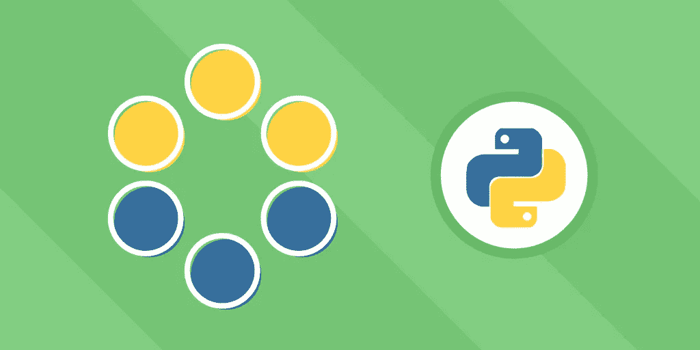
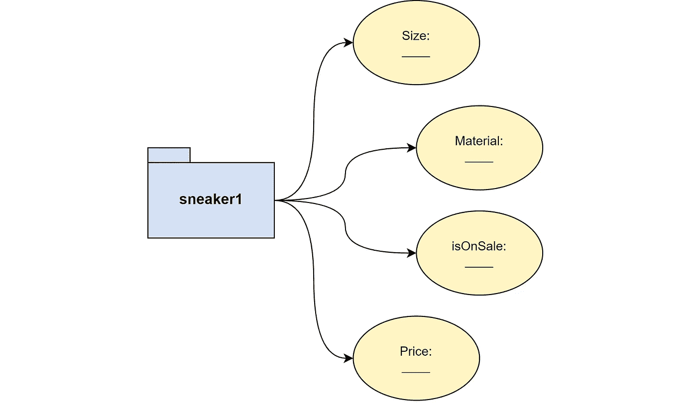
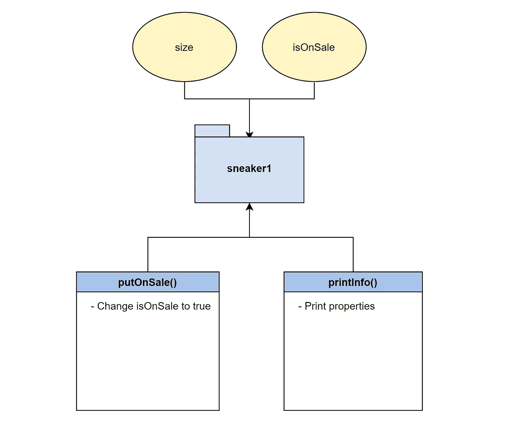
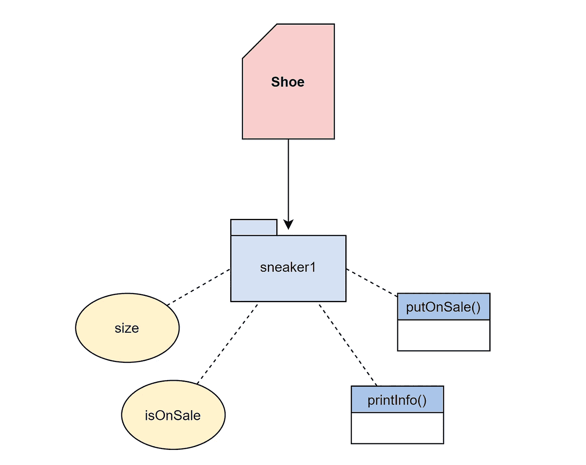
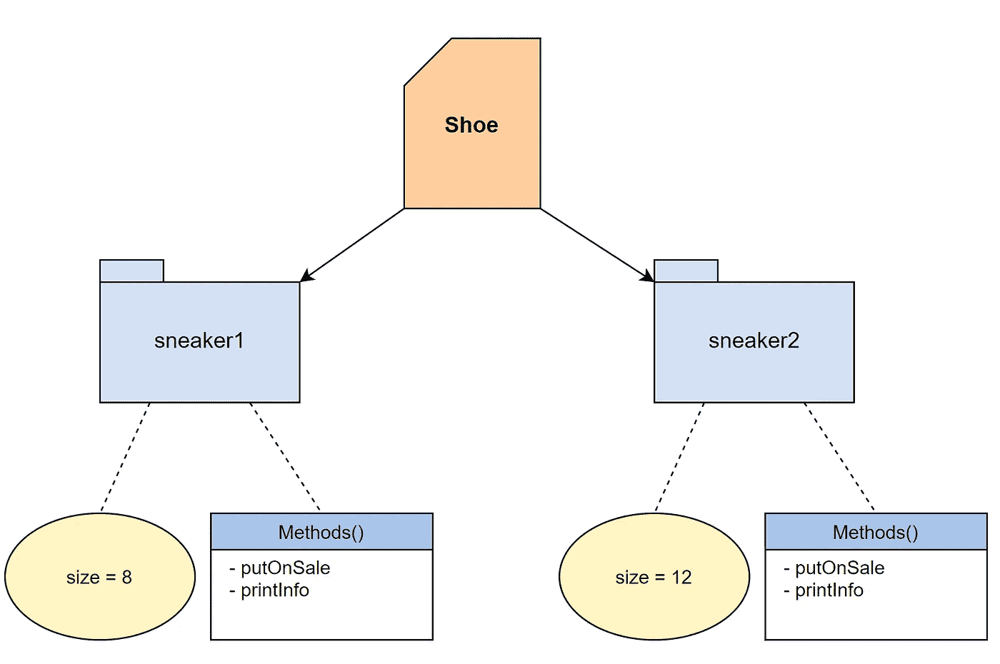
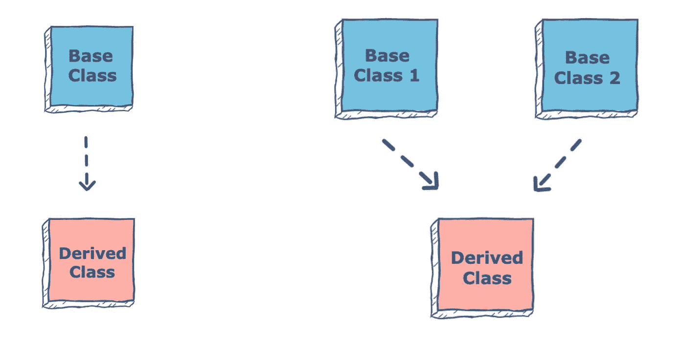

# 如何在 Python 中使用面向对象编程

> 原文：<https://levelup.gitconnected.com/how-to-use-object-oriented-programming-in-python-ee6548ca178a>



面向对象编程(OOP)是一种广泛流行的编程范式，跨许多不同的语言使用。这种构建程序的方法使用了具有属性和行为的对象。每种编程语言处理 OOP 原理的方式都有所不同，所以学习每种语言的 OOP 是很重要的。今天，我们将讨论 Python 中的 **OOP 的基础，以推动您的 Python 技能更上一层楼。**

无论您是 OOP 新手，还是只是好奇它在 Python 中的用法，这都是入门的绝佳文章。您将学习 Python 中 OOP 的好处，以及如何在您的代码中应用 OOP 概念。到本文结束时，您将能够创建类、初始化对象，并将继承应用到 Python 项目中。

**今天我们将讲述:**

*   什么是面向对象编程？
*   Python 中的 OOP
*   如何在 Python 中定义一个类
*   如何在 Python 中创建对象
*   如何在 Python 中创建实例方法
*   如何在 Python 中使用继承
*   放在一起:计算器问题
*   复习和前进

# 什么是面向对象编程？

面向对象编程是一种基于创建可重用“对象”的编程范式，这些“对象”具有自己的属性和行为，可以被操作和捆绑。

这些对象将相关的数据和行为打包成现实生活对象的表示。OOP 是各种流行编程语言(如 Python、C++和 Java)中广泛使用的范例。

许多开发人员使用 OOP 是因为它使你的代码**可重用**并且合乎逻辑，它使继承更容易实现。它遵循 DRY 原则，这使得程序更加高效。

在 OOP 中，每个对象都有自己的属性。例如，假设我们的对象是一名员工。这些属性可以是他们的姓名、年龄和角色。OOP 使得对现实世界的事物和它们之间的关系建模变得容易。许多初学者更喜欢使用 OOP 语言，因为它们组织数据的方式很像人脑组织信息的方式。

OOP 的四个主要原则是**继承**、**封装**、**抽象**和**多态**。要了解更多，请阅读我们的文章*什么是面向对象编程？*在这里继续之前复习一下。

在了解它在 Python 中是如何工作的之前，让我们重温一下 OOP 的构建模块。

# 性能



sneaker1 对象中的属性字段

属性是描述对象的数据。每个对象都有独特的属性，程序中的函数可以访问或操作这些属性。把这些看作描述单个对象的变量。

例如，`sneaker1`对象可能具有属性`size`和`isOnSale`。

# 方法



包含属性(顶部)和方法(底部)的 sneaker1 对象

方法定义了对象的行为。方法就像对象范围内的函数。它们通常用于改变对象的属性。

例如，我们的`sneaker1`对象将拥有打开或关闭`isOnSale`属性的方法`putOnSale`。

它们还可以用于报告特定对象的属性。例如，同一个`sneaker1`对象也可以有一个向用户显示其属性的`printInfo`方法。

# 班级



从 Shoe 类创建的 sneaker1 对象

每个对象都用一个类创建。把这个想象成某种物体的蓝图。类列出了该类型对象的基本属性，但没有给它们赋值。类还定义可用于该类型的所有对象的方法。

例如，`sneaker1`是从定义我们的属性`size`和`isOnSale`以及方法`putOnSale`和`printInfo`的类`Shoe`中创建的。从`Shoe`类蓝图创建的所有对象都将定义相同的字段。

> 类别就像每个对象所属的伞状类别。

# 例子



Shoe 类的两个实例:sneaker1 和 sneaker2

对象是其父类的实例，具有唯一的名称和属性值。在一个程序中，同一类类型可以有多个实例。程序调用指向单个实例，而类保持不变。

例如，我们的`shoe`类可以有两个实例`sneaker1`，一个是`8`的`size`，一个是`12`的`size`。对实例`sneaker1`的任何更改都不会影响`sneaker2`。

# Python 中的 OOP

Python 是一种多范例编程语言，这意味着它支持 OOP 以及其他范例。在 Python 中你使用类来实现 OOP。Python 提供了面向对象编程的所有标准特性。

开发人员经常选择在他们的 Python 程序中使用 OOP，因为它使代码更具可重用性，并且更容易处理更大的程序。OOP 程序防止你重复代码，因为一个类可以被定义一次，然后重用多次。OOP 因此很容易实现“不要重复自己”(DRY)的原则。

让我们看一个 OOP 如何改进 Python 的例子。假设您用列表而不是类来组织数据。

```
sneaker1 = [8, true, "leather", 60]
```

这里，列表`sneaker1`包含属性`size`、`isOnSale`、`material`和`cost`的值。这种方法不使用 OOP，会导致几个问题:

1.  你必须记住他们使用哪个索引来存储特定类型的数据。`sneaker1` [0] =大小。这不如`sneaker1.size`的对象调用直观
2.  不可重复使用。您必须为每个项目创建一个新列表，而不仅仅是初始化一个新对象。
3.  难以创建特定于对象的行为。列表不能包含方法。每个列表必须调用相同的全局函数来实现给定的行为，而不是特定于对象的方法。

相反，使用 OOP，我们可以把它写成一个`Shoe`类对象来避免这些问题，并使我们的代码更加有用。

```
sneaker1 = Shoe(8, true, "leather", 60)
```

为了避免这些问题，Python 开发人员经常使用 OOP 而不是其他可用的范例。下面我们将探索如何在 Python 程序中实现 OOP。

# 如何在 Python 中定义一个类

为了在 Python 中创建一个类，我们使用了`class`关键字和一个类似这样的属性:

```
class MyClass:
  x = 4
```

然后我们使用`MyClass`创建一个这样的对象:

```
p1 = MyClass()
print(p1.x)
```

让我们深入一点。对于下面的例子，假设你受雇为一家鞋店制作一个在线商店。我们将学习如何使用 Python 来定义一个`Shoe`类，以及每只鞋必须在网站上列出的属性。

首先，我们使用关键字`class`开始我们的类，然后将其名称设置为`Shoe`。`Shoe`的每个实例将代表不同的一双鞋。然后我们列出每只鞋将具有的属性，`size`、`isOnSale`、`material`和`price`。最后，我们将每个属性设置为值`None`。我们将在初始化一个`Shoe`对象时设置这些属性值。

```
class Shoe:# define the properties and assign none value size = None isOnSale= None material = None price = None
```

> ***注:间距***
> 
> *记住在一个类中的所有属性或方法前包含四个空格***，这样 Python 就能识别出它们都在已定义的类中。**

# *如何在 Python 中创建对象*

*现在，我们将了解如何初始化对象并设置属性值来表示每双鞋。*

*要创建一个对象，我们必须首先设置我们的初始化方法。initializer 方法是唯一的，因为它有一个预定义的名称`__init__`，并且没有返回值。当从那个类创建一个新的对象时，程序自动调用初始化器方法。*

*初始化器方法应该接受特殊的`self`参数，然后接受所有类属性作为参数。`self`参数允许初始化器方法选择新创建的对象实例。*

*然后，我们用每个属性的一个实例变量初始化来填充初始化器方法。这些初始化中的每一个都将所创建对象的属性设置为相应参数的值。*

> **例如，第一个* `*self.size = size*` *将创建对象的* `*size*` *属性设置为等于对象创建时传递的* `*size*` *参数。**

*一旦初始化器设置好了，我们就可以用`[objectName] = Shoe()`创建一个对象，并传递必要的参数。在第 10 行，我们创建了一个名为`sneaker3`的`Shoe`对象，其属性为`size = 11`、`isOnSale = false`、`material = "leather"`和`price = 81`*

*我们可以使用这段代码创建我们需要的尽可能多的`Shoe`实例。*

```
*class Shoe: # defines the initializer method def __init__(self, size, isOnSale, material, price): self.size = size self.isOnSale = isOnSale self.material = material self.price = price# creates an object of the Shoe class and sets# each property to an appropriate valuesneaker3 = Shoe(11, 'false', "leather", 81)*
```

# *如何在 Python 中创建实例方法*

*接下来，我们将实例方法添加到我们的`Shoe`类中，这样我们就可以在鞋店程序中与对象属性进行交互。实例方法的主要优点是，一旦创建，它们就可用于任何`Shoe`类型的对象。*

> **要创建实例，您调用该类并传递其* `*__init__*` *方法接受的参数。**

```
*class Shoe:# defines the initializer method def __init__(self, size, isOnSale, material, price): self.size = size self.isOnSale = isOnSale self.material = material self.price = price# Instance method def printInfo(self): return f" This pair of shoes are size {self.size}, are made of {self.material}, and costs ${self.price}"# Instance method def putOnSale(self): self.isOnSale = truesneaker3 = Shoe(11, 'false', "leather", 81) print (sneaker3.printInfo())*
```

*我们的第一个实例方法是`printInfo`，它列出了除`isOnSale`之外的所有属性。在第 10 行，我们使用关键字`def`开始声明一个新方法，然后将该方法命名为`printInfo`，最后列出特殊参数`self`。*

*在这种情况下，`self`允许该方法访问调用该方法的对象中的任何参数。然后我们使用`self.[property]`调用在第 11 行写出我们的消息。*

> ****注意:*** *这个用的是 Python 3.6+ f-String 功能。花括号中消息的任何部分实际上都不会打印，而是打印所选对象的指定属性值。**

*我们的第二个实例方法`putOnSale`将所选对象中的`isOnSale`属性的值更改为`true`。在第 15 行，我们使用关键字`def`，我们的方法名，和`self`参数来定义一个方法。*

*然后我们用一条语句填充该方法，将第 16 行的`isOnSale`属性更改为`true`。该语句的第一部分选择当前选中对象的`isOnSale`属性。该语句的第二部分将所选属性的值设置为`true`。*

*改变这个`Shoe`对象的`isOnSale`属性的值不会改变`Shoe`类中的默认值。Python 并不要求每个方法中都有一个`return`值。*

# *如何在 Python 中使用继承*

*最后，我们将使用继承添加`Shoe`类的子类`Sandal`。继承允许一个新类接受另一个类的属性和行为。从继承而来的类称为**父类**。任何从父类继承的类都被称为**子类**。*

*子类不仅继承所有的属性和方法，还可以扩展或覆盖它们。*

> ****展开*** *指给子类添加父类中没有的属性或方法。* ***覆盖*** *是在子类中重新定义已经在父类中定义的方法的能力。**

*单个类继承的一般语法是:*

```
*class BaseClass:
  Base class body
class DerivedClass(BaseClass):
  Derived class body*
```

*我们也可以有多个类继承:*

```
*class BaseClass1:
  Base class1 body
class BaseClass:
  Base class2 body
class DerivedClass(BaseClass1,BaseClass2):
  Derived class body*
```

**

*要在 Python 中实现继承，定义一个普通的类，但在最后一个冒号前的括号中添加其父类的名称(第 2 行)。*

```
*#Sandal is the child class to parent class Shoeclass Sandal(Shoe): def __init__(self, size, isOnSale, material, price, waterproof): #inherit self, size, isOnSale, material, 
            #and price properties Shoe.__init__(self, size, isOnSale, material, price) #expands Sandal to contain additional 
            #property, waterproof self.waterproof = waterproof#overwrites printInfo to reference 
#pair of sandals" rather than shoes def printInfo(self): return f" This pair of sandals are size {self.size}, are made of {self.material}, and costs ${self.price}"sandal1 = Sandal(11, False, "leather", 81, True) print (sandal1.printInfo())*
```

*然后我们定义一个新的初始化器方法，它从`Shoe`获取所有属性，并添加一个唯一的`waterproof`属性。*

*在第 3 行，我们为父类和子类中需要的所有属性声明了初始化方法。然后在第 5 行，我们从父`Shoe`类调用初始化方法来处理共享属性。然后我们扩展继承的属性，在第 7 行添加`waterproof`属性。*

*您可以使用扩展的类来减少重写的代码。如果我们的类没有从`Shoe`继承，我们将需要重新创建整个初始化方法来做一个小的改变。*

*接下来，我们重写在`Shoe`中定义的`printInfo`类，使其成为`Sandal`特定的。Python 将总是使用方法的最局部的定义。*

*因此，当调用`printInfo`方法时，Python 将使用`Sandal`中新定义的`printInfo`方法，而不是从`Shoe`继承的`printInfo`方法。*

# *综合起来:计算器问题*

*让我们用一个挑战把你学到的技能付诸实践。您的目标是编写一个名为`Calculator`的 Python 类。**这个挑战有两个步骤:**定义计算器的属性，并为四个操作中的每一个添加方法。*

***任务 1***

*写一个初始化器来初始化`num1`和`num2`的值。属性为`num1`和`num2`。*

***任务二***

*向程序中添加四种方法:*

*   *`add()`，返回`num1`和`num2`之和的方法。*
*   *`subtract()`，返回 num2 减去`num1`的方法。*
*   *`multiply()`，返回`num1`和`num2`乘积的方法。*
*   *`divide()`，返回`num2`除以`num1`的方法。*

*您的输入将是对象的属性整数，您的输出将是这些数字的加法、减法、除法和乘法结果。*

```
*# Sample input

obj = Calculator(10, 94);
obj.add()
obj.subtract()
obj.multiply()
obj.divide()

# Sample output

104
84
940
9.4*
```

*自己尝试一下，如果卡住了就检查解决方案。*

*下面是一个空白的程序结构，供您参考:*

```
*class Calculator: def __init__(self): pass def add(self): pass def subtract(self): pass def multiply(self): pass def divide(self): pass*
```

*祝你好运！*

# *溶液分解*

```
*class Calculator: def __init__(self, num1, num2): self.num1 = num1 self.num2 = num2 def add(self): return (self.num2 + self.num1) def subtract(self): return (self.num2 - self.num1) def multiply(self): return (self.num2 * self.num1) def divide(self): return (self.num2 / self.num1)demo1 = Calculator(10, 94)print("Addition:", demo1.add())print("Subtraction:", demo1.subtract())print("Mutliplication:", demo1.multiply())print("Division:", demo1.divide())*
```

*让我们深入研究一下解决方案。如果你第一次没收到也没关系！实践是我们学习的方式。*

*   *我们首先用两个属性实现了`Calculator`类:`num1`和`num2`。*
*   *在第 3–4 行上，我们初始化了两个属性`num1`和`num2`。*
*   *在第 7 行的**上，我们实现了`add()`，一个返回两个属性的总和`num1` + `num1`的方法。***
*   *在**第 10 行**上，我们实现`subtraction()`。该方法返回`num1`和`num2`之间的差值。*
*   *在**第 13** 行，我们实现了`multiplication()`，一个返回`num2`和`num1`乘积的方法。*
*   *在**第 16 行**上，我们实现`division()`。这个方法返回`num1`对`num2`的商。*

# *复习和前进*

*现在，您已经完成了对面向对象 Python 编程世界的探索。今天，我们分解了面向对象编程的定义，为什么它在 Python 中流行，并带您了解 Python 中面向对象程序的关键部分。*

*然而，本文涵盖的概念仅仅是 OOP 能力的开始。在您的 OOP 之旅中需要了解的下一个主题是:*

*   *数据封装*
*   *多态性*
*   *聚合*
*   *运算符重载*
*   *信息隐蔽*

**快乐学习！**