# 如何在 React 本地聊天应用中使用 OneSignal 第三部分

> 原文：<https://levelup.gitconnected.com/how-to-use-onesignal-with-a-react-native-chat-app-6ea2efbe8829>

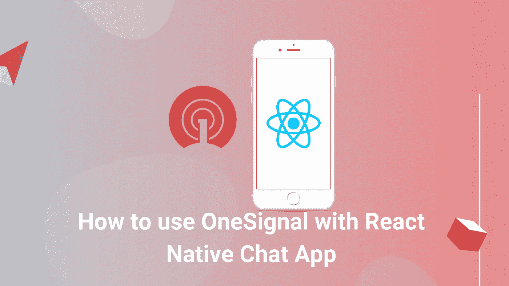

在本教程中，我们将学习如何集成一个信号推送通知，以反应原生聊天应用程序项目。对于本教程，我们只打算使用 android 设备在 Android 平台上实现它。OneSignal 是一种流行的服务，它可以在设备上实现推送通知，抽象出设备运行的平台等细节。通过使用 OneSignal 插件，移动应用程序可以发送和接收推送通知。因此，我们将在 React 原生聊天应用中实现这种 OneSignal 服务，以实现推送通知。

# 先决条件

基本上，要将一个信号集成为本地信号，我们必须满足以下两个要求:

1.  起始代码
2.  安卓硬件设备(因为安卓模拟器太慢)

# 设置一个信号

第一步，我们将建立我们的单一信号服务。为此，我们需要登录 [Onesignal](https://app.onesignal.com/login) 网站，然后登录我们的 Onesignal 账户。请注意:如果您没有帐户，您可以通过注册他们的网站或使用谷歌、脸书或 Github 登录来轻松创建一个帐户，如下图所示:

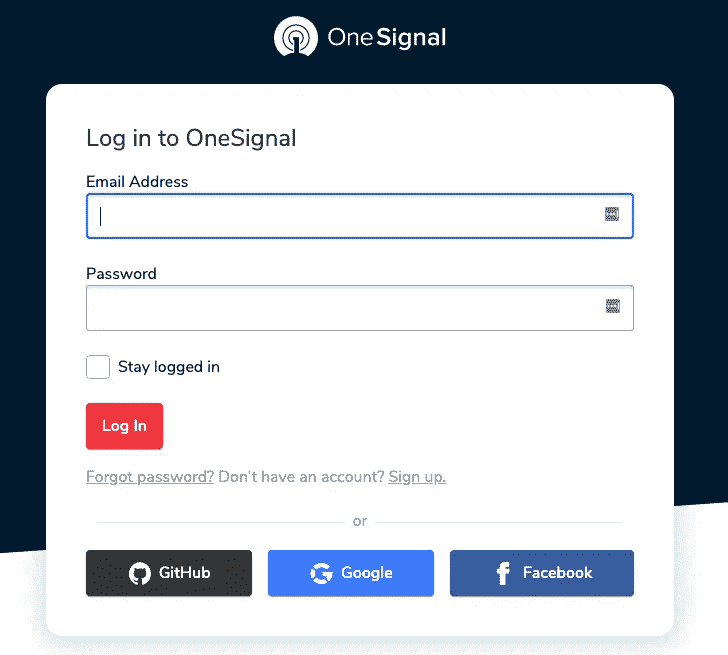

登录后，我们需要创建一个新的应用程序。为此，首先，我们需要选择一个平台。这里，我们将选择“Google Android”平台，如下面的代码片段所示:

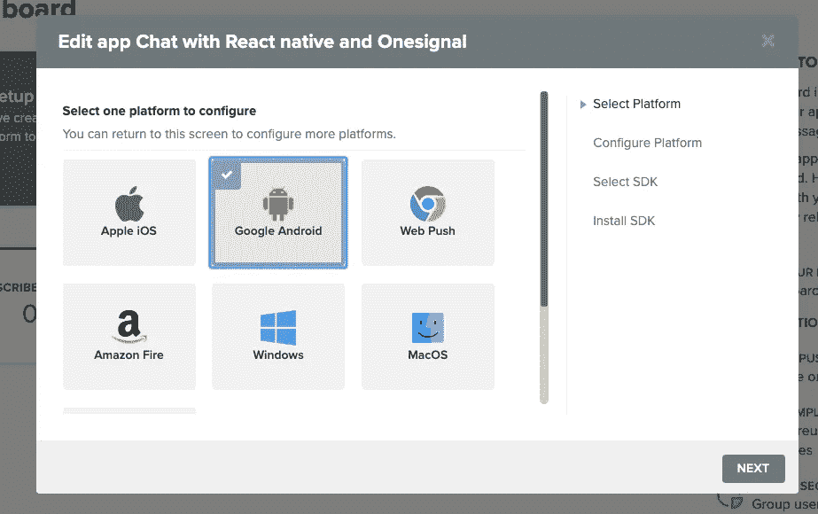

然后，我们需要 firebase 服务器密钥来建立 OneSignal 和 Firebase 云消息之间的通信，如下图所示:

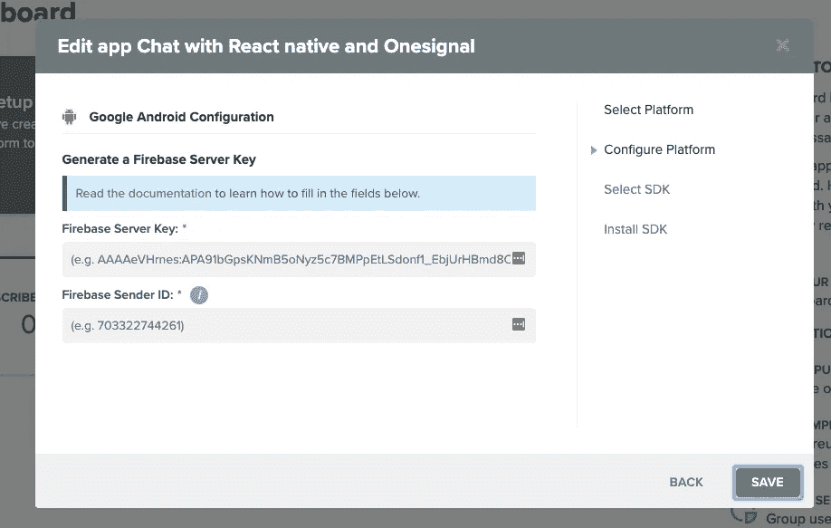

对于 firebase 服务器密钥，我们需要转到 Firebase 控制台并创建一个 Firebase 应用程序。成功创建 Firebase 应用程序后，我们需要进入“设置”。然后，我们需要导航到“云消息”选项卡，复制**服务器密钥**和**发件人 id** ，如下图所示:

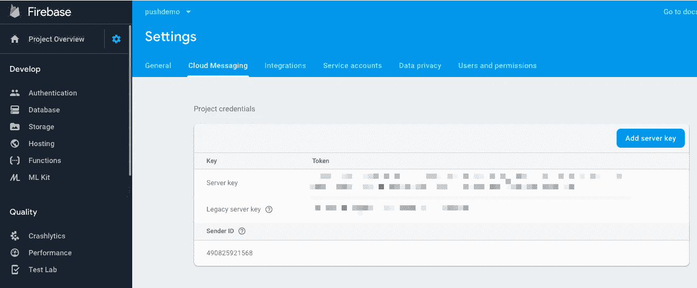

现在，我们需要返回到我们的 OneSignal 平台配置，并将 Firebase **服务器密钥**和**发送方 ID** 粘贴到 OneSignal 表单，如下图所示:

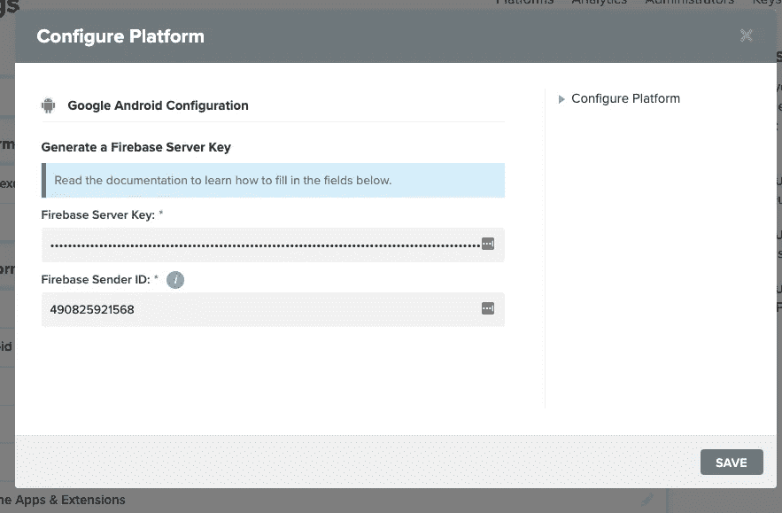

平台配置完成后，我们需要为我们的 OneSignal app 选择 SDK。这里，我们将选择 **React native SDK** 作为我们的应用 SDK。

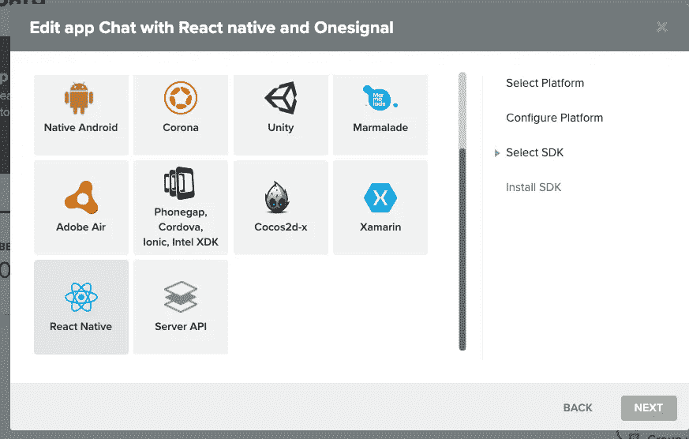

在选择 SDK 之后，我们获得了用于发送推送通知的 AppID，如下面的屏幕截图所示:

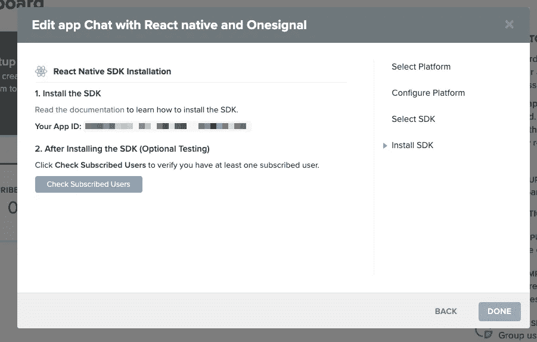

现在，我们需要点击“完成”按钮，导航至我们的 OneSignal 仪表盘，如下图所示:

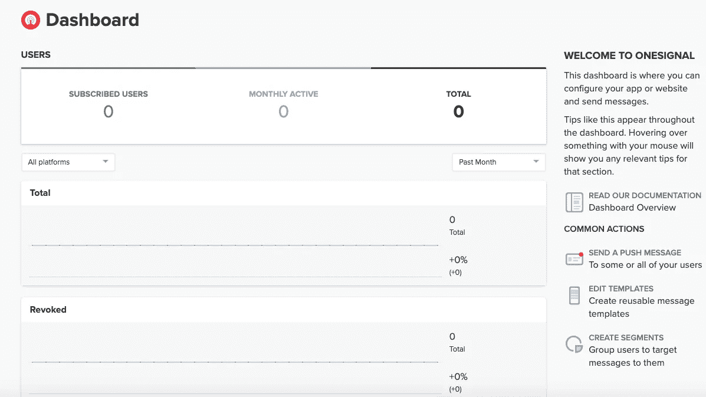

在此之后，我们需要转到 React native SDK [文档](https://documentation.onesignal.com/docs/react-native-sdk-setup)并向我们的应用程序添加一个信号代码片段代码，如下面的代码片段所示:

这里，我们使用三个函数来显示活动日志，正如您在上面的代码片段中看到的。当我们打开应用程序时，它会自动注册到 OneSignal，如下图所示:

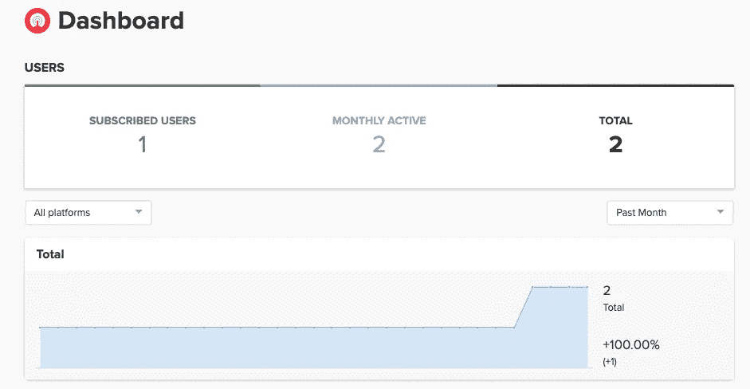

现在，让我们通过从 OneSignal 控制台发送消息来测试我们的 OneSignal 应用程序。

首先，我们需要进入**消息**选项卡，然后创建一条新消息，如下图所示:

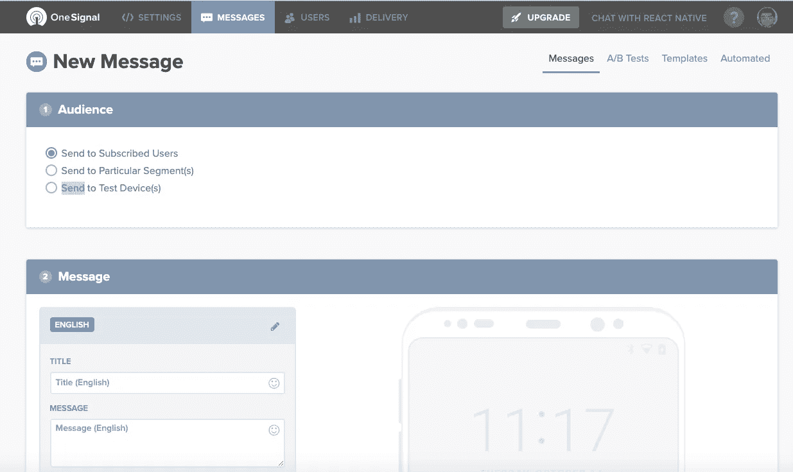

我们可以在左下方的屏幕截图中看到第一条消息的设置，以及推送通知将如何出现在右下方的屏幕截图中:

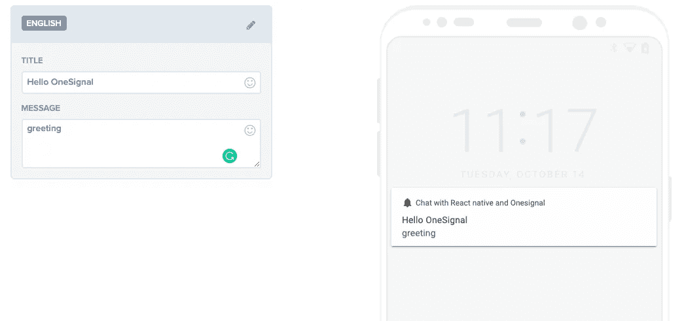

现在，我们需要确认我们是否真的在向 Android 设备发送消息。如果我们正在发送消息，那么我们点击**发送消息**按钮，如下图所示:

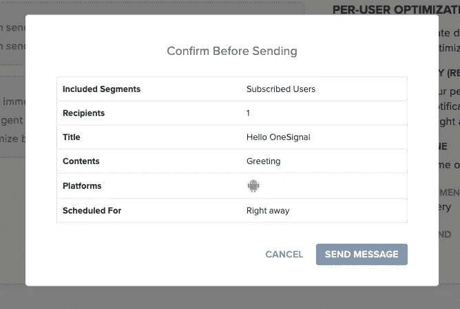

在这里，我们可以看到它正在按预期工作。我们可以在我们的 Android 设备中收到一条消息，正如您在下面的模拟中看到的:

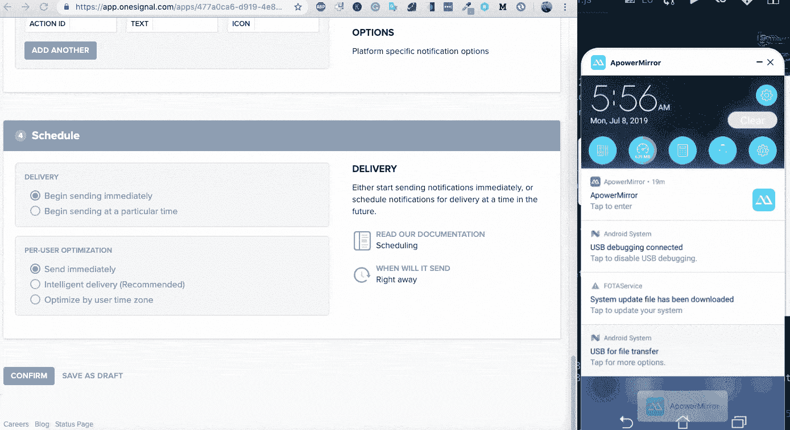

之后，我们将重定向到消息分析控制面板，如下面的屏幕截图所示:

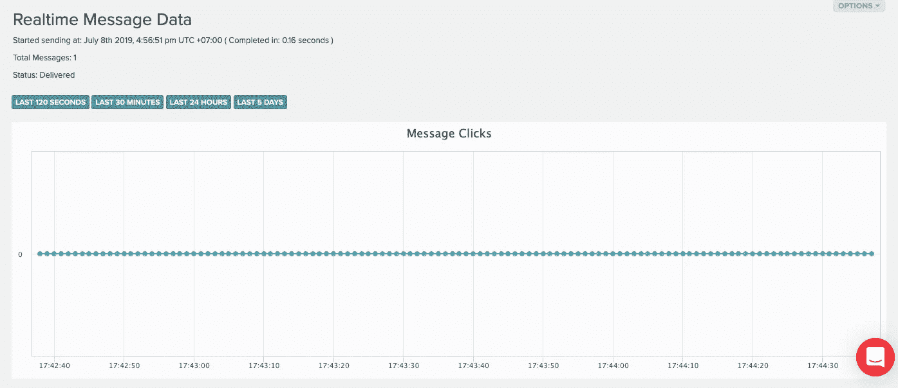

# 发送推送通知

在这一步中，我们使用在上一步中配置的 OneSignal 应用程序向 React 本地聊天应用程序发送推送通知。这里，我们将使用 [rest API](https://documentation.onesignal.com/reference#section-example-code-create-notification) 向一个信号服务器发送消息。我们需要构建一个 URL 和一个有效负载，如下面的代码片段所示:

在这里，我们可以复制上面的代码，并将其粘贴到 React 本地项目中，但是我们必须记住，我们需要一个服务器密钥来创建授权头和 app_id 以构造消息。

注意:更多消息配置可在 OneSignal [的文档中找到，此处为](https://documentation.onesignal.com/reference#create-notification)。

现在，我们需要添加一个带有消息的 *sendNotification()* 函数到 React 本地应用的 *componentDidMount* 中，如下面的代码片段所示:

```
componentDidMount() {
   this.sendNotification('Greeting from Chat App');
}
```

现在，我们可以看到，当我们启动应用程序时，通知显示为一个警告框，如下面的设备屏幕截图所示:

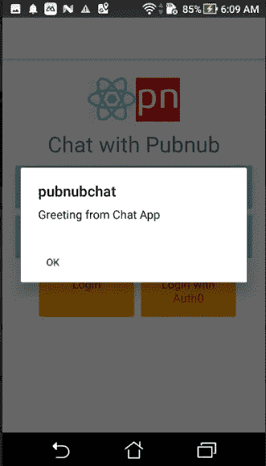

\

现在，当用户加入或离开频道时，我们需要使用这个特性。为此，我们可以将下面代码片段中提供的代码用于 *PresenceStatus* 函数:

这里，我们在两种情况下调用 *sendNotification()* 。一种是当用户进入频道时，另一种是当用户离开频道时，如上面的代码片段所示。现在，让我们在我们的 android 设备上尝试一下。

对于测试模式，我们可以在 Mac 上使用 Android 模拟器。但是，它非常慢，所以我们流式传输硬件设备并使用 iPhone 模拟器，如下面的代码片段所示:

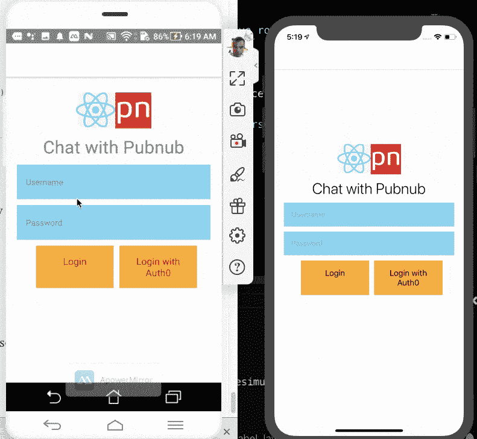

我们可以看到它工作正常。但是通知看起来并不熟悉，也没有很好地集成到 UI 中。因此，为此，我们需要从标题中发出通知警报。OneSignal 文档中配置通知样式的解决方案，也可以在下面的代码片段中找到:

现在，我们需要重新加载 React 应用程序并检查它。你可以看到一切都正常工作了。这就完成了我们有趣的教程，将使用 OneSignal 服务的推送通知集成到 react 本地聊天应用程序中。

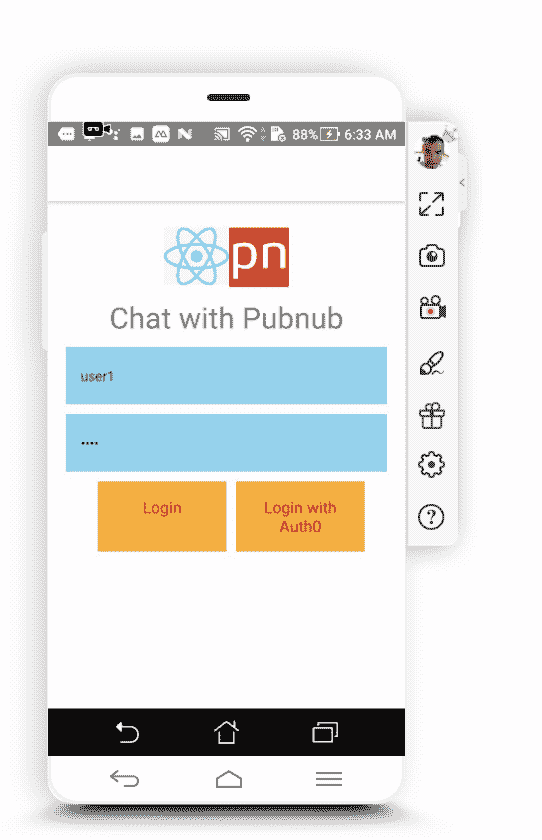

# 结论

在本教程中，我们学习了如何通过创建 OneSignal 应用程序来配置 OneSignal 服务。然后，通过使用 OneSignal 应用程序，我们了解了如何在 React 本地聊天应用程序中启用推送通知。我们还详细了解了如何在用户加入或离开聊天室时发送推送通知。本教程的代码可以在 Github 上免费获得。

*原载于*[*https://kriss . io*](https://kriss.io/posts/How-to-use-OneSignal-with-React-Native-Chat-App.js)*。*