# 如何将 OneSignal 与 React 原生聊天应用一起使用

> 原文：<https://levelup.gitconnected.com/how-to-use-onesignal-with-react-native-chat-app-92f4a97a777c>

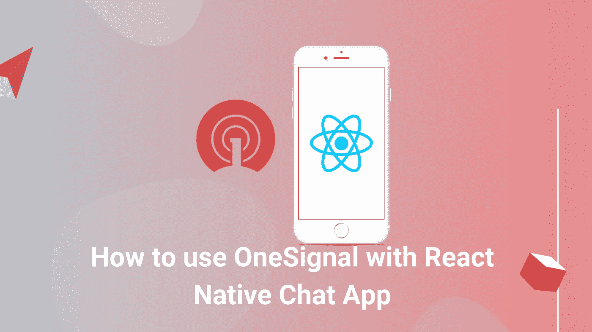

## **几分钟后发布下一个 Yelp**

下载这个华丽的 [React 本地商店定位器应用](https://www.instamobile.io/app-templates/react-native-store-locator-app-template)模板，在几分钟内创建您自己的商店查找器应用。通过使用这个用 React Native 编写的完全编码的初学者工具包，您可以节省数周的设计和开发时间，并可以专注于其他重要的工作，如客户参与和营销。

在本教程中，我们将学习如何将 OneSignal 推送通知集成到 React 原生聊天应用项目中。对于本教程，我们只打算使用 Android 设备在 Android 平台上实现它。OneSignal 是一种流行的服务，它可以在设备上实现推送通知，抽象出设备运行的平台等细节。通过使用 OneSignal 插件，移动应用程序可以发送和接收推送通知。因此，我们将在 React 原生聊天应用中实现这种 OneSignal 服务，以实现推送通知。

## 先决条件

基本上，要将一个信号集成为本地信号，我们必须满足以下两个要求:

1.  [一个启动码](https://github.com/krissnawat/pubnub-react-native-chat/tree/add_auth0)
2.  安卓硬件设备(因为安卓模拟器太慢)

## 设置一个信号

第一步，我们将建立我们的单一信号服务。为此，我们需要登录 [Onesignal](https://app.onesignal.com/login) 网站，然后登录我们的 Onesignal 帐户。

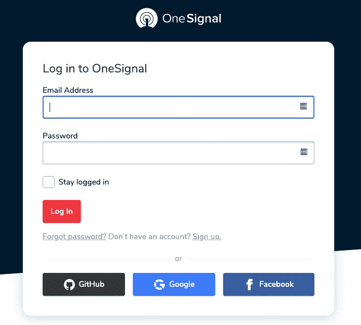

登录后，我们需要创建一个新的应用程序。为此，我们需要选择一个平台。这里，我们将选择“Google Android”平台，如下面的代码片段所示:

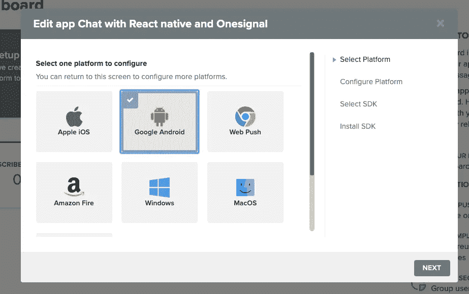

然后，我们需要一个 Firebase 服务器密钥来建立 OneSignal 和 Firebase 云消息之间的通信，如下图所示:

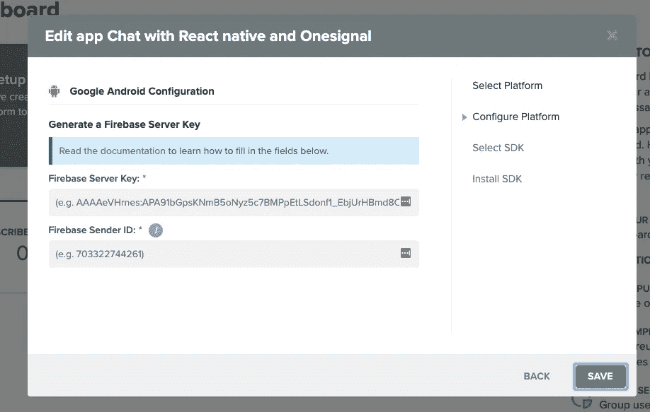

对于 firebase 服务器密钥，我们需要转到 Firebase 控制台并创建一个 Firebase 应用程序。成功创建 Firebase 应用程序后，我们需要进入“设置”。然后，我们需要导航到“云消息”选项卡，复制**服务器密钥**和* *发件人 id * *，如下图所示:

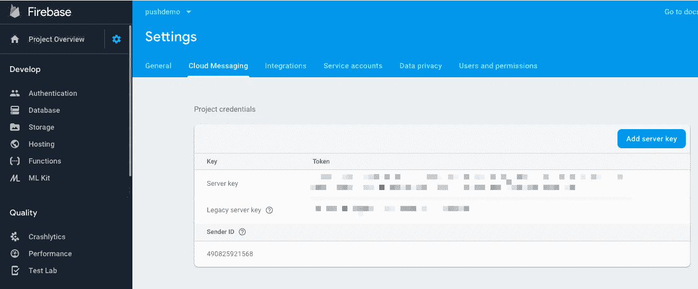

现在，我们需要返回到我们的 OneSignal 平台配置，并将 Firebase **服务器密钥* *和* *发送方 ID** 粘贴到 OneSignal 表单，如下图所示:

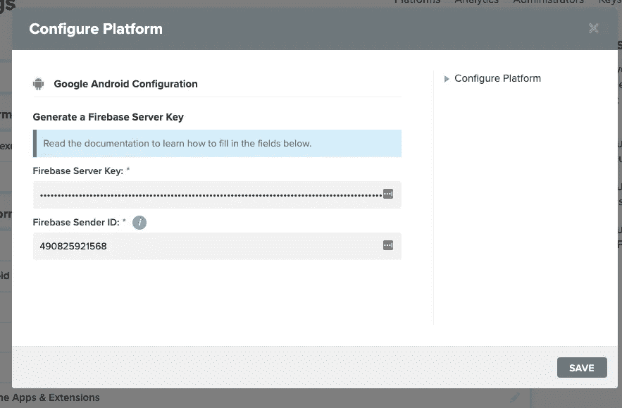

平台配置完成后，我们需要为我们的 OneSignal app 选择 SDK。在这里，我们将选择* * React native SDK * *作为我们的应用 SDK。

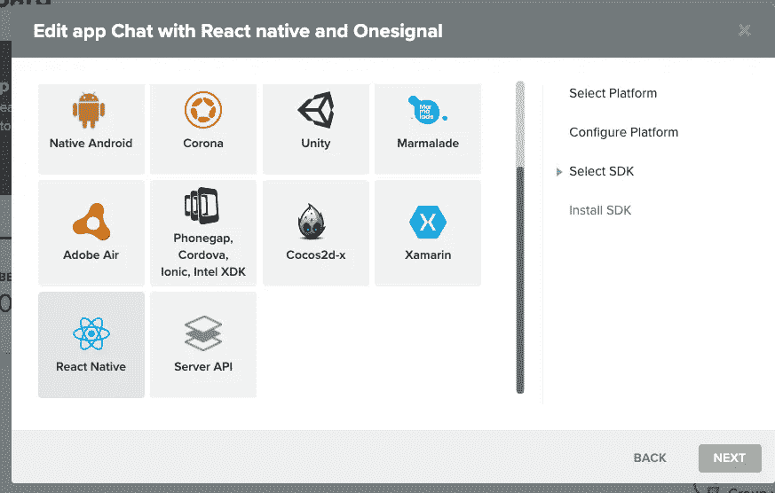

在选择 SDK 之后，我们获得了用于发送推送通知的 AppID，如下面的屏幕截图所示:

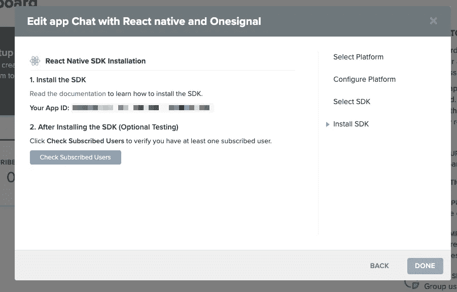

现在，我们需要点击“完成”按钮，导航至我们的 OneSignal 仪表盘，如下图所示:

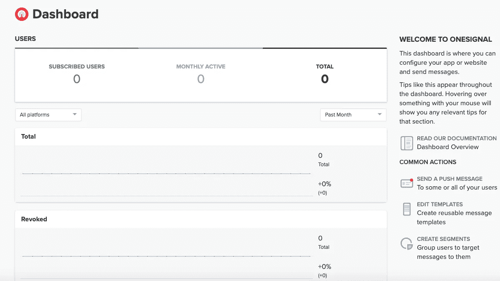

在此之后，我们需要转到 React Native SDK [文档](https://documentation.onesignal.com/docs/react-native-sdk-setup)并向我们的应用程序添加一个信号代码片段代码，如下面的代码片段所示:

```
constructor(props) {
    super(props);
    ................
    OneSignal.init(process.env.onesignal_key);
    OneSignal.addEventListener("received", this.onReceived);
    OneSignal.addEventListener("opened", this.onOpened);
    OneSignal.addEventListener("ids", this.onIds);
    OneSignal.configure();
    ................
  }

 onReceived = notification => {
    console.log("Notification received: ", notification);
  };

  onOpened = openResult => {
    console.log("Message: ", openResult.notification.payload.body);
    console.log("Data: ", openResult.notification.payload.additionalData);
    console.log("isActive: ", openResult.notification.isAppInFocus);
    console.log("openResult: ", openResult);
  };

  onIds = device => {
    console.log("Device info: ", device);
    this.setState({ device });
  };
```

这里，我们使用三个函数来显示活动日志，正如您在上面的代码片段中看到的。当我们打开应用程序时，它会自动注册到 OneSignal，如下图所示:

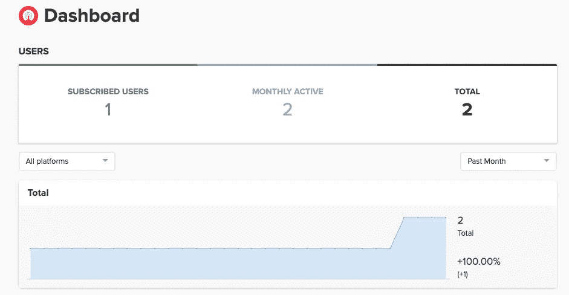

现在，让我们通过从 OneSignal 控制台发送消息来测试我们的 OneSignal 应用程序。

首先，我们需要进入* *消息* *选项卡，然后\** * *创建一条新消息，如下面的 OneSignal 控制台屏幕截图所示:

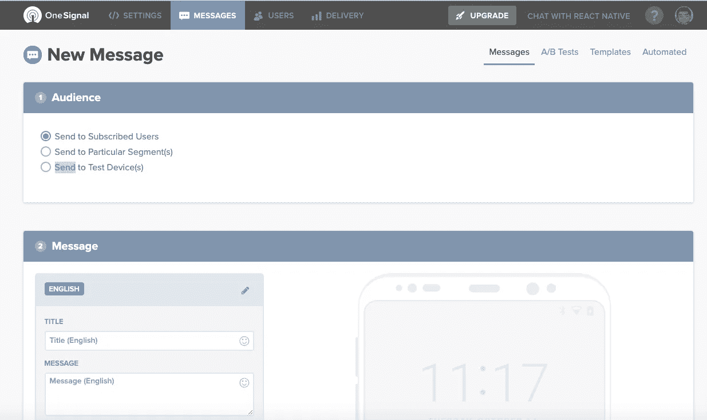

我们可以在左下方的屏幕截图中看到第一条消息的设置，以及推送通知将如何出现在右下方的屏幕截图中:

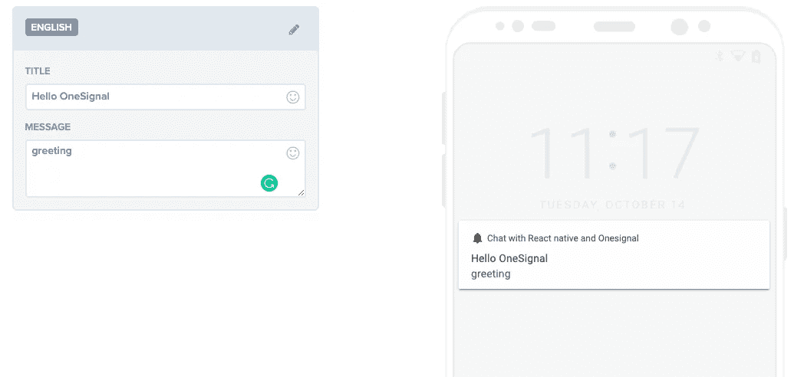

现在，我们需要确认我们是否真的在向 Android 设备发送消息。如果我们正在发送消息，那么我们点击**发送消息**按钮，如下图所示:

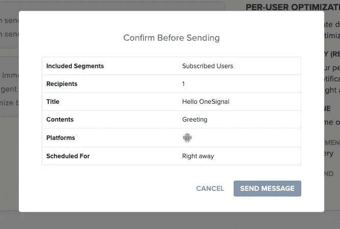

在这里，我们可以看到它正在按预期工作。我们可以在我们的 Android 设备中收到一条消息，正如您在下面的模拟中看到的:

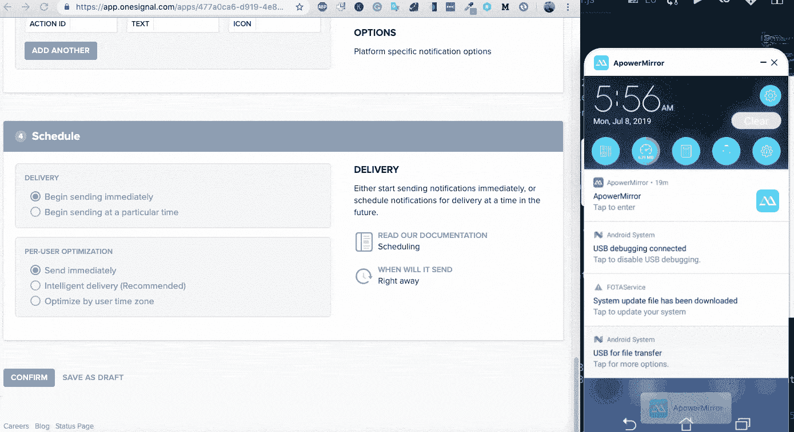

之后，我们将重定向到消息分析控制面板，如下面的屏幕截图所示:

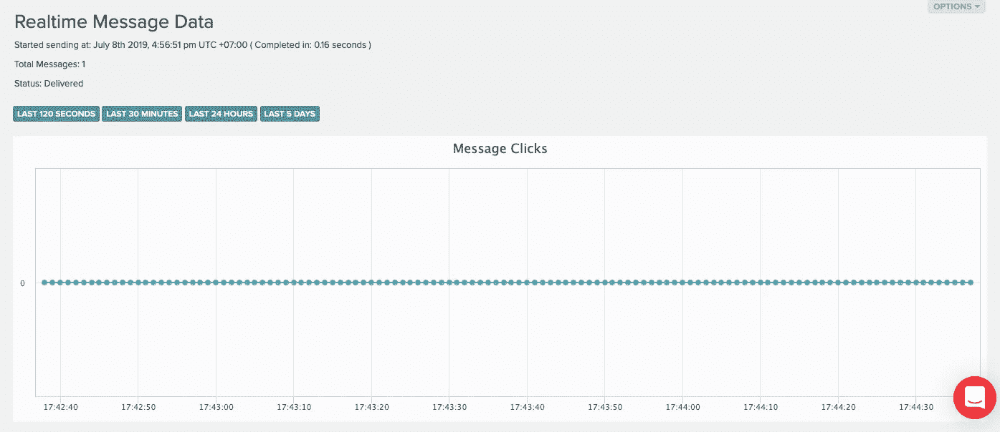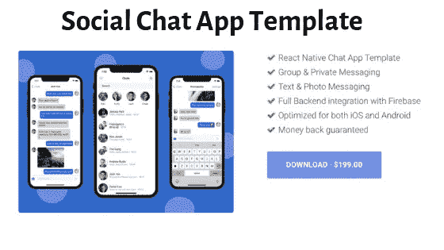

## 发送推送通知

在这一步中，我们使用在上一步中配置的 OneSignal 应用程序向 React 本地聊天应用程序发送推送通知。这里，我们将使用 [rest API](https://documentation.onesignal.com/reference#section-example-code-create-notification) 向一个信号服务器发送消息。我们需要构建一个 URL 和一个有效负载，如下面的代码片段所示:

```
sendNotification = data => {
  let headers = {
    "Content-Type": "application/json; charset=utf-8",
    Authorization: "Basic 'OneSignal Server Key'"
  };

  let endpoint = "https://onesignal.com/api/v1/notifications";

  let params = {
    method: "POST",
    headers: headers,
    body: JSON.stringify({
      app_id: "xxxxxxxx-xxxxxx-xxx-a14a-xxxxxx",
      included_segments: ["All"],
      contents: { en: data }
    })
  };
  fetch(endpoint, params).then(res => console.log(res));
};
```

在这里，我们可以复制上面的代码，并将其粘贴到 React 本地项目中，但是我们必须记住，我们需要一个服务器密钥来创建授权头和 app_id 以构造消息。

注意:更多消息配置可在 OneSignal [的文档中找到，此处为](https://documentation.onesignal.com/reference#create-notification)。

现在，我们需要向 React 本机应用程序的* componentDidMount *添加一个带有消息的`sendNotification()`函数，如下面的代码片段所示:

```
componentDidMount() {
       this.sendNotification('Greeting from Chat App');
    }
```

现在，我们可以看到，当我们启动应用程序时，通知显示为一个警告框，如下面的设备屏幕截图所示:

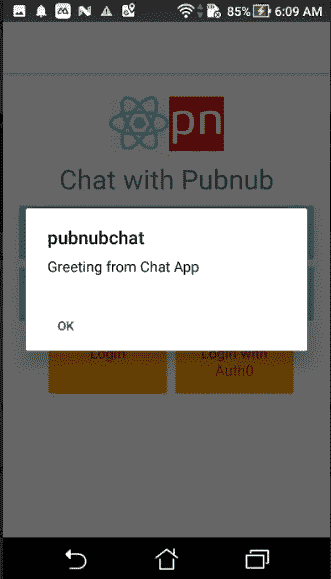

现在，当用户加入或离开频道时，我们需要使用这个特性。为此，我们可以使用下面代码片段中提供的代码和`PresenceStatus`函数:

```
PresenceStatus = () => {
    this.pubnub.getPresence(RoomName, presence => {
      if (presence.action === "join") {
        let users = this.state.onlineUsers;

        users.push({
          state: presence.state,
          uuid: presence.uuid
        });

        this.setState({
          onlineUsers: users,
          onlineUsersCount: this.state.onlineUsersCount + 1
        });
        this.props.navigation.setParams({
          onlineUsersCount: this.state.onlineUsersCount
        });
        this.sendNotification(presence.uuid + " join room");
      }

      if (presence.action === "leave" || presence.action === "timeout") {
        let leftUsers = this.state.onlineUsers.filter(
          users => users.uuid !== presence.uuid
        );

        this.setState({
          onlineUsers: leftUsers
        });
        console.log("leave room");
        const length = this.state.onlineUsers.length;
        this.setState({
          onlineUsersCount: length
        });
        this.props.navigation.setParams({
          onlineUsersCount: this.state.onlineUsersCount
        });
        this.sendNotification(presence.uuid + " leave room");
      }
```

这里，我们在两种情况下调用`sendNotification()`。一个是当用户进入频道时，另一个是当用户离开频道时，如上面的代码片段所示。现在，让我们在我们的 android 设备上尝试一下。

对于测试模式，我们可以在 Mac 上使用 Android 模拟器。但是，它非常慢，所以我们流式传输硬件设备并使用 iPhone 模拟器，如下面的代码片段所示:

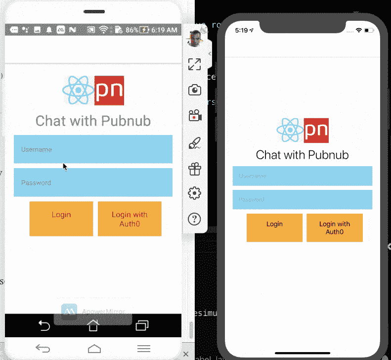

我们可以看到它工作正常。但是通知看起来并不熟悉，也没有很好地集成到 UI 中。因此，为此，我们需要从标题中发出通知警报。OneSignal 文档中配置通知样式的解决方案，也可以在下面的代码片段中找到:

现在，我们需要重新加载 React 应用程序并检查它。你可以看到一切都正常工作了。这就完成了我们有趣的教程，将使用 OneSignal 服务的推送通知集成到 react 本地聊天应用程序中。

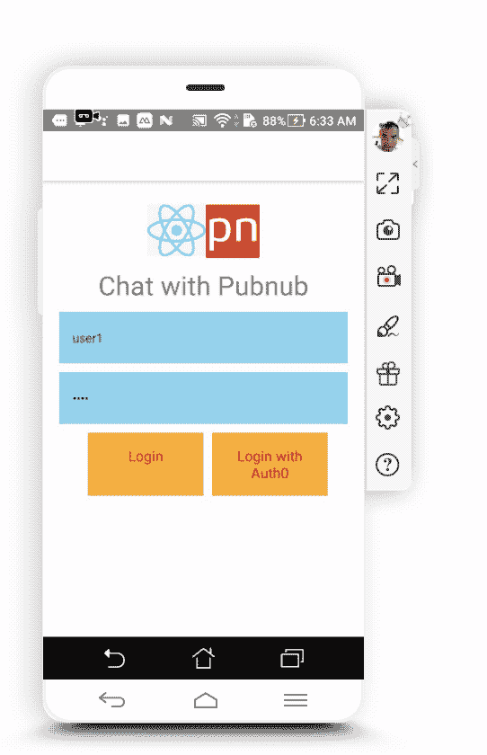

## 结论

在本教程中，我们学习了如何通过创建 OneSignal 应用程序来配置 OneSignal 服务。然后，通过使用 OneSignal 应用程序，我们了解了如何在 React 本地聊天应用程序中启用推送通知。我们还详细了解了如何在用户加入或离开聊天室时发送推送通知。本教程的代码可以在 [Github](https://github.com/krissnawat/pubnub-react-native-chat/tree/add-push-notification-with-OneSignal) 上免费获得。

该网站包含产品的附属链接。我们可能会收到通过这些链接购买的佣金。

*最初发表于* [*克里斯*](https://kriss.io/how-to-use-onesignal-with-react-native-chat-app/) *。*