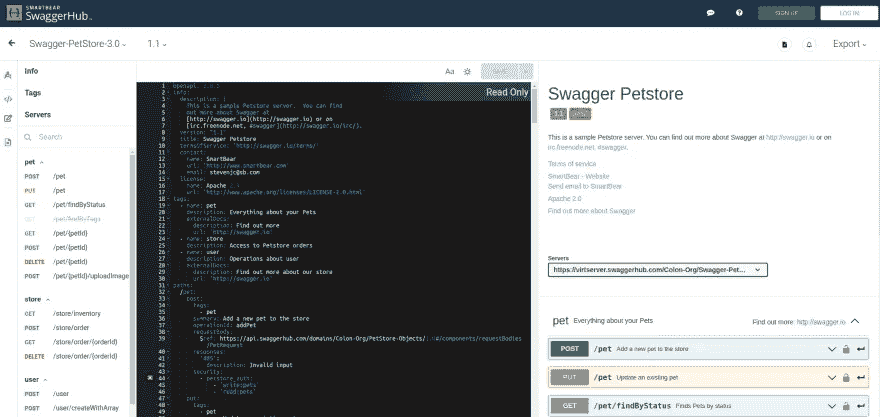
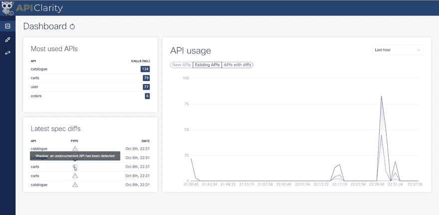

# 如何使用 OpenAPI 实现安全可靠的 API 集成

> 原文：<https://levelup.gitconnected.com/how-to-use-openapi-for-secure-and-robust-api-integration-df1bb37b569d>

标准很牛逼。

如果编程语言允许`()`和`[]`和`{}`互换使用，甚至混合在一起，这将是一个什么样的世界？混乱会接踵而至。

如果计算机侧面的端口只是一堆松散的电线和触点，等待您找到正确的连接组合来启动您的网络摄像头，会怎么样？感谢 USB 标准。

**API 也需要标准。**在不可预测和不可靠的 API 上构建你的应用程序是浪费时间的。只是一个接一个的头疼。这就是为什么 **API 开发已经转向广泛采用** [**OpenAPI 规范(OAS)——**](https://spec.openapis.org/oas/latest.html)API 的构建者*和消费者*都使用的行业标准。

**当您构建使用 API 的系统时，OAS 会有什么帮助？通过使用遵循 OAS 的 API，您将避免哪些陷阱？**

最终，当一个 API 符合一个标准时，它是最有用的。除了符合 OAS 的 API 更易于使用之外，OAS 还带来了几个工具，如 [Swagger](https://swagger.io/) 和 [APIClarity](https://apiclarity.io/) ，为开发人员更好地理解他们正在使用的 API 而构建。Swagger 包括一套用于 API 的设计、开发、文档和测试的工具。APIClarity 观察进出 API 的实时流量，然后将*实际*使用情况与 API 规范进行比较。

让我们看看 OpenAPI 规范是如何产生的，然后深入研究采用 OAS 将如何消除令人头痛的问题，并为您的第三方 API 集成带来信心。

# 什么是 OpenAPI 倡议？

OpenAPI Initiative (OAI)是“*一个由前瞻性行业专家组成的联盟，他们认识到了 API 描述标准化的巨大价值*财团成员包括 IBM、谷歌、甲骨文、微软和孔等重量级公司。

截至 2021 年 10 月的 OAI 成员([来源](https://www.openapis.org/membership/members))

建立标准时，OAI 的目标是为 API 双方的开发者带来价值。

对于构建 API 的开发人员来说，该标准提供了一个框架来构建可靠的服务，与其他服务进行交互。该框架将您推向安全性和面向未来的开发的最佳实践。你*构建的 APIs】可以变得可预测和可靠。通过使用标准格式来记录您的 API，您的 API 变得更容易被发现。*

**对于使用 API**的开发人员来说，好处甚至更大:与符合标准的 API 进行交互可以确保您*使用的 API*将是**可预测的**和**可靠的**。你*也*获得 API **可发现性**的好处，因为根据 OAS 记录的 API 将更容易在 API 市场或交易中找到。

OAI 在 Linux 基金会下运营，是许多行业领先公司的合作伙伴。遵循 OAS 的 API 的开发者和消费者可以放心地知道这些 API 是厂商中立的，并且依赖于众所周知的 web 技术。

OAS 本身最初是基于 [Swagger 规范](https://swagger.io/)的，并继续从 Swagger 流行的 API 文档工具中汲取许多元素。此外，OAS 的目标是 RESTful API 开发和资源驱动的 API 模型。

“Swagger Petstore”是 OpenAPI 规范的“Hello World”([source](https://app.swaggerhub.com/apis/Colon-Org/Swagger-PetStore-3.0/1.1))

# 为什么使用 OAS？

当一个 API 按照一个标准被设计、构建和使用时，这对维护者和 API 的用户都有好处。不再有浪费时间或猜测的工作，试图找出参数是否应该在查询字符串或请求正文中，或者头中的身份验证是基本身份验证还是载体身份验证。开发者的信心和速度——对于构建者和消费者——增加了，因为约定导致了代码的一致性。

有了 OpenAPI 规范，开发人员可以享受许多好处，并避免常见的陷阱。

# 享受的福利

OAS 最大的好处之一是定义了一个约定——一个标准的、与语言无关的接口。符合 OAS 的 API 可以用任何语言实现，并且可以使用任何数量的底层服务。该规范与它所描述的 API 的实现细节完全分离。规范只是详细描述了 API 的功能。

这种与实现的分离对 API 服务的开发者和消费者都有好处，因为它**简化了系统**不同功能的可发现性。有了规范在手，API 消费者可以**轻松理解 API** ，而无需了解开发 API 的语言或框架。消费者不需要访问任何源代码或专门的文档。例如， [Twitch API](https://dev.twitch.tv/docs/api) 的消费者将从 OAS 文档中获得他们使用 API 所需要的一切，而不需要学习 Ruby on Rails 或 Go，它们是 Twitch 技术堆栈的一部分。同样， [Spotify API](https://developer.spotify.com/documentation/web-api/) 的用户不需要学习 Python 或 Java 来使用该 API。这就是 OAS 与语言无关的好处。

因为 OpenAPI 规范在整个行业得到了广泛的使用和认可，所以大量的**工具被用来简化 API 开发的任务**。有验证请求的工具(如 [Dredd](https://dredd.org/en/latest/) 或 [RESTest](https://github.com/isa-group/RESTest) )，自动化编写 API 文档的工具(如 [Stoplight](https://stoplight.io/api-documentation/) 或 [DeveloperHub](https://developerhub.io/api-docs) )，甚至为许多客户端语言生成 SDK 代码(如 [APIMatic CodeGen](https://www.apimatic.io/continuous-code-generation/) 或 [OpenAPI Generator](https://openapi-generator.tech/) )。虽然 API 开发人员当然可以独自完成构建，而不需要任何帮助，但是在构建符合 OAS 的 API 时，拥有许多工具链选项当然很有帮助。

# 避免的陷阱

此外，使用符合 OAS 的 API 可以确保您不会成为许多常见陷阱的受害者。**跨 API 的端点被保证是一致的**，因为该标准确保了 HTTP 方法的使用。

您也不需要担心遇到不推荐的 API(有时称为“僵尸 API”)，因为**标准确保了 API** 的合理版本。符合 OAS 的 API 不会在同一版本中引入突破性的变化；相反，突破性的改变需要 API 中的版本改变。

当使用符合 OAS 的 API 时，也要避免未记录的 API(或“影子 API”)，因为该标准要求开发人员**在他们的 API 中使用可理解的和一致同意的结构**。

# 强制遵守 OAS

尽管 OpenAPI 规范做出了种种承诺，但确保您使用的 API 符合 OAS 标准似乎令人望而生畏。构建一个遵循 OAS 的 API 的任务似乎同样艰巨。

不需要这样。

首先，围绕 OpenAPI 规范的工具对于从事该领域工作的任何开发人员来说都是一笔巨大的资产。因为 OAS 最初是基于 Swagger 规范的，所以仍然有来自 Swagger 的[许多工具](https://swagger.io/tools/)可以帮助任何开发 API 的开发者。

对于 API 开发者来说，OpenAPI 倡议提供了一个[工具列表](https://openapi.tools/)，用于构建健壮的符合 OAS 的 API。无论您需要代码生成还是文档帮助，这里都可能有您需要的东西。

当构建使用 API 的客户端应用程序时，有用的工具包括那些用于[了解更多关于您使用的 API 的工具](https://openapi.tools/#learning)。其中一些工具可以针对您想要使用的 API 运行，根据 OAS 标准生成 API 的描述。

例如， [APIClarity](https://apiclarity.io/) 是一个观察 Kubernetes 环境中所有 API 流量的工具。基于流量观察，APIClarity 推断出这些 API 的 OpenAPI 描述。如果 API 创建者从未定义或提供过这样的描述，这一点尤其有用。它也暴露了现有 API 的潜在问题，比如对未记录的、影子 API 的请求，或者继续使用已废弃的、僵尸 API。如果您正在开始 OAS 遵从的道路上，那么像 APIClarity 这样的工具可以成为洞察力和可观察性的重要来源。

# 结论

总之，OpenAPI 规范的存在是为了让开发人员的工作变得更加容易——无论他们是构建还是使用 API。不要根据过去的经验匆忙做出设计决策，您可以利用行业专家的共同智慧来开发一个优秀的 API 或客户端应用程序。[开始使用 OAS 标准构建 API](https://oai.github.io/Documentation/start-here.html)并非遥不可及，您今天就可以开始！