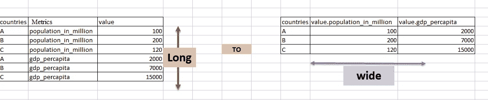
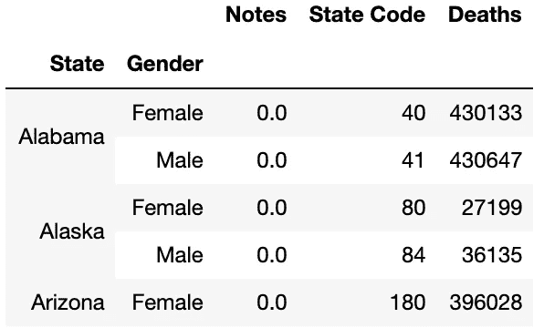
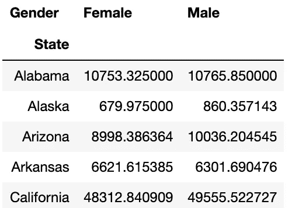

# 如何在熊猫中使用数据透视表

> 原文：<https://levelup.gitconnected.com/how-to-use-pivot-tables-in-pandas-2cef66fd1e9c>

一个普通的 Excel 函数在熊猫身上变得更简单。

在这篇简短的博文中，我将向您介绍构建和索引数据集的不同方法，使其更易于处理和理解。这篇博文的三个目标是:

*   展示宽**的**数据帧和长**的**数据帧之间的区别。
*   比较简单的扁平索引结构和多层次索引结构。
*   展示如何利用聚合函数和数据透视表自己制作它们。

## 长与宽

这两种不同的排列暗示了如何在数据帧中组织数据。在**宽**排列中，每一列等于一个变量，每一行等于一个数据点。索引通常是一个整数，0 是第一行。这是你可能已经习惯看到的常见排列。

在**长**排列中，每个索引是每次观察的时间点。这意味着一个给定的观察可以在许多行上有多个值。当管理时间序列或聚合数据时，这是一种特别有价值的格式，因为我们可以利用**多层次索引**。下图直观地展示了长而宽的数据帧:



[https://www . datasciencemadesimple . com/WP-content/uploads/2017/11/Reshape-long-to-wide-in-pandas-python-with-pivot-function-0 . png](https://www.datasciencemadesimple.com/wp-content/uploads/2017/11/Reshape-long-to-wide-in-pandas-python-with-pivot-function-0.png)

## 多层次索引

处理数据时的一些常见任务是制作数据透视表和/或利用聚合函数收集数据。在这方面， **long** 排列为您提供了一种整洁、有序的方法来组织具有多个索引的数据。它允许你灵活有效地表现各种数据的混合。考虑下面的数据透视表:



按性别和州显示死亡人数的数据透视表。

通过查看左边的两列，您可以看到该数据框架有一个包含两个级别的多层次索引，由“State”和“Gender”组成。正因为如此，你有一个简单的方法来聚集和分类数据，这允许你回答这样的问题，“在阿拉斯加，有更多的男人或女人死了？”

## 聚合方法

Pandas 数据帧提供了一种利用 ***汇总信息的简单方法。*group by()**方法。要使用这种方法，您只需指出您的索引，即您需要按顺序对数据进行分组的列，该方法将根据您的请求返回包含分组数据的另一个 dataframe。例如，如果您只需要按州聚合上述数据集，您可以键入:

```
df.groupby("State")
```

这将给你一个具有扁平索引结构的**长的**数据帧。或者，您可能需要按照州和性别对数据进行分组，就像上面的例子一样。您应该键入:

```
df.groupby(["State", "Gender"])
```

这将返回一个具有多层次索引的**宽的**数据帧，其中“State”是最外层的索引。

*。groupby()* 语句通常与聚合方法一起使用，聚合方法允许您快速计算汇总统计数据，如平均值、中值、众数等。扩展上一个示例，如果您需要查看多个其他变量中“State”和“Gender”的每个分组的平均值，您可以通过键入以下内容来利用方法链:

```
df.groupby(["State", "Gender"]).mean()
```

## 数据透视表

数据透视表允许您通过“旋转”各种感兴趣的变量来快速检查数据。Pandas 允许你用内置的 ***轻松制作数据透视表。*枢()**法。要创建一个数据透视表，只需调用 *df.pivot()* 方法，确定要放入数据透视表的索引列&，以及要放入每个单元格的值。例如，下面的代码:

```
pivot = df.pivot(index=’State’, columns=’Gender’, values=’Deaths_mean’)
pivot.head()
```

会产生以下数据透视表:



**注意** 未显示如何创建“Deaths_mean”的上下文。它是作为我的项目中的一个不同的步骤创建的，在这篇文章中不会讨论。我在上面的例子中使用它只是为了演示如何使用 Pandas 创建数据透视表。

这就结束了我关于如何使用聚集方法和透视表来索引和结构化数据集的博文。我希望这有所帮助！感谢您的阅读！

[领英](https://www.linkedin.com/in/acusio-bivona-7a315818b/)