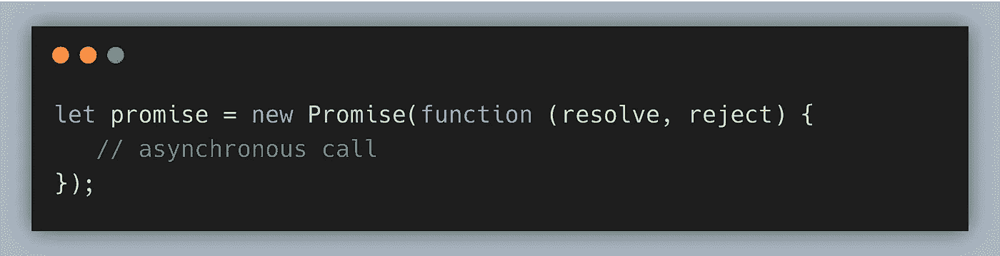
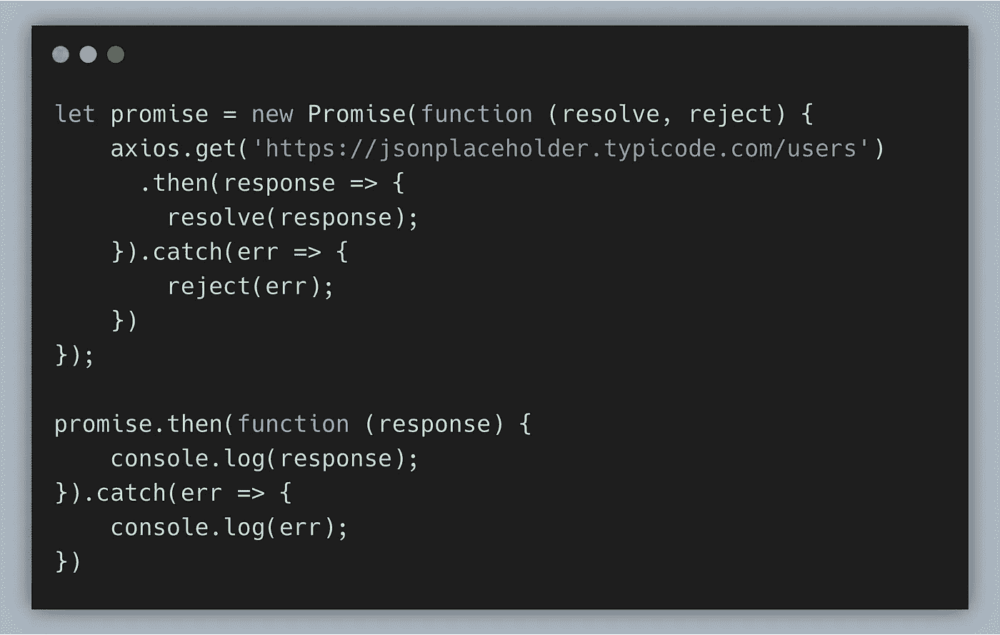
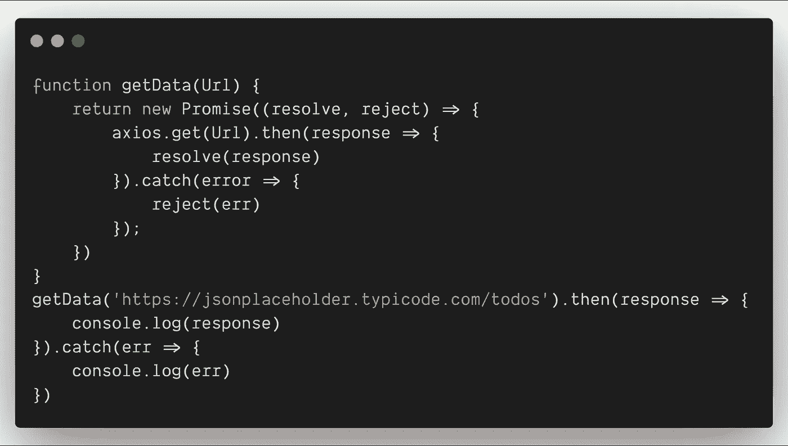
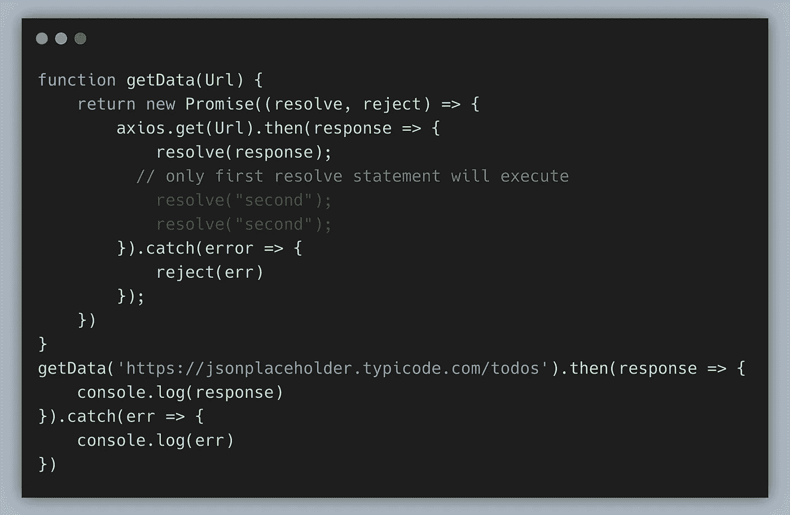
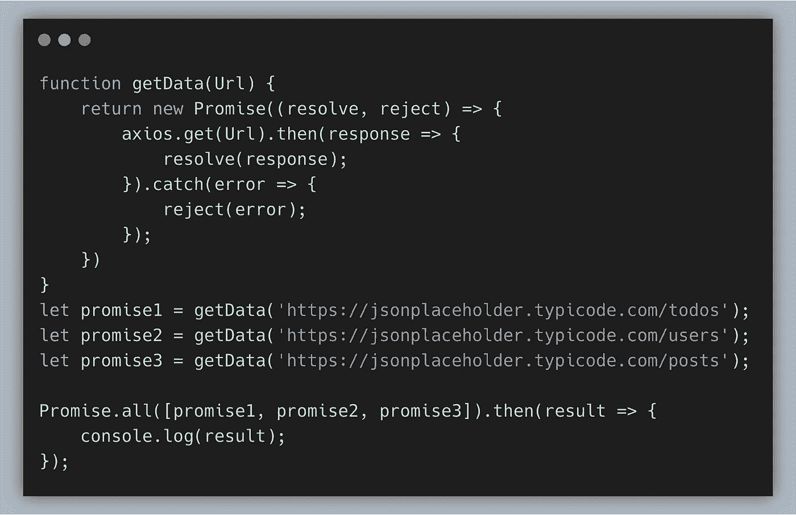
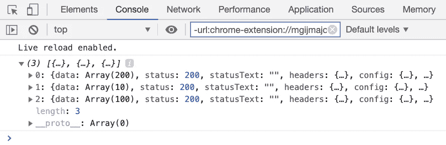
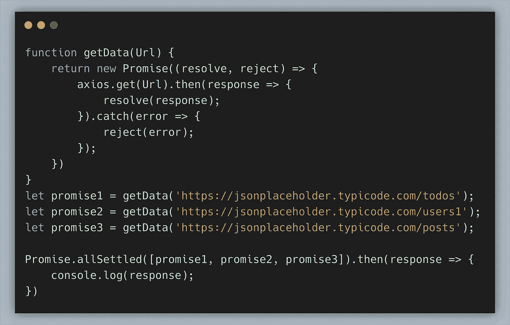
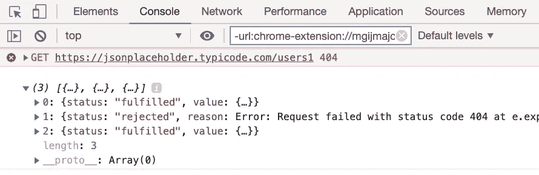
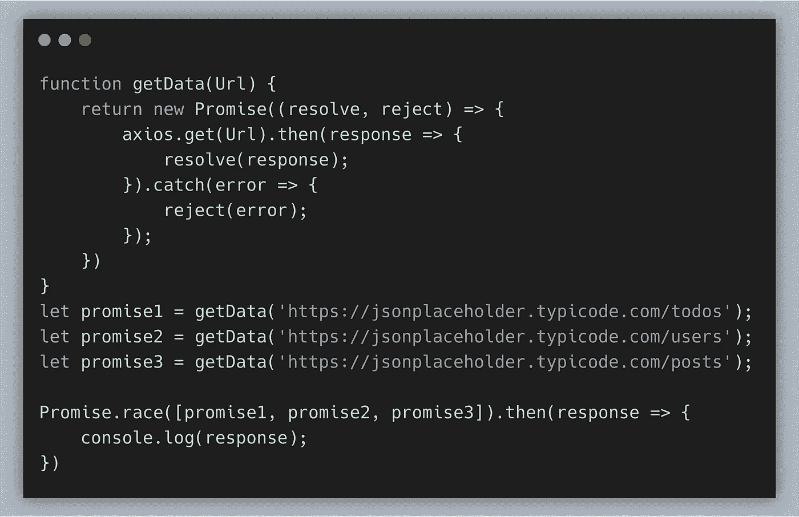
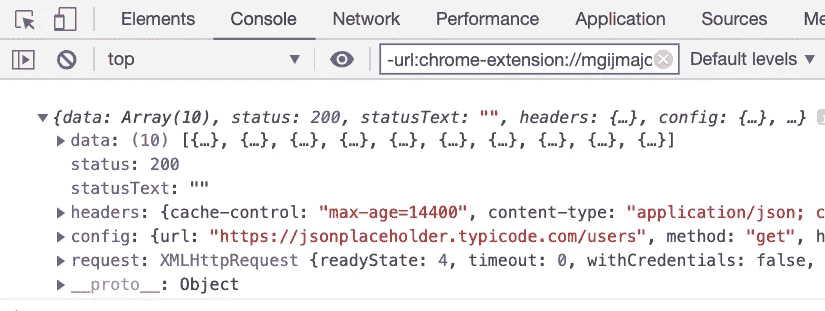

# 关于如何在 JavaScript 中使用承诺的完整指南

> 原文：<https://levelup.gitconnected.com/how-to-use-promises-in-javascript-real-time-24332f4f3f6f>

莎拉·塞万提斯在 [Unsplash](https://unsplash.com?utm_source=medium&utm_medium=referral) 上的照片

JavaScript 中的承诺与现实生活中的承诺非常相似。由于现实生活中的承诺要么被遵守，要么被打破，JavaScript 承诺要么被解决，要么被拒绝。

在 JavaScript 的早期，回调用于处理异步操作。

然而，多个回调函数会导致不可管理的代码，产生所谓的回调地狱。为了克服这一点，JavaScript 在 ES6 中引入了原生承诺。

## **承诺**

首先，让我们创建一个简单的 promise 对象。

Promise 接受一个回调函数作为参数，该回调函数接受两个参数—第一个是一个`**resolve**` 函数，第二个是一个`**reject**` 函数。一个承诺既可以*带值履行*，也可以*带原因(错误)拒绝*。

这里我分享两种写承诺的方法。这是相同的想法，但语法略有不同。

**语法 1:**

## **语法 2:**

在一个承诺中，只有一个`resolve`或`reject`语句有效。如果我们包含多个`resolve`语句，只有第一个有效。看看下面的例子。

## **约定俗成**

如果你想同时执行多个承诺，我们可以用`**Promise.all()**`。它接受一个承诺数组，响应将有一个结果数组，这些结果与它们在初始数组中出现的顺序相匹配。

如果任何一个承诺失败，它就会抛出一个异常。让我们看看下面的例子:

如果所有的承诺都成功了，这就是我们将得到的回应。

## **承诺.全部解决**

这是 JavaScript 的新内容。老浏览器可能不支持，但是可以多填充。不管结果如何，它只是等待所有的承诺都得到满足(而如果任何一个请求有错误，那么`Promise.all`就会结束)。

例如，我们想要获取多个用户的信息。如果一个请求失败了，我们仍然对其他请求感兴趣。再来看`**Promise.allSettled()**`。

> ***我输入的第二个 API url 是错误的，让我们在控制台中看到结果***

它向`{state:'fulfilled', value:...}`返回成功结果，向`{state:'rejected', reason:...}`返回错误。这正是`Promise.allSettled`的格式。

现在我们可以用`Promise.allSettled`得到*所有*给定承诺的结果，即使其中一些拒绝。

## **无极.竞**

它将返回首先被解决或拒绝的 promise 实例。让我们看一个例子:

`/users` API 是第一个被解析的，所以它只返回用户 API 的响应。

**总结:**

`**Promise.all**`–等待所有承诺完成并返回一组结果。如果任何一个给定的承诺被拒绝，就变成了`Promise.all`的错误，其他所有结果都被忽略。

`**Promise.allSettled**`–等待所有承诺完成，并以对象数组的形式返回结果，它们可以分别是`resolved`或`rejected`。

`**Promise.race**`–返回首先被解决或拒绝的 promise 实例。

为了您的方便，在此添加[源代码](https://github.com/jayanthbabu123/Javascript-promises-source)。感谢您的时间:)