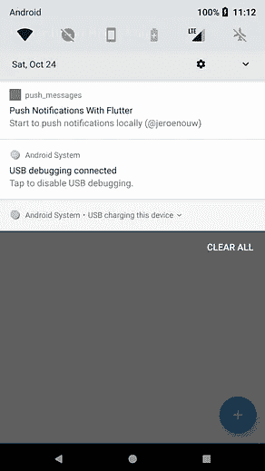
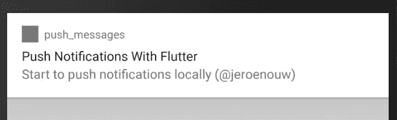

# 如何在 Flutter 中使用推送通知

> 原文：<https://levelup.gitconnected.com/how-to-use-push-notifications-with-flutter-23bed9e47e52>

## 编程；编排

## 开始以简单的方式向您的用户推送通知


我找不到任何关于 push notifications with Flutter 的简单文档，大部分都比它应该的要复杂。所以在这个指南中，我只想解释什么是必要的。

> **注**；这篇文章关注 Android 的 Flutter

# 1.入门指南

我用`flutter create push_messages`创建了一个新项目。在生成的`pubspec.yaml`中可以添加`dependencies`下的[后续包](https://pub.dev/packages/flutter_local_notifications)；

```
dependencies:
  flutter_local_notifications: 3.0.0 // latest at time of writing
```

然后运行`flutter pub get`，这将安装软件包。

# 2.设置权限

接下来，我们去；

```
android/app/src/**main**/AndroidManifest.xml
```

我们需要添加一些代码，这需要显示通知，即使你的设备被锁定，并将打开你的屏幕。此外，我们还设置了一些代码，以防您将来想要安排通知。请添加以下所有**粗体**代码；

```
<manifest xmlns:android="[http://schemas.android.com/apk/res/android](http://schemas.android.com/apk/res/android)"
    package="com.example.push_messages">
   <application
        android:label="push_messages"
        android:icon="[@mipmap/ic_launcher](http://twitter.com/mipmap/ic_launcher)">
        <activity
          <!-- other code -->
          **android:showWhenLocked="true"
          android:turnScreenOn="true">**
          <!-- other code -->
        </activity>
       ** <receiver android:name="com.dexterous.flutterlocalnotifications.ScheduledNotificationBootReceiver">
          <intent-filter>
              <action android:name="android.intent.action.BOOT_COMPLETED"/>
              <action android:name="android.intent.action.MY_PACKAGE_REPLACED"/>
              <action android:name="android.intent.action.QUICKBOOT_POWERON" />
              <action android:name="com.htc.intent.action.QUICKBOOT_POWERON"/>
          </intent-filter>
        </receiver>**
      <!-- other code -->
  </application>
</manifest>dasd
```

要设置其他权限，我们需要去**调试**文件夹中的`AndroidManifest`；

```
android/app/src/**debug**/AndroidManifest.xml
```

这里我们再添加一些基本权限，请添加**加粗的**行；

```
<manifest xmlns:android="[http://schemas.android.com/apk/res/android](http://schemas.android.com/apk/res/android)"
    package="com.example.push_messages">
 **<uses-permission android:name="android.permission.INTERNET"/>
    <uses-permission android:name="android.permission.RECEIVE_BOOT_COMPLETED"/>
    <uses-permission android:name="android.permission.VIBRATE" />**
</manifest>
```

# 3.创建通知

让我们创造`lib/notifications.dart`。这里我们有三种方法；

*   initNotifications() —我们需要它来初始化 Android、iOS 和 macOS 的通知设置。对于 Android，我们希望在通知中使用图标。我们称之为`app_icon`(在下一节中解释)。
*   pushNotification() —我们需要设置一些通用的通道细节，对于 Android 8.0+需要设置。它有各种各样的选项(比显示的更多)。现在，我们终于看到了您想要显示的通知部分；`flutterLocalNotificationsPlugin.show(<your-displayed-notification>)`。您可以在这里指定通知的 id、标题和内容，这本身就说明了一切。但是也有有效载荷；

> “已经指定了有效负载(“项目 x”)，当用户点击通知时，该有效负载将通过您的应用程序传回”——文档

*   selectNotification ()—是最后一个方法，这将在选择通知时触发。

通知. dart

# 4.设置图标

在下面的文件夹中添加一个`app_icon`，尺寸最好是 72x72。这用作您的通知的图标；

```
android/app/src/main/res/drawable/app_icon.png
```

# 5.实施通知

在我们的`lib/main.dart`中，每次点击`floatingActionButton`都会有一些生成的代码需要计算。我们去掉了所有与计数相关的东西。一旦完成，我们就在`_MyHomePageState`类下面添加下面的代码行；

```
final Notifications _notifications =  Notifications();[@override](http://twitter.com/override)
  void initState() {
    super.initState();
    this._notifications.initNotifications(); **// initialise notification**
  }void _pushNotification() {
    this._notifications.pushNotification(); **// display notification**
  }
```

在`floatingActionButton`中，你有一个`onPressed`选项，我们给它添加了`_pushNotification`方法。例如，您当然可以在其他操作中触发通知。文件现在看起来应该如下所示；

主.镖

# 6.显示通知

启动您的仿真器或设备，然后执行下一个命令。

```
flutter run
```

该应用程序现在应该正在运行。要触发通知，您应该按下右下角的`floatingActionButton`。如果你做了所有正确的事情，将会显示一个通知。在这里，您可以看到您的应用程序徽标以及软件包名称、标题和一些内容。



Flutter 中的推送通知

# 结论

干得好，您刚刚完成了自己推送通知。现在，您可以通过一些简单的步骤在自己的项目中实现它们。看看[flutter _ local _ notifications](https://pub.dev/packages/flutter_local_notifications)包能做些什么。您也可以安排通知。