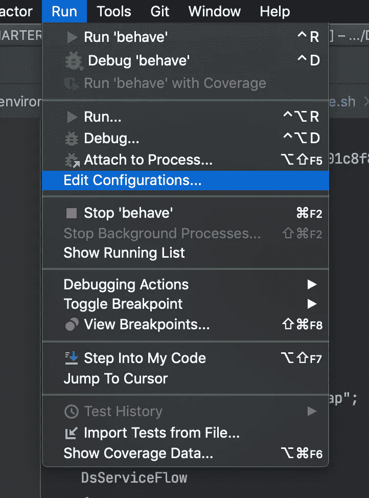
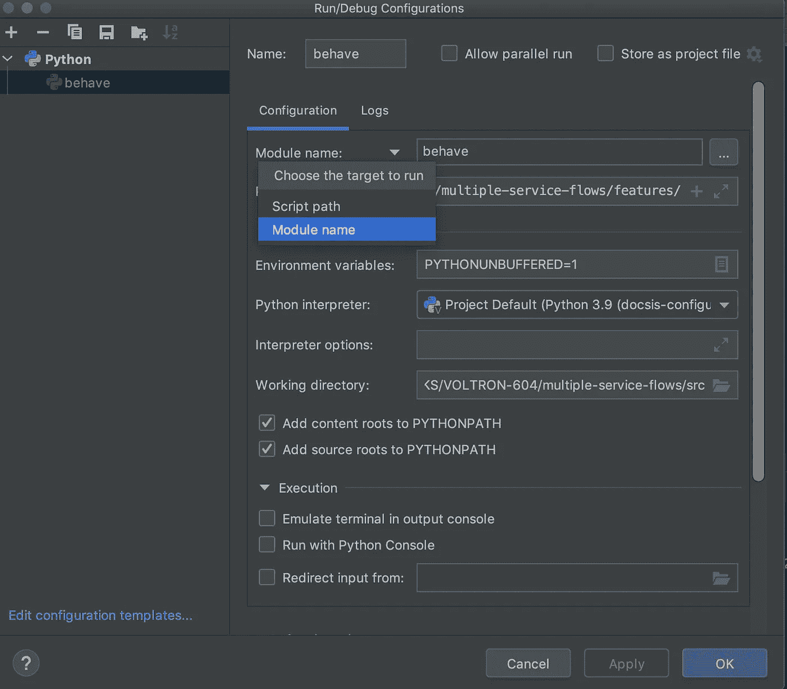
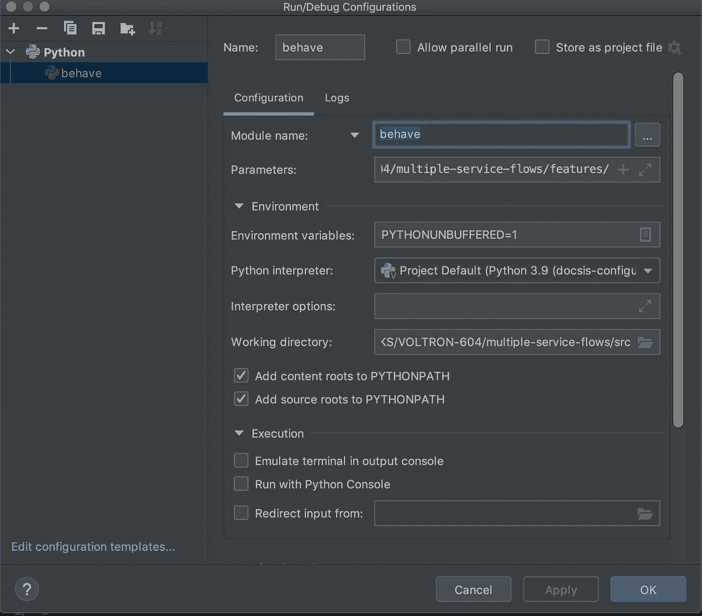
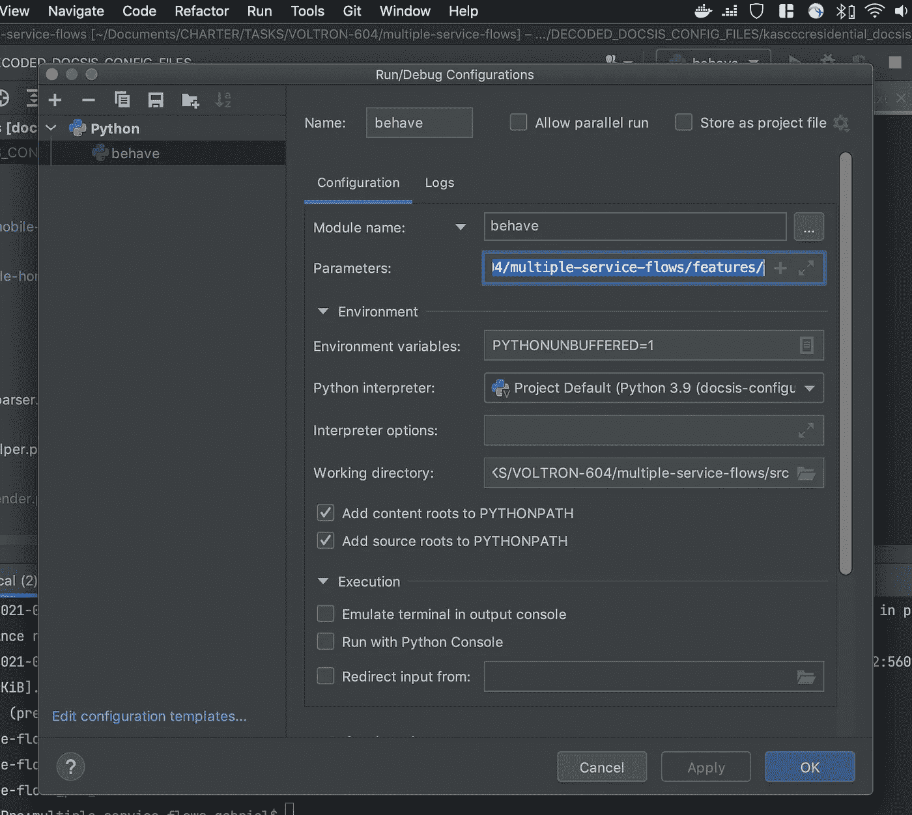

# 如何用 PyCharm CE 调试行为

> 原文：<https://levelup.gitconnected.com/how-to-use-pycharm-ce-debugger-with-behave-3396f5b0865d>

对于那些不知道的人来说，[behavior](https://behave.readthedocs.io/en/stable/#)是用 Python 编写 [BDD](https://behave.readthedocs.io/en/stable/philosophy.html) 自动化测试的强大工具。

在 PyCharm Professional 中，您可以开箱调试 behavior，但这当然是一个付费工具。这是一种昂贵的工具。

但是不用担心，因为可以使用 PyCharm CE 的调试器，只需几个设置就可以运行。

在您的工作流程中使用调试器有什么好处？这样做有很多原因，但仅举几个例子:断点和表达式赋值器。

# 让我们用 PyCharm CE 配音工具来试试吧

## 设置 PyCharm CE 调试器以运行 behavior

1.  转到顶部的“运行”并点击“编辑配置…”

2.将目标的类型指定为“模块名”

3.类型 Behave，因为这是我们想要执行的模块。

4.在参数部分中，指向您的功能目录。

就是这样！现在你所要做的就是放置断点并点击 bug 图标。

## 奖励行为提示

在终端输出中打印文本:`behave --nocapture`

调试愉快！

# **Python** 是你的东西吗？

也许你对这篇关于 Python、Flask 和 Docker 的文章感兴趣。

 [## 烧瓶+ Docker:快速提示

### Flask 是一个众所周知的 Python 微框架。有人会说 Python 是一门容易学习的语言，我会说也许是。它…

levelup.gitconnected.com](/flask-docker-quick-tips-285e4e360f2)