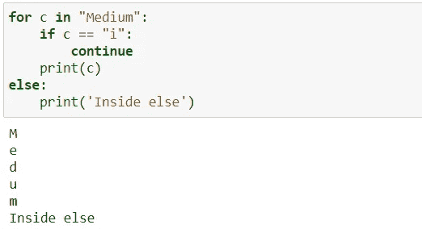
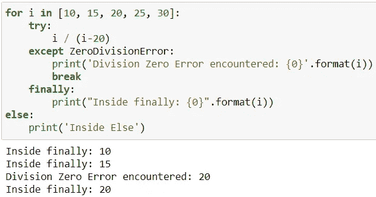

# 如何使用 Python for 和 while 循环

> 原文：<https://levelup.gitconnected.com/how-to-use-python-for-and-while-loops-6a6a3325929c>

## 编程，Python

## …使用 else、break、continue 和 try 语句。


由[Tine ivani](https://unsplash.com/@tine999)在 [Unsplash](https://unsplash.com/photos/u2d0BPZFXOY) 上拍摄的图像

你知道 Python `for`和`while`循环有`else`语句吗？你知道`for`和`while`循环与`else`、`break`、`continue`、&、`try`语句一起使用时是如何工作的吗？请继续阅读，了解更多相关信息。

# for 循环

`for`循环的一般语法:

```
for *val* in *sequence*:
    <<body of for loop>>
```

让我们看几个简单的例子:

```
for i in range(3):
    print(i)
>> 0
>> 1
>> 2for c in "Hi":
    print(c)
>> H
>> i
```

**现在，我们来看看** `**for**` **循环在使用** `**else**` **、** `**break**` **、** `**continue,**` **和** `**try**` **语句时是如何工作的。**

*   只有在没有遇到`break`语句的情况下，`for`循环已经正常终止，才会执行`else`语句。
*   当遇到`break`语句时，控制退出`for`循环，执行循环后的下一条语句
*   当遇到`continue`语句时，它会跳过当前迭代循环中的剩余代码，继续下一次迭代。
*   `finally`无论是否有异常，语句总是执行。

了解了`else`、`break`、`continue`和`try`语句的工作原理后，让我们看看`for`循环的例子:

**例 1** :在本例中，执行了`break`语句，因此控制退出了`for`循环，而没有执行`else`语句。


作者图片

**例 2** :在本例中，由于使用了`continue`语句，所以包括`else`语句在内的所有语句都被执行。



作者图片

**例 3** :在这个例子中，由于`continue`语句被用在 except 语句中，所以所有的语句都被执行，包括`else`语句。正如您所注意到的，`finally`语句也会被执行，不管是否有异常。


作者图片

**例 4:** 本例中，`ZeroDivisionError`异常被捕获。因为有一个`break`语句，控制从循环中出来。但是正如预期的那样,`finally`语句是在循环结束之前执行的。



作者图片

# while 循环

`while`循环的一般语法:

```
while *test_expression*:
    <<body of while loop>>
```

让我们看一个简单的例子:

```
i = 0
while (i < 3):
    print(i)
    i+= 1
>> 0
>> 1
>> 2
```

现在，我们可以看看 while 循环与`else`、`break`、`continue`和`try`语句一起使用的例子。

**例 1** :在本例中，由于使用了`continue`语句，所以包括`else`语句在内的所有语句都被执行。注意，当`i==2`时，当前迭代被跳过。


**示例 2** :在这个示例中，执行了`break`语句，因此控制从`while`循环中出来，而没有执行`else`语句。


**例 3:** 本例中，捕捉到一个异常。因为有一个`break`语句，控制从`while`循环中出来。但是不出所料，`finally`语句是在循环结束前执行的。


作者图片

**例 4:** 在本例中，由于`continue`语句是在`except`语句内部使用的，所以包括`else`语句在内的所有语句都被执行。正如您所注意到的，`finally`语句也会被执行，不管是否有异常。


作者图片

# 结论

希望你已经理解了`for`和`while`循环如何与`else`、`break`、`continue`、&、`try`语句一起工作。

*阅读更多关于 Python 和数据科学的此类有趣文章，* [***订阅***](https://pythonsimplified.com/home/) *到我的博客*[***www.pythonsimplified.com***](http://www.pythonsimplified.com/)***。*** 你也可以在[**LinkedIn**](https://www.linkedin.com/in/chetanambi/)**上联系我。**