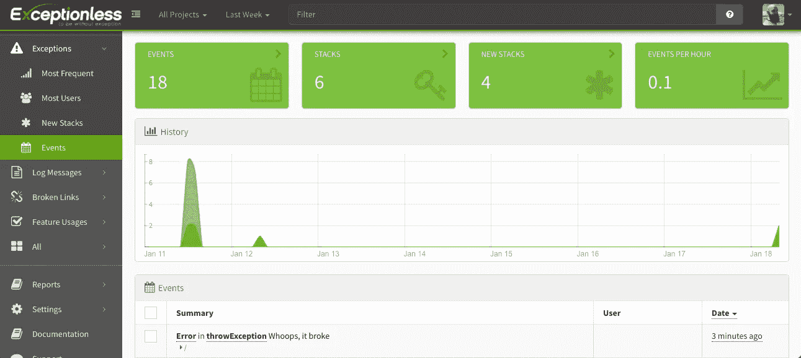
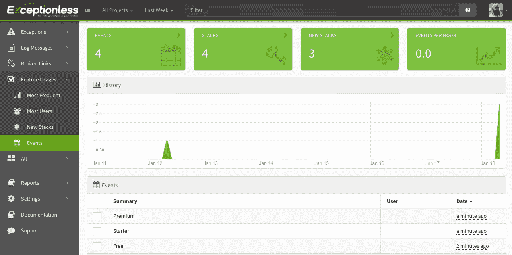

# 如何使用 React 钩子来监控应用程序中的事件

> 原文：<https://levelup.gitconnected.com/how-to-use-react-hooks-to-monitor-events-in-your-app-cd404042df6>

React 中钩子的引入是一个游戏改变者。开发人员现在可以选择创建有状态的组件。过去，如果你有一个有状态的组件，你必须使用一个类组件，如果你有一个表示组件，你可以在类或函数组件之间选择。现在，通过钩子，可以在函数组件内部管理状态。但这并不是 Hooks 为 React 开发者所做的全部。

Hooks 引入了一种更好的重用有状态函数的方法。今天，我们将探索如何构建一个自定义的 React 钩子，它将允许我们在应用程序中监控事件。这些事件可以是错误、消息、功能使用、日志或任何您想要的东西。有很多错误监控服务，但是我们将利用 [Exceptionless](https://exceptionless.com/) ，原因有三:

1.  实时更新
2.  这是开源的
3.  无异常的 JavaScript 客户端给了我们一个单例选项(这在本文中是一个很好的例子)

让我们从启动一个新的 React 项目开始。您需要在您的机器上安装以下设备:

*   节点> = 8.10
*   npm >= 5.6
*   文字编辑器

假设你已经准备好了，打开一个终端。要创建新的 React 项目，只需运行:

`npx create-react-app Monitoring-App`

将`Monitoring-App`替换为您喜欢的项目名称。当一切都完成后，进入你的新应用程序的目录(`cd Monitoring-App`)。现在，我们需要安装无异常的 JavaScript 客户端。

为此，只需运行:

`npm install exceptionless`

安装完成后，启动你的应用程序(`npm start`)，在你选择的文本编辑器中打开你的项目目录。

## 什么是钩子？

React 的文档对钩子有最简单的定义，我认为值得在这里提出来:

> *钩子是 React 16.8 中的新增功能。它们允许您使用状态和其他 React 特性，而无需编写类。*

总的来说，JavaScript 中的类的流行程度有了很大的波动。然而，在 React 生态系统中，这是创建实际上可以做任何事情的组件的唯一选择。因为许多 JavaScript 开发人员不喜欢也不想使用类，所以选择编写函数组件是一个巨大的进步。但是在开发人员的偏好之外，React 挂钩开辟了在 React 应用中编写代码的新途径，并有望帮助您在这个过程中减少代码占用。

Hooks 还引入了一种新的方式来处理 React 中的生命周期事件。`componentDidMount`和`componentDidUpdate`方法已经不存在了。在是简单而优雅的`useEffect`功能。

你可以在这里阅读更多关于 React 引入钩子[背后的逻辑，但是对于本教程来说，我认为这已经足够了。](https://reactjs.org/docs/hooks-intro.html)

# 创造了我们的第一个钩子

钩子只是一个返回值的函数。然而，钩子的一个大问题是，它们只能在函数组件的主体中被调用。随着我们的进步，请记住这一点。它仍然处于钩子生命的相对早期，但是已经有了一些标准和约定。惯例是将您的定制钩子放在一个叫做`hooks`的文件夹中。就这么办吧。

在项目的`src`目录下创建一个名为`hooks`的文件夹。在该文件夹中，我们将使用 React Hooks 社区中的另一种约定创建一个文件。开发人员通常会用一个`useFunctionPurpose`类型的模式来命名他们的钩子。例如，如果你正在构建一个钩子来决定一个导航栏是否应该出现，你可以将这个钩子文件命名为`useNavigation`。对我们来说，我们将把我们的文件称为`useMonitoring`。

在`hooks`目录中创建文件，然后我们可以开始构建函数。我们将逐行进行，然后我将在一个片段中显示整个文件。让我们从从 React 导入必要的函数开始。

`import { useState, useEffect } from 'react';`

我简单谈了一下`useEffect`。可以在与`componentDidMount`或`componentDidUpdate`相同的上下文中考虑。我们将利用这一点来处理无例外客户机设置中的一些逻辑。`useState`可以被认为类似于 React 类组件中的`this.state`和`this.setState`。

接下来，我们将像这样访问无异常的 JavaScript 客户机:

`import { ExceptionlessClient } from "exceptionless/dist/exceptionless";`

注意:引用`/dist/exceptionless`文件很重要，因为 Exceptionless 针对多个环境，我们希望确保导入正确的环境。

接下来我们要处理我之前提到的一些东西。Exceptionless 是一个基于类的客户端。这意味着我们可以选择在每次使用该类时实例化它，或者我们可以使用 Exceptionless 提供给我们的 singleton。我们首先设置单例模式，然后我们将使用一些逻辑来处理可能不需要使用单例的情况。像这样毫无例外地抓住`default`客户端:

`const defaultClient = ExceptionlessClient.default;`

如果您还没有这样做，请从 Exceptionless 为自己获取一个 API 密钥。你可以在这里注册一个免费账户。一旦你有了它，我们将把这个密钥提供给默认的无异常客户端。我喜欢利用环境变量，即使在浏览器中使用安全的键也是如此。所以我的看起来像这样:

`defaultClient.config.apiKey = process.env.REACT_APP_EXCEPTIONLESS_API_KEY;`

现在我们已经处理了所有的导入和初始配置，我们可以构建钩子函数了。基本功能如下所示:

```
export const useMonitoring = ({ config, useDefault }) => {
  *// Code goes here*
}
```

这看起来没什么，但有两件事我想说出来。函数名遵循我之前说的约定，这个函数取两个道具:`config`和`useDefault`。如果我们使用无异常客户端的默认单例实例，`useDefault`将为真，`config`将为空。然而，如果我们正在创建一个无异常客户端的定制实例，`config`将是一个对象，而`useDefault`将是 null 或 false。

让我们来处理这个逻辑。在函数的顶部添加以下内容:

`const [client, setClient] = useState(defaultClient);`

我们在这里使用内置的`useState`钩子。我们只是定义了一个`client`状态变量，定义了一个用于更新该变量的函数(`setClient`，并为变量设置了一个默认值。如您所见，我们设置了缺省值以使用来自 Exceptionless 的缺省客户机。有道理，对吧？

接下来，我们将使用内置的`useEffect`钩子来确定应该返回哪个客户端，以供请求它的应用程序的特定部分使用。

```
useEffect(() => {
    if(useDefault) {
      return client;      
    } else if(config) {
      config.apiKey = process.env.REACT_APP_EXCEPTIONLESS_API_KEY;      
      setClient(new ExceptionlessClient(config));
    } else {
      throw "Please pass useDefault as true or a config object in";
    }
  });
```

在这种情况下，最好像看待`componentDidUpdate`一样看待我们的`useEffect`函数。对调用我们的`useMonitoring`钩子的组件的任何更新都会触发我们的`useEffect`函数中的另一个事件。

如果你想让这个`useEffect`方法更像`componentDidMount`那样运行，你应该这样构建它:

```
useEffect(() => {}, []) *// <-- This array says only run this function once when the component mounts*
```

上例中的空数组可以用依赖列表来填充。比方说，你想让你的`useEffect`方法在每次某个特定变量改变时运行，你只需要把那个变量名传入数组。

好的，回到我们的`useEffect`方法。你可以看到我们正在检查我之前提到的`useDefault`道具。如果是真的，我们返回客户端状态变量。我们已经将该变量设置为使用无 singleton 异常客户端，所以我们所要做的就是返回它。如果`useDefault`为假，那么我们检查配置对象。如果存在，我们将 apiKey 添加到传递给 config 对象的任何值中，然后实例化一个新的无异常客户端。

如果没有提供`config`对象，我们抛出一个错误。你可以更进一步，检查`config` prop 是否确实是 object 类型，但是，嘿，这就是 Typescript 的作用，对吗？我们危险地生活在这个疯狂的动态世界里。

您需要在`useMonitoring`函数中做的最后一件事是返回客户端。听起来很简单:

`return client;`

这是完整的文件:

```
import { useState, useEffect } from 'react';
import { ExceptionlessClient } from "exceptionless/dist/exceptionless";
const defaultClient = ExceptionlessClient.default;
defaultClient.config.apiKey = process.env.REACT_APP_EXCEPTIONLESS_API_KEY;export const useMonitoring = ({ config, useDefault }) => {
  const [client, setClient] = useState(defaultClient);
  useEffect(() => {
    if(useDefault) {
      return client;      
    } else if(config) {
      config.apiKey = process.env.REACT_APP_EXCEPTIONLESS_API_KEY;      
      setClient(new ExceptionlessClient(config));
    } else {
      throw "Please pass useDefault as true or a config object in";
    }
  });
  return client;
}
```

准备好用这个坏小子了吗？

# 使用您的自定义挂钩

我们创建了一个基本的 React 应用程序，所以让我们只利用开箱即用的东西。打开您的`App.js`文件，并导入您的新定制钩子。

`import { useMonitoring } from "./hooks/useMonitoring";`

您还需要从 React 导入内置的`useEffect`钩子:

`import { useEffect } from 'react';`

现在，在主`App`函数中，您可以使用新的定制钩子:

`const exceptionlessClient = useMonitoring({ useDefault: true });`

我们现在如何测试这个？好吧，让我们利用`useEffect`函数在组件挂载时抛出一个错误。

```
useEffect(() => {
  throwException();
}, []);
```

正如您所记得的，函数末尾的空数组表示，这只应在组件挂载时运行一次。

现在，像这样定义实际的`throwException`函数:

```
const throwException = () => {
  try {
    throw new Error("Whoops, it broke"); 
  } catch (error) {
    exceptionlessClient.submitException(error);
  }
}
```

准备好测试了吗？如果你之前启动了 React 应用，它可能已经工作了。如果您还没有启动该应用程序，现在就开始吧。

除了默认的 starter React 模板之外，你不会看到太多。但是没关系。打开您的无异常仪表板，您应该看到一个异常已经被捕获。



如果您单击该异常，您将获得一系列额外的有用信息。你可以开始看到这是如何有帮助的。

现在是我提醒你的时候了，我们的定制钩子只能在你的组件函数体内部使用。如果您试图在 Redux 操作函数中使用您的钩子，您会看到一个错误。美妙之处在于，即使您使用 Redux 或其他东西，您仍然可以将错误返回给您的组件，并用您的`useMonitoring`钩子处理错误。

但是无例外不仅仅是错误。让我们构建一个快速、更实用的示例。

# 使用情况跟踪

在你的`App.js`文件中，我们将删除所有的样板文件并添加一些难看的按钮。这篇文章没有风格。这是您的`App.js`文件现在应该看起来的样子:

```
import { useMonitoring } from "./hooks/useMonitoring";function App() {
  const exceptionlessClient = useMonitoring({ useDefault: true }); const handleButtonClick = (planName) => {
    exceptionlessClient.submitFeatureUsage(planName);
  }
  return (
    <div>
      <button onClick={() => handleButtonClick("Free")}>Free Plan - Learn More</button>
      <button onClick={() => handleButtonClick("Starter")}>Starter Plan - Learn More</button>
      <button onClick={() => handleButtonClick("Premium")}>Premium Plan - Learn More</button>
    </div>
  );
}export default App;
```

你可以看到我们在应用程序中有一个定价页面。有三个按钮，每个计划一个。我们已经连接了一个按钮，该按钮将调用一个函数，该函数最终会向 Exceptionless 发送一个特性使用事件。继续点击按钮。

如果您转到您的无例外仪表板，并单击左侧的功能使用链接，您会看到这些事件已在一个专门的部分捕获，这使您可以轻松地跟踪功能使用情况。这可能不会取代你的分析提供商，但它有很长的路要走。



# 包扎

你可以用 Exceptionless 做更多的事情。例如，你可能已经注意到了，我们只把`useDefault`道具传递给了我们的定制钩子。您可以完全定制您的无例外配置，并传入一个`config`道具来代替。我鼓励你[阅读这里的选项](https://exceptionless.com/docs/clients/javascript/client-configuration/)。

Exceptionless [提供了大量内置于其 JavaScript 客户端的方法](https://exceptionless.com/docs/clients/javascript/sending-events/)，这将使调试、日志记录和跟踪更加容易。