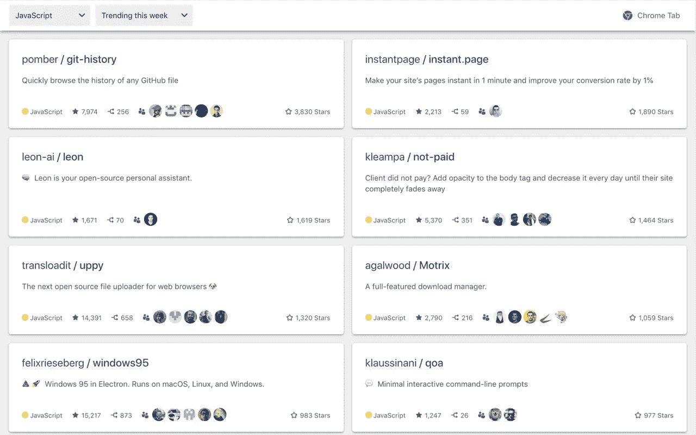
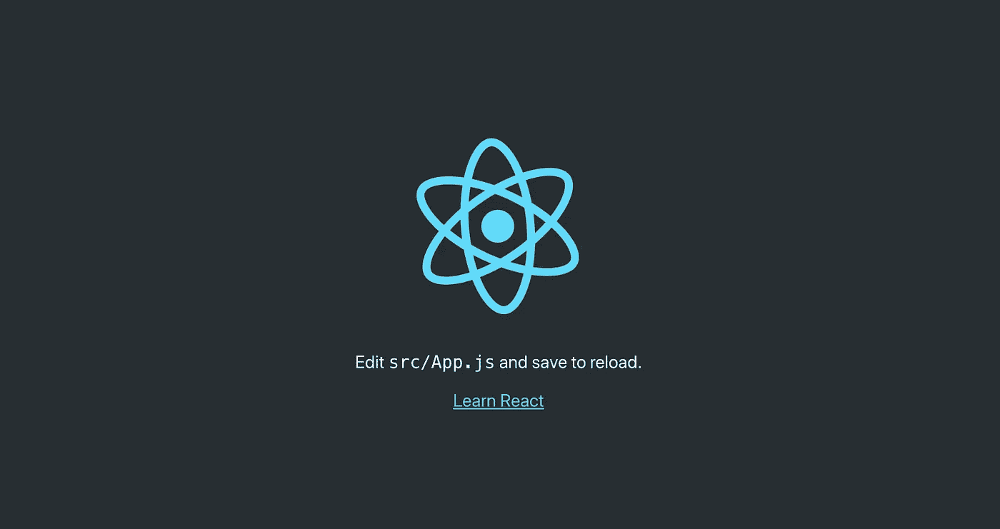
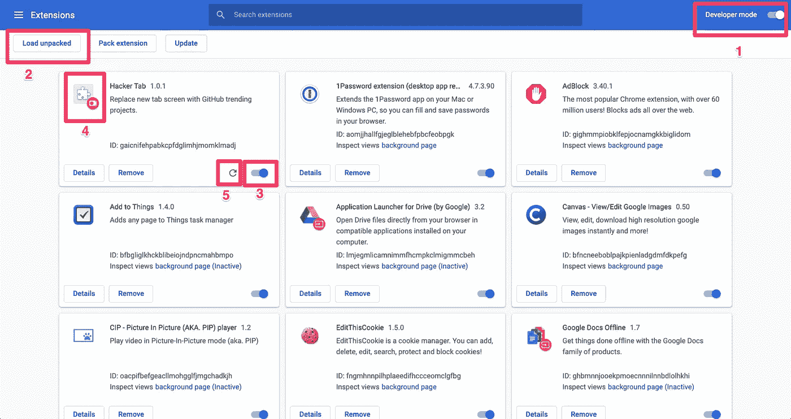
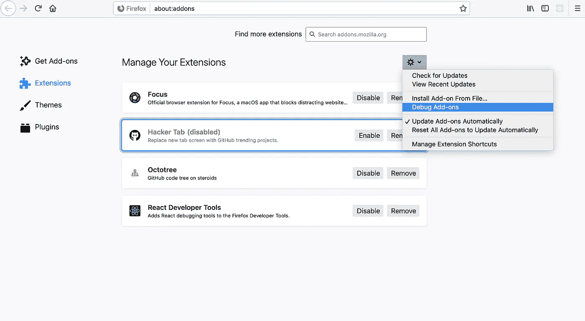
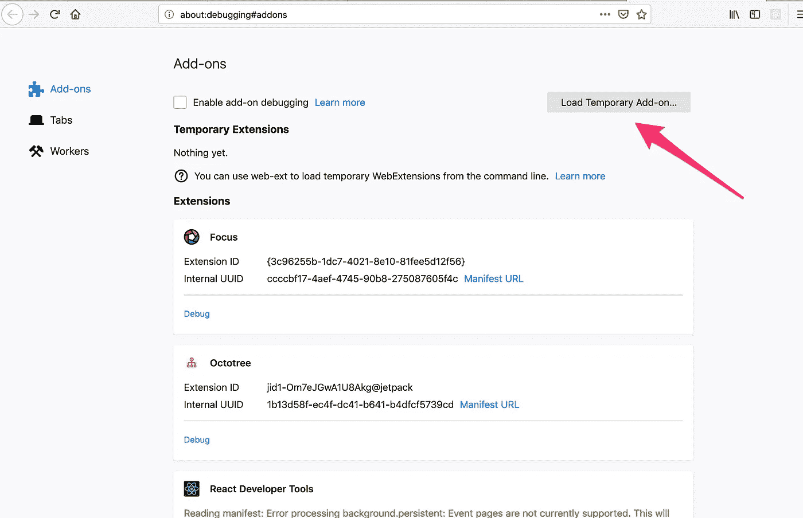
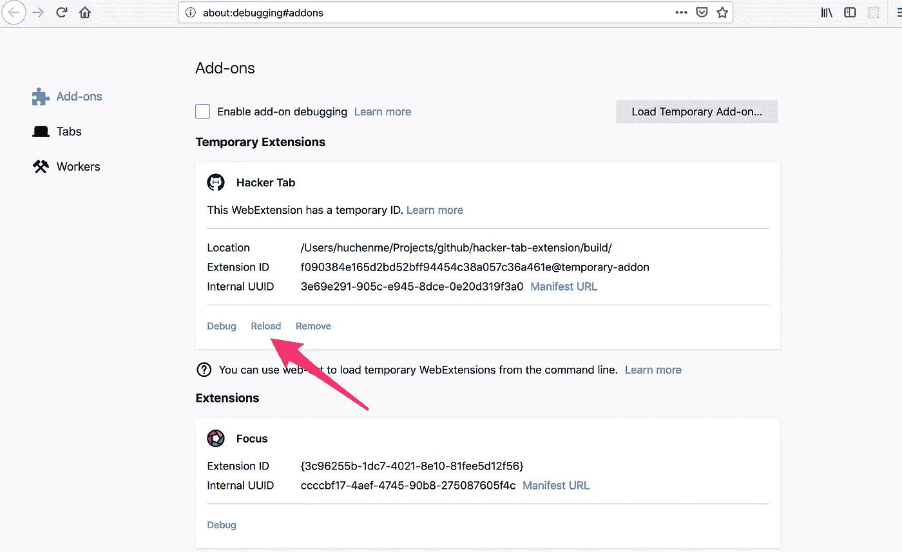

# 如何使用 React.js 在 5 分钟内创建跨浏览器扩展

> 原文：<https://levelup.gitconnected.com/how-to-use-react-js-to-create-chrome-extension-in-5-minutes-2ddb11899815>



黑客标签:Chrome 扩展，在新标签上查看 GitHub 趋势项目📈

> **更新**:这篇博文原本是针对 Chrome 扩展的，我最近[移植到了 Firefox](https://addons.mozilla.org/en-US/firefox/addon/hacker-tab/) 上，我想和✨.分享一下我在这里学到的东西

## 另请参阅:

[**第二部分:如何使用后台脚本在 Chrome 扩展中获取数据**](https://medium.com/@chen/how-to-use-background-script-to-fetch-data-in-chrome-extension-ef9d7f69625d)

最近我试图创建一个 [Chrome 扩展](https://chrome.google.com/webstore/detail/hacker-tab/ibomigipadcieapbemkegkmadbbanbgm)，用 GitHub 趋势项目**替换新标签**屏幕，它[在产品搜索中成为趋势](https://www.producthunt.com/posts/hacker-tab)。我使用 [create-react-app](https://github.com/facebook/create-react-app) 构建了它，我想在 5 分钟内分享一下我是如何做到的。

# 1.创建应用程序

我创建的 Chrome 扩展用我用 **create-react-app** 创建的自定义页面替换了新的标签屏幕。不管你使用哪种框架——react . js、Vue.js 还是带有 CSS 和 JS 的普通 HTML，只要你能在浏览器中提供 HTML 文件，它就能作为 Chrome 的扩展。

在我的项目中，我使用 [create-react-app](https://github.com/facebook/create-react-app) 来创建、运行和捆绑应用程序。我还使用 [Redux](https://redux.js.org/) 进行状态管理，使用 [styled-components](https://www.styled-components.com/) 进行造型。

```
$ npx create-react-app my-awesome-extension
$ cd my-awesome-extension
$ npm start
```

您应该能够在 [http://localhost:3000](http://localhost:3000) 看到默认的`creact-react-app`启动页面



创建-反应-应用程序的启动页面

本教程不会涵盖如何使用 React.js 开发网页，那里有大量的资源。我将重点介绍如何将应用程序转变为 Chrome 扩展。现在开始编写您的应用程序。

# 2.为 Chrome 扩展做准备

一旦您在本地有了一个工作版本，在准备您的扩展时，还需要配置一些其他的东西。

## 创建`manifest.json`

在`public`文件夹中有一个`manifest.json`文件，用于 PWA 或配置我们的扩展。你需要用下面的内容替换它，这些内容将在`build`过程中被复制到`build`文件夹，Chrome 将把它作为扩展的配置文件。

上面的片段是我在扩展中使用的。您也可以找到[其他配置选项](https://developer.chrome.com/extensions/manifest)。

*   `[version](https://developer.chrome.com/extensions/manifest/version)`:你扩展的版本，当你计划发布新版本的时候，你应该更新这个。
*   `[icons](https://developer.chrome.com/extensions/manifest/icons)`:你需要不同大小的图标在不同的情况下使用(例如 Chrome 网上商店)，通常你只需要`16x16`、`48x48`和`128x128`。
*   `[chrome_url_overrides](https://developer.chrome.com/extensions/override)`:由于我们要将 chrome 新标签页覆盖到一个定制的 HTML 页面，我们需要将`newtab`替换为`index.html`
*   在你的扩展中包含你需要的权限。我使用`[chrome.storage](https://developer.chrome.com/apps/storage)` API 来存储用户偏好的编程语言，所以我添加了`storage`权限。通常，您应该只添加应用程序中所需的权限。

## INLINE_RUNTIME_CHUNK=false

默认情况下，Create React App 在生产构建期间将一个小的运行时脚本嵌入到`index.html`中，这是为了减少 HTTP 请求的数量。但不幸的是，你会看到与 [CSP](https://developers.google.com/web/fundamentals/security/csp/#inline_code_is_considered_harmful) 相关的控制台错误。您可以通过将`INLINE_RUNTIME_CHUNK`标志设置为`false`来关闭嵌入行为。

**改变** `**package.json**` **:**

```
"build": "INLINE_RUNTIME_CHUNK=false react-scripts build"
```

## 切换到 Chrome 默认标签

有时候，人们希望切换回默认的 Chrome 标签来访问顶级网站。我们可以使用`chrome.tabs` API。

```
<Button
  onClick={() => {
    chrome.tabs.getCurrent(tab => {
      chrome.tabs.update(tab.id, {
        url: 'chrome-search://local-ntp/local-ntp.html',
      });
    });
  }}>
  Chrome Tab
</Button>
```

> 该网址不适用于 Firefox，我已经使用`[react-useragent](https://github.com/quentin-sommer/react-useragent)`只为 Chrome 显示该按钮。[此处检查代码](https://github.com/huchenme/hacker-tab-extension/blob/v1.2.1/src/components/GitHub/TopBar.js#L38-L54)。

## 删除收藏夹图标

Create React App 在 public 文件夹中自带默认`favicon.ico`。对于 Chrome 新标签页，我们不希望新标签页有任何图标，所以我们从公共文件夹中删除了它，也删除了`index.html`中的链接。

## 添加启动占位符

因为 React.js 最初会在应用程序以 Javascript 呈现之前加载一个空白页面，所以根据我的经验，在所有内容呈现之前会有一个明显的空白页面闪现。这对用户来说不是一个很好的体验。

有几种方法可以解决这个问题，一种方法是使用 [react-snapshot](https://www.npmjs.com/package/react-snapshot) 或 [react-snap](https://github.com/stereobooster/react-snap) 将[预渲染成静态 HTML 文件](https://facebook.github.io/create-react-app/docs/pre-rendering-into-static-html-files)。

这种方法不适合我的扩展的用例，因为它还预先呈现来自服务器的数据，导致初始 HTML 在新数据进入之前总是包含过时的存储库。

在撰写本文时，我还没有想出如果使用快照库该如何解决这个问题，所以我提出了一个更简单的解决方案。

我已经设计了`index.html`的样式，这样在应用程序渲染之前，它会在页面中央显示一个灰色的标志，而且效果很好。


启动页面

一旦 Javascript 完成渲染，`root`将被替换为实际内容。

# 3.在本地测试铬

在发布到 Chrome 网络商店之前，最好在本地进行测试。

你需要做的就是运行`npm run build`把所有需要的东西放到`build`文件夹里，然后在谷歌 Chrome 里启动`chrome://extensions/`。



本地测试扩展

1.  确保开发者模式已打开，如上图所示(1)。
2.  点击“Load unpacked”并在你的项目中定位“build”文件夹，它应该包含`index.html`、`manifest.json`，不同大小的 logos，以及捆绑的 javascript 文件(2)。
3.  确保其他扩展如 [Momentum](https://chrome.google.com/webstore/detail/momentum/laookkfknpbbblfpciffpaejjkokdgca) 也修改新标签被禁用(3)。
4.  如果您已经在生产环境中发布了一个版本，并且正在测试一个较新的版本，则还应该禁用生产环境版本。(本地版本在右下角会有一个红色图标，如图(4))

打开一个新的标签页应该可以让你测试你闪亮的新扩展！

要更新扩展，您需要更改代码，再次运行`npm run build`，并点击“刷新”按钮(5)。

# 4.在 Firefox 上进行本地测试

幸运的是，我们刚刚完成的代码在 Firefox 上开箱即用，在 Firefox 上的测试也是类似的。

在火狐浏览器中启动`about:addons`，打开“调试插件”。



打开“调试插件”

你可以看到界面略有变化，现在点击“加载临时加载项”



单击“build”文件夹中的任何文件，只需选择“manifest.json”即可。

现在你也可以在列表中看到你的扩展，打开一个新标签，测试一切正常，如果你想做些改变，再次运行`npm run build`，点击“重新加载”按钮。



# 就是这样！

现在你已经准备好了你的扩展，只需按照这个官方文档将你的扩展发布到 [Chrome 网络商店](https://developer.chrome.com/webstore/publish)或 [Firefox 附加组件中心](https://developer.mozilla.org/en-US/docs/Mozilla/Add-ons/Distribution/Submitting_an_add-on)。

## 另请参阅:

[**第二部分:如何使用后台脚本在 Chrome 扩展中获取数据**](https://medium.com/@chen/how-to-use-background-script-to-fetch-data-in-chrome-extension-ef9d7f69625d)

谢谢你读到这里。您可以在 [Github](https://github.com/huchenme/hacker-tab-extension) 中查看源代码，或者在 [Chrome 网络商店](https://chrome.google.com/webstore/detail/hacker-tab/ibomigipadcieapbemkegkmadbbanbgm)和 [Firefox 附加组件中心](https://addons.mozilla.org/en-US/firefox/addon/hacker-tab/)下载扩展，祝您黑客愉快，并让我知道您构建了什么！

[](https://levelup.gitconnected.com)[](https://gitconnected.com/learn/react) [## 学习 React -最佳 React 教程(2019) | gitconnected

### 排名前 49 的 React 教程-免费学习 React。课程由开发人员提交并投票，使您能够…

gitconnected.com](https://gitconnected.com/learn/react)