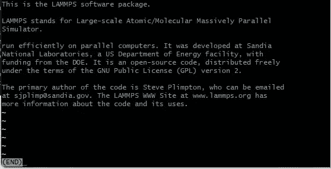

# 如何使用 SED 操作文本文件(第 1 部分:打印、删除、追加)

> 原文：<https://levelup.gitconnected.com/how-to-use-sed-to-manipulate-text-files-part-1-print-delete-append-aa444143c4bd>

S ED(流编辑器)是类 Unix 系统中 ED 和 QED(快速编辑器)的继承者，用于纯文本编辑。我们经常会遇到这样的情况:我们必须从一个巨大的文件中提取一些数据，或者从一个大数据文件中获取一两列数据。我们喝了咖啡，坐下来写一些代码，或者开始在互联网上寻找已经提供的代码。我不是要把我们叫出来，但是如果我告诉你有一个一行代码可以让你付出代价，你会有什么感觉？是的，SED 可以用非常简单的一行程序做到这一点。

在本文中，我将总结一些基本的文件格式，然后在本文的后半部分，我将尝试举例说明如何使用 SED 从 LAMMPS 的日志文件中获取数据(LAMMPS 是一个分子动力学模拟软件包)。

假设我们有一个名为' *foo.data* 的文本文件，其内容如下:

# **语法:**

> sed -option 'command '文本文件>输出文件

我们来分析一下-

*   **sed** =启动 sed
*   **选项** =任意可选参数(-n 表示关闭自动打印，-i 表示就地编辑，-e =表达式)
*   **‘命令’**=你想做的事情(正则表达式，模式匹配，删除)
*   **文本文件** =您想要处理的文件
*   **outputfile** =如果你想保存输出到一个文件(可选)

# **打印带 SED 的行:**

如果我们想打印 foo.data 的第 6 行，那么命令

> sed '6p' foo.data

会给我们这样的整个文件内容，它会打印第 6 行( *LAMMPS 是一个经典的分子动力学模拟代码，设计用于)*两次——一次用于 *6p* ，另一次用于不使用 *-n* 。

但是我们可以通过在“命令”前添加-n 来关闭自动打印:

> sed -n '6p' foo.data

现在，输出将只有第 6 行:

同样，对于第二行，我们必须写“2p”。SED 也能识别空行。如果你写‘5p’，你将得到第 5 行(空行)作为输出。同样，如果我们想从第 3 行到第 5 行打印，那么我们使用:

> sed -n '3，5p' foo.data

或者，

> sed -n '3，+2p' foo.data

为了得到最后一行，我们使用$:

> sed -n '$p' foo.data

# 删除:

> sed '6d' foo.data

前述命令将删除第 6 行( *LAMMPS 是一个经典的分子动力学模拟代码，旨在)*，但原始文本文件不变。要修改原始文件，我们必须在命令前使用-i (inplace)。

> sed -i '6d' foo.data

现在，要查看文件，我们可以使用这些工具中的任何一个:cat、less 或 more。

> less foo.data
> 
> 更多 foo.data
> 
> cat foo.data

对于 *less foo.data* ，输出缓冲区将如下所示:

您可以看到我们删除的行丢失了，这个-i 选项修改了原始文本文件。现在，让我们再把这条线放回去:

> sed -i '5 a LAMMPS 是一个经典的分子动力学模拟程序

这将把我们选择的行放在第 5 行之后。让我们看看这意味着什么:

*   任何数字(这里是 5)=到第 5 行。
*   a =附加在第 5 行之后(这意味着要插入第 6 行)
*   兰姆普斯是…=要追加的行

现在，如果我们再次看到文件使用较少，我们会看到原始文件已被保留。

# 打印奇数/偶数行:

**古怪:**

> sed -n '1~2p' foo.data

这将打印奇数行(1，3，5，…)。)

**偶数:**

> sed -n '2~2p' foo.data

这将打印偶数行(2，4，6，…)。)

*   1~2 =从**第一行**开始，然后跳转+2 行:1+2 = **3** ，3+2 = **5** …
*   2~2 =从**第 2**行开始，然后跳转+2 行:2+2 = **4** ，4+2 = **6** …

类似地，4~3 将得到第 4、7、10 行。

# **插入:**

如果我们想在第 4 行插入一行呢？

> sed -i '4 我在此插入一行' foo.data
> cat foo.data

# **变更行内容:**

> sed -i '5 c 模拟包' foo.data
> cat foo.data

插入

现在让我们回到之前的位置:

> sed-I ' 4d；5 c 模拟器' foo.data '

这将删除第 4 行(“此处插入的行”)，并将第 5 行从“模拟包”改回“模拟器”。分号(；)用于分隔两个命令。这将使文件看起来与我们开始时的文件完全一样。

**另一种方式:**

> sed -i -e '4d' -e '5 c 模拟器' foo.data

*   -e 用于表达。

# 杂项:

> sed '=' foo.data

*   这将在每一行之前打印行号——这是查看每一行的好方法。

> sed 'G' foo.data

*   这将在每行之后添加一个空行。

> sed ' =；G' foo.data
> 或，sed -e '=' -e 'G' foo.data

*   这将打印数字，然后在每行后添加一个空行。

> sed '1=' foo.data

*   这将打印第一行之前的数字。

> sed '$=' foo.data

*   这将打印最后一行之前的数字。

> sed -n '$=' foo.data

*   这将打印文件中的总行数(无内容打印)。

> sed '1~2 w oddlines.data' foo.data

*   这将只把奇数行打印到名为 oddlines.data 的文件中

在第 2 部分中，我将详细介绍 SED 在模式匹配方面的工作原理，并向您展示如何使用 SED 只用一两行代码来操作大量数据——就这么简单！！我不是 Unix 的天才，但是我喜欢使用 SED 和类似 SED 的其他工具来方便使用。我在分享我的知识，这也是我的数字指南，一举两得！！谢谢你跟上这篇长文。祝您愉快！！