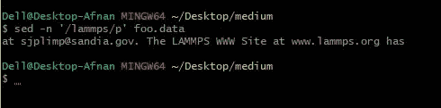
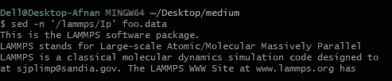
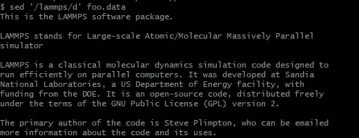
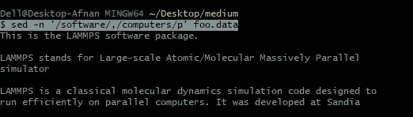
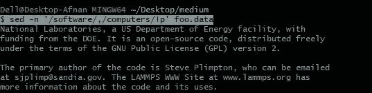
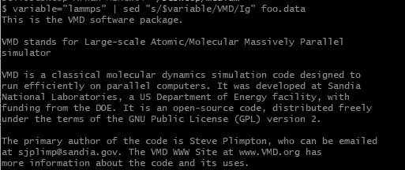

# 如何使用 SED 操作文本文件(第 2 部分:模式、正则表达式)

> 原文：<https://levelup.gitconnected.com/how-to-use-sed-to-manipulate-text-files-part-2-pattern-regular-expression-77d2472a2043>

这是我的 SED 备忘单的第 2 部分(希望是最后一部分),在这里，我将解释 SED 中的模式匹配和正则表达式。所以让我们直入主题吧。

让我们考虑一下我们在第 1 部分中使用的同一个文件。此处给出了第 1 部分的链接[。](https://afnanmostafa.medium.com/how-to-use-sed-to-manipulate-text-files-part-1-print-delete-append-aa444143c4bd)

# 图案:

**区分大小写:**

> sed -n '/lammps/p' foo.data

*   **/lammps/** =包含图案/单词 lammps 的线条
*   **p** =打印匹配图案的线条

**不区分大小写:** 如果我们要做一个不区分大小写的搜索呢？

> sed -n '/lammps/Ip' foo.data

*   **I =** 不区分大小写的搜索

> sed '/lammps/d' foo.data

*   删除包含 lammps 的行

我们可以看到包含 lammps 的行被删除了。

> sed -n '/lammps/d' foo.data

*   这不会打印文件内容。此外，要从主文件中删除这一行，我们需要使用-i

> sed -i '/lammps/d' foo.data

## 两个图案之间的线条:

此外，我们可以得到两种模式之间的一系列线条:

> sed -n '/software/，/computers/p' foo.data

该命令打印出两个图案之间的线条(从带有“软件”的线条开始，到带有“计算机”的线条结束)。

## 忽略两个图案之间的线条:

> sed -n '/software/，/computers/ **！** p' foo.data

*   它将打印出不在这两种模式之间的行(“软件”和“计算机”)。

> sed '$ **！** d' foo.data

*   这将删除除最后一行之外的所有行。这种编辑只是终端才有的，要对原始文本文件进行修改，我们需要使用:
    ***sed -i '$！d ' foo . data***

> sed -n '$ **！** p' foo.data

*   这将打印除最后一行之外的所有行。

# 替换:

> sed 's/lammps/VMD/Ig' foo.data

*   这段代码将使用不区分大小写的全局搜索用 VMD 替换 lammps:
    s = substitute
    Ig = case-**不区分大小写**和**全局**搜索
*   g 代表全局；这意味着每行中的所有实例。
    如果使用了***sed ' s/lammps/VMD/I2 ' foo . data***，那么只有每行中的第二个' lammps '会被替换。自己试试吧，超级简单。
*   ***sed ' 3s/lammps/VMD/Ig ' foo . data***将只替换第三行的内容。
*   ***sed '3，$ s/lammps/VMD/Ig ' foo . data***将从第 3 行开始替换到最后一行。

## 使用变量:

> variable = " lammps "
> sed " s/$ variable/VMD/Ig " foo . data

或者使用管道工具，

> $ variable = " lammps "**|**sed " s/$ variable/VMD/Ig " foo . data

对于变量，我们需要使用双引号" "而不是单引号" "，因为 POSIX shells 不能很好地读取单引号中的变量。

# 其他:

> sed -n 's/[aeiou]/\$/gp' foo.data

*   这将用$替换所有元音。$表示最后一行，但是我们必须用\对它进行转义，以确保我们希望 SED 不把它看作最后一行，而是一个符号。

> sed 's/[^aeiou]/*/g'美食数据

*   这将用星号*替换所有辅音(非元音= [^aeiou])

在第 3 部分中，我将展示如何使用 sed 和 awk 来操作 LAMMPS 的日志文件。这就是现在的全部内容，我希望你能愉快地阅读这篇文章。谢谢大家！！