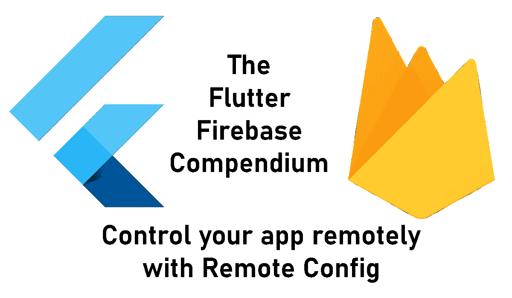
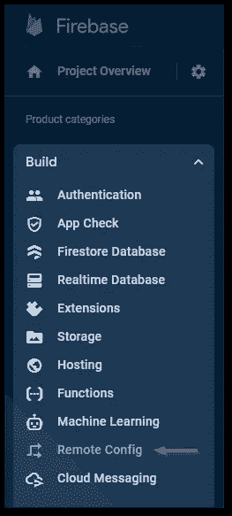
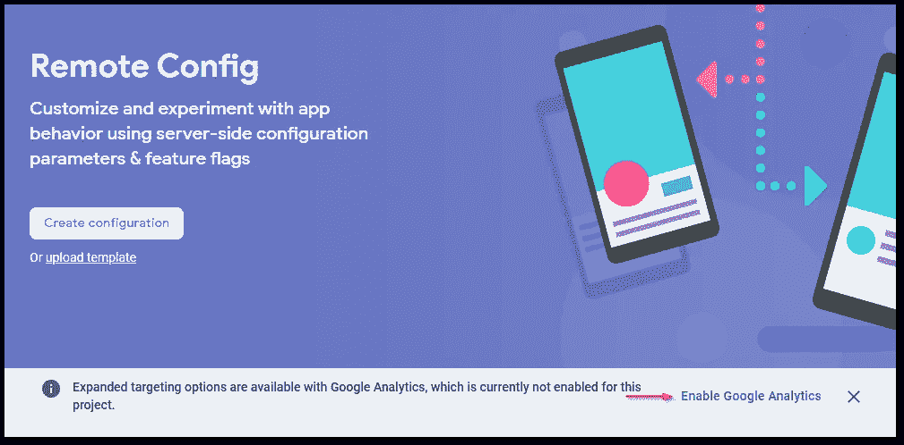
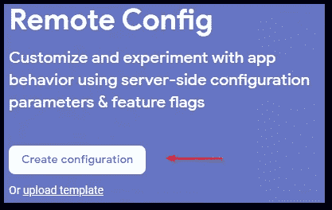
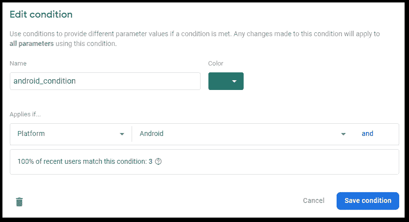
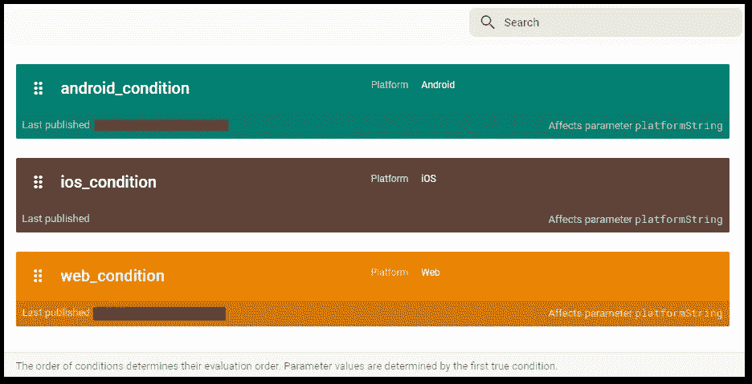
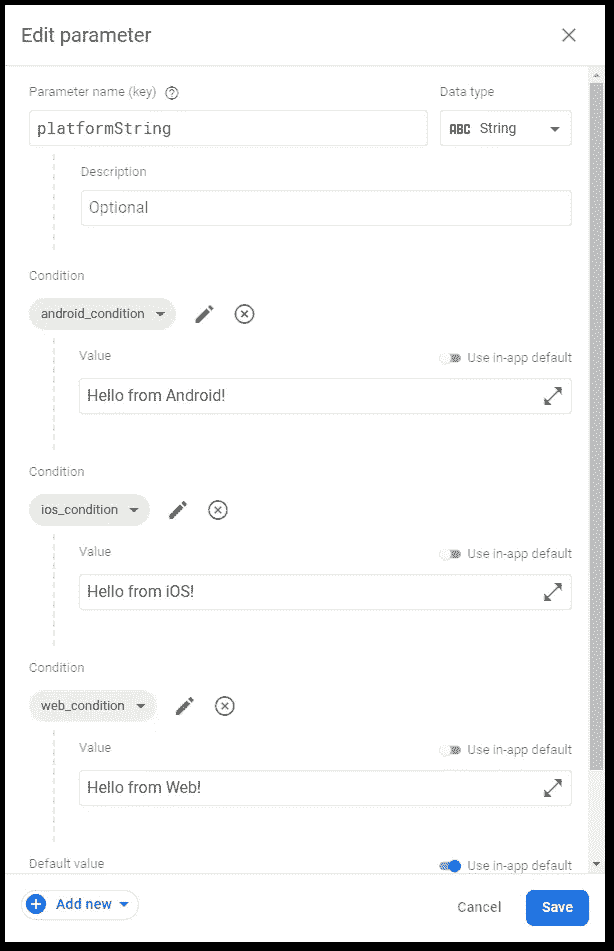
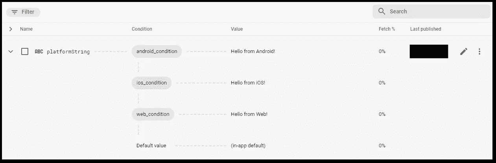
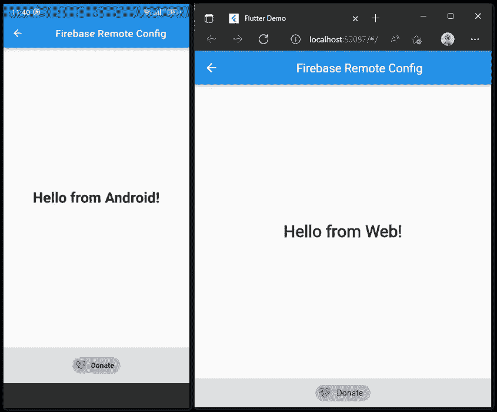

# 如何通过 Firebase 远程配置使用服务器端配置

> 原文：<https://levelup.gitconnected.com/how-to-use-server-side-configurations-with-firebase-remote-config-3996b5606079>

## 控制局面。

## 使用 Firebase Remote Config 远程控制您的应用程序，使用本教程启用/禁用功能或更改用户界面。



如果你能在应用程序通过商店发布后对其有所控制，那不是很好吗？您可以禁用仍有缺陷的功能。或者你的用户可能是 A/B 测试人员的一部分。或者，您可能希望在应用程序中显示不同的广告横幅，而不发布新版本。使用 Firebase 远程配置，所有这些场景([和更多](https://firebase.google.com/docs/remote-config/use-cases))都是可能的。我将向您展示如何在 Firebase 和您的应用程序代码中设置它。最后会有一个完整的代码示例。

```
👉 Do you want all the details? Check out [**my ebook**](https://xeladu.gumroad.com/l/ffc) with in-depth guides about building Flutter apps with Firebase! Buy it on [**Gumroad**](https://xeladu.gumroad.com) now!
```

## 什么是 Firebase 远程配置？

Firebase 远程配置允许您在 Firebase 控制台中定义参数值。支持的数据类型有`String`、`Boolean`、`Number`和`JSON`。例如，您的应用程序获取这些值并通过启用或禁用某个功能来处理它们。它让你有可能在没有新版本的情况下改变应用程序的行为。

❗不要在 Firebase 远程配置中存储任何秘密或机密数据！

## 应用程序设置

首先，用`flutter pub add firebase_remote_config`将 [Firebase 远程配置](https://pub.dev/packages/firebase_remote_config)包安装到你的应用程序中。在后面的部分中，我们将讨论特定用户组和应用程序实例的条件和目标。这也需要安装[fire base Analytics](https://pub.dev/packages/firebase_analytics)(`flutter pub add firebase_analytics`)。好了🎉

然后您可以定义与后端的连接设置。Firebase 初始化后的`main`函数是一个很好的起点。我们还需要定义默认值。如果 Firebase 后端不可达(例如，设备没有连接到互联网)，将使用这些值。也要确保你的应用在这种错误情况下也能运行。

要获得远程值，使用提供的函数`getBool()`、`getDouble()`、`getInt()`或`getString()`。使用这些值来触发应用程序中的特殊行为。我们稍后将在 Firebase 中定义一个带有关键字`platformString`的字符串。要获得该值，可以使用下面的代码(使用一个`StatefulWidget`及其`initState`函数)。

您的应用程序代码已完成。在下一节中，我们将在 Firebase 控制台中定义要下载到您的应用程序的值。

## 用 Firebase 中的条件创建参数

在[https://console.firebase.google.com](https://console.firebase.google.com)登录你的 Firebase 账户。

🔔你已经有一个 Firebase 项目了吗？如果没有，请按照我下面的文章详细介绍所有步骤！

[](/how-to-create-a-firebase-project-and-link-it-with-your-flutter-app-acd826be8356) [## 如何创建一个 Firebase 项目并将其与您的 Flutter 应用程序链接

### 在本文中，我将向您展示如何创建一个 Firebase 项目，以及如何将它与您的 Flutter 应用程序链接起来。

levelup.gitconnected.com](/how-to-create-a-firebase-project-and-link-it-with-your-flutter-app-acd826be8356) 

转到**构建**菜单中的**远程配置**。



作者在 Firebase 中创建菜单的截图

🔔如果您在初始设置时还没有启用 Google Analytics，请确保为您的 Firebase 项目启用它。Firebase 控制台会在尚未激活的情况下通知您(见下图)。



Firebase 通知的情况下，谷歌分析没有为当前的 Firebase 项目激活。要启用它，请单击链接并按照说明进行操作。作者截图。

点击**创建配置**下一步。



作者在 Firebase 中的远程配置菜单截图

现在，您可以创建参数和条件。条件是一种识别具有共同属性的应用程序用户组的机制。您可以根据条件为不同的组提供不同的值。例如，iOS 用户可能会有灰色的应用背景，而 Android 用户会有蓝色的背景。按照以下步骤创建带条件的参数。

转到**条件**选项卡，点击**添加条件**。选择一个名称并定义一个条件。在这个例子中，我创建了一个适用于所有 Android 用户的条件。



作者在 Firebase 中添加或编辑远程配置条件的对话框屏幕截图

总之，我为 Android、iOS 和 web 创建了 3 个条件。它应该如下图所示。



作者在 Firebase 中为远程配置创建的条件截图

让我们转到**参数**选项卡，根据我们的条件创建一个参数。点击**添加参数**创建一个新参数。密钥是`platformString`，我们的应用程序代码将使用它来获取值。添加 3 个条件值，并将之前创建的条件分配给它们。您可以定义输出值或依赖应用程序内的默认值(如果已设置)。请看下图，了解如何创建参数。



作者在 Firebase 中为远程配置创建参数的屏幕截图

点击**保存**后，您应该会在概览中看到类似这样的内容。



作者提供的 Firebase 中远程配置的参数概览屏幕截图

使用此参数的应用程序将输出“你好，来自 Android！”在安卓手机上，“来自 iOS 的你好！”在 iPhones 上，还有“你好，来自网络！”在网络平台上。在任何其他平台上，将使用应用内默认值(我们将其设置为“Hello！”在前面的章节中)。

确认更改后，这些更改将立即可用。但是用户将不得不等待，直到他们的提取间隔被重置，直到他们接收到新的值(参见关于提取间隔的部分)。


作者在 Firebase 中未保存更改提示横幅的屏幕截图

让我们通过运行我们的应用程序来验证正确的功能。您应该会看到如下图所示的结果。



作者使用 Firebase 远程配置的演示应用程序中 Android 输出(左)和 Web 输出(右)的屏幕截图

祝贺您，您的 Firebase 远程配置设置已经完成并正在运行！🔥

## 提取间隔

`RemoteConfigSettings`对象的`minimumFetchInterval`属性定义了对 Firebase 远程配置的后续调用将被忽略的时间段。有一个服务器端的限制，因此将该值设置得太低可能会导致许多用户很快达到该限制。默认值是 12 小时，但在开发过程中使用更低的值(如 1 分钟)是有意义的。只要确保只在开发模式下使用它。

## 装载策略

[Firebase 文档](https://firebase.google.com/docs/remote-config/loading)推荐了 3 种不同的加载策略。

1.  **获取并使用**下载数值并立即更新相关应用程序部件。只有当用户在使用应用程序时，没有大的 UI 变化会使用户感到困惑时，这才是合适的。
2.  **读取并使用加载屏幕**显示加载屏幕并在后台下载数值。如果这些值可能会极大地改变用户界面或显示/隐藏基本功能，这将非常有用。即使下载尚未完成，也要确保在一段时间后丢弃加载屏幕。用户通常不会接受长时间的应用启动。
3.  **获取并在下次应用启动时使用**在应用启动时激活先前获取的值。当用户使用您的应用程序时，运行对 Firebase Remote Config 的异步调用，但不激活获取的结果。当用户下次启动应用程序时，提取的值将被激活。

## 高级选项

有一个[远程配置 REST API](https://firebase.google.com/docs/reference/remote-config/rest) ，您可以使用它来添加、删除或修改 Firebase 远程配置中的值和模板，而无需使用 Firebase UI。例如，如果您正在开发一个额外的工具来管理您的 A/B 测试，您可以将 REST API 与您的工具一起使用来更改用户组的参数。[Firebase 文档](https://firebase.google.com/docs/remote-config/automate-rc)提供了一个很好的入门概述。

## 结论

Firebase 远程配置提供了一种简单的方法来控制您的应用程序，即使没有新的版本。您可以在运行时加载数据，并在您的应用程序中触发特殊行为。

您可以在我的 GitHub 页面上找到完整的示例源代码。

[](https://github.com/xeladu/flutter_firebase) [## GitHub - xeladu/flutter_firebase:一个用于与各种 firebase 服务交互的 flutter 演示应用程序

### 这是附带代码示例的 Flutter Firebase 概要的配套应用程序。颤振燃烧基地纲要是一个…

github.com](https://github.com/xeladu/flutter_firebase) 

这篇文章是 Flutter Firebase 纲要的一部分，其中有许多教程和操作指南，介绍了 Firebase 与 Flutter 应用程序相结合的可能性。


[赛拉杜](https://xeladu.medium.com/?source=post_page-----3996b5606079--------------------------------)

## 了解 Flutter 和 Firebase 的威力

[View list](https://xeladu.medium.com/list/learn-about-the-power-of-flutter-and-firebase-2ec07e25baba?source=post_page-----3996b5606079--------------------------------)13 stories

用我的电子书为 Flutter 开发者充分利用 Firebase。

[](https://xeladu.gumroad.com/l/ffc) [## 颤振燃烧基础概要

### 这本电子书着重于让你能够在你的应用中集成 Firebase 云服务。当你想要的时候，它是一个跳跃的开始…

xeladu.gumroad.com](https://xeladu.gumroad.com/l/ffc) 

[***通过我的推荐链接加入成千上万的媒体会员，每月只需 5 美元就可以阅读你想阅读的文章！***](https://medium.com/@xeladu/membership)

[](https://medium.com/@xeladu/membership) [## 通过我的推荐链接加入 Medium-xela du

### 只需点击一下，就可以通过会员资格访问数千篇文章！您的会员资格只需 5 美元一张…

medium.com](https://medium.com/@xeladu/membership) 

点击 [**此处**](https://xeladu.medium.com/subscribe) 将我所有的新文章发送到你的邮箱🔔浏览[我的 Gumroad 商店](https://xeladu.gumroad.com/)寻找有趣的编程素材🏬


xeladu

## 适合初学者的颤振文章

[View list](https://xeladu.medium.com/list/flutter-articles-for-beginners-a040ea777956?source=post_page-----3996b5606079--------------------------------)24 stories

[塞拉多](https://xeladu.medium.com/?source=post_page-----3996b5606079--------------------------------)

## 软件工程师的高级颤振文章

[View list](https://xeladu.medium.com/list/advanced-flutter-articles-for-software-engineers-f074879fdef3?source=post_page-----3996b5606079--------------------------------)9 stories

# 分级编码

感谢您成为我们社区的一员！在你离开之前:

*   👏为故事鼓掌，跟着作者走👉
*   📰查看更多内容请参见[升级编码刊物](https://levelup.gitconnected.com/?utm_source=pub&utm_medium=post)
*   🔔关注我们:[Twitter](https://twitter.com/gitconnected)|[LinkedIn](https://www.linkedin.com/company/gitconnected)|[时事通讯](https://newsletter.levelup.dev)

🚀👉 [**将像你这样的开发人员安置在顶级初创公司和科技公司**](https://jobs.levelup.dev/talent/welcome?referral=true)