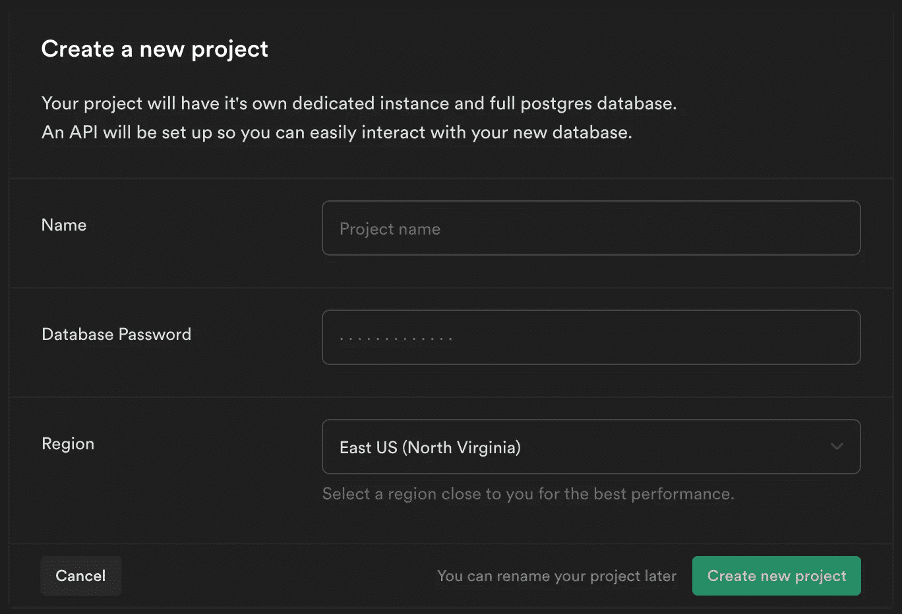

# 如何在 React 应用程序中使用超级身份验证

> 原文：<https://levelup.gitconnected.com/how-to-use-supabase-authentication-in-a-react-application-b23cd24e591b>

## Supabase 简介:Firebase 替代方案


托拜厄斯·菲舍尔在 [Unsplash](https://unsplash.com?utm_source=medium&utm_medium=referral) 上的照片

如果你以前用过 Firebase，你会发现它是多么有用的一个工具，尤其是对前端开发人员来说。您可以在几分钟内建立一个数据库和身份验证。

Supabase 是 Firebase 的开源替代方案。Supabase 没有 Firebase 的所有功能，但是它有一个数据库、认证和存储。

使用 Supabase，您可以执行以下操作:

*   监听数据库更改
*   查询您的表，包括过滤、分页和深层嵌套关系(如 GraphQL)
*   创建、更新和删除行
*   管理您的用户及其权限
*   使用简单的用户界面与数据库进行交互

在本文中，我们将了解如何做到以下几点:

*   使用 Supabase 创建新项目
*   将 Supabase 连接到 React 应用程序
*   创建身份验证上下文挂钩
*   使用身份验证挂钩

这篇文章将是我们建立网站系列的延续。在上一篇文章中，我们学习了 Material-UI 中的网格组件。如果你错过了那篇文章，你可以点击查看[。](/using-the-grid-component-in-material-ui-to-create-responsive-layouts-7b9de0d11c6)

您还可以在下面找到本系列所有文章的链接。

1.  [用 React 和 Material-UI 创建一个注册页面](/create-a-signup-page-with-react-and-material-ui-9b203d18cf3f)
2.  [将 React 挂钩形式与 Material-UI 组件一起使用](/using-react-hook-form-with-material-ui-components-ba42ace9507a)
3.  [如何用 Material-UI 创建导航栏](/how-to-create-a-navigation-bar-with-material-ui-9cbcfcec2570)
4.  [如何使用 React 播放器创建带有视频的英雄部分](/how-to-create-a-hero-section-with-video-using-react-player-aa46445094db)
5.  [使用 Material-UI 中的网格组件创建响应式布局](/using-the-grid-component-in-material-ui-to-create-responsive-layouts-7b9de0d11c6)
6.  **如何在 React 应用中使用 Supabase 认证**

如果您正在阅读本系列文章，我对文件结构、注册表单和导航栏做了以下更改:

*   为资产、组件和上下文创建文件夹
*   添加状态值以在登录表单和注册表单之间进行更改
*   如果用户已登录，则添加注销按钮

你可以在下面我的 GitHub repo 获得这个项目的完整源代码。请务必查看 *supabase* 分支以获取最新更新。

[](https://github.com/chadmuro/medium-signup/tree/supabase) [## Chad muro/中型注册

### 这个项目是用 Create React App 引导的。在项目目录中，您可以运行:在…中运行应用程序

github.com](https://github.com/chadmuro/medium-signup/tree/supabase) 

# 使用 Supabase 创建新项目

要开始使用 Supabase，请访问 [app.supabase.io](https://app.supabase.io/) 。您可以使用您的 GitHub 帐户创建一个新的 Supabase 帐户。

从那里，点击**新项目**按钮创建一个新项目。您需要选择一个组织。选择后，将出现以下页面。



给项目取一个名称和密码，然后选择离您最近的区域。

构建数据库和 API 需要几分钟时间。完成后，进入**设置** - > **API** ，复制 URL 和 API 密钥以备后用。

# 将 Supabase 连接到 React 应用程序

现在我们已经在 Supabase 中创建了一个新项目，让我们学习如何将它连接到我们的 React 应用程序。

首先，在您的项目中安装 Supabase 库。

```
npm install @supabase/supabase-js
```

然后，用`createClient`函数初始化一个新的 Supabase 客户端。在我们的例子中，我们将在项目中创建一个名为`supabase.js`的新文件。

`createClient`函数有两个参数，Supabase URL 和 Supabase 密钥。我们将使用在上一节中保存的 URL 和 API 键。

```
import { createClient } from '@supabase/supabase-js';export const supabase = createClient(
  // replace with your URL and API key 
  'SUPABASE_URL',
  'SUPABASE_API_KEY'
);
```

# 创建身份验证上下文挂钩

接下来，我们将在 React 中使用上下文 API 创建一个身份验证挂钩。我们将能够在整个应用程序中使用这个钩子。如果你不熟悉 React 中的上下文 API，可以在这里查看他们的文档。

# 使用身份验证挂钩

为了使用我们创建的`useAuth`钩子，我们首先需要用`AuthProvider`包装我们的应用程序。在`App.js`文件中，导入`AuthProvider`并用它包装您的应用程序。App 组件现在看起来将是这样的。

```
const App = () => {
  return (
    <ThemeProvider>
      <AuthProvider>
        <Navbar />
        <Hero />
        <Features />
      </AuthProvider>
    </ThemeProvider>
  );
};
```

我们现在可以在应用程序的任何地方导入`useAuth`钩子，使用我们创建的方法，并访问用户数据。

要使用`useAuth`钩子，我们只需要在一个功能组件中导入并调用它。我们的 useAuth 钩子返回`signUp`、`signIn`和`signOut`方法，以及类似这样的`user`数据对象。

```
const { user, signUp, signIn, signOut } = useAuth();
```

对于我们的网站，我们将在`Form.js`文件和`Navbar.js`文件中使用`useAuth`钩子。查看完整的源代码[这里](https://github.com/chadmuro/medium-signup/tree/supabase)看到最终产品。

# 结论

感谢阅读！Supabase 仍处于测试阶段，但他们似乎正在添加许多新功能。我有信心，他们可以与 Firebase 竞争，并成为一个不错的选择。

如果您想了解更多，请查看他们的网站和文档。

[](https://supabase.io/) [## 开源 Firebase 替代方案| Supabase

### Firebase 的开源替代方案。

supabase.io](https://supabase.io/) 

如果您错过了我们使用 Material-UI 的网格组件构建特性部分的上一篇文章，请查看下面的内容。

[](/using-the-grid-component-in-material-ui-to-create-responsive-layouts-7b9de0d11c6) [## 使用 Material-UI 中的网格组件创建响应式布局

### 了解网格容器和网格项目之间的区别

levelup.gitconnected.com](/using-the-grid-component-in-material-ui-to-create-responsive-layouts-7b9de0d11c6)