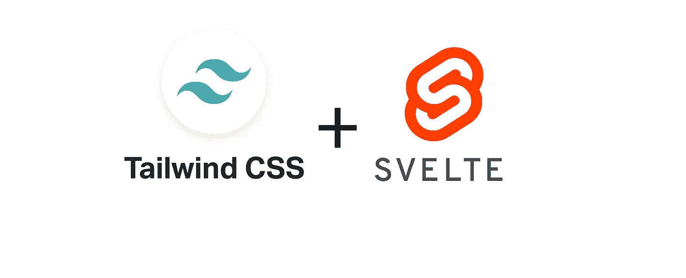

# 如何将苗条的 JS 与顺风 CSS 一起使用

> 原文：<https://levelup.gitconnected.com/how-to-use-svelte-js-with-tailwind-css-f0554187eca1>



顺风 CSS +苗条 JS

🔴如果你用的是 Sveltekit。检出 [**此条**](https://katendeglory.medium.com/how-to-use-svelte-kit-with-tailwind-css-jit-just-in-time-compilation-bc04c0c9ec17) 代替。

来自 React，我惊讶于 Svelte 的开发是如此的简单，一些需要 React 提供大量库的特性，实际上 Svelte 已经提供了。苗条有很多优点，我立刻就被吸引住了(没有双关语)😁)看了文档之后就一直在用了。

Tailwind 是一个令人惊叹的、反应灵敏的 CSS 实用程序库，它允许你将所有的样式写成 HTML 类，[如果你想开始使用它，这里有一个链接](https://www.youtube.com/watch?v=21HuwjmuS7A&list=PL7CcGwsqRpSM3w9BT_21tUU8JN2SnyckR)指向一个很棒的教程。

我一直用的是带 React 的 tailwind，发现 svelte 后第一件事就是怎么给它添加 Tailwind CSS。本教程的目的是给你一个循序渐进的指导，回购的链接将在本指南的末尾提供。

我们将在本教程中使用 PostCSS，如果你是新手，请点击[链接](https://postcss.org/)来了解它。

# 创建一个苗条的应用程序

首先，通过输入以下命令创建一个苗条的应用程序。

```
npx degit sveltejs/template your-awesome-project
cd your-awesome-project && yarn#Or if you are using npmnpx degit sveltejs/template your-awesome-project
cd your-awesome-project && npm install
```

# 添加开发依赖项

那很容易！接下来，安装以下开发依赖项。

```
yarn add -D autoprefixer postcss-cli tailwindcss concurrently cross-env#Or if you are using npmnpm install autoprefixer postcss-cli tailwindcss concurrently cross-env --save-dev
```

如果您运行的是 windows，跨 env 包将允许您在 package.json 脚本中设置环境变量，因为通常的 ENV_VAR=value 命令会导致错误。

**😷嘿，等一下！这是来自未来的我，快速更新…**

**【更新】**
Tailwind v2 和 PostCSS v8 刚刚退出，在这次更新时(2020–11–23)，你可能会经历一些重大变化。

这个问题最终会得到解决，但与此同时，如果你想使用最新版本的 tailwind，这里有一个适合你的组合:

👉tailwindcss @ NPM:[@ tailwindcss/postcss 7-compat](http://twitter.com/tailwindcss/postcss7-compat)
👉postcss@^7
👉autoprefixer@^9

```
yarn add tailwindcss@npm:[@tailwindcss/postcss7-compat](http://twitter.com/tailwindcss/postcss7-compat) postcss-cli@^7 autoprefixer@^9 concurrently cross-env -D#OR With NPMnpm install tailwindcss@npm:[@tailwindcss/postcss7-compat](http://twitter.com/tailwindcss/postcss7-compat) postcss-cli@^7 autoprefixer@^9 concurrently cross-env --save-dev
```

阅读本文了解更多信息:👉[https://tailwindcss . com/docs/installation # post-CSS-7-compatibility-build](https://tailwindcss.com/docs/installation#post-css-7-compatibility-build)

现在一切都结束了，我会把控制权交给过去的另一个我👇

# 配置 Post CSS 和 Tailwind

粗鲁的打断！让我们继续…

在项目的根目录下，创建 Post CSS & Tailwind 配置文件:

```
touch postcss.config.js public/tailwind.css
npx tailwindcss init
```

在 postcss.config.js 中，粘贴以下内容:

```
module.exports = () => ({ 
  plugins: [
    require(["tailwindcss"](https://github.com/tailwindcss/tailwindcss)), 
    require(["autoprefixer"](https://github.com/postcss/autoprefixer))
  ],
})
```

在 public/tailwind.css 中:

```
@tailwind base;
@tailwind components;
@tailwind utilities;
```

# Npm 脚本

将以下脚本添加到 package.json 中(覆盖 svelte 设置的原始值)

```
"scripts": {    
   "watch:tailwind": "postcss public/tailwind.css -o public/index.css -w",
   "build:tailwind": "cross-env NODE_ENV=production postcss public/tailwind.css -o public/index.css",    
   "build": "yarn run build:tailwind && rollup -c",
   "start": "sirv public",
   "serve": "serve public -p 80",
   "dev": "concurrently \"rollup -c -w\" \"yarn run watch:tailwind\""
},
```

在开发脚本中，concurrently 允许 svelte 服务器与 PostCSS 一起运行，post CSS 将监视您的顺风，并在项目的公共文件夹中生成 index.css 文件。

# 运行服务器

```
yarn run dev#Or if you are using npmnpm run dev
```

打开 [http://localhost:5000](http://localhost:5000)

# 将生成的顺风样式导入到项目中

从您的根项目目录的公共文件夹中打开 index.css，并导入由 PostCSS 生成的 index.css

```
*<!-- Paste me in public/index.html -->* <link rel='stylesheet' href='/index.css'>
```

就像那样，你已经在你的苗条应用程序中添加了 tailwind CSS。

还有最后一件事，顺风文件可能会变得非常大，兆字节的那种大，在 index.css 中有许多未使用的 CSS 类。在开发模式下这是没问题的，但你不想把它发送给你的客户端。

幸运的是，有一个解决方案。

# 清除您的 CSS

⚠如果你在你的 tailwind.config.js 文件中启用了 JIT，这部分指南就不需要了。

如果你不知道什么是 JIT，这里有一篇很棒的文章可以让你快速了解(【https://tailwindcss.com/docs/just-in-time-mode】T2)。

如果你没有启用 JIT，我还没跟你说完，继续滚……；)

清除 CSS 可能会占用大量 CPU 资源，如果在开发模式下执行，可能会降低环境速度。

因此，只有当 NODE_ENV 设置为 production 时，CSS 才会被清除。这个值是在构建阶段设置的(参见 package.json 中的构建脚本)。

在 tailwind.config.js(根目录)中，输入以下代码:

```
purge: ["./src/**/*.svelte", "./src/**/*.html"],
```

就是这样！你现在可以用你所有的顺风职业了。

感谢您花时间阅读！

别见外！如果你遇到任何问题，打电话给我，我会很乐意帮忙的！

你喜欢这篇文章吗？留下反馈，并与可能会觉得有用的人分享。

# 链接:

🔗[项目资源库](https://github.com/katendeglory/svelte-with-tailwind)
🔗[带细长套件的顺风](https://katendeglory.medium.com/how-to-use-svelte-kit-with-tailwind-css-jit-just-in-time-compilation-bc04c0c9ec17)

# 分级编码

感谢您成为我们社区的一员！ [**订阅我们的 YouTube 频道**](https://www.youtube.com/channel/UC3v9kBR_ab4UHXXdknz8Fbg?sub_confirmation=1) 或者加入 [**Skilled.dev 编码面试课程**](https://skilled.dev/) 。

[](https://skilled.dev) [## 编写面试问题

### 掌握编码面试的过程

技术开发](https://skilled.dev)