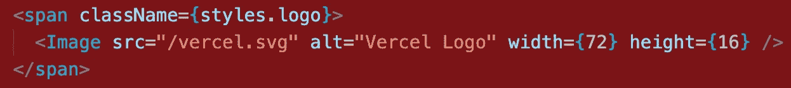

# 如何在 Next.js 项目中使用 SVG 图标

> 原文：<https://levelup.gitconnected.com/how-to-use-svg-icons-in-a-next-js-project-f6f8256f9e12>


[Pankaj Patel](https://unsplash.com/@pankajpatel?utm_source=medium&utm_medium=referral) 在 [Unsplash](https://unsplash.com?utm_source=medium&utm_medium=referral) 上拍摄的照片

## 前言

对于 SVGS 来说，SVG 图标比 png/jpeg 有很多优势，因为它们的尺寸更小，并且可以像改变 CSS 属性和动画一样进行编程。

在本文中，我们将研究如何在 Next.js 项目中使用 SVG 图标。有 4 种方法可以用来显示 SVG 图标:

1.  使用 Next.js 的`Image`组件
2.  使用 [SVGR](https://react-svgr.com/docs/what-is-svgr/)
3.  将 SVG 内容内联到 JSX
4.  使 SVG 成为 JavaScript 常量变量

## 使用 Next.js 的图像组件

每当我们使用`create-next-app`创建一个 Next.js 项目时，我们可以看到`public`目录包含一个`vercel.svg`，它在`page/index.tsx`文件中被引用。SVG 图标呈现为图像:



`Image`是一个 Next.js 组件，它是 HTML ``元素的扩展，具有多种性能优化。

如果不想使用这个组件，可以直接使用``元素。

```

```

## 使用 SVGR

SVGR 是将 SVG 转换成 React 组件的工具，支持 Webpack、Rollup.js、Next.js 等。

对于 Next.js 项目，我们需要首先安装`@svgr/webpack`加载器:

```
npm install --save-dev @svgr/webpack
```

然后修改 Next.js 项目根目录下的`next.config.js`，配置`@svgr/webpack`:

```
module.exports = {
  webpack(config) {
    config.module.rules.push({
      test: /\.svg$/i,
      issuer: /\.[jt]sx?$/,
      use: ['[@svgr/webpack](http://twitter.com/svgr/webpack)'],
    }) return config
  },
}
```

然后在我们的代码中，我们可以将 SVG 图标作为普通的 React 组件导入:

```
import VercelLogo from '../public/vercel.svg';const Footer = () => {
  return <footer> <VercelLogo /> </footer>
};
```

React 会将 SVG 图标呈现为 html `<svg>`元素，所以我们可以通过 CSS 改变颜色或其他属性。

## 将 SVG 内容内联到 JSX

SVG 图标是基于 html `<svg>`元素的，我们也可以将 SVG 内容内联到 JSX:

```
const Footer = () => {
  return (
    <footer>
      <svg width="283" height="64" viewBox="0 0 283 64" fill="none" >
        <path d="M141.04 16c-11.04 0-19 7.2-19 18s8.96 18 20 18c6.67 0 12.55-2.64 16.19-7.09l-7.65-4.42c-2.02 2.21-5.09 3.5-8.54 3.5-4.79 0-8.86-2.5-10.37-6.5h28.02c.22-1.12.35-2.28.35-3.5 0-10.79-7.96-17.99-19-17.99zm-9.46 14.5c1.25-3.99 4.67-6.5 9.45-6.5 4.79 0 8.21 2.51 9.45 6.5h-18.9zM248.72 16c-11.04 0-19 7.2-19 18s8.96 18 20 18c6.67 0 12.55-2.64 16.19-7.09l-7.65-4.42c-2.02 2.21-5.09 3.5-8.54 3.5-4.79 0-8.86-2.5-10.37-6.5h28.02c.22-1.12.35-2.28.35-3.5 0-10.79-7.96-17.99-19-17.99zm-9.45 14.5c1.25-3.99 4.67-6.5 9.45-6.5 4.79 0 8.21 2.51 9.45 6.5h-18.9zM200.24 34c0 6 3.92 10 10 10 4.12 0 7.21-1.87 8.8-4.92l7.68 4.43c-3.18 5.3-9.14 8.49-16.48 8.49-11.05 0-19-7.2-19-18s7.96-18 19-18c7.34 0 13.29 3.19 16.48 8.49l-7.68 4.43c-1.59-3.05-4.68-4.92-8.8-4.92-6.07 0-10 4-10 10zm82.48-29v46h-9V5h9zM36.95 0L73.9 64H0L36.95 0zm92.38 5l-27.71 48L73.91 5H84.3l17.32 30 17.32-30h10.39zm58.91 12v9.69c-1-.29-2.06-.49-3.2-.49-5.81 0-10 4-10 10V51h-9V17h9v9.2c0-5.08 5.91-9.2 13.2-9.2z" fill="#000"/>
      </svg>
    </footer>
  );
}
```

但是它会使 JSX 变得混乱，当我们需要替换或导入更多的 SVG 图标时，这将是一场灾难。

## 使 SVG 成为 JavaScript 常量变量

正如我们所知，React 通过使用`dangerouslySetInnerHTML`属性支持将字符串呈现为 html。所以我们可以将 svg 作为一个常量变量:

```
const logoString = '<svg width="283" height="64" viewBox="0 0 283 64" fill="none" ><path d="M141.04 16c-11.04 0-19 7.2-19 18s8.96 18 20 18c6.67 0 12.55-2.64 16.19-7.09l-7.65-4.42c-2.02 2.21-5.09 3.5-8.54 3.5-4.79 0-8.86-2.5-10.37-6.5h28.02c.22-1.12.35-2.28.35-3.5 0-10.79-7.96-17.99-19-17.99zm-9.46 14.5c1.25-3.99 4.67-6.5 9.45-6.5 4.79 0 8.21 2.51 9.45 6.5h-18.9zM248.72 16c-11.04 0-19 7.2-19 18s8.96 18 20 18c6.67 0 12.55-2.64 16.19-7.09l-7.65-4.42c-2.02 2.21-5.09 3.5-8.54 3.5-4.79 0-8.86-2.5-10.37-6.5h28.02c.22-1.12.35-2.28.35-3.5 0-10.79-7.96-17.99-19-17.99zm-9.45 14.5c1.25-3.99 4.67-6.5 9.45-6.5 4.79 0 8.21 2.51 9.45 6.5h-18.9zM200.24 34c0 6 3.92 10 10 10 4.12 0 7.21-1.87 8.8-4.92l7.68 4.43c-3.18 5.3-9.14 8.49-16.48 8.49-11.05 0-19-7.2-19-18s7.96-18 19-18c7.34 0 13.29 3.19 16.48 8.49l-7.68 4.43c-1.59-3.05-4.68-4.92-8.8-4.92-6.07 0-10 4-10 10zm82.48-29v46h-9V5h9zM36.95 0L73.9 64H0L36.95 0zm92.38 5l-27.71 48L73.91 5H84.3l17.32 30 17.32-30h10.39zm58.91 12v9.69c-1-.29-2.06-.49-3.2-.49-5.81 0-10 4-10 10V51h-9V17h9v9.2c0-5.08 5.91-9.2 13.2-9.2z" fill="#000"/></svg>'const Footer = () => {
  return  <footer  dangerouslySetInnerHTML={{__html: logoString}} />;
};
```

通过使用`dangerouslySetInnerHTML`，字符串中的整个 html 将被保留，这可能会使您的用户遭受 XSS 攻击。另一种方法是使用一个 [html-react-parser](https://github.com/remarkablemark/html-react-parser) 库，它将 html 字符串转换成 react 组件。

## 结论

在本文中，我们学习了在 Next.js 项目中使用 SVG 图标的 4 种方法。如果你需要改变悬停时 SVG 图标的颜色，图像的方式是不适合的。

在我的项目中，最常用的方法是 SVGR，因为它将 SVG 图标作为一个 React 组件，React 最重要的特性是基于组件的。

# 分级编码

感谢您成为我们社区的一员！在你离开之前:

*   👏为故事鼓掌，跟着作者走👉
*   📰查看[升级编码出版物](https://levelup.gitconnected.com/?utm_source=pub&utm_medium=post)中的更多内容
*   🔔关注我们:[Twitter](https://twitter.com/gitconnected)|[LinkedIn](https://www.linkedin.com/company/gitconnected)|[时事通讯](https://newsletter.levelup.dev)

🚀👉 [**将像你这样的开发人员安置在顶级初创公司和科技公司**](https://jobs.levelup.dev/talent/welcome?referral=true)