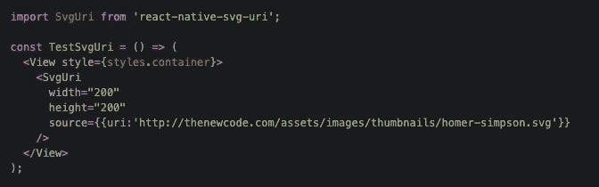
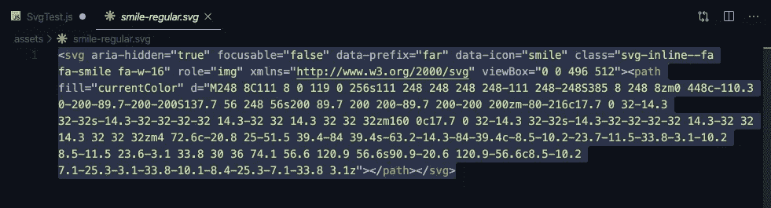
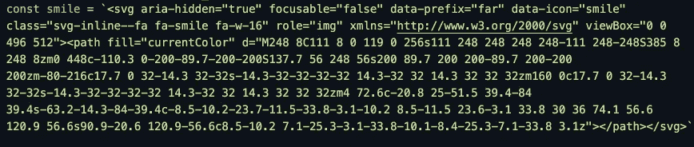
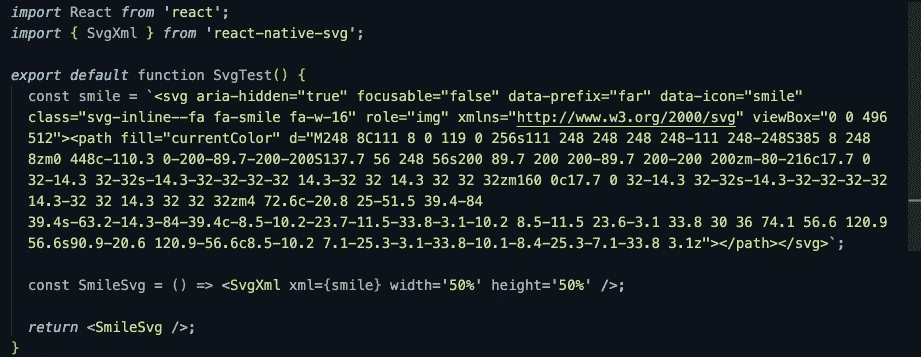
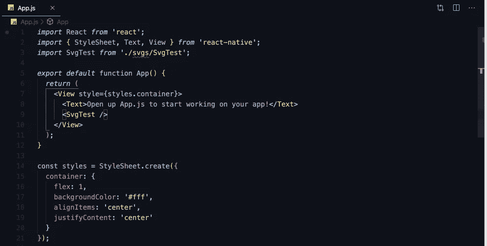
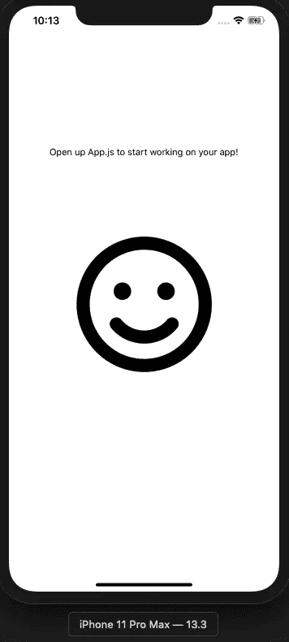

# 如何在 React Native with Expo 中使用 SVG

> 原文：<https://levelup.gitconnected.com/how-to-use-svgs-in-react-native-with-expo-ec34f085f5e0>

**SVG 是一种矢量格式，可以缩放到任何大小而不损失其质量，**这是它们在移动应用程序开发中非常受欢迎的原因。然而，React Native 还没有完全解决使用 SVG 的所有问题。

在写这篇文章的时候，有很多方法可以尝试在你的项目中使用 SVG 图像。最常见和稳定的一种是使用 [react-native-svg-uri](https://github.com/vault-development/react-native-svg-uri) 。它允许您使用 SvgUri 组件在 React Native 中从 URL 或静态文件呈现 SVG 图像。



虽然这是一个*奇妙的*和*简单的*库来使用，但它有一个**主要**错误:在 Android 上，开发时一切似乎都正常，但在发布模式下无法加载文件。这意味着当你在开发或调试模式下测试你的应用程序时，你的 SVG 会显示出来，但当你推送到 Google Play 商店时，你的 SVG 就不再呈现在 Android 设备上了。

到目前为止，唯一已知的解决方法是在 svgXmlData 属性中传递 SVG 内容。但是，只有在使用以下命令链接到 [react-native-svg](https://github.com/react-native-community/react-native-svg) 时，才能访问这个属性:

```
react-native link react-native-svg
```

现在，如果您没有使用 Expo，您可以在这里停下来，成功地链接到 react-native-svg 并使用 SvgUri 组件和 svgXmlData prop。但是如果你使用 Expo，这就是它发挥作用的地方。

Expo 最大的限制是你不能在不分离的情况下添加你自己的原生模块。所以，如果你想使用任何需要 *react-native link 的东西，*就像上面所要求的那样，那么你需要分离你的项目，用或不用 ExpoKit 来开发它。一个解决方案？当然，只要你不介意在这样做的时候失去某些功能和集成(如 Expo 的推送通知服务)，但这是 Expo 作为一体化软件包提供的权衡。分离时，您会失去这些功能。

**那么，我们如何在 React 原生项目中实现 SVG，而不丢失 Expo 提供的所有附加功能和集成呢？**

嗯，有一种方法可以同时运行 Expo 和 raw React Native，如果你有兴趣了解更多，你可以在这里查看这篇文章。

否则，您可以跟随我向您展示如何快速将 iOS **和** Android 支持的 SVG 添加到您的 Expo 应用程序中。

1.  **创建新的世博 App**

```
expo init my-expo-app
```

选择一个裸应用 JavaScript 模板，并在您喜欢的编辑器中打开它。

2.**添加 react-native-svg**

```
expo install react-native-svg
```

3.**将你的 SVG 文件添加到*资产*文件夹**

4.**在项目的根目录下添加一个文件夹**

我将把我的命名为 SVG，但是您可以随意命名

5.**在我们在步骤 4** 中创建的文件夹中添加一个. js 文件

我将我的命名为 SvgTest.js，但是同样，您可以随意命名它

6.**导入适当的组件并创建您的功能**

```
import React from "react";
import { SvgXml } from "react-native-svg";export default function SvgTest(){ return()}
```

7.**走进你的。svg 文件并复制那里的所有内容**



8.**在你的。js 文件并将您的 SVG 内容粘贴到一对反勾号中**



9.**在您的。js 文件并使用 react-native-svg 中的 SvgXml 组件**

在这里，您将把之前的常量传递给 xml prop。你也可以定义你的高度和宽度。


10.**返回您的函数**

你完成了。js 文件应该是这样的



11.将你的新 SVG 组件导入到你的 App.js 中，并像普通的 React 本地组件一样使用它



12.**运行您的项目并启动您的模拟器**

```
expo start
```



iPhone 11 Pro Max 上显示的 SVG