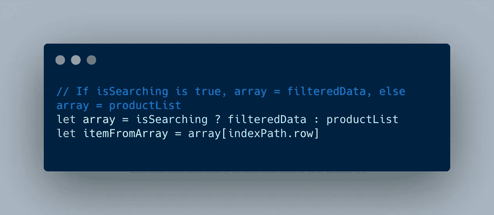

# 如何使用 Swift 的三元运算符

> 原文：<https://levelup.gitconnected.com/how-to-use-swifts-ternary-operator-19fcae4229cd>

## 利用 Swift 中的语法优势



Swift 中三元运算的屏幕截图

三元运算符非常酷。它们是在一行中完成一些 if-else 逻辑的简单方法。除此之外，它们仍然易于阅读和理解，所以你不必为了使用语言的高级特性而牺牲可读性。事实上，这是一个很好的方法，可以让方法更简短，并把注意力吸引到对你的程序更有意义的其他逻辑上。

# 以 If-Else 语句开始

以下面的代码为例。你比较两个变量，并根据结果打印一些东西。

```
**if** variable1 == variable2 {
    print("Equality! 🥳")
} **else** {
    print("NO EQUALITY 🤬")
}
```

# 将其转换为一行

三元运算符由 3 部分组成。

1.  有条件的支票
2.  条件为真时的运算结果
3.  条件为假时的运算结果

对于上面的 if-else 语句，我们可以这样写👇

```
print(variable1 == variable2 ? "Equality! 🥳" : "NO EQUALITY 🤬")
```

# 赋值

Swift 中的三元运算不仅限于打印语句。事实上，三元运算符返回一个可用于设置变量的值。

你可以通过下面的检查来确定饮酒的年龄

```
var result = “”if(age < 21){
  result = "Too young to drink 🍺"
} else {
  result = "Old enough to drink 🍻"
}print(result)
```

这是一个基于数字值分配字符串的大量代码。我们可以用三进制操作符只用两行代码就完成了——你可以看到下面的例子👇

```
**let** result = age > 21 ? "Too young to drink 🍺"" : "Old enough to drink 🍻"
print(result)
```

如果你觉得这很有帮助，你可能会喜欢看我的关于用 Swift 学习编程的书！