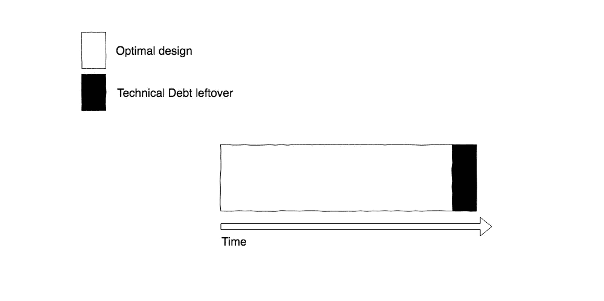

# 如何使用技术债务对你有利🔊

> 原文：<https://levelup.gitconnected.com/how-to-use-technical-debt-in-your-favor-98bae475ba68>

## 技术债是不可避免的，只有你能减少要付的利息

图中左边的一只手给了右边一只空着的手三张百元钞票。

听听音频版！

技术债务就像贷款。

比方说，你需要一辆昂贵的汽车，但买不起。一种选择是贷款，并在一段时间内支付一些利息。代价是你要为汽车的最终价格支付更多的钱。这是一种妥协，但如果贷款得到正确支付，不会招致过多的复利，这是有意义的。

然而，贷款 3 万美元购买完成工作所需的汽车和贷款 70 万美元购买兰博基尼是有区别的。你应该只欠你有能力支付的债务来实现你真正需要的东西，这样你就不必申请破产。

[技术债](https://martinfowler.com/bliki/TechnicalDebt.html)大部分时间是作为负面内涵使用的，但不需要一直那样。就像贷款一样。它将允许您在不利的环境下更快地交付软件，而不必投入足够的时间来寻找问题的最佳设计。

马丁·福勒[说得好](https://martinfowler.com/bliki/TechnicalDebtQuadrant.html)，他说:

> [……]当你编程时，你就在学习。通常情况下，在你理解最好的设计方法应该是什么之前，一个项目可能需要一年的编程时间。[…]

换句话说，编程就像一个“找模式”的游戏。

需求[会经常不可预测地改变](/code-less-think-more-incrementally-98adee22df9b)。一个好的策略是从一个非常简单和简单的方法开始。随着更多需求的出现，您需要修改现有的代码来适应新的需求。在这一点上，您可能会开始看到更清晰的模式，即对于您正在工作的领域，应该如何构造代码，然后您会朝着这个方向进行重构。也许重构会带来价值，但有时不会，所以你在[反馈循环](https://www.fs.blog/2011/10/mental-model-feedback-loops/)中一次又一次地重构。

这也是一个悖论。

[传统组织](https://hackernoon.com/why-corporate-culture-is-toxic-for-software-development-e4f0a2a203c6)认为你必须在第一时间朝着最佳设计努力。然而，除非你知道能够看到模式的所有要求，否则不可能知道什么是好的设计。这个过程需要时间。

这在[增量](/code-less-think-more-incrementally-98adee22df9b)开发中是一个巨大的限制。

即使你不知道所有的需求，你仍然可以写出有用的软件。但是，它的设计可能无法满足未来的需求。在这种情况下，技术债务可以帮助你推迟重构，直到模式足够清晰，让你有充分的理由[重构](https://blog.cloudboost.io/how-to-refactor-a-public-interface-317ed18d38a3)。

> 除非你知道所有的需求，否则不可能知道什么是好的设计

为了这篇文章的目的，让我们称之为**【任务】**任何可以驱使你编写代码来解决问题的事情，无论是在微观层面还是宏观层面。它可以是一个技术任务、需求、特性、故事、史诗…没关系。

一个任务的设计在被认为已经完成之前可以被迭代和改进很多次。然而，一段时间后，收益递减定律开始生效，改进设计的好处就不值得花时间了。

过多的设计和抽象会带来负面的后果。复制比错误的抽象要好。

代表任务生命周期的时间线的心理模型。在底部，它显示一个从左向右的箭头，包含标题“时间”。在箭头的上方，有一个从箭头的起点到终点的方块，代表一个“最佳设计”。

虽然迫使您更改代码的需求正在到来，但不断迭代和改进设计是有意义的。一旦需求停止，你就没有理由再迭代了，停止在它上面投入大量的精力是一个好主意。相反，让代码处于优化状态，以使重构更容易。

这意味着用很少的抽象来编写代码，[更简单的转换](https://en.wikipedia.org/wiki/Transformation_Priority_Premise)，以及清晰的测试来记录意图。

代表任务生命周期的时间线的心理模型。在底部，它显示一个从左向右的箭头，包含标题“时间”。在箭头上方，有一个从箭头开始到结束的区块。该块的最后有一个黑色部分，代表一些技术债务的遗留。

如果你接触到系统的核心部分，而这个核心部分经常改变，并且永远不会再接触到，你可以决定不留下技术债务。

一个更好的设计，虽然也有助于易读性，但它意味着支持未来的变化。如果你所写的代码有可能永远不会被再次触及，为什么还要花大量的时间在上面呢？

在这种情况下，在最后留下一些技术债务，让下一个需求驱动更好的设计。在未来，你将处于一个更好的位置来看到这些模式，而不是猜测它。

代表任务生命周期的时间线的心理模型。在底部，它显示一个从左向右的箭头，包含标题“时间”。在箭头上方，有一个从箭头开始到结束的区块。该块代表两个任务。**第一个任务**在最后增加了一些技术债务，第二个任务驱使开发者清除之前的技术债务。**的第二个任务**在末尾有一个黑色部分，代表一些技术债务遗留，以方便下一个设计决策。

这看起来很棒，但是有一些坏消息:[没有什么灵丹妙药](https://medium.com/@fagnerbrack/how-to-reject-the-belief-on-the-silver-bullet-1d86b686acbb)。

唯一可行的方法是，当所有在代码库**中工作的开发人员**都有相同的技能水平和[纪律](https://hackernoon.com/how-to-fix-the-software-industry-c2b627ec3d9d)时。如果不是这样，他们将很难理解代码背后的意图并做出正确的决策。

在现实生活中，很难找到每个人都完全一致的团队。这就是 [Mob 编程](https://hackernoon.com/how-mob-programming-will-make-you-more-effective-590a1b7e0418)和[结对编程](https://medium.com/@fagnerbrack/pair-programming-8cfbf2dc4d00)可以帮助塑造文化和改善协作的地方。

记住**没有什么可以作为编写糟糕代码的借口**。

一幅漫画展示了右边的一个人在流汗，试图驾驶一辆方轮自行车。标题写着“停不下来。太忙了！!"。在左边，有一个人拿着一个圆形的轮子。左边的人看着右边的人，眼花缭乱。([来源](http://www.gratasoftware.com/technical-debt-bad-for-business/))

> 如果团队是一致的、协作的和有纪律的，你只能使用对你有利的技术债务

这种方法的一个常见问题是，开发人员往往会留下太多的技术债务，而不是仅仅足以促进未来模式的发现。

这会让事情变得更糟。

这个想法是为了促进下一个设计决策，而不是让它变得更难。

代表任务生命周期的时间线的心理模型。在底部，它显示一个从左向右的箭头，包含标题“时间”。在箭头上方，有一个从箭头开始到结束的区块。一半的任务因技术债务遗留而中断。

如果你留下了大量的技术债务，没有人会有时间或意愿在以后修复它。这只会导致更多的窗户被打碎。

不要牺牲[干净的代码](https://www.youtube.com/watch?v=35l-OFlmGWs)。

做出一个有意识的决定，让你在支持未来重构的同时前进。只有在代码和测试能够暴露出其背后的[气味](https://medium.com/@fagnerbrack/code-smell-92ebb99a62d0)的情况下，才应该这样做。

债务并不总是坏事。

如果你没有借钱的选择，你就买不起房子或汽车。

技术债务也是如此。

确保你迭代了你的**任务** [的设计](/code-less-think-more-incrementally-98adee22df9b)并且创建了[质量测试](https://medium.com/@fagnerbrack/why-test-driven-development-4fb92d56487c)，否则你将无法自信地重构。

确保你重构的方式能够帮助你的旧代码适应你的需求，[别无他求](https://hackernoon.com/how-to-accept-over-engineering-for-what-it-really-is-6fca9a919263)。

> 重构你知道的过去，而不是你不知道的未来

程序员的角色不仅仅是写代码，而是给这个充满逻辑废话的世界带来一些意义。

这是一项“寻找模式”的工作。

注意那个“啊哈”的时刻，把代码放在一个让其他人更容易找到它的地方。

也许在未来，我们将生活在一个这些行为成为规范的世界里。

不幸的是，作为一个行业，我们还远远没有做到这一点。

该由你开始改变了。

如果你的团队从我关于这篇文章或我正在进行的任何其他项目的谈话和/或问答中受益，请在`contact at fagnermartins.com`给我写信。

感谢阅读。如果您有任何反馈，请通过 [Twitter](https://twitter.com/FagnerBrack) 、[脸书](https://www.facebook.com/fagner.brack)或 [Github](http://github.com/FagnerMartinsBrack) 联系我。

想当面聊聊吗？你可以在 [**悉尼软件工匠聚会**](https://www.meetup.com/Software-Crafters-Sydney/) 找到我。