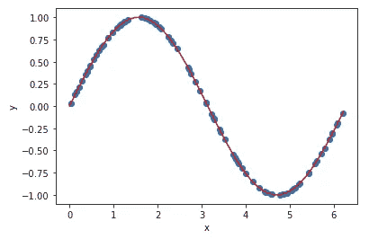
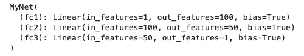
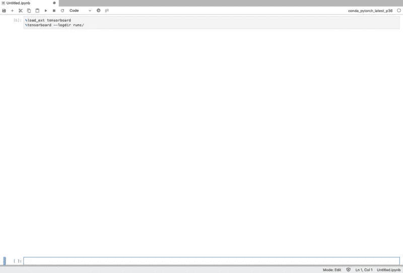
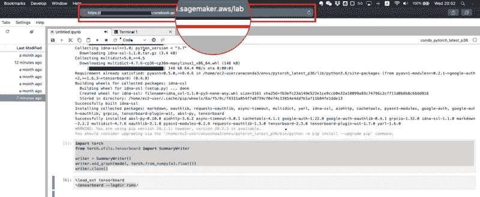
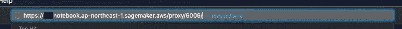
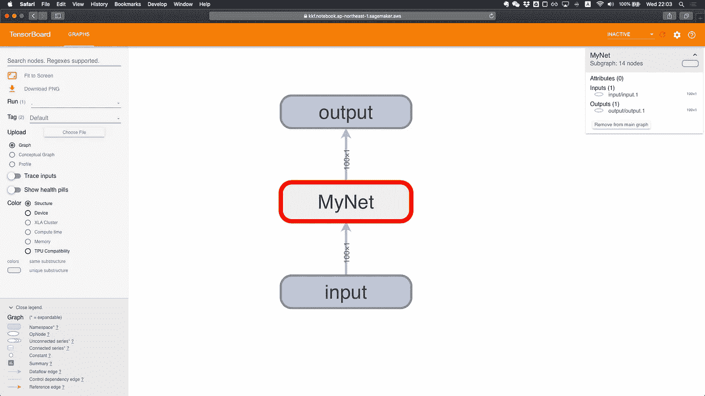

# 如何在 Amazon SageMaker 笔记本实例中使用 TensorBoard

> 原文：<https://levelup.gitconnected.com/how-to-use-tensorboard-in-an-amazon-sagemaker-notebook-instance-a41ce2fd973f>

在本文中，我将向您展示如何在 amazon sagemaker 笔记本实例中使用 TensorBoard。

在我最近的一个项目中，我需要在 sagemaker 笔记本实例中使用 TensorBoard 来可视化训练和验证损失。但是网上搜了一下，才知道很少有博客涉及这个话题。所以我写了这个循序渐进的教程，希望能帮到你。

让我们用一个简单的回归例子来深入这个话题。

# **1。创建样本数据**

首先，我将使用 NumPy 创建一个样本数据集，并简单地创建一个名为 x 的变量，它是一个从 0 到 2π的随机数据样本。然后我们会计算 y，它是 x 的符号，其中 x 是一个随机数据。因此，x 是我们的输入值，y 将是我们数据集的真实值。

我们可以把它画出来。蓝点代表我们的样本数据集。红线表示 x 的符号是什么。



# **2。构建神经网络**

那么我们来构建一个简单的全连接神经网络。这是一个非常简单的神经网络。它有两个隐藏层。我们将在第一个隐藏层使用 100 个节点，在第二个隐藏层使用 50 个节点。并对这些层中的每一层使用 ReLu 激活。

如果我们打印模型，我们可以看到模型的样子。



这并没有在视觉上向我们展示很多信息，但它给了我们每层有多少节点以及各层如何连接的信息。

# 3.张量板模型可视化

让我们用 TensorBoard 来看看这个模型。

为此，我们需要在一个单元中运行以下命令来安装 TensorBoard。

```
!pip install tensorboard
```

然后我们导入 TensorBoard summary writer 类。需要注意的是，如果没有预先安装 TensorBoard，您将会得到如下错误👇🏻

```
ModuleNotFoundError: No module named 'tensorboard'
```

然后，我们使用一个名为 writer 的变量实例化摘要 writer 类。我们应用一个名为 add_graph 的方法将这个图添加到我们的 TensorBoard 事件日志中。最后，我们关闭 writer 来完成它。

让我们试着在这个笔记本上执行 TensorBoard。我们调用扩展“load_ext tensorboard”，然后用 log direct 标志调用 tensorboard。在这里，我们将其设置为“运行”文件夹。

开始了。



哎呀…怎么回事？？什么都没出现…

关于这个结果，我问了一位学长，得到了他的如下回答:

> *“tensorboard 似乎未安装在 conda_pytorch_latest_p36 实例中，Sagemaker Jupyter Lab 或 Jupyter Notebooks 不支持嵌入 tensor board 应用程序。*
> 
> *您可以通过在单元中运行以下命令来安装 tensor board:*
> 
> *！pip 安装张量板*

但是在我调用扩展“load_ext tensorboard”之前，我已经通过这个命令安装了 tensorboard，不是吗？🤔

条条大路通罗马。我们为什么不试试另一条路？🧐

这次让我们打开终端并执行以下命令:

```
pip install tensorboard
tensorboard --logdir runs/
```

需要注意的是，请确保您位于“runs”文件夹的根路径中。对我来说，我需要使用

```
*cd sagemaker*
```

更改我当前的工作目录。

然后你会得到回应:

```
...
...
TensorBoard 2.3.0 at [http://localhost:6006/](http://localhost:6007/) (Press CTRL+C to quit)
```

重点来了。

1.  获取您笔记本的 URL。大概会是这样:[*https://YOUR _ NOTEBOOK _ INSTANCE _ name . NOTEBOOK . AP-northeast-1 . sagemaker . AWS/lab*](https://YOUR_NOTEBOOK_INSTANCE_NAME.aws/lab)



2.将“lab”替换为“proxy/6006”。这里的 6006 是你从回答中得到的数字。所以新的网址应该是这样的:[*https://YOUR _ NOTEBOOK _ INSTANCE _ name . NOTEBOOK . AP-northeast-1 . sage maker . AWS/proxy/6006/*](https://YOUR_NOTEBOOK_INSTANCE_NAME.notebook.ap-northeast-1.sagemaker.aws/proxy/6006/)



3.然后在外部浏览器中访问该 URL。

开始了。冲浪板出现了！👏



这是描述我们网络的张量图。双击显示 MyNet 的地方，这将扩展到我们的网络的样子。我们可以上下滚动，还可以移动这个模型来调整它的大小，这样我们就可以看得很清楚了。我们也可以阅读右上角显示的信息，以检查有多少输入和输出。