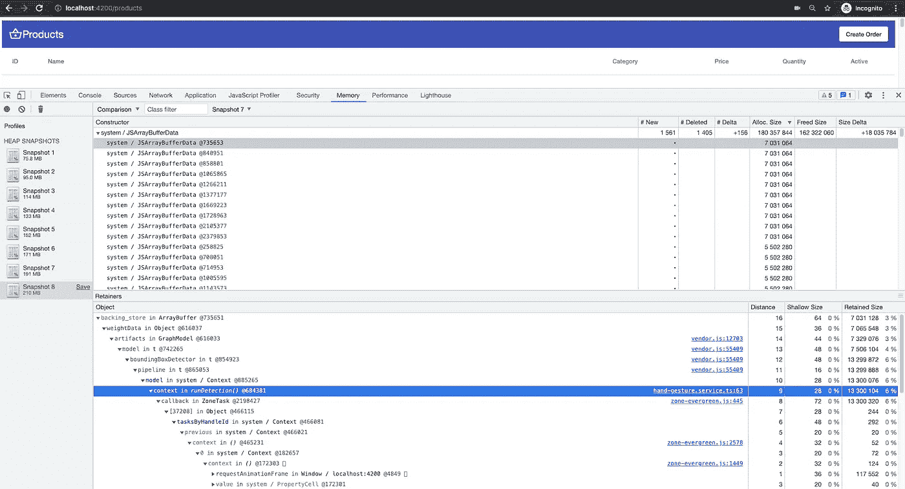
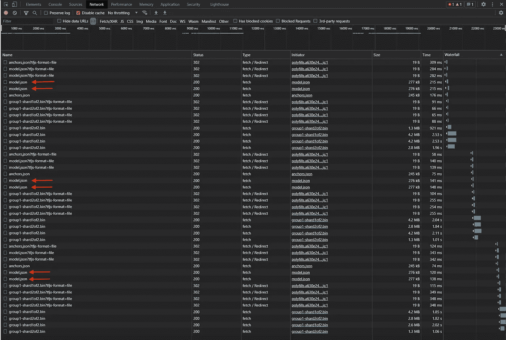
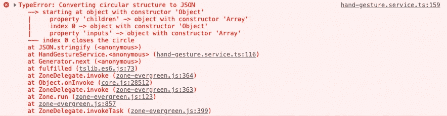
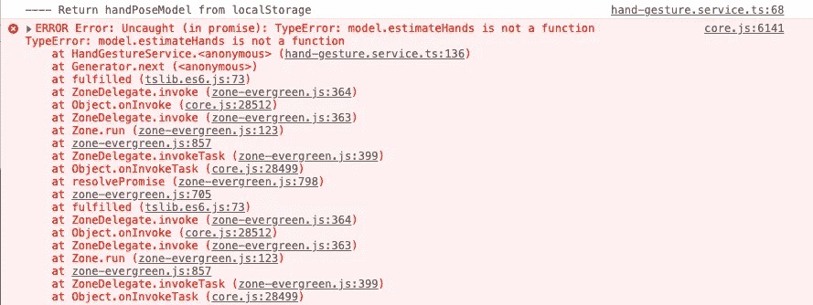
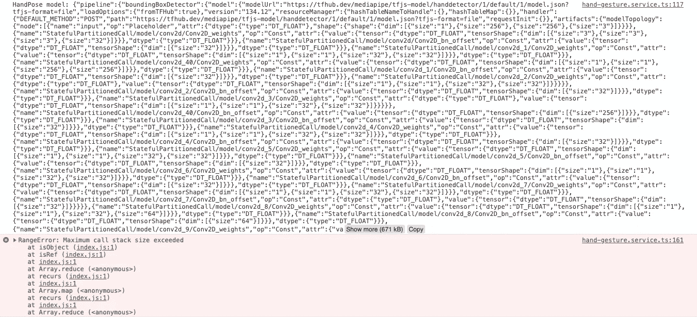
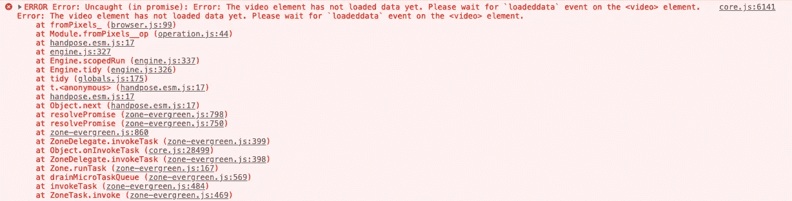
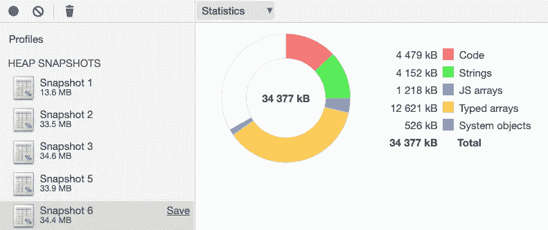
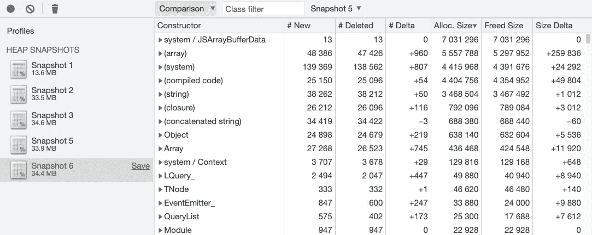

# 我如何在不泄漏内存的情况下使用 TensorFlow.js

> 原文：<https://levelup.gitconnected.com/how-to-use-tensorflow-js-without-memory-leaks-273ad16196be>

## [网页性能](https://rakiabensassi.medium.com/list/software-engineering-7a179a23ebfd)

## 使用 TFJS 模型而不影响 web 性能的技巧


图片来自 [StartupStockPhotos](https://pixabay.com/users/startupstockphotos-690514/?utm_source=link-attribution&utm_medium=referral&utm_campaign=image&utm_content=593313) 来自 [Pixabay](https://pixabay.com/?utm_source=link-attribution&utm_medium=referral&utm_campaign=image&utm_content=593313)

在[的上一篇文章](https://betterprogramming.pub/web-performance-and-tensorflow-js-3db05b1de958)中，我在使用 TensorFlow.js 和机器学习通过手势而不是鼠标点击在订单创建步骤之间导航后，解决了我的一个 web 应用程序中遇到的性能问题。

几周后，Google for TensorFlow.js 和机器学习的高级开发人员 Jason Mayes[找到了](https://medium.com/@JasonMayes/thanks-for-making-the-informative-and-very-well-presented-video-and-blog-post-152493308039)，问了我几个问题:

> “这个 GUI 性能问题是在模型加载时出现的，还是在应用程序的整个使用过程中持续出现的(甚至在模型加载完成并且手动跟踪开始工作之后)？
> 
> 我自己刚刚尝试了默认的 handpose 演示，当模型首次加载时，我看到了延迟，因为数据必须传输到 WebGL，Chrome 也使用 GPU 来渲染 DOM 等——我们正在研究在这种情况下为浏览器保留一些 GPU 能力的方法，但一旦加载，我的性能又可以使用了——这对你来说是一样的吗？
> 
> 我们最近确实发现了一个与 WebGL 相关的内存泄漏错误，我相信它已经被修复了，你能确认一下你使用的内存是否仍然是 100Mb 吗？在我这边，我看到 25Mb，它似乎没有比我刚才测试时的大。"

因为我是 TensorFlow.js 的新手，而且我刚刚使用了 Google Angular 团队的软件工程师 Minko Gechev 的示例,做了一点小小的修改来实现这个功能，这条消息让我对 TensorFlow.js 的工作原理有了更多的了解。

[](https://betterprogramming.pub/javascript-memory-leaks-390957523a9e) [## 如何识别、诊断和修复 Web 应用程序中的内存泄漏

### 通过编写优化的代码和使用 Chrome DevTools 来提升你的 web 应用程序的性能

better 编程. pub](https://betterprogramming.pub/javascript-memory-leaks-390957523a9e) 

# 确定内存泄漏的确切原因

为了回答 Jason 的问题，我继续分析我的案例，发现在用户会话期间内存消耗持续增加，甚至在 HandPose 模型加载完成并且手势跟踪开始工作之后也是如此。

我拍摄了许多堆快照，并注意到每当我转到编辑订单或产品的视图(其中有手势跟踪)并返回到产品列表视图(其中没有手势跟踪)时，快照的大小几乎增加了 20 MB，如下所示:



大小不断增加的多个堆快照(图片由作者提供)

在给出这个结果后，Jason 确认了每次用户访问 details 视图时都会重新加载模型，并且当用户离开页面时不会释放旧的内存，这使得堆大小的增加保持在 20Mb 以上。

当你在 chrome 浏览器的网络选项卡上看到多个`model.json`时，你可以在下面的截图中找到这个:



在 chrome 浏览器的网络选项卡上多次加载 model.json(图片由作者提供)

# 我的项目与 Minko 的例子有何不同

在我的项目中，我有一个作为 [Angular](https://betterprogramming.pub/angular-10-new-features-dbc779061dc8) 库实现的[动态步进器](https://betterprogramming.pub/angular-library-dynamic-stepper-2ba05ab40228),它具有步骤之间的导航，手跟踪是其中的一个特性。`DynamicStepperModule`用于订单创建和产品详情视图，负责通过其`HandGestureService`加载手部姿势模型。

这就是 Minko Gechev 演示中逻辑的不同之处，其中根组件`AppComponent`负责呈现视频 HTML 元素:

app.component.html

以及处理媒体流的逻辑:

应用程序组件

`AppComponent`是 UI 的主要包装器，所以用户永远不会离开并在会话期间回来，这意味着在这种情况下他们永远不会有机会看到模型被重新加载。

# 如何修复我的项目？

在我的案例中，我看到的解决方案是每当用户离开细节视图时就释放模型。就像`load()`方法一样，TensorFlow.js 库提供了一个`dispose()`方法来释放模型保留的内存。

然而，Jason [建议](https://discuss.tensorflow.org/t/memory-leaks-with-tensorflow-js-hand-gestures/4384)不要这样做，因为这样可以修复内存泄漏，但不能修复性能问题:

> “加载模型本身是一个非常密集的过程，在某些浏览器上，它甚至会阻止在加载时更新 GUI。我们的团队实际上正在寻找降低负载强度的方法，但是仍然会使用大量的资源。
> 
> 我建议加载一次 TFJS 模型，存储在一个在视图变化之间不会被破坏的常量中，然后在需要时调用预测函数。这将导致一个更高性能的 web 应用程序，并节省带宽，如果你没有在本地缓存，例如在本地存储等，每次视图改变时重新下载模型。
> 
> 你建议的解决方案将解决内存泄漏，但不会解决性能问题，因为它必须每次都重新解析所有内容，并从 CPU 发送到 GPU 内存，这是非常密集的。"

因此，有了这个提示，很明显，我没有其他解决方案例外调整我的应用程序的逻辑，只加载一次手部跟踪模型，然后将它保存在某个地方，并在需要时从那里读取它的值。

# 解决方案 1:将模型保存在本地存储中

虽然我以前已经使用过`localStorage`很多次，但是序列化 HandPose 模型并不像我预期的那么容易。

## **1。类型错误:将循环结构转换为 JSON**

我面临的第一个挑战是我调用了`JSON.stringify()`以便在保存之前将模型转换成字符串。我得到了错误:

`TypeError: Converting circular structure to JSON`:



类型错误:将循环结构转换为 JSON(图片由作者提供)

这个问题我以前见过很多次，尤其是当我试图`console.log`一个复杂的 JSON 对象时。

为了解决这个问题，我使用了下面的代码片段来查找和过滤循环引用:

[来源:Mozilla](https://developer.mozilla.org/en-US/docs/Web/JavaScript/Reference/Errors/Cyclic_object_value)

然后我调用了`getCircularReplacer()`函数作为`JSON.stringify()`的第二个参数。方法`stringify()`有一个名为`replacer`的可选参数:

```
stringify(value: any, **replacer**?: (this: any, key: string, value: any) => any, space?: string | number): string;
```

这是我的手部姿势模型逻辑在改变后的样子:

在本地存储中保存并加载 TensorFlow.js 手选模型

## 2.TypeError: model.estimateHands 不是函数

我面临的下一个挑战是第二次访问具有手部跟踪功能的视图。

当用户第一次打开这个视图时，它从`handpose.load()`获取模型，第二次从`localStorage`加载模型:

```
const modelFromLocalStorage = localStorage.getItem('handPoseModel');
return JSON.parse(modelFromLocalStorage);
```

这是我得到的:`TypeError: model.estimateHands is not a function`:



TypeError: estimateHands 不是函数(图片由作者提供)

原因是只有模型的属性保存在`localStorage`中。`getCircularReplacer()`在过滤循环引用的过程中导致了数据丢失。

因此，我没有使用这种自我实现的解决方案，而是寻找一个支持序列化循环引用而不会丢失数据的库。我选择了`[json-cyclic](https://www.npmjs.com/package/json-cyclic)`(或 [cycle.js](https://github.com/douglascrockford/JSON-js/blob/master/cycle.js) )并将其添加到项目中:

```
yarn add json-cyclic
```

## 3.范围错误:超出了最大调用堆栈大小

我几乎解决了这个问题，除了这个错误给了我一记耳光:

`RangeError: Maximum call stack size exceeded`

显然，这是因为来自`json-cyclic`库的`decycle()`和`encycle()`方法中的递归函数调用:



范围错误:超出了最大调用堆栈大小(图片由作者提供)

# 解决方案 2:在服务中保存模型

在最后一个错误之后，我改变了我的方法来修复内存泄漏:不是在`localStorage`中保存模型，我想使用`HandGesture`服务作为存储，并在那里保存 TFJS 模型，就像我在其他项目中使用[可观察数据服务(或基于行为主体的存储服务)](https://betterprogramming.pub/frontend-architecture-376e6323ef9b)一样。

`HandGestureService`实际上是一个单例，这意味着应用程序只有一个实例，这允许我在其中定义一个新变量`_handPoseModel`，它应该在第一次加载后保存模型:

实施这种方法后，我发现从`_handPoseModel`获取模型的值太快了，导致了以下错误:

`The video element has not loaded data yet. Please wait for ‘loadeddata’ event on the <video> element`:



错误:视频元素尚未加载数据。请等待元素上的“loadeddata”事件(图片由作者提供)

HTML 视频元素很慢，需要几秒钟才能向用户显示`MediaStream`内容:

```
<video #video width="600" height="480" [srcObject]="stream" autoplay></video>
```

在多次尝试将`video.addEventListener('loadeddata', (e) => {...})`添加到源代码的不同位置后，我终于找到了合适的位置，让应用程序运行时没有错误和内存泄漏。

我已经将它添加为`model.estimateHands(video).then(...)`的包装器，如你在下面的代码中所见:

在调用 model.estimateHands(video)之前，请等待视频事件“loadeddata”

瞧啊！

漫长的时间和令人生畏的工作最终得到了回报:)更重要的是，我对 TensorFlow.js 以及如何使用它有了更多的了解。

下面是修复后堆快照的样子:



修复内存泄漏后的堆快照(图片由作者提供)



修复内存泄漏后的堆快照(图片由作者提供)

*   第一个快照(13.6MB)是在启动应用程序后拍摄的。
*   接下来的快照是在玩应用程序并多次访问和离开详细信息页面(显示手跟踪视频)后拍摄的。
*   第二个快照(33.5MB)与第一个相比增加了大约 20MB，因为它是在加载`HandPose`模型之后拍摄的。它包括模型的大小和相关的逻辑。
*   在此之后，没有新的模型加载，因此几乎没有连续增加内存。

感谢阅读！我希望你在这篇文章中找到了一些见解和灵感，帮助你在自己的 web 应用程序中尝试 TensorFlow.js。

特别感谢[杰森·梅斯](https://medium.com/u/c86fe9178d2?source=post_page-----273ad16196be--------------------------------)。

🧠💡我为一群聪明、好奇的人写关于工程、技术和领导力的文章。 [**加入我的免费电子邮件简讯**](https://rakiabensassi.substack.com/) 获取独家访问权限，或者如果您还没有注册，请在此注册 Medium [。](https://rakiabensassi.medium.com/membership)

*你可以在 Udemy 上查看我的* ***视频课程****:*[*如何识别、诊断、修复 Web Apps 中的内存泄漏*](https://www.udemy.com/course/identify-and-fix-javascript-memory-leaks/) *。*

[](https://betterprogramming.pub/web-vitals-guide-b56e28798e7f) [## 网络生命:它们是什么，如何衡量它们

### 谷歌用来影响你的网络应用排名的基本性能指标指南

better 编程. pub](https://betterprogramming.pub/web-vitals-guide-b56e28798e7f) [](/7-nodejs-vulnerabilities-149094e441c2) [## GitHub 在 NodeJS 中发现了 7 个漏洞——这对你意味着什么？

### 漏洞演练和给用户的建议

levelup.gitconnected.com](/7-nodejs-vulnerabilities-149094e441c2)