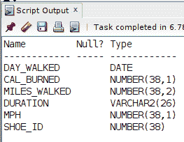

# 如何使用 LEAD() Window 函数并发现日期间隔

> 原文：<https://levelup.gitconnected.com/how-to-use-the-lead-window-function-and-discover-gaps-in-dates-60665d383a5d>

你们中的许多人可能知道我是一个狂热的步行者。我喜欢散步和远足，这对健康和精神都有好处。我对走路穿的鞋子也很挑剔。我最近对我跟踪的一些行走数据使用了`LEAD()`窗口功能，发现了我穿特定品牌鞋子的日期范围的差距。继续阅读并查看我提出的示例查询，以巩固关于`LEAD()`的学习概念…

在 Medium 上关注我，当我发布帖子时[会收到电子邮件通知](https://parabollus.medium.com/subscribe)！

**:**

**如果你喜欢这里写的内容，尽一切办法，把这个博客和你最喜欢的帖子分享给其他可能从中受益或喜欢它的人。因为咖啡是我最喜欢的饮料，如果你愿意，你甚至可以给我买一杯！**

**我在这篇文章中使用 Oracle 数据库进行查询。据我所知，大多数 SQL 实现都支持`LEAD()`窗口函数。但是，请务必查看适用于您的版本的文档。**

**示例查询中涉及到两个表。一个 **STG_WALKING_STATS** 和**鞋子 _ 磨损**表。表 **STG_WALKING_STATS** 中的 **SHOE_ID** 列是表**SHOE _ wear**中 **SHOE_ID** 列的**外键。****

****

**表 **STG_WALKING_STATS** 。**

****

**表**鞋子 _ 磨损**。**

**一个简单的`INNER JOIN`返回我穿了一双最喜欢的鞋子的总行数:**

****

**特定鞋子的目标行总数。**

**问题是，我直接知道这不是连续的*天，事实上，是由同一品牌的两双不同的鞋分开的。我从穿第一双鞋的时候休息了一下，尝试不同品牌的鞋子。然而，在这一点上，我最终会回到最适合我的鞋子品牌。***

**随着*填充符*的完成，接下来的主要目标是找出我在*休息(*开始尝试其他品牌 *)* 前最后一次穿第一双鞋到我再次开始穿这个特定品牌的鞋之间过去了多少天。**

**我发现`LEAD()`窗口函数对于这个特定的查询工作得很好。**

## **LEAD()窗口函数:使用和语法**

**`LEAD()`窗口函数从当前操作行开始访问后续行。`LEAD()`最多接受 3 个参数，其中 2 个是可选的。**

**`LEAD(expression, offset, DEFAULT)`**

**(**注**:参数****默认*** 可选。)***

***我坚持每周写一封关于我正在学习并感兴趣的 SQL/PHP 的邮件。如果这听起来像是你想参与的事情，使用这个[注册](https://digitalowlsprose.ck.page/1b35a06295)(异地链接)表格并订阅。谢谢大家！***

## ***LEAD()窗口函数:查找日期值范围中的间隙***

***通过在对`LEAD()`的调用中指定 **DAY_WALKED** 列，以及`OVER()`子句的`ORDER BY`子句，我可以访问每个当前行的下一行。***

***在 Oracle SQL 中，您可以减去 2 个`DATE`值，并计算两者之间的天数。如该查询所示，我从下一行的' **DAY_WALKED** 值(由`LEAD()`返回)中减去当前行的' **DAY_WALKED** 值，并确定它们之间的天数。***

******

*****LEAD()** 窗口函数访问后续行。***

***(**注**:由于截图图像的限制，上述查询结果中返回的行数多于显示的行数。)***

***将查询包装在内联的`VIEW`中，然后按照降序对`ORDER BY`DAYS _ DIFF 表达式进行处理，首先返回结果集中值最大的那些行:***

******

***使用嵌入式视图对查询结果进行排序。***

***根据查询结果，从 5 月 13 日至 20 日，我最后一次穿第一双鞋，到 3 月 23 日至 21 日，我第二次穿这种品牌的鞋，总共有 314 天。***

***当我继续在我的博客上提供有价值的内容时，请考虑捐款。非常感谢！！！每一点都非常感谢和帮助巨大！***

******

## ***LEAD()窗口函数:偏移和默认可选参数***

***您可能已经注意到了前面查询的`ORDER BY`子句中的`NULLS LAST`关键字。省略`NULLS LAST`，我们返回如下查询结果:***

******

***由从**顺序中省略**最后一个**为空。*****

***例如，以 2011 年 6 月 29 日的值为例。对于 **NEXT_WALK** 列表达式，返回`NULL`。也就是说，该日期没有后面的*行，因为它是结果集中的最后一行。在这种情况下，`LEAD()`返回`NULL`，并且 **DAYS_DIFF** 表达式也计算为`NULL`。****

***如果在对`LEAD()`的调用中没有指定 ***偏移*** 或 ***默认*** 参数——对于那些 ***偏移*** 超出表格行的实例——则 1 被用作 ***偏移*** ，`NULL`是 ***默认*** 。***

***如果你看到任何错误或对代码有疑问，请在评论中自由分享。建设性的反馈帮助我提供准确的文章，非常感谢！***

***我真的很喜欢学习更多关于 SQL 窗口函数的知识。在我参与的大多数项目中(后端 LAMP stack web 开发)，我都没有遇到太多的用例。但是，通过个人项目的自我导向学习——比如这篇文章——会让我在需要使用它们的时候做好更好的准备。***

***喜欢你读过的？看到什么不正确的吗？请在下面评论，感谢阅读！！！***

# ***行动的号召！***

***感谢你花时间阅读这篇文章。我真心希望你发现了一些有趣和有启发性的东西。请在这里与你认识的其他人分享你的发现，他们也会从中获得同样的价值。***

***访问[组合项目页面](https://wp.me/P28ctb-3KD)查看我为客户完成的博客帖子/技术写作。***

***咖啡是我最喜欢的饮料！！！***

***要在最新的博客文章发表时收到来自本博客(“数字猫头鹰散文”)的电子邮件通知(绝不是垃圾邮件)，请点击“点击订阅！”按钮在首页的侧边栏！(您可以随时查看 [Digital Owl 的散文隐私政策页面](https://wp.me/P28ctb-3gI),了解您可能有的任何问题:电子邮件更新、选择加入、选择退出、联系表格等……)***

***请务必访问[“最佳”](https://joshuaotwell.com/where-blog_post-in-digital-owls-prose-best-of/)页面，收集我的最佳博客文章。***

***[Josh Otwell](https://joshuaotwell.com/about/) 作为一名 SQL 开发人员和博客作者，他热衷于学习和成长。其他最喜欢的活动是让他埋头于一本好书、一篇文章或 Linux 命令行。其中，他喜欢桌面 RPG 游戏，阅读奇幻小说，并与妻子和两个女儿共度时光。***

***免责声明:本文中的例子是关于如何实现类似结果的假设。它们不是最好的解决方案。所提供的大多数(如果不是全部)示例都是在个人发展/学习工作站环境中执行的，不应被视为生产质量或就绪。您的特定目标和需求可能会有所不同。使用那些最有利于你的需求和目标的实践。观点是我自己的。***

****原载于 2021 年 8 月 4 日 https://joshuaotwell.com***。*****