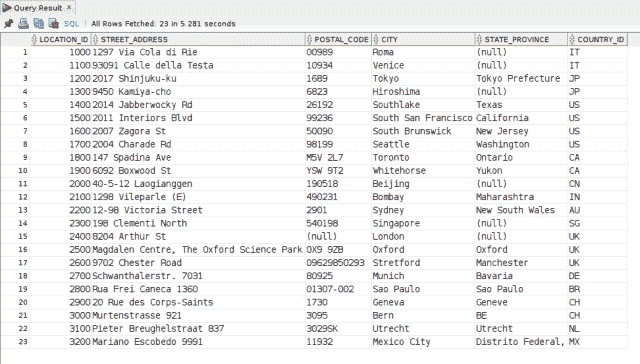
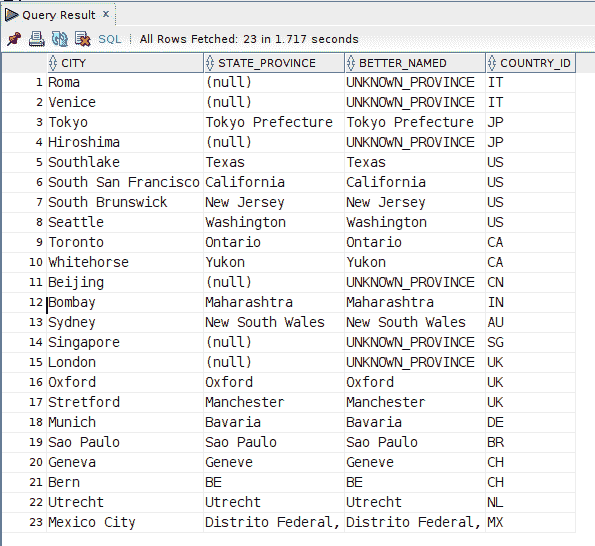
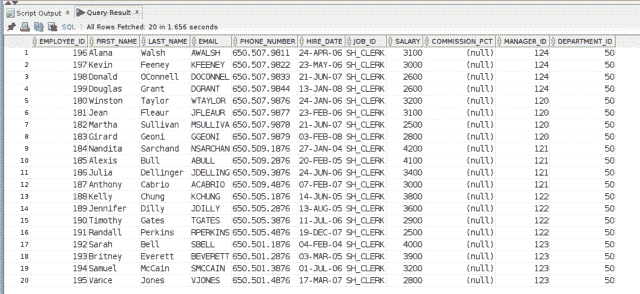
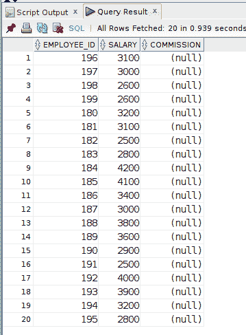
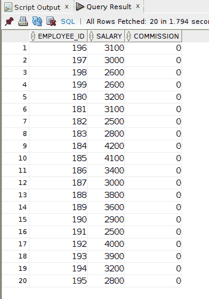
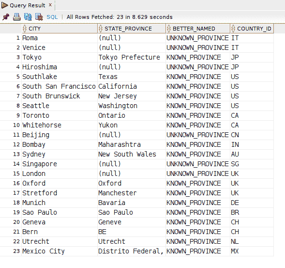
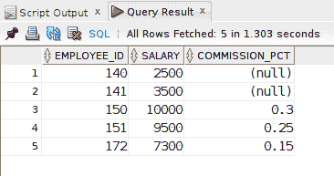
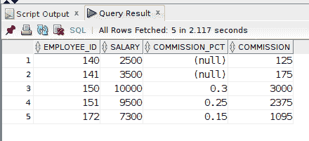

# 如何在 Oracle SQL 中使用 NVL 和 NVL2 函数

> 原文：<https://levelup.gitconnected.com/how-to-use-the-nvl-and-nvl2-functions-in-oracle-sql-digital-owls-prose-f3d89521972c>

作为一名 SQL 专业人员或开发人员，在某些时候，您将会遇到臭名昭著的值。`NULL`的可能非常棘手，直到你理解了一半。幸运的是，所有流行的 SQL 供应商都有不同的函数来帮助处理`NULL`。在本文中，我将介绍 Oracle 数据库中的两个这样的函数，`NVL()`和`NVL2()`。

自我推销:

如果你喜欢这里写的内容，尽一切办法，把这个博客和你最喜欢的帖子分享给其他可能从中受益或喜欢它的人。既然咖啡是我最喜欢的饮料，如果你愿意，你甚至可以给我买一杯！

对于本文中的示例，我使用的是众所周知的 Oracle **HR** 示例数据库。

**位置**表具有模拟地址信息，如以下查询和结果集所示:

位置表中的示例数据。

## Oracle NVL()函数

几行将`NULL`存储在**州 _ 省**列中。如果您要从这些数据中生成一个报告或其他终端用户显示，那么您最不想做的事情可能就是在结果中输出`NULL`。当然，你完全可以使用一个`CASE`表达式来提供一些更有意义的东西。

然而，这只是`NVL()`函数的一个用例(众多用例之一)。`NVL()`语法超级简单:

`NVL(expression_1, expression_2)`

使用`NVL()`，如果第一个表达式为`NULL`，则返回第二个表达式。否则，返回第一个表达式。

**专业提示:**两个参数都必须提供，并且应该是匹配的数据类型。

我坚持每周写一封关于我正在学习并感兴趣的 SQL/PHP 的邮件。如果这听起来像是你想参与的事情，请使用此[注册表格](https://digitalowlsprose.ck.page/1b35a06295)进行订阅。谢谢大家！

让我们编写一个查询，并为 **STATE_PROVINCE** 列显示' *UNKNOWN_PROVINCE* ，而不是`NULL`，其中该列为`NULL`。

NVL()函数允许您用一个值替换遇到的任何空值。

如查询结果所示， **STATE_PROVINCE** 列为`NULL`的地方，返回' *UNKNOWN_PROVINCE'* 。对于那些没有`NULL`的行，它们的原始列值被保留。

## 数学计算中的 Oracle NVL()函数

众所周知，涉及任何`NULL`值的数学计算总是返回`NULL`。为了*限制*发生这种情况，一种选择是利用像`NVL()`这样的函数，并在需要的地方使用替代值代替`NULL`，以便返回实际的数学计算结果。

为了获得更易于管理的数据集，我将对 **EMPLOYEES** 表进行过滤，只过滤那些带有‘SH _ CLERK’的 **JOB_ID** 的行:

JOB_ID 为' SH_CLERK '的雇员表。

我们可以看到所有的行都有`NULL`作为 **COMMISSION_PCT** 列。如果我们正在计算报告中每一行的佣金金额，这些行将显示普通的老掉牙的`NULL`:

COMMISSION_PCT 列值显示为 NULL 的行。

然而，使用`NVL()`，我们可以提供一个 0(零)数值(或其他值)以便进行计算。在本例中，*数学运算*返回 0(零),实际显示为:

在数学计算中使用 NVL()函数。

## Oracle NVL2()函数

`NVL()`的另一种选择是类似名称的`NVL2()`函数，它有 3 个参数:

`NVL2(expression, if_not_null, if_null)`

`NVL2()`允许返回一个值，无论第一个参数表达式的计算结果是否为`NULL`。

基于使用 **STATE_PROVINCE** 列的示例，在这个查询中，对于那些 **STATE_PROVINCE** 列值不是`NULL`的行，我们将使用`NVL2()`并显示“*KNOWN _ PROVINCE”*。与之前一样，具有`NULL`的行将显示“*未知 _ 省份*”:

使用 NVL2()函数，可以为空值和非空值指定返回值。

在这个结果集中，`NVL2()`根据所述行是否包含指定表达式的`NULL`，从 *if_not_null* 或 *if_null* 参数返回两个可用值中的一个。

## 数学计算中的 Oracle NVL2()函数

与`NVL()`示例数学计算一样，我们也可以在类似的意义上使用`NVL2()`。但是，有了`NVL2()`，我们有了更多的选择。

让我们访问下面的任意查询:

假设您想将任何行的 **COMMISSION_PCT** 应用于其**薪金**的计算。如果**工资**不是`NULL`，继续使用该值。然而，如果一行包含 **COMMISSION_PCT** 的`NULL`，无论如何都要应用一些值。在本例中，对任何具有`NULL` **的行应用值为 0.05 的 **COMMISSION_PCT** 。**

同样，在这种类型的查询中可以使用一个`CASE`表达式(以及其他方法)。然而，在我看来，使用`NVL2()`更简洁，但仍然提供了一点灵活性。

## Oracle NVL()和 NVL2()结束和进一步阅读

尽管这篇文章中的一些例子过于简单，但希望它们能为你提供如何在查询中使用`NVL()`和`NVL2()`的思路。

给我留言，告诉我你使用`NVL()`或`NVL2()`函数的一些有趣的方式。

*   [NVL()](https://www.oracletutorial.com/oracle-comparison-functions/oracle-nvl/) (异地链接)
*   [NVL2](https://www.oracletutorial.com/oracle-comparison-functions/oracle-nvl2/) ()(异地链接)

如果您有任何问题或在代码中看到任何不正确的地方，请在下面的评论部分留下评论。谢谢你。

## 你会喜欢类似的职位

*   [如何重命名 SQL 表](https://joshuaotwell.com/how-to-rename-an-sql-table/)(离线链接)
*   [如何使用 Oracle SQL Developer 插入数据](https://joshuaotwell.com/how-to-insert-data-using-oracle-sql-developer/)(非现场链接)
*   [使用案例表达式的动态 RPAD()函数— Oracle SQL 示例](https://joshuaotwell.com/dynamic-rpad-function-using-a-case-expression-oracle-sql-example/)(非现场链接)
*   [使用 Oracle SQL Developer 导入 CSV 文件](https://joshuaotwell.com/import-csv-file-with-oracle-sql-developer/)(非现场链接)

喜欢你读过的？看到什么不正确的吗？请在下面评论，感谢阅读！！！

# 行动的号召！

感谢你花时间阅读这篇文章。我真心希望你发现了一些有趣和有启发性的东西。请在这里与你认识的其他人分享你的发现，他们也会从中获得同样的价值。

访问 [Portfolio-Projects 页面](https://wp.me/P28ctb-3KD)查看我为客户完成的博客帖子/技术写作。

[**咖啡真好喝！给我拿个杯子！**](https://ko-fi.com/joshlovescoffee)

要在最新的博客文章发表时收到来自本博客(“数字猫头鹰散文”)的电子邮件通知(绝不是垃圾邮件)，请点击“点击订阅！”按钮在首页的侧边栏！(如有任何问题，请随时查看 [Digital Owl 的散文隐私政策页面](https://wp.me/P28ctb-3gI):电子邮件更新、选择加入、选择退出、联系表格等……)

请务必访问[“最佳”](https://joshuaotwell.com/where-blog_post-in-digital-owls-prose-best-of/)页面，收集我的最佳博客文章。

[Josh Otwell](https://joshuaotwell.com/about/) 作为一名 SQL 开发人员和博客作者，他热衷于学习和成长。其他最喜欢的活动是让他埋头于一本好书、一篇文章或 Linux 命令行。其中，他喜欢桌面 RPG 游戏，阅读奇幻小说，并与妻子和两个女儿共度时光。

免责声明:本文中的例子是关于如何实现类似结果的假设。它们不是最好的解决方案。所提供的大多数(如果不是全部)示例都是在个人发展/学习工作站环境中执行的，不应被视为生产质量或就绪。您的特定目标和需求可能会有所不同。使用那些最有利于你的需求和目标的实践。观点是我自己的。

*原载于 2021 年 7 月 7 日 https://joshuaotwell.com***。**