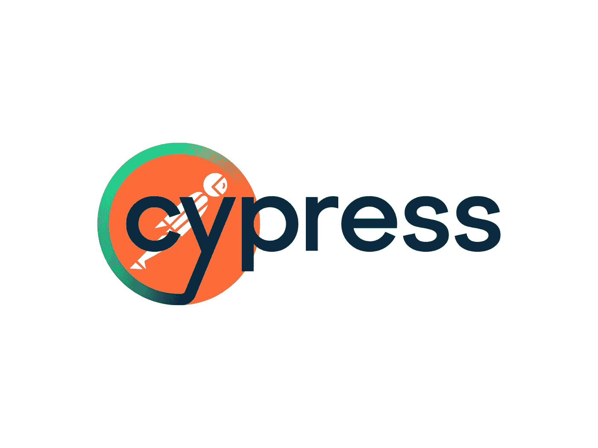
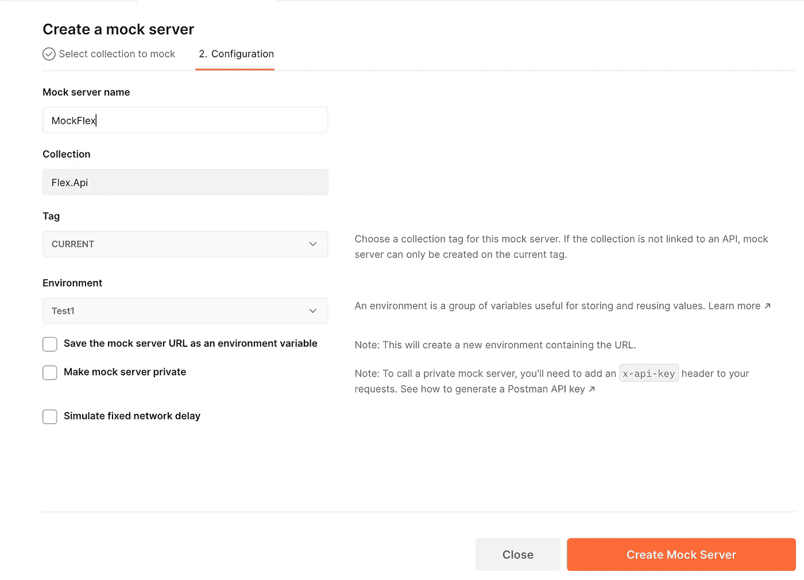
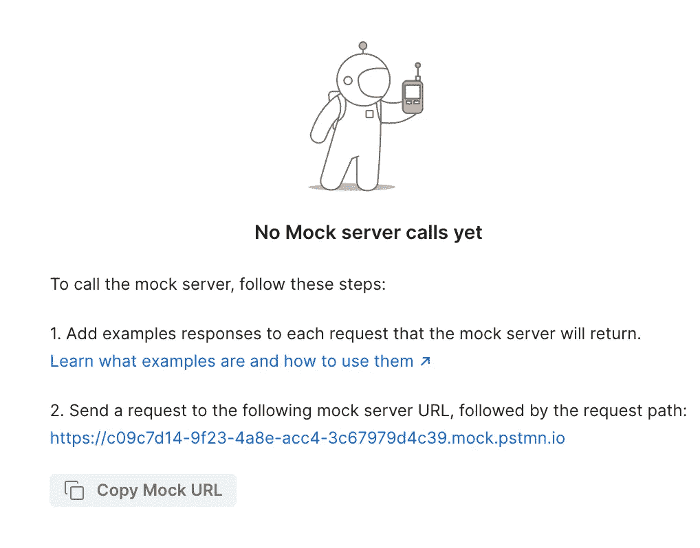
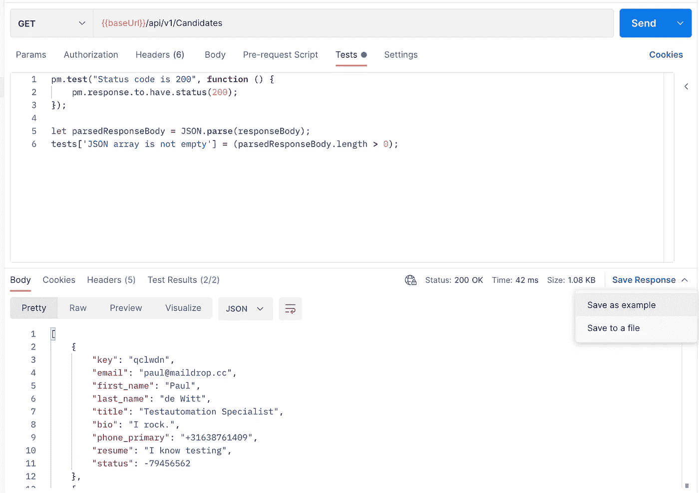
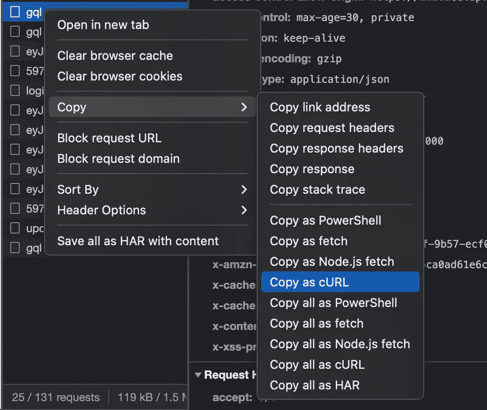

# 如何在 Cypress 中使用邮递员模拟服务器

> 原文：<https://levelup.gitconnected.com/how-to-use-the-postman-mock-server-in-cypress-2524b46e4fb4>

# 将邮递员与柏树融为一体



如果你看过[我关于如何用 Cypress 编写隔离前端测试的演讲](https://youtu.be/j2toLZcBbWI)，你就会知道我是如何使用 fixtures 来存根 API 响应的。

但是您知道您还可以在 Cypress 中使用您的邮递员模拟数据吗？

# 《邮差》里的嘲讽很容易。

你必须建立一个模拟服务器。只需点击几下鼠标就能完成！所以在 Postman 应用程序中使用它是不言自明的。但不幸的是， [Postman 文档](https://learning.postman.com/docs/designing-and-developing-your-api/mocking-data/mock-with-api/)没有解释如何将其与其他工具集成。所以如果你和我一样在苦苦挣扎，我会帮你整合《邮差》和《赛普拉斯》。



# 您可以基于新的或现有的集合创建一个模拟服务器。

模拟服务器获得一个惟一的 URL，我们将用它来连接 Cypress。您创建的所有端点和模拟都应该在这个集合中。根据端点的数量，我建议在 Postman 集合中创建一个可读的文件夹结构。纯粹出于维护和可读性的目的。



# 保存示例

在 Postman 中执行一个测试用例之后，您可以将响应保存为一个例子。作为我们集合的一部分，这个例子将作为我们的模拟。



# Postman 使用一种算法来决定哪个例子属于你的请求。

这个[算法](https://learning.postman.com/docs/designing-and-developing-your-api/mocking-data/matching-algorithm/)考虑了多个因素，例如:

*   如果响应的格式正确，
*   如果 HTTP 方法匹配，
*   如果 URL(及其路径)匹配，并且
*   如果标题匹配。

> 您还可以使用特定的定制模拟头(例如，“x-mock-response-name”)和通配符。但即使没有这些，也有可能让一切正常运转。

# 更正格式化的响应

这听起来很简单，对吗？我来告诉你；这是我做错的第一件事。

在 Postman 中，可以测试 REST APIs 和 GraphQL。你可以选择一种非常格式化的方式来写它的主体。这是棘手的部分:邮递员为你美化它。但是，当您启动 API 时，请求数据是原始的，没有经过美化。所以你的要求也不应该。例如，我正在测试 GraphQL，我美化过的请求中没有一个与任何存根匹配。

如果它是一个原始端点，您可以通过浏览器的 DevTools 调用，您可以打开 Network 选项卡，将请求复制为 **cURL BASH** 语法。



转到你的邮差收藏，选择“导入”，作为原始文本导入。现在，粘贴你的卷发。接下来，单击 import，您可以看到请求以原始格式导入。现在运行它，并将响应保存为示例。现在你有你的第一个模拟！

# 将它与柏树融为一体

现在我们已经在 Postman 中进行了初始设置，让我们转到我们的前端存储库，将 API 调用定向到我们的模拟服务器。

对于本例，我将它设置为. env 文件中的环境变量:

```
POSTMAN_MOCK_SERVER_URL=[https://c09c7d14-9f23-4a8e-acc4-3c67979d4c39.mock.pstmn.io](https://c09c7d14-9f23-4a8e-acc4-3c67979d4c39.mock.pstmn.io)
```

就是这样！

# 现在我们准备编写我们的第一个测试。

主要目标是拦截 API 调用并验证其响应。这可能看起来像这样:

```
cy.intercept({
  method: 'GET',
  url:'[https://c09c7d14-9f23-4a8e-acc4-3c67979d4c39.mock.pstmn.io](https://c09c7d14-9f23-4a8e-acc4-3c67979d4c39.mock.pstmn.io)',
}).as('getMock');cy.get('doSomething').click();cy.wait('@getMock').its('request.headers').should('have.property',
'referer', 'http://localhost:8000/define-exact-path');
```

# 你的回应很可能会失败。

这与 CORS 误差有关。您在本地主机上运行应用程序，而 Postman 在云中运行。为了解决这个问题，我们需要为 Postman 中的请求设置两个头:

*   起源，以及
*   推荐人

来源指明发送请求的来源。这不是 localhost，而是启动 API 的官方域。例如:'https://www.medium.com/path-to-page'。

Referer 包含发送请求的地址。对我们来说，这就是:‘http://localhost:3000/path-to-page’。

现在，重新运行您的测试场景，并且:

# 一切正常！

就这样，伙计们！现在，您有了一个工作设置。剩下唯一要做的就是在 Postman 中添加更多的请求和例子，这样我们就可以创建多个测试用例。但是，请记住 Postman 算法，不要忘记以原始格式导入请求，也不要忘记每次都添加额外的头。这些是你成功的关键因素。

## 参考

[](https://learning.postman.com/docs/designing-and-developing-your-api/mocking-data/mock-with-api/) [## 与邮差一起嘲讽 API |邮差学习中心

### 用 Postman API 模仿:Postman 的文档，API 开发的协作平台。创造更好的…

learning.postman.com](https://learning.postman.com/docs/designing-and-developing-your-api/mocking-data/mock-with-api/) [](https://learning.postman.com/docs/designing-and-developing-your-api/mocking-data/matching-algorithm/) [## 了解示例匹配|邮差学习中心

### 理解示例匹配:Postman 文档，API 开发的协作平台。创建…

learning.postman.com](https://learning.postman.com/docs/designing-and-developing-your-api/mocking-data/matching-algorithm/) 

# 分级编码

感谢您成为我们社区的一员！更多内容见[级编码出版物](https://levelup.gitconnected.com/)。
跟随:[推特](https://twitter.com/gitconnected)，[领英](https://www.linkedin.com/company/gitconnected)，[通迅](https://newsletter.levelup.dev/)
**升一级正在改造理工大招聘➡️** [**加入我们的人才集体**](https://jobs.levelup.dev/talent/welcome?referral=true)