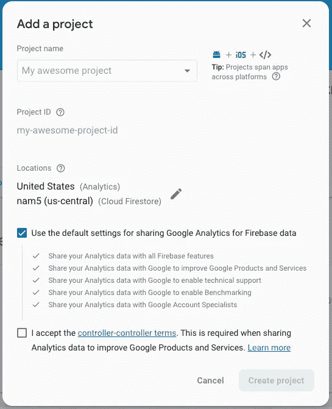
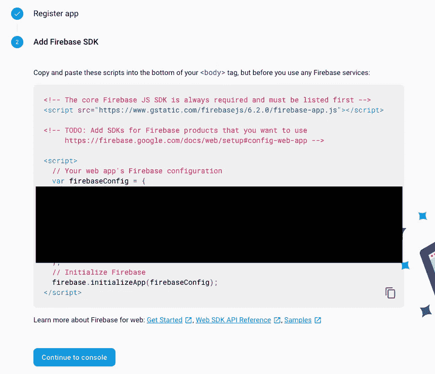
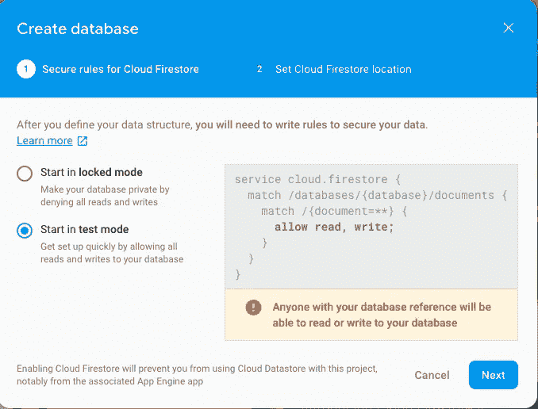
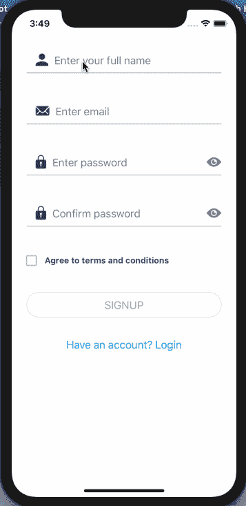
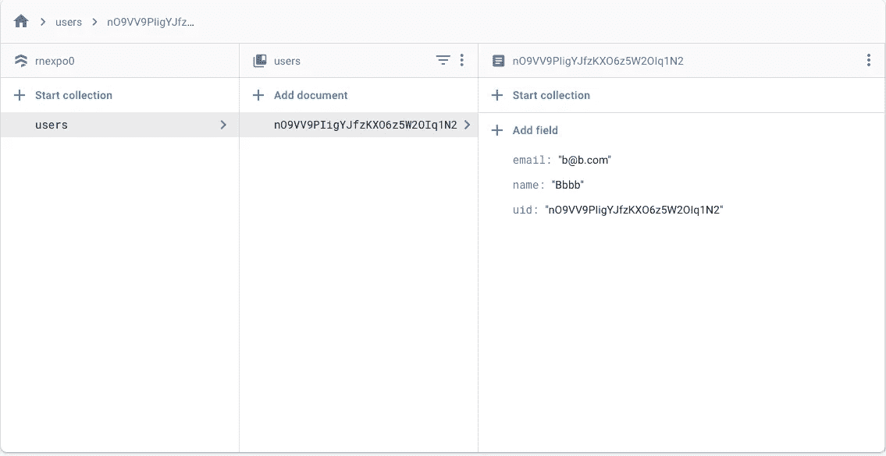
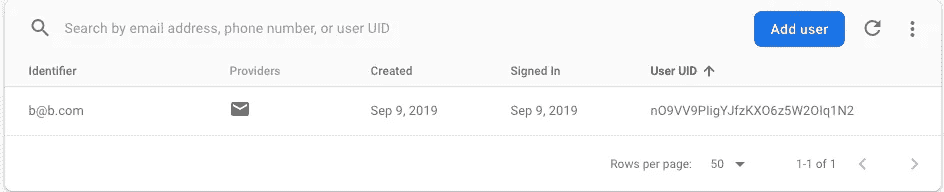
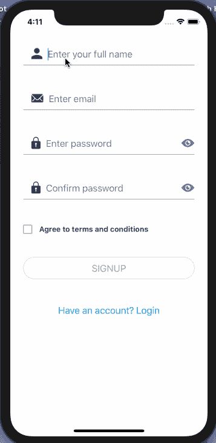
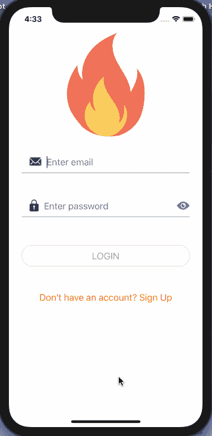

# 如何使用 React 上下文 API 构建 React 本机、Expo 和 Firebase 应用程序

> 原文：<https://levelup.gitconnected.com/how-to-use-the-react-context-api-to-build-react-native-expo-and-firebase-apps-adda840e52b0>

React 上下文 API 允许您避免在组件树的每一层将属性从父级传递到子级。它允许您使用 Redux 等状态管理库向应用程序添加全局状态，而无需增加代码库的复杂性。在 React Native 或 Expo 应用程序中使用带有上下文 API 的 Firebase 身份验证和存储服务是一个很好的尝试用例。

在本教程中，我将向您展示如何使用上下文 API 在 Expo 应用程序中设置 Firebase 电子邮件身份验证。在我们开始之前，请注意我将使用一个 Expo 项目，它具有:

*   [导航设置同](https://amanhimself.dev/authentication-navigation-flow-in-react-native-apps) `[react-navigation](https://amanhimself.dev/authentication-navigation-flow-in-react-native-apps)` [4.x.x](https://amanhimself.dev/authentication-navigation-flow-in-react-native-apps)
*   缓存本地图像/资产
*   [使用 formik 和 yup 登录并注册屏幕设置](https://amanhimself.dev/build-validate-forms-with-react-native-formik-yup)
*   [用 formik 和 yup 处理 React 原生表单中的不同字段类型](https://amanhimself.dev/handle-different-field-types-in-react-native-forms)

在开始之前，您可以从这个 Github repo 下载当前状态的源代码。

安装源代码后，请在项目目录中导航，并通过运行以下命令安装依赖项:

> *如果你有兴趣用 Redux 来管理邮箱认证，用 Firebase、Firestore、React Native、Expo 来存储用户的数据，可以参考我以前的一篇帖子* [***这里***](https://amanhimself.dev/how-to-build-an-email-authentication-app-with-firebase-firestore-and-react-native) *。*

# 目录

*   要求
*   添加 Firebase 配置并集成 Firebase SDK
*   启用 Firestore
*   添加上下文 API
*   向 Firebase 注册
*   处理实时/服务器错误
*   登录 Firebase 用户
*   添加注销按钮
*   检查自动登录的用户身份验证状态
*   结论

# 要求

要遵循本教程，请确保您的本地开发环境中安装了以下库，并且可以访问下面提到的服务。

*   安装了 npm/yarn 的节点(> = `10.x.x`)
*   expo-cli (>= `3.x.x`)(以前称为 create-react-native-app)
*   Firebase 账户，免费层就可以了

*如果你正在寻找通过实现钩子来升级你的 React 原生应用并且想要开始，在这里* *查看帖子* [***，它解释了如何在 React 原生应用中使用* `*useState*` *和* `*useEffect*` *。***](https://www.instamobile.io/mobile-development/react-native-hooks/)

# 添加 Firebase 配置并集成 Firebase SDK

> 如果你已经知道如何获得 Firebase API 和存储密钥，你可以跳过这一节。否则，你可以跟着走

从 [Firebase 控制台](https://console.firebase.google.com)创建一个新的 Firebase 项目。

接下来，填写关于 Firebase 项目的适当细节，并单击 Create project 按钮。

您将被重定向到 Firebase 项目的仪表板。从工具条菜单进入项目设置，复制`firebaseConfig`对象。它有我们需要的所有必要的 API 键，以便使用 Firebase 项目作为任何 React Native 或 Expo 应用程序的后端。

接下来，进入 [Expo app](https://github.com/amandeepmittal/expo-firebase/releases/tag/0.5.0) 内部，创建一个名为`config`的新目录。该文件夹将包含所有配置文件。在其中，创建`Firebase/firebaseConfig.js`文件并粘贴 config 对象的内容，如下所示。

接下来，从终端窗口安装 Firebase SDK。

回到`config/Firebase/`目录。创建一个新文件`firebase.js`。这将包含与集成 Firebase SDK 相关的所有配置以及它提供的身份验证功能——实时数据库等等。

同样，用一些您将在教程中使用的初始方法定义一个`Firebase`对象。这些方法将执行实时事件，如用户身份验证、从应用程序中注销，并基于对名为 Cloud Firestore 的实时 NoSQL 数据库中的`uid`(*Firebase 为每个注册用户创建的唯一用户 id*)的引用来存储用户详细信息。

这种与 React 的上下文 API 一起使用的方法将消除 Redux 状态管理(这是我以前在**中使用的方法)库的使用，并简单地使用 React 原则。用上下文填充`Firebase`对象，你将能够访问所有的功能，以及作为道具的 React 本地应用程序中的用户。**

# **启用 Firestore**

**Firebase 提供了两种基于云的数据库服务。一个叫做云 Firestore，另一个叫做实时数据库。实时数据库将数据存储为一棵大型 JSON 树。复杂且可扩展的数据很难在其中组织。**

**在存储数据时，Cloud Firestore 遵循适当的 NoSQL 术语。它将数据存储在文档中，每个文档都可以有子集合——因此，它适用于可伸缩的复杂数据场景。**

**返回 Firebase 控制台，在数据库部分，选择云 Firestore 并单击按钮 Create database。**

****

**然后，选择“在测试模式下启动”选项，并单击“下一步”按钮，如下所示。**

****

# **添加上下文 API**

**在 React 原生应用中使用上下文 API 的常见原因是，您需要在组件树的不同位置或组件中共享一些数据。手动传递道具既乏味又难以跟踪。**

**上下文 API 由三个构件组成:**

*   **创建上下文对象**
*   **声明提供值的提供者**
*   **声明允许消费值的消费者(由提供者提供**

***在`Firebase`目录下创建一个名为`context.js`的新文件。声明一个将要成为对象的`FirebaseContext`。***

***创建上下文后，下一步是声明提供者和消费者。***

***最后，让我们声明一个特设(*高阶组件*)来概括这个 Firebase 上下文。React 中的 HoC 是一个接受一个组件并返回另一个组件的函数。这个 HoC 要做的不是在每个必要的组件中导入和使用`Firebase.Consumer`，所有要做的只是将组件作为参数传递给下面的 HoC。***

***在下一节中，当用这个 HoC 修改现有的`Login`和`Signup`组件时，你会更加清楚地理解。现在，创建一个新文件`index.js`来从`firebase.js`文件中导出`Firebase`对象、提供者和特设。***

***提供者必须从上下文对象中获取值，以便消费者使用该值。这将在`App.js`文件中完成。`FirebaseProvider`的值将是具有不同策略和功能的`Firebase`对象，用于在实时数据库中验证和存储用户数据。用它包住`AppContainer`。***

***这就是设置 Firebase SDK 的全部内容。***

# ***向 Firebase 注册***

***在本节中，您将修改现有的`Signup.js`组件，以便在 firebase 后端注册一个新用户，并将他们的数据存储在 Firestore 中。首先，导入`withFirebaseHOC`。***

***用`handleOnSignup()`替换`handleSubmit()`方法。因为所有的输入值都来自 Formik，所以您也必须在`Formik`元素上编辑`onSubmit` prop。`signupWithEmail`来自 firebase props，因为您已经用`FirebaseProvider`包装了导航容器，`this.props.firebase`将确保文件`config/Firebase/firebase.js`中的`Firebase`对象内的任何方法都可以在该组件中使用。***

***`signupWithEmail`方法有两个参数，`email`和`password`，使用它们，它创建一个新用户并保存他们的凭证。然后，在创建新用户时，它从响应中获取用户 id ( `*uid*`)。`createNewUser()`方法将用户对象`userData`存储在集合`users`中。这个用户对象包含来自身份验证响应的`uid`、注册表单中输入的用户的姓名和电子邮件。***

***保存用户对象的逻辑如下:***

***最后，不要忘记导出`withFirebaseHOC`中的`Signup`组件。***

***让我们看看它是如何工作的。***

******

***因为它将出现在主屏幕上，意味着用户正在注册。要验证这一点，请访问 Firebase 控制台仪表板的数据库部分。您会发现一个`users`集合中有一个带有`uid`的文档。***

******

***要验证`uid`，请访问认证部分。***

******

# ***处理实时/服务器错误***

***为了处理实时或服务器错误，Formik 有一个解决方案。现在，要明白在客户端有效的东西在服务器端可能是无效的。例如，当使用 Firebase 存储中已经存在的电子邮件注册新用户时，应该通过抛出错误来通知客户端的用户。***

***为了解决这个问题，在`Formik`元素编辑`onSubmit`属性，绕过第二个参数`actions`。***

***接下来，不是仅仅在控制台记录错误值，而是显示错误，您将必须使用`setFieldError`。这将在`catch`块中设置一条错误信息。另外，添加一个`finally`块，它将避免表单在出错时被提交。***

***最后，在应用程序屏幕上显示错误，在`FormButton`组件后添加一个`ErrorMessage`。***

***现在回到应用程序中的注册表单，尝试使用上一步中使用的相同电子邮件 id 注册用户。***

******

***瞧吧！管用！显示错误消息，并且不提交表单。***

# ***登录 Firebase 用户***

***与上一节一样，必须执行类似数量的步骤，登录表单才能工作。这里是完整的`Login`组件，而不是逐个介绍。***

***让我们看看它是如何工作的。要成功登录，请使用注册的凭据。***

# ***添加注销按钮***

***在这一点上退出按钮是必不可少的，但由于现在没有应用程序界面，我将在主屏幕上放一个简单的按钮。打开，`Home.js`文件，从`react-native-elements`导入`Button`。***

***此外，导入`withFirebaseHOC`并在文本下方添加`Button`组件。***

***这是输出。***

******

***现在，这个按钮不能做任何事情。您必须添加如下的`handleSignout`方法。***

***返回主屏幕并登录应用程序。显示主屏幕后，点击按钮`Signout`。***

******

# ***检查自动登录的用户身份验证状态***

***现在，每当用户成功登录或注册时，它确实会导致应用程序的主屏幕，但在刷新模拟器时，导航模式会回到登录屏幕。***

***在本节中，您将使用 Firebase 方法`onAuthStateChanged()`添加一个小的身份验证检查，如果当前用户已经登录，该方法将当前用户作为参数。***

***当应用程序加载资产，即`Initial`屏幕组件时，auth 检查将在同一点进行。它已经被挂在导航模式中作为第一个屏幕或初始路线。***

***使用`Initial.js`内部的生命周期方法，可以检查用户是否登录应用的认证状态。***

***从导入文件`screens/Initial.js`中的 Firebase HoC 开始。***

***接下来，在`componendDidMount`方法中添加以下内容。如果用户先前已经登录，导航流将直接把用户带到主屏幕。如果未登录，它将显示登录屏幕。***

***让我们看看它的实际应用。即使在刷新应用程序后，经过身份验证的用户仍保持登录状态。***

******

# ***结论***

****祝贺你！🎉****

***如果你已经走了这么远，我希望喜欢阅读这篇文章。这些是我在任何**Firebase+React Native+Expo**项目中尝试遵循的一些策略。我希望本教程中使用的任何代码库对您有所帮助。***

***要找到完整的代码，你将不得不访问 [**这个 Github 回购发布**](https://github.com/amandeepmittal/expo-firebase/releases/tag/0.6.0) **。*****

> ***如果你有兴趣用 Firebase 和 React Native 构建更多的实时认证特性，请查看下面关于用 Firebase 和 React Native 设置电话认证的帖子。***

*** [## 如何在 React Native 中设置 Firebase 电话认证

### 使用电话号码和唯一的短信验证码登录移动应用程序是最常见的模式之一…

www.instamobile.io](https://www.instamobile.io/mobile-development/firebase-phone-authentication-react-native/)*** 

*****我经常在 Nodejs、Reactjs、React Native 上写。*****

***你可以访问我的博客[**aman his . dev**](https://amanhimself.dev/)**获取更多 React 本地教程，或者你可以订阅 [**每周简讯**](https://tinyletter.com/amanhimself) 直接在你的收件箱中接收所有新帖子和内容的更新💌。*****

******原载于* [*我的个人博客*](https://amanhimself.dev/)*****