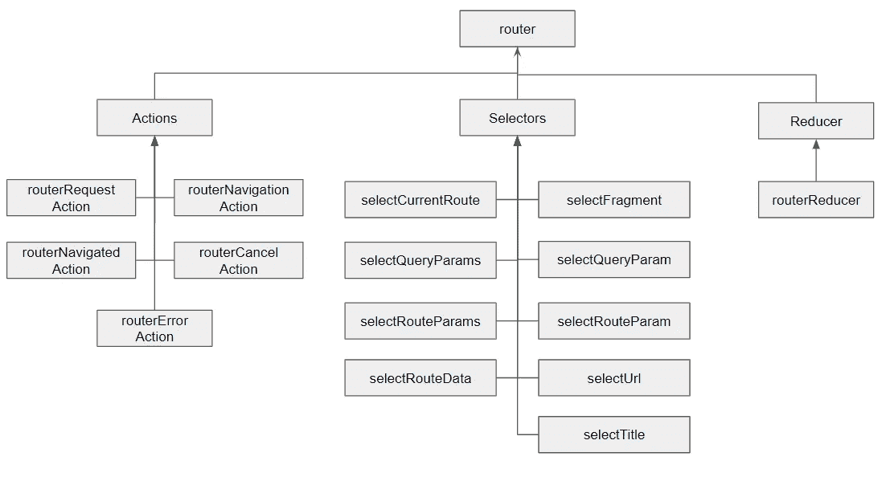

# 如何使用 NgRx 中的路由器存储

> 原文：<https://levelup.gitconnected.com/how-to-use-the-router-store-in-ngrx-24f6ae37290a>



# NgRx 中路由器存储的目的是什么？

正如我在[上一篇关于 NgRx](/ngrx-explained-3891da35eeea) 的文章中所解释的，NgRx 的目的是分离我们前端应用程序的数据管理部分，以便代码更容易管理。我们不必使用发射器和输入来在组件之间传递数据，但是我们使用动作和选择器直接引用 NgRx 存储来满足任何数据需求。而有时候我们需要的数据就是来自路由器，比如路由的标题。我们肯定可以创建`states`和`selectors`来使用正常的 NgRx 方式检索数据，但是，NgRx 提供了[路由器存储库](https://ngrx.io/guide/router-store)来使检索导航数据变得更容易。

但是，请注意，来自路由器存储的所有数据实际上都可以在 [ActivateRoute](https://angular.io/api/router/ActivatedRoute) 中找到。但是如果您已经在使用 NgRx，那么从 ActivatedRoute 获取路线数据就违背了将数据从用户界面中分离出来的目的。

# 装置

```
ng add @ngrx/router-store@latest
```

# 使用

> 请注意，`@ngrx/store`是必需的，`@ngrx/router-store`是一个附加组件，并不是独立的。

将`StoreRouterConnectingModule.forRoot()`添加到模块的`imports`数组中。当您执行上面的安装命令时，应该已经完成了。

然后添加一个新文件`router.selectors.ts`到你所有其他 NgRx 文件的同一个文件夹中。

```
import { getSelectors, RouterReducerState } from '@ngrx/router-store';// `router` is used as the default feature name. You can use the feature name
// of your choice by creating a feature selector and pass it to the `getSelectors` function
// export const selectRouter = createFeatureSelector<RouterReducerState>('yourFeatureName');export const {
  selectCurrentRoute, // select the current route
  selectFragment, // select the current route fragment
  selectQueryParams, // select the current route query params
  selectQueryParam, // factory function to select a query param
  selectRouteParams, // select the current route params
  selectRouteParam, // factory function to select a route param
  selectRouteData, // select the current route data
  selectUrl, // select the current url
  selectTitle, // Select the title if available
} = getSelectors();
```

上述代码也可以在 NgRx 路由器官方商店页面上找到—[https://ngrx.io/guide/router-store/selectors](https://ngrx.io/guide/router-store/selectors)。这提供了路由器存储中所有可用的选择器来获取您需要的导航数据。

然后，您可以在组件中订阅您需要的选择器并显示它。例如，如果您只想从 router-store 中获取标题，那么您可以从`store`中订阅`selectTitle`选择器，并在收到数据时将它分配给一个局部变量(在我们的例子中也称为`title`)。

```
export class ChildComponent implements OnInit { title?: string;

  constructor(private store: Store) { } ngOnInit(): void {
  	this.store.select(selectTitle).subscribe(title => this.title = title);
  }}
```

然后在 html 模板中显示出来。

```
<b>Title: </b><div *ngIf="title"></div>
```

我的 [NgRxRouterDemo](https://github.com/thecodinganalyst/NgRxRouterDemo) 上有一个其他选择器的工作演示。