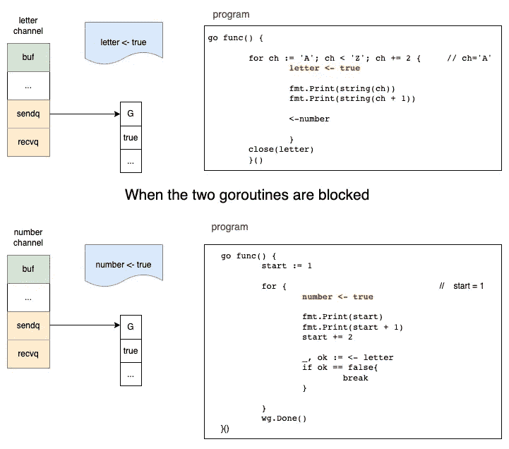
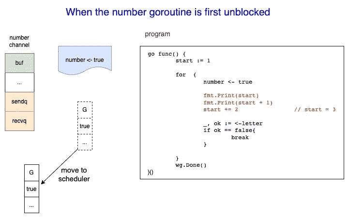
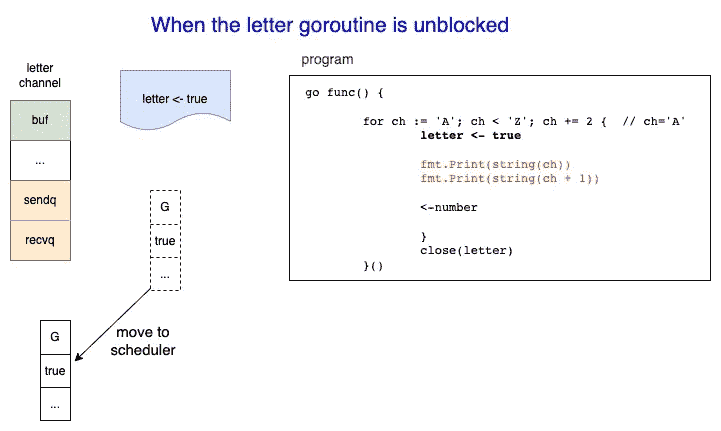

# 如何使用两个 Goroutines 交替打印序列

> 原文：<https://levelup.gitconnected.com/how-to-use-two-goroutines-to-print-the-sequence-alternately-5655da5881f5>

## 理解 Go 频道的一个例子

以下是一个与 Go Goroutines 相关的经典面试问题。这是理解**频道**和 **Goroutines** 的绝佳例子。

# 问题陈述

请使用两个 Goroutines 交替打印序列；一个打印数字，另一个打印字母。最终结果如下:

```
12AB34CD56EF78GH910IJ1112KL1314MN1516OP1718QR1920ST2122UV2324WX2526YZ2728
```

# 解决办法

解决办法很简单。这是完整的代码。

它使用两个**通道**和两个 **Goroutines** 来控制打印进度。

*   第一个 Goroutine 负责打印字母，第二个负责打印数字。
*   第一个 Goroutine 将按顺序打印字母，第二个将按顺序打印数字。
*   两个 Goroutine 将被阻塞，直到另一个 go routine 打印完前一个字母或数字。
*   第一个 Goroutine 最后会关闭字母通道，第二个会关闭数字通道。
*   主 Goroutine 将等待两个 go routine 完成并打印一个新行。

有两点值得注意。

## 第一点:当 goroutines 被阻塞时



数字和字母交替打印顺序

两个 Goroutines 在开始时被阻塞，因为在无缓冲通道上没有接收动作。当有人从某个渠道收到一个项目时，Goroutine 将解除阻止。

## 第二点:当 goroutines 被解除封锁时



号码 goroutine 已解锁



goroutine 这封信是畅通的

解除封锁 Goroutine 是什么意思？这意味着 Goroutine 被转移到运行时调度器中，并将很快执行。

发现这篇文章很有用👏？看看我下面的其他文章吧！

[](/how-does-golang-channel-works-6d66acd54753) [## Golang 频道是如何工作的

### 了解戈朗通道的内部运作

levelup.gitconnected.com](/how-does-golang-channel-works-6d66acd54753) [](/8-highest-voted-golang-questions-and-answers-on-stackoverflow-9478e99bab4e) [## StackOverflow 上 8 个投票最高的 Golang 问题和答案

### 挑选关于 Golang 编程语言堆栈溢出的投票最高的问题和答案

levelup.gitconnected.com](/8-highest-voted-golang-questions-and-answers-on-stackoverflow-9478e99bab4e) [](/go-programming-copy-function-explained-d0493c4a9800) [## 编程|复制功能说明

### 内置的复制功能用于将元素从一个源片复制到另一个目标片。

levelup.gitconnected.com](/go-programming-copy-function-explained-d0493c4a9800)