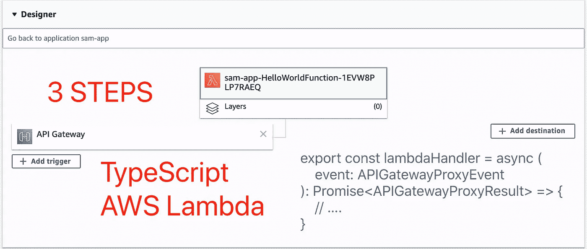
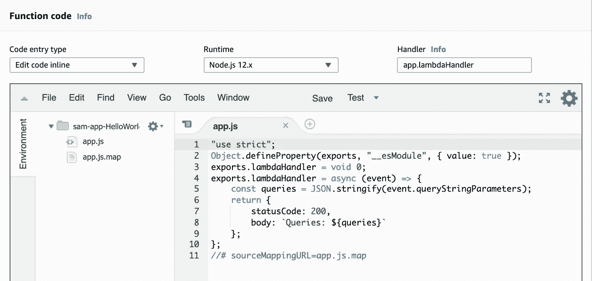

# 如何在 3 个步骤中使用 AWS Lambda 的 TypeScript

> 原文：<https://levelup.gitconnected.com/how-to-use-typescript-for-aws-lambda-in-3-steps-1996243547eb>



# AWS Lambda/NodeJS(类型脚本)系列

1.  [如何在 3 个步骤中使用 AWS Lambda 的 TypeScript](/how-to-use-typescript-for-aws-lambda-in-3-steps-1996243547eb)
2.  [TypeScript 中 AWS Lambda/NodeJS 的单元测试和集成测试](https://medium.com/@zijing/unit-test-and-integration-test-for-aws-lambda-nodejs-in-typescript-2235a0f69f5)

# 情况

当我们使用 NodeJS 作为 AWS Lambdas 的运行时，JavaScript 是默认语言。然而，由于 JavaScript 中缺乏类型检查，不时会有错误代码被不经意地部署到 Lambda 中。比如这样一个小小的错别字:

```
exports.lambdaHandler = async (event, context) => {

  **const** queries = event.que**yt**StringParameters;

  *// ...* }
```

我们本想得到`que**ry**StringParameters`，但是由于粗心大意`queries`最终变成了`undefined`。

# 目标

我们希望利用 TypeScript 来编写 lambda 处理程序。使用 TypeScript，我们将获得以下好处:

1.  编程时的普通代码完成提示
2.  编译时错误检查以避免冗余部署

这并不难做到，本文将介绍完成这项工作的 3 个步骤。

# 准备

在经历这 3 个步骤之前，让我们用 [SAM CLI](https://docs.aws.amazon.com/serverless-application-model/latest/developerguide/serverless-sam-cli-install.html) 创建一个经典 lambda 项目:

```
sam init
```

在上面的命令之后，我们将得到一个包含这些文件的文件夹:

```
├── README.md
├── events
│   └── event.json
├── hello-world
│   ├── app.js
│   ├── package.json
│   └── tests
│       └── unit
│           └── test-handler.js
└── template.yaml
```

然后我们就开始把这个 JS 包转移到 TS 包。

# 步骤 1:添加 TypeScript 依赖项

在`package.json`中，添加以下代码:

```
"scripts": {
  "compile": "tsc"
},
"devDependencies": {
  "aws-sdk": "^2.655.0",
  "@types/aws-lambda": "^8.10.51",
  "@types/node": "^13.13.5",
  "typescript": "^3.8.3"
}
```

*   **脚本/编译**:这将用于将类型脚本代码编译成 JavaScript
*   **devDependencies** :由于这只是为了开发，我们不需要将包添加到`dependencies`块中
*   **aws-sdk** :取决于你是否在 lambda 中使用 AWS SDK
*   这对于代码完成和类型检查来说是非常重要的
*   **@types/node** :内置类型需要这个包
*   **打字稿**:其中`tsc`来自

> 如果你觉得这篇文章有用，请关注这个帐户，以便将来更新。感谢支持！

# 第二步:添加`tsconfig.json`

```
{
  "compilerOptions": {
    "module": "CommonJS",
    "target": "ES2017",
    "noImplicitAny": true,
    "preserveConstEnums": true,
    "outDir": "./built",
    "sourceMap": true
  },
  "include": ["src-ts/**/*"],
  "exclude": ["node_modules", "**/*.spec.ts"]
}
```

TypeScript 编译器需要`tsconfig.json`来弄清楚如何将 TypeScript 转换成 JavaScript。

*   **模块** : *普通*这里没问题
*   **目标**:应用 *ES2017* 将保留`async`和`await`语法，而不是将其转换为`Promise`代码。因为我们使用 Node12 作为运行时环境，所以 Lambda 函数支持解释语法。同时，保持`async`和`await`使得代码简洁明了
*   **无注入**:推荐有。如果有一个变量没有类型声明，编译器将抛出一个错误
*   **preserve constanums**:更像是一个语法糖，但是我想继续使用它，因为它可以在 JavaScript 代码中以`object`的形式保存`enum`类，这有助于理解 JavaScript 代码
*   **outDir** :您想要设置为编译输出的任何文件夹
*   这个是可选的

# 第三步:修改代码

首先，创建文件夹`src-ts`，并将`app.js`移动到该文件夹。

`app.js`现在看起来是这样的:

```
exports.lambdaHandler = **async** (event, context) => {
  **const** queries = ***JSON***.stringify(event.queytStringParameters);
  **return** {
    **statusCode**: 200,
    **body**: **`Queries:** ${queries}**`** }
};
```

让我们创建`app.ts`并替换它:

```
**import** { 
  APIGatewayProxyEvent, 
  APIGatewayProxyResult 
} **from "aws-lambda"**;**export const** *lambdaHandler* = **async** (
  event: **APIGatewayProxyEvent**
): Promise<**APIGatewayProxyResult**> => {
  **const** queries = ***JSON***.stringify(event.**queryStringParameters**);
  **return** {
    **statusCode**: 200,
    **body**: **`**Queries**:** ${queries}**`** }
}
```

由于这个 TypeScript 文件将被编译到`built`文件夹中，我们还需要修改`template.yaml`中的`Handler`字段，以确保`lambda`资源可以在正确的路径中定位代码:

```
**Resources**:
  **HelloWorldFunction**:
    **Type**: AWS::Serverless::Function**Properties**:
      **CodeUri**: hello-world/built
      **Handler**: app.lambdaHandler
```

我们在文件夹`hello-world`后面添加了路径`built`，这样 AWS Lambda 就可以正确地找到处理程序。

现在，该目录如下所示:

```
├── README.md
├── **hello-world**
│   ├── **built**
│   │   ├── app.js
│   │   └── app.js.map
│   ├── package-lock.json
│   ├── package.json
│   ├── **src-ts**
│   │   ├── app.ts
│   │   └── tests
│   └── tsconfig.json
├── samconfig.toml
└── template.yaml
```

# **部署和测试**

```
cd hello-world
npm install
npm run compile
cd ..
sam deploy --guided
```

部署成功后，我们将在 AWS 控制台中看到 Lambda 函数，如下所示:



我们应该能够使用以下命令测试 Lambda 函数:

```
▶ curl https://[API_ID].amazonaws.com/Prod/hello\?weather\=sunny
Queries: {"weather":"sunny"}
```

# 结论和下一步

示例代码可以在[https://github.com/zijing07/aws-lambda-nodejs-ts](https://github.com/zijing07/aws-lambda-nodejs-ts)找到

在为我的 Lambda 函数利用了 TypeScript 支持之后，我发现这真的令人耳目一新。一方面，它可以节省我在 API 文档中查找方法名或参数列表的大量时间。另一方面，`tsc`也帮助我在部署之前检测到任何潜在的问题。

在[下一篇文章](https://medium.com/@zijing/unit-test-and-integration-test-for-aws-lambda-nodejs-in-typescript-2235a0f69f5)中，我会谈到如何对 Lambda 函数进行局部集成测试。

[](https://medium.com/@zijing/unit-test-and-integration-test-for-aws-lambda-nodejs-in-typescript-2235a0f69f5) [## TypeScript 中 AWS Lambda/NodeJS 的单元测试和集成测试

### 在我的上一篇文章中，我们讨论了如何将 TypeScript 应用于 AWS SAM CLI 创建的 NodeJS 项目，请查看链接…

medium.com](https://medium.com/@zijing/unit-test-and-integration-test-for-aws-lambda-nodejs-in-typescript-2235a0f69f5) 

> 如果你觉得这篇文章有用，请关注这个帐户，以便将来更新。感谢支持！

# 分级编码

感谢您成为我们社区的一员！升级正在改变技术招聘。 [**在最好的公司**找到你最理想的工作](https://jobs.levelup.dev/talent) **。**

[](https://jobs.levelup.dev/talent) [## 提升——改变招聘流程

### 🔥让软件工程师找到他们热爱的完美角色🧠寻找人才是最痛苦的部分…

作业. levelup.dev](https://jobs.levelup.dev/talent)