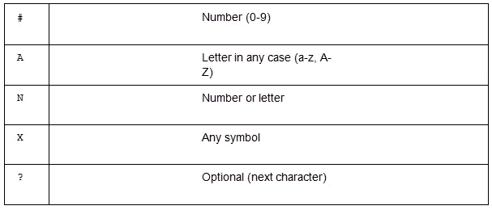

# 使用 Vue.js 构建表单时如何使用 v-mask 转换输入值

> 原文：<https://levelup.gitconnected.com/how-to-use-v-mask-when-building-forms-with-vue-js-62b774d4b927>


任何成功形式的一个关键方面是清晰。如果用户发现表单易于使用和理解，他们更有可能填写并提交表单。在本文中，我们将讨论输入屏蔽。您将学习如何快速轻松地将掩码应用到表单输入中，并通过真实的例子(如电话号码)根据您的需要配置它们。

输入掩码到底是什么？它们是显示输入数据的预定义结构。例如，如果您要屏蔽一个电话输入，您可能希望它显示为(123)234–5555，而不是简单的 1232345555。你可以清楚地看到，第一个例子不仅更容易阅读，而且它还传达了该领域试图实现的目标。

输入掩码是一个很好的特性，可以将你的 UX 提升到另一个层次，而且由于有了像`v-mask`这样的开源库，它们非常容易实现。GitHub 存储库页面可以在[这里](https://github.com/probil/v-mask)找到。

## **如何安装 v-mask 库**

让我们开始安装`v-mask`库。为了让我们的项目使用它，我们首先需要将它添加到我们的项目依赖项中。为此，请遵循以下步骤:

1.  打开您的终端，输入以下命令将库添加到我们的依赖项中:

```
npm install v-mask
```

2.我们需要把它作为一个插件添加到 Vue，所以去`main.js`，`import`让 Vue 知道我们想把它注册为我们所有应用的插件。在`import`应用程序行后添加以下代码:

```
import VueMask from ‘v-mask’Vue.use(VueMask);
```

现在我们已经注册了我们的插件，我们可以访问一个新的指令:`v-mask`。我们可以将这个新指令直接添加到我们的`<input>`元素中，库将通过读取用户的输入在幕后处理屏蔽。它将根据掩码转换字段的显示。

让我们先在常规输入上尝试一下，然后我们将为项目的组件添加一些道具。

3.转到`App.vue`，创建一个新的`<input>`元素:

`*<input type="text" />*`

如果我们在这个字段中键入一个电话号码，我们将得到默认的输入行为。一切皆有可能。因此，让我们对其应用电话号码掩码。我们新的`v-mask`库有一个要求，即我们应用它的每个字段都需要是`v-modeled`，所以让我们先把它完成。

4.在表单对象中添加一个新的电话道具到我们的`data()`中:

```
form: {
  …
  telephone: ‘’
},
```

5.现在，回到我们新的`<input>`元素并应用`v-model`。我们现在还将添加`v-mask`指令，如下所示:

```
<input type=”text”
  v-model=”form.telephone” v-mask=”’(###)###-####’”
>
```

返回浏览器，再次尝试输入。当你输入的时候，你会看到你实际上把它很好地格式化成了我们所期望的电话号码。

在五个简单的步骤中，我们向表单字段之一添加了输入屏蔽。现在让我们更深入地了解一下 v-mask 指令的作用。

## **什么是指令？**

当我们将`v-mask`库添加到我们的项目和`main.js`中的插件时，这个库为我们创建了一个新的指令`v-mask`。然而，到底什么是指令呢？我们知道它看起来像一个 HTML 属性，但是还有什么呢？

指令是带有`v-`前缀的特殊属性。指令属性值应该是一个 JavaScript 表达式(除了`v-for` […])。一个指令的工作是当它的表达式的值改变时，对 DOM 反应性地应用副作用。

看起来我们有一个特殊的属性可以修改元素，我们在电话号码掩码中看到了这一点。这个指令实际上是如何工作的？

从示例中我们知道我们正在传入一个字符串，您可以看到在组成`v-mask=””`属性的双引号内，我们正在设置一对新的单引号(`‘’`)。这意味着这个属性中的表达式是 JavaScript，我们传递给它一个字符串值。

通过查看`v-mask`库文档，我们知道我们有一些特殊的占位符可以在我们的掩码中使用。这些项目的表格如下:



例如，一个将显示一天中的时间的掩码，您可以将其定义如下:

```
v-mask="'##:##'"
```

这意味着该输入将接受从 0 到 9 的两个数字(`##`)，后面是一个`:`字符，再后面是另外两个数字(`##`)。

任何与此模式不匹配的内容都将被输入忽略。

`v-mask`是一个非常强大的库，它允许我们通过组合这些简单的规则来定制我们想要的输入显示方式。在这篇文章的最后一节，我们将看看如何修改自定义输入。这将允许我们充分利用输入掩码的功能。

## **如何增强自定义输入**

我们已经投入了大量的工作来创建我们令人敬畏的自定义输入，所以我们肯定希望继续使用它！

按照以下步骤修改基本输入，并允许输入屏蔽:

1.  返回到`App.vue,`并将`<input>`元件切换为`<BaseInput>`元件:

```
<BaseInput label=”Telephone”
  type=”text”
  v-model=”form.telephone”
/>
```

现在让我们进入`BaseInput.vue`，创建一个新道具；我们称它为`mask`，它默认为一个空字符串。重要的是，我们将它默认为一个空字符串，否则指令将试图匹配，如果它们没有声明的掩码，我们将无法在字段中键入内容！

2.将其添加到您的道具对象中:

```
…,
mask: {
  type: String, required: false
}
```

3.现在，回到`App.vue`，更新我们的电话`BaseInput`以使用掩码属性:

```
<BaseInput label=”Telephone” type=”text”
  v-model=”form.telephone”
  :mask=”’(###)###-####’”
/>
```

全部完成！返回到您的浏览器，并添加一些数字到字段，您应该有一个好看的电话口罩与您的自定义组件！

**这是摘自 Marina Mosti(**[**@ Marina Mosti**](https://twitter.com/marinamosti)**)用 Vue.js** **写的** [**建筑形式。)要访问形成贯穿全书的项目基础的代码，请单击**](https://www.packtpub.com/business-other/building-forms-with-vue-js?utm_source=Insertwebsite&utm_medium=referral&utm_campaign=Outreach_ExplorerBPR) [**此处**](https://gitlab.com/marinamosti/vuetiful- forms-step-3) **。**

玛丽娜将于 11 月在多伦多的 VueConf 发表演讲。在这里了解更多[](https://vuetoronto.com/)**。**