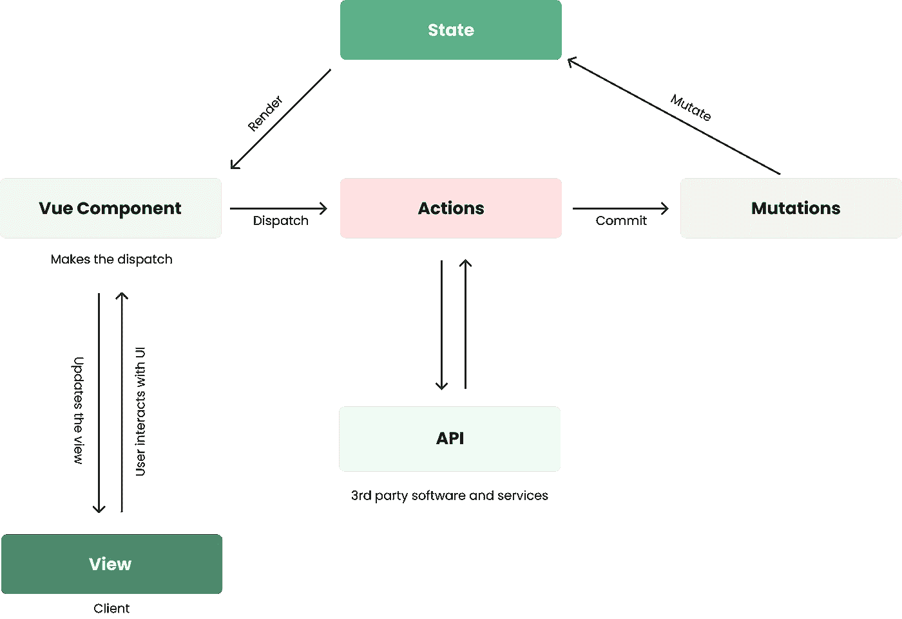

# Vuex 简单解释道

> 原文：<https://levelup.gitconnected.com/how-to-use-vuex-in-nuxt-js-9b07262b93d3>


[梁杰森](https://unsplash.com/@ninjason?utm_source=medium&utm_medium=referral)在 [Unsplash](https://unsplash.com?utm_source=medium&utm_medium=referral) 上的照片

作为一名 web 应用程序开发人员，您会遇到需要理解复杂问题并为其创建无缝解决方案的情况。在我的例子中，我现在正在使用一个框架(类似于许多其他的框架),它要求我利用状态管理模式。

# 什么是 S **tate** ？

状态是驱动应用程序的唯一真实来源。整个应用程序中的任何组件都可以在这里接收和操作数据。请将它视为整个应用程序的全局变量。

如果没有 Vuex，你的组件将会有它自己的状态版本，改变它也会影响到当前状态的真实性。Vuex 允许所有组件接收新更改的状态，不管它发生在哪里。

当组件使用 props 进行更改时，可以通过将事件传递给状态来进行这些更改，但这可能会变得非常混乱，尤其是当应用程序的规模和复杂性增加时。

我知道这对你们很多人来说非常困惑。幸运的是，我明白这一点，我会把它变得更简单一点。

> “从马嘴中听到它”

从源头接收信息已经阻止了人们之间的谣言和争斗。如果每个人都遵循这个建议就好了。

因此，Vuex 状态是马，而组件是对从它那里听到最新更新感兴趣的人。当两个个体(或组件)得到不同版本的状态(谣言)时，糟糕的事情发生了，事情开始破裂。一个表现不佳的应用程序可能会在硅谷的某个地方引起一场争斗。

下面的示例演示了如何使用存储和状态。当用户登录到他们的帐户时，诸如“热门歌曲”部分的组件可以被更新以反映来自该用户的数据。


如果没有国家，这些数据中的大部分都是不准确的。

# Vuex 属性



## 状态

这是应用程序中唯一的真实来源。

## 突变

```
mutations: {
    mutatationOne(state, payload){
        state.variable = payload
    }
}
```

突变是由动作调用的同步函数，用于对状态进行更改。通过使用突变来改变状态，而不是直接执行操作，可以帮助我们在出现问题时进行诊断和调试。突变也可以被追踪。

*有效负载是一个参数，它接受一个参数，该参数来自调用变异的地方(使用变异的动作或组件)*

## 行动

```
actions:{
    makeChange(context){
      context.commit("mutationOne", payloadArgument)
   }
}
```

动作是异步的，并且可以访问 Vuex 存储。在这里，您可以调用多个突变来改变状态。例如，如果您希望在进行 API 调用以检索视频或博客帖子列表时显示一个加载栏。我们使用 commit 调用变异来修改状态，因为动作不能直接改变它。

## 吸气剂

Getters 与 Vue 实例中的 computed 属性非常相似。与 computed 属性不同，Getters 可以从应用程序中的所有组件引用，并且不需要复制代码块就可以工作。当检测到依赖关系发生变化时，Getters 将自动更新。

```
getters:{
    partyPlaylist(state){
        return state.music.filter(p => p.title = "party")
    }
}
*p = playlist
```

# 最后的想法

每个应用程序都不需要复杂的状态管理。构建应用程序时，在决定如何处理反应性数据之前，必须考虑成本、开发时间和可伸缩性之间的权衡。

## 在网上和我联系！

*   [和我一起工作](https://digyt.co)
*   [个人博客](http://www.christopherclemmons.com/)
*   电子邮件:christopher.clemmons2020@gmail.com