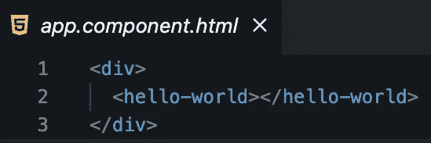
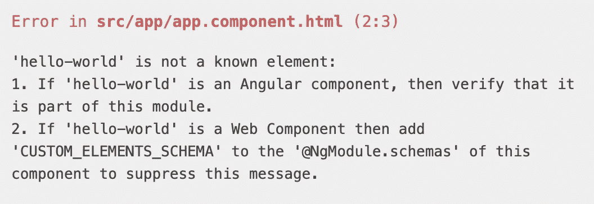
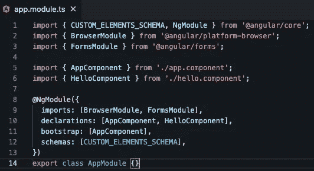

# 如何在 Angular 中使用 Web 组件

> 原文：<https://levelup.gitconnected.com/how-to-use-web-components-in-angular-c5d1d7825ca0>

## Web 组件使我们能够完全独立于前端框架进行开发。

原照片由 [Cytonn 摄影](https://www.pexels.com/de-de/@cytonn?utm_content=attributionCopyText&utm_medium=referral&utm_source=pexels)发自 [Pexels](https://www.pexels.com/de-de/foto/zwei-personen-im-langarmeligen-hemd-shakehand-955395/?utm_content=attributionCopyText&utm_medium=referral&utm_source=pexels)

许多开发人员对 Web 组件清除前端框架和库的想法感到威胁。这种情况不会发生，因为两种技术解决的是不同的问题。但是，将它们结合起来才是成功的真正秘诀。

> 大多数使用 Angular 的人并不使用 Web 组件，但是你可能想这样做。

在深入我们的例子之前，让我们看看 Web 组件和 Angular 的目的。

# Web 组件的用途

Web 组件是基于官方 web 标准的可重用客户端组件，受所有主流浏览器支持。它们是从我们代码的其余部分中封装功能的**的一种很好的方式。不仅如此，你还可以在每个网络应用程序和网页中重用它们。**

他们的目的是编写在任何地方都可以使用的封装强大的定制元素。Web 组件使我们能够完全独立于前端框架进行开发。

> Web 组件的主要好处是我们可以在任何地方使用它们。有任何框架，甚至没有框架。——[*vuejs.org*](https://v3.vuejs.org/guide/web-components.html)

# 角度的目的

虽然 Web 组件为可重用组件提供了强大的封装，但 Angular 提供了一个声明性库，使 DOM 与数据保持同步。

与 Web 组件的主要区别在于，我们只能在 Angular 应用程序中使用 Angular 组件。另一方面，Web 组件可以在任何地方使用。我们可以在 React、Vue、Angular 或任何其他 web 应用程序中使用它。

> *作为开发者，你可以自由地在你的 Web 组件中使用 React，或者在 React 中使用 Web 组件，或者两者都用。——*[*https://reactjs.org*](https://reactjs.org/docs/web-components.html)

当你的组件需要处理大量需要传递给子组件的数据时，Angular 或任何其他前端框架都是不错的选择。

 [## Web 组件会取代前端框架吗？

### 它们是为解决不同的问题而构建的。

medium.com](https://medium.com/@mariusbongarts11/will-web-components-replace-frontend-frameworks-535891d779ba) 

# 构建 Web 组件

让我们继续构建我们的第一个 Web 组件，我们将把它集成到一个 Angular 应用程序中。

我们将保持事情简单，并创建一个轻松的自定义元素。如果您对构建更复杂的 Web 组件感兴趣，请阅读我的系列文章:[完整的 Web 组件指南](https://medium.com/@mariusbongarts11/the-complete-web-component-guide-part-1-custom-elements-a627af805df8)。

下面是我们的`hello-world`定制元素的 JavaScript 代码:

将这段 JavaScript 代码加载到我们的 HTML 中，我们可以像这样轻松地包含我们的组件:

`<hello-world></hello-world>`

那将显示我们的"**你好世界！"**头条。你自己试试。这里是[码笔](https://codepen.io/marius2502/pen/ZErXXLL)。

# 在 Angular 中集成 Web 组件

让我们将 Web 组件包含在一个正在运行的 Angular 应用程序中。为了简单起见，我们将在 [Stackblitz](https://stackblitz.com/fork/angular-ivy) 上进行一个角度启动项目。之后，我们创建文件`hello-world.js`,并将上面的 Web 组件代码放入其中。

 [## 你不需要 React 来创建一个可重用的按钮！

### 请改用 Web 组件！

javascript.plainenglish.io](https://javascript.plainenglish.io/you-dont-need-react-to-create-a-reusable-button-2108cfeac38c) 

接下来，我们进入 Angular 组件，导入包含 Web 组件代码的 Javascript 文件:

`import ./hello-world`

并将我们的自定义元素传递给我们的模板:

app.component.html

当保存我们的更改时，我们的组件还没有显示，我们得到错误***“‘hello-world’不是已知元素”*** :

“hello-world”不是已知元素

在这种情况下，Angular 的错误信息非常好。它为我们提供了两种选择。当阅读第二条时，我们可以得出结论，当使用 Web 组件时，我们需要将`CUSTOM_ELEMENTS_SCHEMA`添加到`@NgModule.schemas`。因此，让我们转到我们的`app.module.ts`文件，从`@angular/core`导入`CUSTOM_ELEMENTS_SCHEMA`，并将其添加到`schemas`数组:

app.module.ts 中的 CUSTOM_ELEMENTS_SCHEMA

瞧啊。预览显示我们的 Web 组件。我们成功地将一个自定义元素集成到 Angular 中。下面是 [**最终 Stackblitz**](https://stackblitz.com/edit/angular-ivy-wx8jkj?file=src/app/app.component.html) 的例子:

# 最后的想法

在 Angular 中使用 Web 组件很容易。构建可在整个前端框架中使用的可重用组件有很多好处。我们已经知道，在创建可重用的组件以便在任何地方使用时，我们应该使用 Web 组件。当涉及到处理大量数据时，Angular 是最好的选择。

我希望你喜欢阅读这篇文章。我总是很乐意回答问题，也乐于接受批评。请随时联系我😊

***如果想支持我写作，*** [***成为中等会员***](https://medium.com/@mariusbongarts11/membership) ***。如果你这样做，我会得到一小笔佣金。谢谢！***

 [## 通过我的推荐链接加入 Medium-Marius bong arts

### 作为一个媒体会员，你的会员费的一部分会给你阅读的作家，你可以完全接触到每一个故事…

medium.com](https://medium.com/@mariusbongarts11/membership) 

关注我，不要错过我的下一篇文章。我写了关于 Typescript、Web 组件、前端框架、软件设计模式、Chrome 扩展以及更多的主题！🙏

# 关于我

我是埃森哲互动公司的软件工程分析师。我喜欢创造有价值的内容和产品，让人们的生活更轻松。例如， [**Web Highlights Chrome 扩展**](https://chrome.google.com/webstore/detail/web-highlights-%20-bookmark/hldjnlbobkdkghfidgoecgmklcemanhm) 使您能够高亮显示您在浏览器中访问的每个页面或 PDF 上的文本。您可以提供标签来对您的研究进行分组，并非常容易地重新找到它。你所有的精彩片段都会同步到 web-highlights.com[上的相应网络应用程序中。看看吧！](https://web-highlights.com/)

通过**[**LinkedIn**](https://www.linkedin.com/in/marius-bongarts-6b3638171/)**与我联系，或者在 [**Twitter**](https://twitter.com/MariusBongarts) 上关注我。****

**** [## 网络亮点- PDF 和网络荧光笔

### 在每个网站或 PDF 上创建亮点、书签、标签和文件夹。以结构化的方式组织您的想法和研究…

chrome.google.com](https://chrome.google.com/webstore/detail/web-highlights-pdf-web-hi/hldjnlbobkdkghfidgoecgmklcemanhm)**** 

# ****进一步阅读****

**** [## 用 Web 组件构建自己的博客组合:基础

### 第 1 部分—定制元素、阴影 DOM 和 HTML 模板

medium.com](https://medium.com/@mariusbongarts11/showcase-your-medium-articles-with-web-components-part-1-basics-d2c6618e9482)  [## 如何用 Web 组件构建一个中型文本荧光笔作为 Chrome 扩展

### 我一直喜欢中型荧光笔，它出现在选择文章中的文本时。我认为这将是很好的…

medium.com](https://medium.com/@mariusbongarts11/how-to-build-the-medium-text-highlighter-as-a-chrome-extension-with-web-components-b3feccddcd01)  [## 完整的 Web 组件指南:自定义元素

### 成为 Web 开发未来的专家(第 1 部分)

medium.com](https://medium.com/@mariusbongarts11/the-complete-web-component-guide-part-1-custom-elements-a627af805df8)  [## 具有代码挑战的高级类型脚本:类型保护

### 学习高级的 TypeScript 特性，并将它们应用到实际的代码练习中。

medium.com](https://medium.com/@mariusbongarts11/advanced-typescript-with-code-challenges-type-guards-a5b24bb6d46b)****