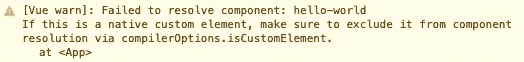

# 如何在 Vue.js 中使用 Web 组件

> 原文：<https://levelup.gitconnected.com/how-to-use-web-components-in-vue-js-bfbd16f6b26f>

## Web 组件使我们能够完全独立于前端框架进行开发。

许多开发人员对 Web 组件清除前端框架和库的想法感到威胁。这种情况不会发生，因为两种技术解决的是不同的问题。但是，将它们结合起来才是成功的真正秘诀。

> 大多数使用 Vue 的人都不使用 Web 组件，但是你可能想这样做。

在深入我们的例子之前，让我们看看 Web 组件和 Vue 的用途。

# Web 组件的用途

Web 组件是基于官方 web 标准的可重用客户端组件，受所有主流浏览器支持。它们是从我们代码的其余部分中封装功能的极好方式。不仅如此，你还可以在每个网络应用程序和网页中重用它们。

他们的目的是编写在任何地方都可以使用的封装强大的定制元素。Web 组件使我们能够完全独立于前端框架进行开发。

> Web 组件的主要好处是我们可以在任何地方使用它们。有任何框架，甚至没有框架。——[*vuejs.org*](https://v3.vuejs.org/guide/web-components.html)

# Vue.js 的目的

Web 组件为可重用组件提供了强大的封装，而 Vue 提供了一个声明性库，使 DOM 与数据保持同步。

与 Web 组件的主要区别在于，我们只能在 Vue 应用程序中使用 Vue 组件。另一方面，Web 组件可以在任何地方使用。我们可以在 **Vue、React、Angular** 或任何其他 web 应用程序中使用它。

> Vue 在[自定义元素无处不在测试](https://custom-elements-everywhere.com/libraries/vue/results/results.html)中获得了满分。*——*[*vuejs.org*](https://v3.vuejs.org/guide/web-components.html)

当您的组件需要处理大量需要传递给子组件的数据时，Vue 或任何其他前端框架都是不错的选择。

 [## Web 组件会取代前端框架吗？

### 它们是为解决不同的问题而构建的。

medium.com](https://medium.com/@mariusbongarts11/will-web-components-replace-frontend-frameworks-535891d779ba) 

# 构建 Web 组件

让我们继续构建我们的第一个 Web 组件，我们将把它集成到一个 Vue 应用程序中。

我们将保持事情简单，并创建一个轻松的自定义元素。如果您对构建更复杂的 Web 组件感兴趣，请阅读我的系列文章:[完整的 Web 组件指南](https://medium.com/@mariusbongarts11/the-complete-web-component-guide-part-1-custom-elements-a627af805df8)。

下面是我们的`hello-world`定制元素的 JavaScript 代码:

将这段 JavaScript 代码加载到我们的 HTML 中，我们可以像这样轻松地包含我们的组件:

`<hello-world></hello-world>`

那将显示我们的" **Hello World！"**头条。你自己试试。这里是[码笔](https://codepen.io/marius2502/pen/ZErXXLL)。

# 在 Vue 中集成一个 Web 组件

让我们将 Web 组件包含在一个正在运行的 Vue 应用程序中。为了简单起见，我们将转到一个关于 [Stackblitz](https://stackblitz.com/fork/vue) 的 Vue starter 项目。之后，我们创建文件`hello-world.js`,并将上面的 Web 组件的代码放到项目的 components 文件夹中。

 [## 你不需要 React 来创建一个可重用的按钮！

### 请改用 Web 组件！

javascript.plainenglish.io](https://javascript.plainenglish.io/you-dont-need-react-to-create-a-reusable-button-2108cfeac38c) 

接下来，我们进入 Vue 组件，导入包含 Web 组件代码的 Javascript 文件:

`import ./component/hello-world`

现在，我们可以轻松地在模板中使用我们的定制元素:`<hello-world></hello-world>`。瞧啊。预览显示我们的 Web 组件。我们成功地将一个自定义元素集成到 Vue.js 中。

尽管如此，控制台中仍有一个警告:

Vue.js 自定义元素警告

默认情况下，Vue 会尝试将非本机 HTML 标记解析为注册的 Vue 组件，然后再将其呈现为自定义元素。这将导致 Vue 在开发期间发出*“未能解析组件”*警告。为了让 Vue 知道某些元素应该被视为定制元素并跳过组件解析，我们可以指定`compilerOptions.isCustomElement`选项。

如果您在构建设置中使用 Vue，您应该通过构建配置来传递该选项，因为它是一个编译时选项。下面是我们的堆栈的`main.js`中的设置:

我们告诉 Vue.js，所有标签，包括破折号，都应该被认为是自定义元素，以抑制警告。刷新页面时，警告应该会消失。

下面是最后的 [**Stackblitz**](https://stackblitz.com/edit/vue3-vite-typescript-starter-7hnsaq?file=src%2Fmain.ts) :

# 最后的想法

在 Vue.js 中使用 Web 组件很容易。构建可在整个前端框架中使用的可重用组件有很多好处。我们已经知道，当创建可重用的组件以在任何地方使用时，我们应该使用 **Web 组件**。说到处理大量数据，Vue.js 是不二之选。

我希望你喜欢阅读这篇文章。我总是乐于回答问题，并乐于接受批评。请随时联系我😊

***如果想支持我写作，*** [***成为中等会员***](https://medium.com/@mariusbongarts11/membership) ***。如果你这样做，我会得到一小笔佣金。谢谢！***

 [## 通过我的推荐链接加入 Medium-Marius bong arts

### 作为一个媒体会员，你的会员费的一部分会给你阅读的作家，你可以完全接触到每一个故事…

medium.com](https://medium.com/@mariusbongarts/membership) 

# 关于我

我是埃森哲互动公司的软件工程分析师。我喜欢创造有价值的内容和产品，让人们的生活更轻松。例如， [**Web Highlights Chrome 扩展**](https://chrome.google.com/webstore/detail/web-highlights-%20-bookmark/hldjnlbobkdkghfidgoecgmklcemanhm) 使您能够高亮显示您在浏览器中访问的每个页面或 PDF 上的文本。您可以提供标签来对您的研究进行分组，以便轻松地重新查找。你所有的精彩片段都会同步到 web-highlights.com[上的相应网络应用程序中。看看吧！](https://web-highlights.com/)

通过**[**LinkedIn**](https://www.linkedin.com/in/marius-bongarts-6b3638171/)**与我联系，或者在 [**Twitter**](https://twitter.com/MariusBongarts) 上关注我。****

**** [## 网络亮点- PDF 和网络荧光笔

### 在每个网站或 PDF 上创建亮点、书签、标签和文件夹。以结构化的方式组织您的想法和研究…

chrome.google.com](https://chrome.google.com/webstore/detail/web-highlights-pdf-web-hi/hldjnlbobkdkghfidgoecgmklcemanhm)**** 

# ****进一步阅读****

**** [## Web 组件死了吗？

### 最近，我发表了一篇关于类似主题的不同问题的文章:Web 组件会取代前端吗…

levelup.gitconnected.com](/are-web-components-dead-12e404e0f4b0)  [## 如何在 React 中使用 Web 组件

### Web 组件使我们能够完全独立于前端框架进行开发。

blog.devgenius.io](https://blog.devgenius.io/how-to-use-web-components-in-react-54c951399bfd)  [## 用 Web 组件构建自己的博客组合:基础

### 第 1 部分—定制元素、阴影 DOM 和 HTML 模板

medium.com](https://medium.com/@mariusbongarts11/showcase-your-medium-articles-with-web-components-part-1-basics-d2c6618e9482)  [## 完整的 Web 组件指南:自定义元素

### 成为 Web 开发未来的专家(第 1 部分)

medium.com](https://medium.com/@mariusbongarts11/the-complete-web-component-guide-part-1-custom-elements-a627af805df8) 

# 分级编码

感谢您成为我们社区的一员！更多内容见[级编码出版物](https://levelup.gitconnected.com/)。
跟随:[推特](https://twitter.com/gitconnected)，[领英](https://www.linkedin.com/company/gitconnected)，[通迅](https://newsletter.levelup.dev/)
**升一级正在改造理工大招聘➡️** [**加入我们的人才集体**](https://jobs.levelup.dev/talent/welcome?referral=true)****