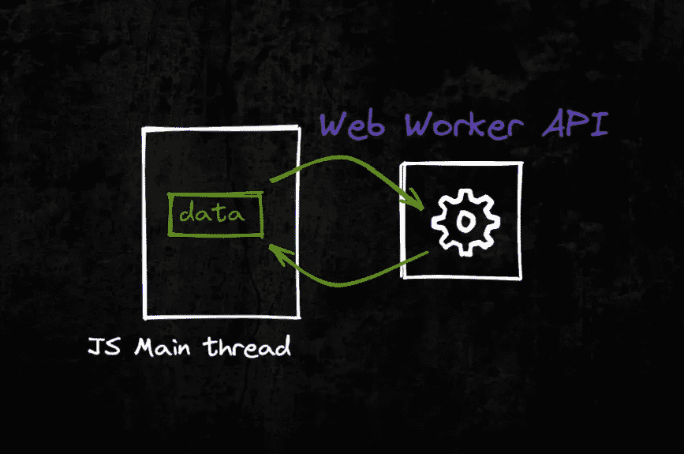
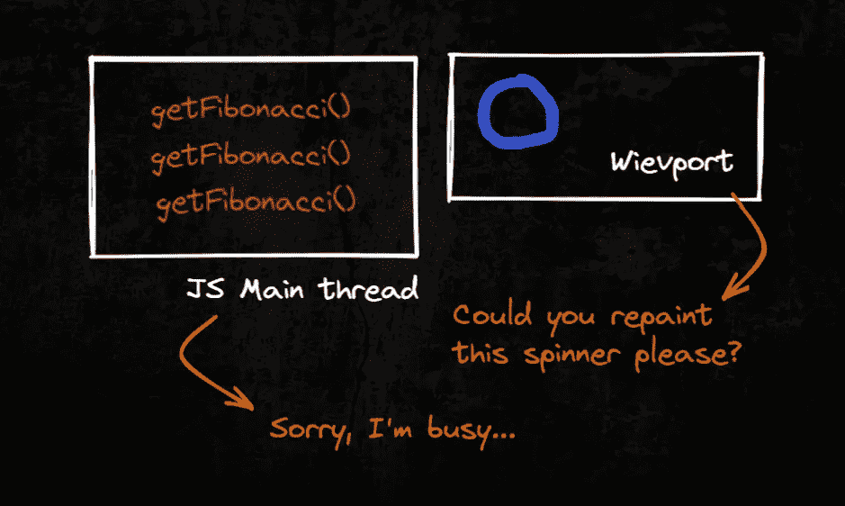
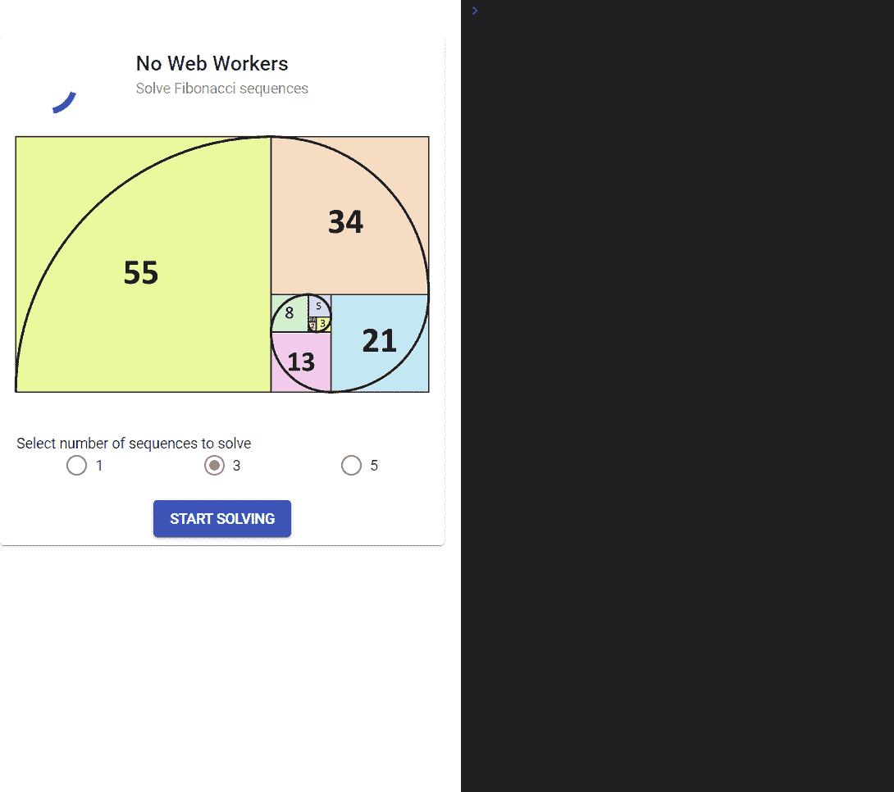
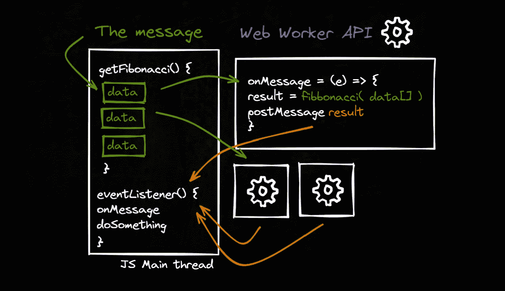
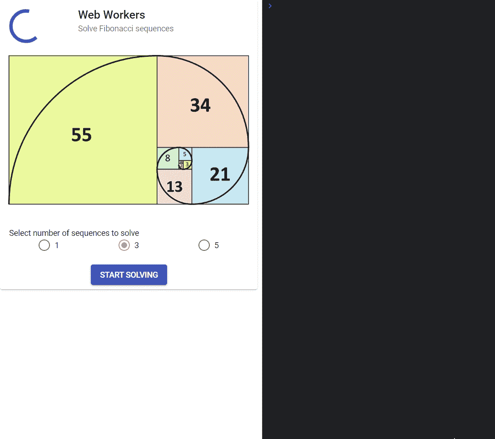
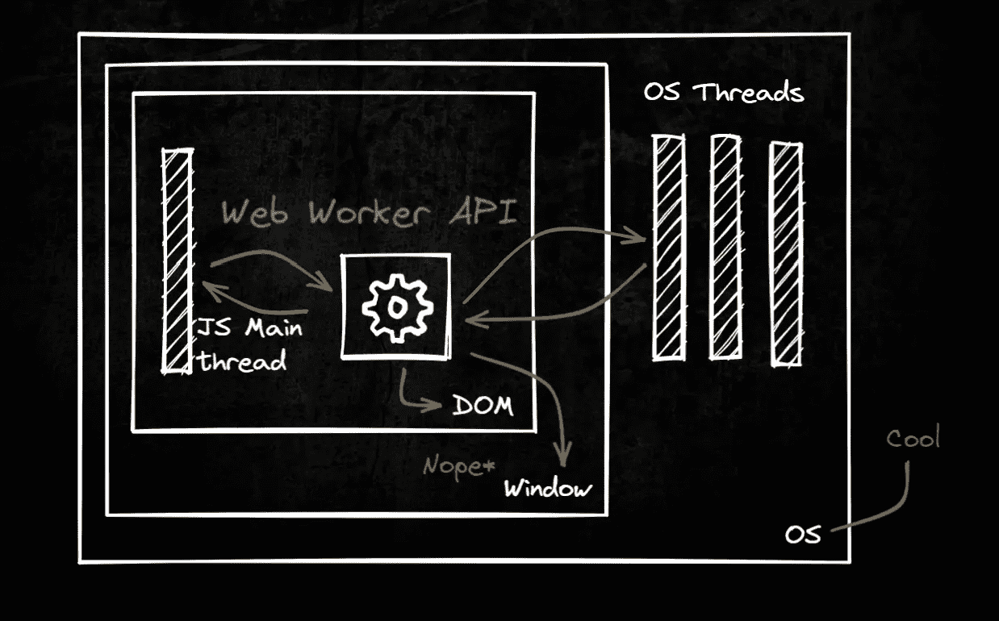

# 如何使用 Web Workers API

> 原文：<https://levelup.gitconnected.com/how-to-use-web-workers-api-b1ef96c46fc0>



[Web Workers](https://developer.mozilla.org/en-US/docs/Web/API/Web_Workers_API/Using_web_workers) 是 Web 内容在后台线程中运行脚本的一种简单方式。工作线程可以在不干扰用户界面的情况下执行任务。

除了一些例外，您可以在工作线程中运行您喜欢的任何代码。例如，您不能从 worker 内部直接操纵 DOM，也不能使用一些默认的方法和`[window](https://developer.mozilla.org/en-US/docs/Web/API/Window)`对象的属性。

我们可以在 JS 主线程之外运行繁重的操作。主线程是浏览器处理用户事件和绘画的地方。默认情况下，浏览器使用单线程来运行页面上的所有 JavaScript，以及执行布局、重排和垃圾收集。这意味着长时间运行的 JavaScript 函数可能会阻塞线程，导致页面无响应和糟糕的用户体验。🤔



例如，我将调用一个计算量很大的方法来求解斐波那契数列(以一种非常低效的方式)。如果碰巧你正在寻找一个序列计算的好的解决方案，使用记忆。类似这样的[【1】](https://stackoverflow.com/a/67765989/15439733)。总之…继续我们的话题。

```
// The typical fibonacci implementation (warning! slow!)
const fibonacci = (num: number): any => {
  if (num <= 1) return 1;
  return fibonacci(num - 1) + fibonacci(num - 2);
};
```

观察 javascript 主线程上运行的微调器，此时主线程开始解决繁重的计算。它会在计算过程中冻结，因为主线程仍然忙于计算，它不会关注其他任何事情。同步执行的美妙之处— **程序中的第一个任务必须在继续执行下一个任务之前完成处理。**



那么，我们如何在繁重的计算中防止主线程阻塞呢？

# 解决办法？网络工作者。🤗



数据通过消息系统在工作线程和主线程之间发送——双方都使用`postMessage()`方法发送消息。工人的魔力通过`[postMessage()](https://developer.mozilla.org/en-US/docs/Web/API/Worker/postMessage)`方法和`[onmessage](https://developer.mozilla.org/en-US/docs/Web/API/Worker/message_event)`事件处理程序实现。

每次调用时，都会产生一个新的工作线程。工人完成他们的工作并返回结果。这就是所谓的异步执行，它使你能够在一个单独的[线程](https://developer.mozilla.org/en-US/docs/Glossary/Thread)中运行一些任务。

## Web Workers 允许您在 Web 应用程序中执行多线程。

让我们观察同样的斐波那契数列计算。注意两件事:1)微调不再冻结 2)总执行时间明显减少。🤩



# 需要考虑的事项

## 保安？

`[Worker](https://developer.mozilla.org/en-US/docs/Web/API/Worker)`接口产生了真正的操作系统级线程，细心的程序员可能会担心，如果不小心的话，并发可能会在代码中产生“有趣”的效果。

然而，由于 web 工作者已经小心地控制了与其他线程的通信点，所以实际上很难引起并发问题。无法访问非线程安全组件或 DOM。您必须通过序列化对象将特定数据传入和传出线程。所以你必须非常努力才能在你的代码中引起问题。

## 资源？

用于产生新线程的资源仍然来自客户端的硬件。这意味着，如果您的客户端在物理上没有大量的计算能力(例如，一些较旧的智能手机)，新线程可能不会那么快。甚至主线程也可能因为整个设备 100%运行(不仅仅是主线程)而遇到阻塞。

## 如果这么棒，为什么不用这个？

谁说不是呢？但是如果我必须列出一些限制它们使用的限制:



1.  首先，也可能是最重要的一点是不能访问文档对象模型。
2.  您无法从 Web Worker 访问您的框架的功能，因为您无权访问它的库。
3.  Web Worker 无法访问`window`名称空间，但在某种程度上，它的概念是可以访问的。

更多关于这个[这里](https://www.codemag.com/Article/2101071/Understanding-and-Using-Web-Workers)。

# 源代码

源代码可以在 [CodeSandBox](https://codesandbox.io/p/github/Nurech/web-workers-example/draft/serene-borg?file=%2Fsrc%2Fapp%2Fservices%2Fdata.service.ts&selection=%5B%7B%22endColumn%22%3A1%2C%22endLineNumber%22%3A53%2C%22startColumn%22%3A1%2C%22startLineNumber%22%3A52%7D%5D) 和 [GitHub](https://github.com/Nurech/web-workers-example) 上找到。

感谢阅读！