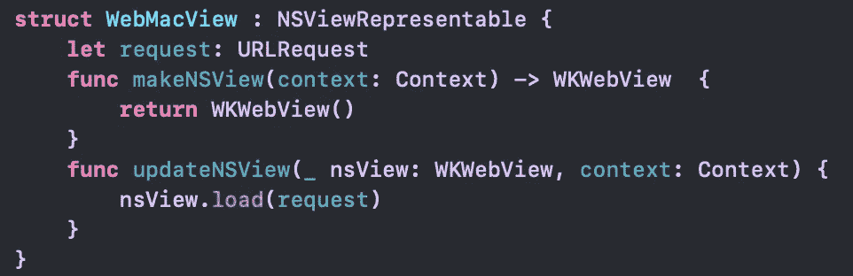

# 如何:通过 SwiftUI 在 Mac 上使用 WKWebView

> 原文：<https://levelup.gitconnected.com/how-to-use-wkwebview-on-mac-with-swiftui-10266989ed11>

## 解决日常问题的简单教程。

最近，我正在寻找将应用程序的支持从 iOS 扩展到 macOS。然而，`WebView`依赖于在 mac 上不可用的 iOS `UIViewRepresentable`。这里有一个帮助解决问题的快速分步教程。

# 开始

编码前，请确保您已经将目标添加到 **macOS** 中。

# 编码

我们需要把`UIViewRepresentable`改成`NSViewRepresentable`。如果你用的是`UIView`，也改成`NSView`。下面是一个代码示例。

macOS 上的 WebView 示例

现在，让我们试着运行这个项目。
哎呀！一个空白屏幕显示，没有任何反应？！

这是因为 macOS 项目默认禁用网络流量。所以，我们需要通过`Signing & Capabilities`来启用这个选项。您可以在项目目标中找到这一点。

如果看不到`App Sandbox`部分，添加+并选择`App Sandbox`。

然后，启用`Network`中的`Outgoing Connections(Client)`。

# 全部完成！感谢阅读:)