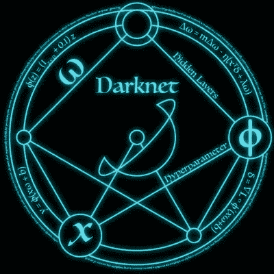
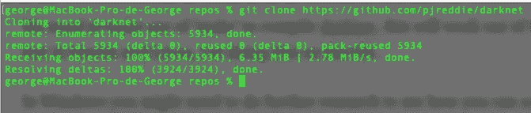
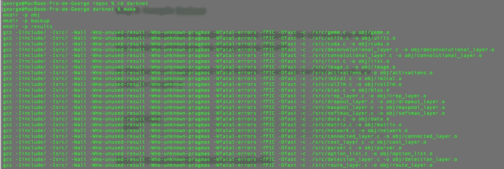
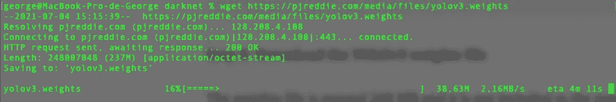
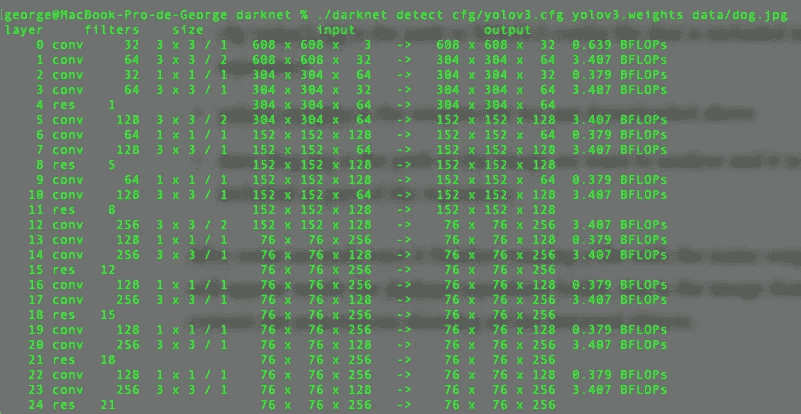
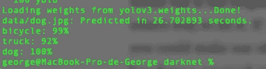
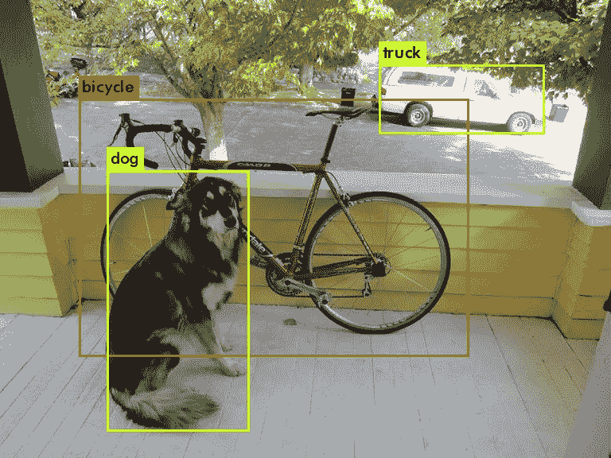
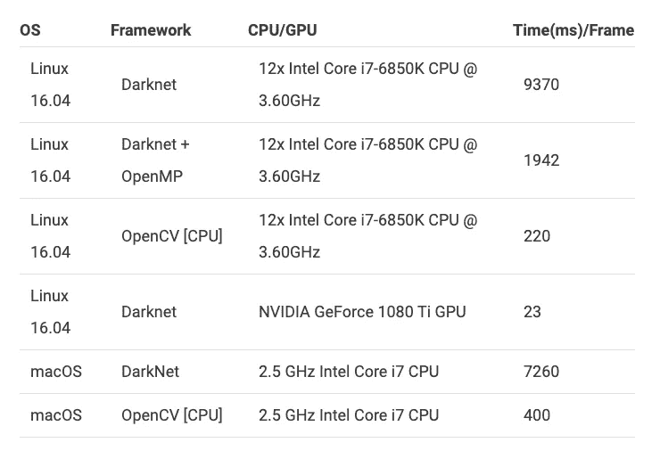

# 如何通过 4 个简单的步骤使用 YOLOv3 和 Darknet

> 原文：<https://levelup.gitconnected.com/how-to-use-yolov3-with-darknet-in-4-easy-steps-f401e1a7e47d>

**什么是暗网？**



Darknet 是一个开源的神经网络框架，以 YOLO 为特色。

YoloV3 现在已经上市很多年了，仍然被广泛使用。

**什么是 YOLO？**


YOLO 代表你只看一次，是一个实时对象检测系统。

**如何利用 YOLO 进行推理**

使用 YOLO 有几种方式，最初的方式是通过暗网本身。

要使用 darknet，我们需要通过终端来完成，这很容易做到。

以下是我们需要遵循的步骤。

**第一步:从 Github 克隆 Darknet】**

```
git clone [https://github.com/pjreddie/darknet](https://github.com/pjreddie/darknet)
```



**第二步:编译暗网**

我们需要利用“make”来编译 darknet，这将在 MacOs 和 Linux 上开箱即用，我正在 macOS 上做这个。

在 Windows 中，你可能需要做进一步的研究，看看如何使用“make”来编译它

```
cd darknet
make
```



**步骤 3:下载 YOLOv3 砝码文件**

权重文件大约 248 MB，它不包含在存储库中，所以我们需要从不同的 URL 下载它。

你可以用浏览器下载，但我更喜欢直接在控制台上下载，就像这样:

```
wget [https://pjreddie.com/media/files/yolov3.weights](https://pjreddie.com/media/files/yolov3.weights)
```



无论哪种方式，您都要确保将权重文件放在 darknet 存储库中，这样我们就可以在下一步中轻松地引用它。

**步骤 4:运行 YOLO 检测图像中的物体**

现在是关键时刻，我们将运行 darknet 来检测图像中的对象。

为此，只需执行以下命令:

```
./darknet detect cfg/yolov3.cfg yolov3.weights data/dog.jpg
```

*   。/darknet 是可执行文件
*   检测是表明我们想要做什么的论点
*   cfg/yolov3.cfg 是存储库中包含的 yolov3 配置文件的路径
*   yolov3.weights 是我们刚刚在上面下载的权重文件
*   data/dog.jpg 是我们想要分析的图像的路径，它也是存储库的一部分



几秒钟后，一旦它运行完毕，一个名为***predictions.jpg***的文件将出现在暗网存储库文件夹中，这个图像将包含显示所有检测到的对象的注释。



26.7 秒后，结束了！

这是结果，如您所见，它包含我们在上面的终端屏幕截图中看到的检测到的对象:

自行车:99%信心
卡车:92%信心
狗:100%信心



**使用 OpenCV 的 YOLOv3】**

虽然这是 YOLO 最初的设计使用方式，但也有其他的使用方式。如果你想在你的 Python 脚本中使用 YOLO，当然你可以利用“子过程”来集成它，但实际上，OpenCV 已经做了很好的工作来集成它和他们的深度神经网络模块或简称“dnn”。

不仅如此，当从 Darknet 运行时，它还被优化为比原来的运行速度更快，更快的速度我指的是快 9 倍左右，正如他们在原始文章中所说:[https://learnopencv . com/deep-learning-based-object-detection-using-yolov 3-with-opencv-python-c/](https://learnopencv.com/deep-learning-based-object-detection-using-yolov3-with-opencv-python-c/)



表格摘自 learnopencv.com->[https://learnopencv . com/deep-learning-based-object-detection-using-yolov 3-with-opencv-python-c/](https://learnopencv.com/deep-learning-based-object-detection-using-yolov3-with-opencv-python-c/)

我将会另外写一篇文章来解释如何将 YOLOv3 和 OpenCV *cv2.dnn* 一起使用，敬请关注。

你觉得这篇文章有用吗？

分享你的评论和经验！让我们知道什么对你有效，什么对你无效。

一定要给这篇文章一些掌声(50 左右是个好数字！)如果你喜欢这篇文章并想看更多。

要了解最新信息，请务必关注，直到下次！

**我们来连线**

你可以在这里找到我的社交网络链接:[https://linktr.ee/gnstudenko](https://linktr.ee/gnstudenko)