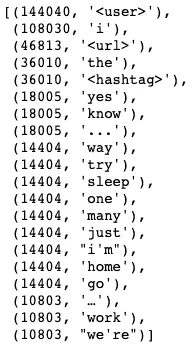
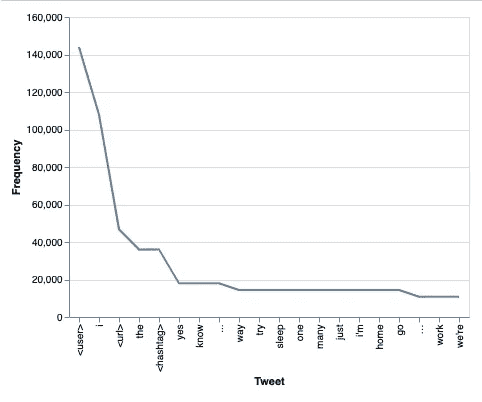
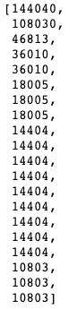
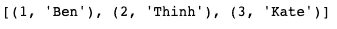
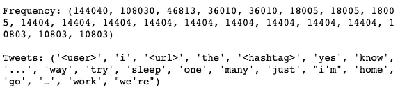
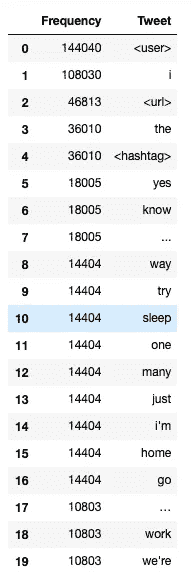
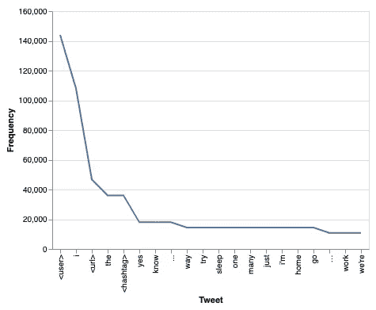

# 如何使用 Zip 操作元组列表

> 原文：<https://levelup.gitconnected.com/how-to-use-zip-to-manipulate-a-list-of-tuples-6ba6e00c02cd>

## 释放 Zip 的威力，让您的数据更加灵活


托马斯·索贝克在 [Unsplash](https://unsplash.com?utm_source=medium&utm_medium=referral) 上的照片

# 动机

假设在分析 Twitter 数据时，我们得到一个元组列表，第一个元素包含单词的频率，第二个元素包含单词。



我们希望用 y 轴代表单词的频率，x 轴代表文本来显示这些数据



要创建上图，明智的做法可能是获取一个 Tweets 列表和另一个频率列表，其中`tweet[i]`对应于其频率`freq[i]`，然后将这两个列表传递给 Matplotlib 中的参数。

这怎么可能呢？

# 第一次尝试理解列表

我们将上面的元组列表存储在`freq_tweets`中。我们可以使用列表理解来访问每个元组的第一个值，并创建频率列表:

```
freq = [x[0] for x in freq_tweets]
freq
```



对推文列表做同样的事情

```
tweet = [x[1] for x in freq_tweets]
```

很好。我们通过列表理解达到我们想要的。但是既然我们正在处理元组，为什么不利用 Python 元组方法呢？

# 解压缩元组

什么是`zip`？Python 的`zip()`函数创建了一个迭代器，它将聚合来自两个或更多可迭代对象的元素。如果你有两个朋友的名单和他们相应的出生月份

```
month= [1,2,3]
names=['Ben','Thinh','Kate']
```

为了更好地理解，您可以创建一个元组列表:

```
birthday = list(zip(month,names))
birthday
```



因此，如果你想解压元组列表，你可以使用相同的方法`zip()`,只是参数有一点变化

```
freq, tweet = zip(*freq_tweets)
print('Frequency: {}'.format(freq))
print('Tweets: {}'.format(tweet))
```



不错！通过在列表名称前插入`*`,我们能够遍历列表中的每个元素并解压缩元组。我们有两个单独的列表，每行代码。

放入数据帧:

```
import pandas as pdtweets = pd.DataFrame({'Frequency':freq,
             'Tweet': tweet})
tweets.head(20)
```



想象一下:



# 结论

恭喜你！在分析数据的同时，您的工具包中又增加了一项处理元组的技能。您了解的 Python 知识越多，您对数据的处理能力和灵活性就越强。

在[这个 Github repo](https://github.com/khuyentran1401/Data-science/blob/master/python/zip.ipynb) 中，您可以随意派生和使用本文的代码。

我喜欢写一些基本的数据科学概念，并尝试不同的算法和数据科学工具。你可以在 LinkedIn 和 Twitter 上与我联系。

如果你想查看我写的所有文章的代码，请点击这里。在 Medium 上关注我，了解我的最新数据科学文章，例如:

[](https://towardsdatascience.com/dictionary-as-an-alternative-to-if-else-76fe57a1e4af) [## 字典作为 If-Else 的替代

### 使用字典创建一个更清晰的 If-Else 函数代码

towardsdatascience.com](https://towardsdatascience.com/dictionary-as-an-alternative-to-if-else-76fe57a1e4af) [](https://towardsdatascience.com/python-tricks-for-keeping-track-of-your-data-aef3dc817a4e) [## 跟踪数据的 Python 技巧

### 如何用列表、字典计数器和命名元组来跟踪信息

towardsdatascience.com](https://towardsdatascience.com/python-tricks-for-keeping-track-of-your-data-aef3dc817a4e) [](https://towardsdatascience.com/an-introduction-to-tweettokenizer-for-processing-tweets-9879389f8fe7) [## 如何用 Python 对 Tweets 进行标记

### 我们应该选择 TweetTokenizers 还是其他 4 种常见的 Tokenizers？

towardsdatascience.com](https://towardsdatascience.com/an-introduction-to-tweettokenizer-for-processing-tweets-9879389f8fe7) [](https://towardsdatascience.com/how-to-use-lambda-for-efficient-python-code-ff950dc8d259) [## 如何使用 Lambda 获得高效的 Python 代码

### lambda 对元组进行排序并为您创造性的数据科学想法创建复杂函数的技巧

towardsdatascience.com](https://towardsdatascience.com/how-to-use-lambda-for-efficient-python-code-ff950dc8d259)