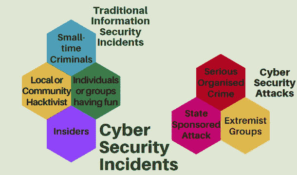
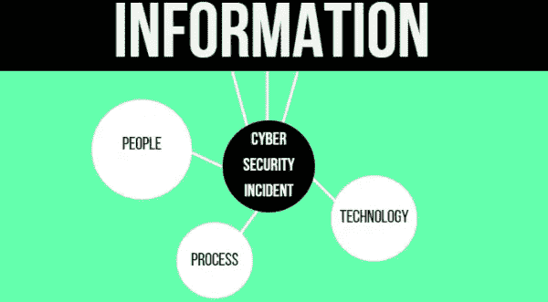
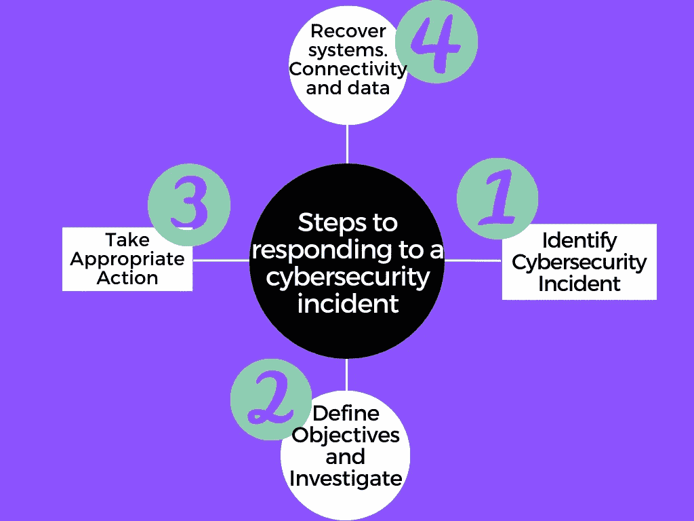

# 如何利用事故响应(IR)计划

> 原文：<https://levelup.gitconnected.com/how-to-utilize-an-incident-response-ir-plan-f631c47bbcc7>

学习如何利用事故计划让组织做好应对网络攻击的准备，包括网络钓鱼、勒索软件和网络欺诈企图，这对任何组织都至关重要。

互联网已经成为一个越来越危险的地方，我们每天都听到网络安全漏洞似乎发生在每个人身上的故事。大多数人不明白的是，当安全事故发生时，你必须快速响应，因为每一秒都很重要。如果没有及时发现和阻止，被入侵的计算机可以在几秒钟内感染组织中的其他人。如果勒索软件到达正确的计算机，它会造成巨大的损失，对整个组织来说可能是灾难性的。网络钓鱼也很可怕，因为他们可以使用受损的帐户来获得特权访问，在某些情况下，这可以给攻击者完全的访问权限。

即使你是一家新公司，只有一小群人在工作，你也应该有一个安全事故协议。它应该在警报响起后立即起飞，并遵循必要的程序来阻止攻击。这对你的公司的繁荣至关重要，并且会在将来省去很多麻烦。

凯文·Ku 在 [Unsplash](https://unsplash.com?utm_source=medium&utm_medium=referral) 上的照片

**什么被认为是网络安全事件？**

有许多类型的信息安全漏洞可以归类为网络安全事件。从对重要国家基础设施的严重网络安全攻击和重大有组织网络犯罪，到黑客行动主义和基本恶意软件攻击，再到系统内部滥用和软件故障。但是，没有办法明确帮助组织确定什么是安全事件、违规或攻击，什么不是。

政府最初将网络安全事件定义为国家支持的对关键国家基础设施或国防能力的攻击，这一定义仍然有效。然而，被媒体推波助澜的行业已经采用了这个术语。现在网络安全事件这个词经常被用来描述传统的信息安全事件。

下图将帮助您更好地理解哪些被视为传统信息安全事件，哪些是网络安全攻击。

**什么是事件响应？**

***事件响应*** 或简称***IR*** 是管理安全事件、违规和网络威胁的详细计划。一个清晰的事件响应计划可以让您有效地识别网络攻击，减少损害，降低成本，同时找到并修复原因，以防止攻击在未来发生。

当面临网络安全事件时，安全团队通常处于混乱的环境中，这阻碍了他们在正确的时间采取正确措施的能力。这对企业不利，因为一秒钟可能意味着价值数百万美元的信息被盗。这就是我们计划事件响应的原因，这样安全团队才知道最重要的任务是什么，而不会被攻击者欺负。拥有一份事故响应计划清单将会非常有帮助。有一个合适的 IR 政策将帮助你的团队从组织中获得最好的支持，这样他们可以最有效地工作。

**网络安全事件响应的主要挑战。**

在当今的商业世界中，政府和大型组织经常忽视快速响应网络安全事件的重要性。当网络攻击发生时，他们会分配更多的资源，当危险过去后，他们会认为这种情况不会再发生，然后撤回。这种情况比你想象的要多得多，甚至发生在声誉卓著的大公司身上。组织中的最高管理层不认为他们面临这些网络安全事件的风险，或者在某些情况下，他们没有意识到可能对公司造成的负面影响。

由 [Markus Spiske](https://unsplash.com/@markusspiske?utm_source=medium&utm_medium=referral) 在 [Unsplash](https://unsplash.com?utm_source=medium&utm_medium=referral) 上拍摄的照片

[研究](https://crestresearch.ac.uk/)显示了组织在以快速、高效和合理的方式响应网络安全事件时面临的最常见困难:

1.识别疑似网络安全事件。

2.确立任何调查和清理行动的目标。

3.分析与潜在网络安全事件相关的所有可用信息。

4.确定实际发生了什么。

5.确定哪些系统、网络和信息已经遭到破坏。

6.确定哪些信息已被泄露给未授权方、被盗、删除或损坏。

7.找出是谁干的以及为什么。

8.找出它是如何发生的。

9.确定网络安全事件的潜在业务影响。

10.进行充分的调查以确定肇事者。

**为网络安全事件做准备。**

在处理网络安全事件时，最重要的行动之一是做好适当的准备。这将有助于您更快地恢复系统，最大限度地减少攻击的影响，增强客户的信心，甚至从长远来看还能为您节省资金。

- ***评估关键信息***

基本上，您需要定义您的公司认为哪些信息是关键的，以及其他资产。然后，您需要确定哪种网络安全威胁会影响这些关键资产，并提高员工的意识。

- ***做一个网络安全威胁分析***

您需要了解不同类型的网络安全事件对您组织的威胁程度。为此，您应该首先定义网络安全事件对您的组织意味着什么，并创建一组与这些事件相关的威胁类型的示例，如网络钓鱼、勒索软件和黑客攻击。

- ***考虑人员、技术、流程和信息的含义***

很难确定罪魁祸首，正如我们从所进行的研究中看到的那样，这是公司在应对网络安全事件时面临的主要挑战。然而，在早期阶段，调查中没有遗漏任何内容。

**应对网络安全事件。**

在处理网络安全事件时，安全团队通常应该有一个详细的计划，列出他们应该完成的任务，以便以最佳方式处理这种情况。这个计划应该早就有了，不能在危机时刻实施。虽然组织通常认为事件是一次性的，但很多时候对于最复杂的事件，他们已经经历了几个月甚至几年。为了让您更广泛地了解典型的现场情况，我们开发了以下四个步骤。

- ***识别网络安全事件***

对于大多数组织来说，识别网络安全事件是最具挑战性的事情。事件响应团队负责准确检测和找出可能的网络安全事件的过程，同时确定事件是否已经发生，如果已经发生，则确定问题的类型、范围和严重程度。他们需要检测网络安全事件，并对其进行高水平的实时分析，因此这不是一件容易的事情，但也是至关重要的。有时没有任何迹象表明发生了什么，但专家们仍然能够找出原因。

——***明确目标，调查情况***

一旦识别出网络安全事件，下一步就是定义响应团队的目标。他们必须认真调查形势。响应团队应该能够清楚地了解他们必须首先保护的最有价值的信息是什么，以及是否有任何关键资产遭到破坏。有时，获得网络威胁情报非常有用，能够研究攻击者以确定他们的能力、动机和可能采取的行动。

- ***应对袭击者时采取适当行动***

初步调查后首先要采取的最重要的行动之一是遏制网络安全事件造成的损害。例如，阻止它传播到组织内外的其他网络和设备。遏制通常包括一系列旨在降低网络安全事件直接影响的并行行动，主要是通过消除犯罪者对系统的访问。遏制的目标并不总是恢复正常业务，而是尽最大努力恢复正常业务，同时继续分析事件并计划长期补救措施。

- ***恢复系统、连接和数据***

应对网络安全事件的最后一步是尽快恢复系统正常运行。团队必须确认系统运行正常，并修复漏洞以防止将来再次发生类似事件。尽快验证系统是很重要的，有时需要进行内部渗透测试，这样你才能确定你得到了很好的保护。