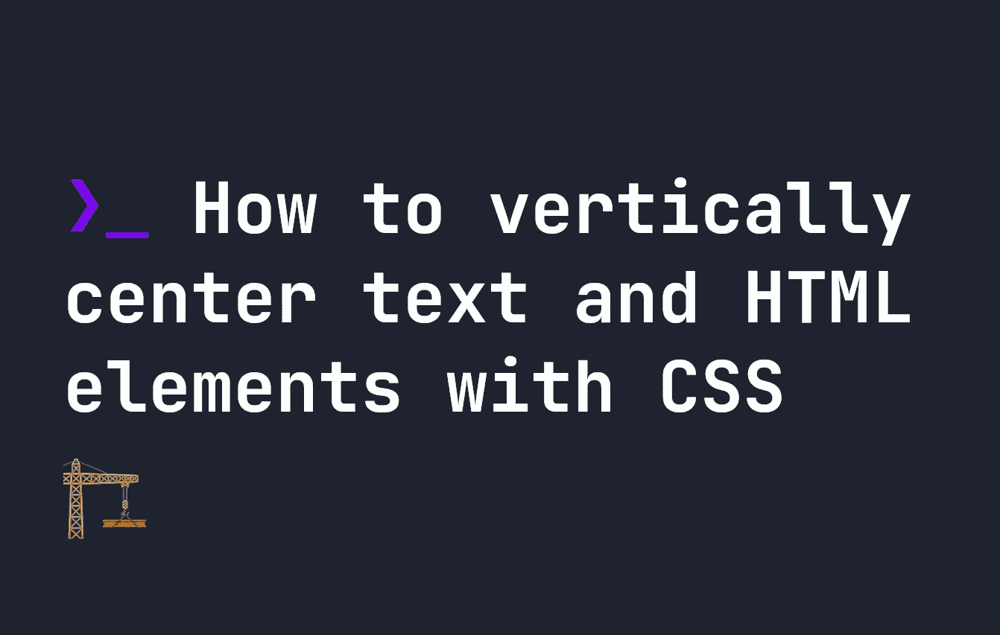
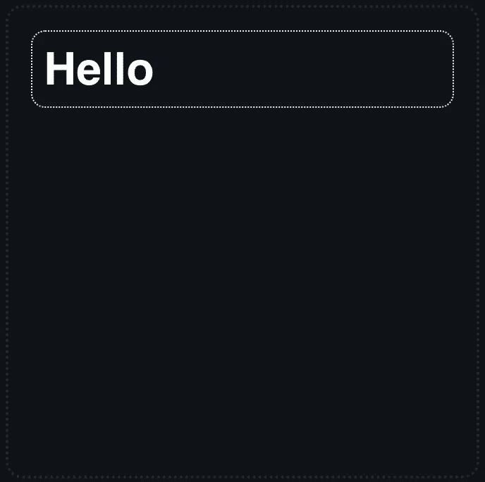
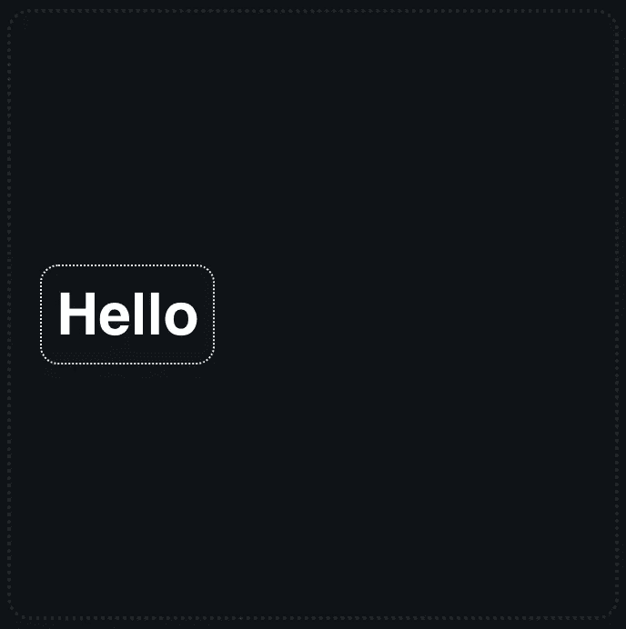
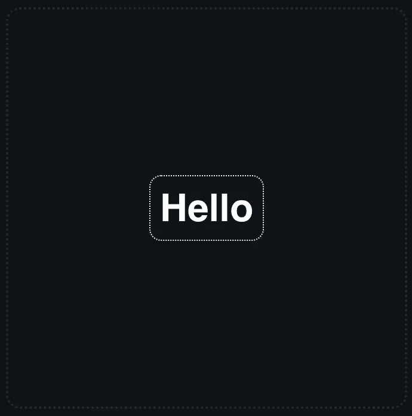

# 如何用 CSS 垂直居中文本和 HTML 元素

> 原文：<https://levelup.gitconnected.com/how-to-vertically-center-text-and-html-elements-with-css-fc78cf9c4bb>



在 CSS 中垂直居中并不像你想象的那么容易，直到我们有了像 **flexbox** 这样的工具，这真的很难。幸运的是，现在在容器中垂直居中已经很容易了。让我们看看如何完成它。

# CSS 中的项目垂直居中

假设我们有一些简单的 HTML，在一个名为`#container`的容器中有一个名为`.item`的 div。我们的 HTML 看起来像这样:

```
<div id="container">
    <div class="item">
        Hello
    </div>
</div>
```

当我们创建它时，我们的输出看起来像下面的例子。默认情况下，`.item`将是全幅的，并且在容器的顶部。



为了纠正这一点并使包含文本“Hello”的`.item` div 居中，我们需要将`#container`做成 flexbox。要简单地将 flexbox 垂直居中，我们只需更新我们的容器 CSS，如下所示:

```
#container {
    display: flex;
    align-items: center;
}
```

导致了这样的结果:



如果我们希望它既垂直居中，又水平居中，那么我们将更新我们的`#container` CSS，如下所示:

```
#container {
    display: flex;
    align-items: center;
    justify-content: center;
}
```

导致以下结果:



[展示该示例完整代码的演示可在 codepen 上找到，点击此处](https://codepen.io/smpnjn/pen/OJvVrMN)。

# 用 CSS 将一个项目放在屏幕中央。

如果我们想在一个 div 元素中居中，这样做很好，但是如果我们想在用户屏幕的正中央居中呢？如果我们想用 CSS 把一些东西放在用户屏幕的中间，我们仍然可以使用`flexbox`，我们只需要调整容器的宽度。这一次，我们将使`#container`的宽度为`100vw`，高度为`100vh`。

这两个单元告诉浏览器使`#container`的宽度和高度与视窗的整个宽度和高度相匹配。我们仍然可以保持相同的 HTML:

```
<div id="container">
    <div class="item">
        Hello
    </div>
</div>
```

然而，我们的`#container`元素的 CSS 现在将被调整以添加新的宽度和高度。我还添加了`box-sizing: border-box`，这样`#container`就不会溢出并导致滚动条出现:

```
#container {
    box-sizing: border-box;
    width: 100vw;
    height: 100vh;
    display: flex;
    align-items: center;
    justify-content: center;
}
```

同样，[这个例子的演示可以在 codepen 这里找到](https://codepen.io/smpnjn/pen/bGvdOBq)。

# 结论

使用 flexbox 将 CSS 中的项目居中非常容易。如果你想了解更多关于 CSS 的知识，我已经为 flexbox 创建了一个[互动指南。它不仅能让你很容易地将项目居中，还能向你展示不同的 flexbox 属性是如何工作的。](https://fjolt.com/article/a-guide-to-css-flexbox)

[如果你想要更多的 CSS 内容，可以在这里找到](https://fjolt.com/category/css)。

# 分级编码

感谢您成为我们社区的一员！更多内容请参见[升级编码出版物](https://levelup.gitconnected.com/)。
跟随:[推特](https://twitter.com/gitconnected)，[领英](https://www.linkedin.com/company/gitconnected)，[通迅](https://newsletter.levelup.dev/)
**升一级正在转型的理工大招聘➡️** [**加入我们的人才集体**](https://jobs.levelup.dev/talent/welcome?referral=true)