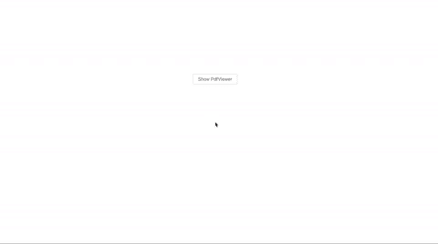
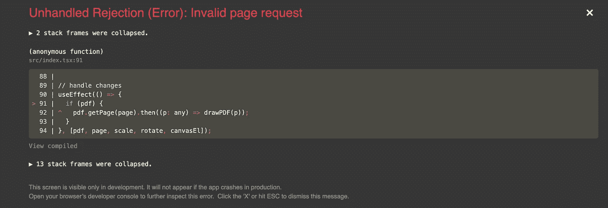
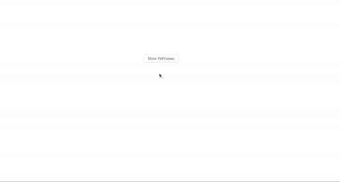
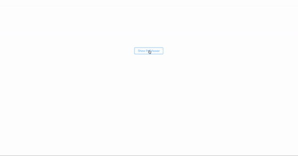

# 如何在 React 应用程序中查看 pdf

> 原文：<https://levelup.gitconnected.com/how-to-view-pdfs-in-a-react-app-32a9f3c48f06>

## 一个方便在网上查看 pdf 的库


Susan Yin 在 [Unsplash](https://unsplash.com/s/photos/books?utm_source=unsplash&utm_medium=referral&utm_content=creditCopyText) 上拍摄的照片

最近有一个在应用程序中查看 pdf 文件的功能请求。用户应该能够点击包含 pdf 的组件，并在模式中打开该 pdf。在这种模式下，用户可以浏览 pdf 文件的页面。在这篇文章中，我将向您展示我是如何借助一个名为 [react-pdf-js](https://github.com/mikecousins/react-pdf-js) 的库相对容易地实现这一点的。

**react-pdf-js** 不要与 [react-pdf](https://github.com/wojtekmaj/react-pdf) 混淆。我首先尝试使用 react-pdf，但是我发现在我们的应用程序中尝试配置它很困难。经过大约一个小时的调试，毫无收获，我决定寻找一个替代方案。这是我发现 react-pdf-js 的时候。


让我们下载库。

```
**NPM**: npm install @mikecousins/react-pdf
**YARN**: yarn add @mikecousins/react-pdf
```

*注意:在这个演示中，我将安装*[*Ant Design*](https://ant.design/components/overview/)*，这样我就可以使用它们的* `[*Modal*](https://ant.design/components/modal/)` *组件。react-pdf-js 不以任何方式依赖于 Ant 设计。*

安装 Ant Design ( `npm i antd`)之后，我们还需要导入 Ant 设计风格。

```
import "antd/dist/antd.css";
```

我将进口蚂蚁设计公司提供的`Modal`和`Button`组件，以及`react-pdf-js`。我们可以将`react-pdf-js`作为`PDF`导入。到目前为止，你的组件应该是什么样子的，请看下面。

```
import React, {useState} from "react";
import "antd/dist/antd.css";
import '../App.css';
import {Modal, Button} from "antd";
import PDF from "react-pdf-js";const PdfViewer = ({pdf, onCancel, visible})=> {
   return( 
         <Modal visible={visible}
                onCancel={onCancel}
                maskClosable={false}
                width={"50%"}         
         >
             Hello World
         <Modal/>;
};export default PdfViewer;
```

`PdfViewer`接受道具`pdf`、`onCancel`和`visible`。对于这个演示，这些道具由我们的`App`组件提供。或者，您可以在`PdfViewer`中处理所有的可见性和 pdf 导入，但这不够动态。见下面我的`App`组件。

```
import React, {useState} from 'react';
import PdfViewer from './components/PdfViewer'
import {Button} from 'antd';
import pdf from './assets/test.pdf'
import './App.css';function App() { const [showPdf, setShowPdf] = useState(false) return (
      <div className="App">
         <PdfViewer pdf={pdf} 
                    onCancel={()=>setShowPdf(false)}
                    visible={showPdf}
         />
         <Button onClick={()=>setShowPdf(!showPdf)}>
           Show PdfViewer
         </Button>
      </div>
   );
}export default App;
```

我使用 react 钩子来控制是否显示`PdfViewer`。下面是我用来设计我的 react 应用的一个小 CSS。

```
.App{
   width: 100%;
   height: 500px;
   display: flex;
   align-items: center;
   justify-content: center;
}
```

添加 CSS 后，你的应用程序应该看起来像一个孤独的按钮，在页面的(几乎)中间。现在我们已经有了基本的结构和模态逻辑，我们可以进入 react-pdf-js 的本质。


首先，我们需要设置页面导航，这样用户就可以更改他们想要查看的页面。我们可以通过使用`useState`存储当前`page`以及功能状态下的总`pages`来实现这一点。

```
const [page, setPage] = useState(1);
const [pages, setPages] = useState(null);
```

既然我们可以跟踪总页数和当前页码，我们可以将第一个道具传递给我们的`PDF`组件`page`。

```
<PDF
   page={page}
/>
```

除了当前页面，`PDF`还接受一个`file`属性，它将是从我们的`App`组件传递来的`pdf`。

```
<PDF   
   page={page}
   file={pdf}
/>
```

太棒了。我们的`PDF`组件现在可以决定为提供的`pdf`文件显示哪个`page`。我们现在需要的只是一个用于`onDocumentComplete`和`onDocumentError`的函数。当所提供的文件被`PDF`处理完后，第一个函数被执行。从这个属性中，我们可以获得 pdf 的总页数，这是我们用来设置`pages`属性的内容。

```
const onDocumentComplete = (numPages) =>{
   setPages(numPages)
}
```

`onDocumentError`是处理任何可能出现的错误的道具。现在，我只打算查看`console.log` any errors，看看是什么(如果有的话)出了问题。

```
const onDocumentError = (err) => {
   console.error('pdf viewer error:', err);
}
```

完美！下面是我们更新后的`PdfViewer`组件的样子。

```
import React, {useState} from "react";
import "antd/dist/antd.css";
import '../App.css';
import {Modal, Button} from "antd";
import PDF from "react-pdf-js";const PdfViewer = ({pdf, onCancel, visible})=> { const [page, setPage] = useState(1);
   const [pages, setPages] = useState(null); const onDocumentError = (err) => {
      console.error('pdf viewer error:', err);
   } const onDocumentComplete = (numPages) =>{
      setPages(numPages)
   }return( 
         <Modal visible={visible}
                onCancel={onCancel}
                maskClosable={false}
                style={{top: 20}}
                width={"50%"}         
         >
             <PDF file={pdf}
                  page={page}
                  onDocumentError={onDocumentError}
                  onDocumentComplete={onDocumentComplete}   
             />     
             <p style={{textAlign: 'center'}}>
                Page {page} of {pages}
            </p>
         <Modal/>;
};export default PdfViewer;
```

现在，如果您单击“显示 PdfViewer”按钮，您应该会看到弹出的模式，其中提供的 pdf 的第一页是可见的，页面指示器位于底部。您可能还会注意到显示的 pdf 有点靠左对齐。要解决这个问题，你可以在`PDF`周围添加一个包装器`div`，并应用下面的样式。

```
.pdfWrapper{
   display: flex;
   align-items: center;
   justify-content: center;
   overflow-x: auto;
}
```

pdf 现在应该是漂亮的和居中的。如果你的屏幕变得太小，pdf 溢出，增加的`overflow-x: auto;`属性应该允许用户水平滚动来查看 pdf 溢出的部分。我们去看看。



厉害！现在让我们添加一些控件，以便用户可以看到其他页面。我们可以通过在我们的模型中添加一个`footer`来做到这一点，并在这个`footer`道具中制作一个`div`来包装两个 Ant Design `Button`组件。一个是上一个，一个是下一个。请参见下面的页脚元素。

```
const footer = <div className="footer">
   <Button onClick={()=>onPage(0)}>Previous</Button>
   <Button onClick={()=>onPage(1)}>Next</Button>
</div>
```

我们的`footer`类将有下面的样式属性。

```
.footer{
   display: flex;
   justify-content: space-between;
}
```

现在我们可以包含`footer={footer}`作为我们`Modal`的道具。你现在应该会在`Modal`的底部看到两个按钮。然而，这些按钮还不做任何事情，因为我们需要定义我们的`onPage`函数。该功能将作为上一个和下一个功能的导航器。我们为上一个动作传递一个`0`，为下一个动作传递一个`1`。这可以让我们确定设置`page`值的方向。

```
const onPage = (type) =>{
   var newPage = type ? page + 1 : page - 1
   setPage(newPage)
}
```

这很好，但是如果我们超出了页数，会发生什么呢？



那可不好！我不知道为什么这个库的创建者没有建立一些默认的行为来处理这个逻辑，但是不用担心！我们可以创造我们自己的。

```
if (newPage > pages){
   newPage = 1
} else if (newPage < 1){
   newPage = pages
}
```

该逻辑在我们正式设置`page`的值之前重置`newPage`的值。如果我们接下来走得太远(`newPage === pages + 1`，我们将`newPage`设置为 1，有效地循环回到 pdf 的第一页。如果我们往回走得太远(`newPage === 0`)，那么我们将`newPage`设置为等于`pages`的总数，循环回到末尾。这样，无论用户点击多少次“下一页”或“上一页”,我们都可以完全正确地循环浏览 pdf。我们最终的`onPage`应该如下所示。

```
const onPage = (type) =>{ var newPage = type ? page + 1 : page - 1 if (newPage > pages){
      newPage = 1
   } else if (newPage < 1){
      newPage = pages
   } setPage(newPage)
}
```

现在，让我们看看我们的 PDF 查看器的运行情况。



看起来相当不错！用户现在可以有效地循环浏览 pdf 页面。虽然这是最初的特性所要求的，但我们可以更进一步。

## 奖金:规模

我们可以传给`PDF`的另一个道具是`scale`。使用`scale`，我们可以管理我们的 pdf 文件有多大。默认情况下`scale`为 1。首先，让我们为`scale`创建一个新的状态值。

```
const [scale, setScale] = useState(1); //default to 1
```

接下来，让我们对页脚做一些修改。我们的页脚现在将包括允许用户放大到 200%(真实比例为 2)或缩小到 10%(真实比例为 0.1)的工具。我们从蚂蚁设计导入`ZoomOutOutlined`和`ZoomInOutlined`吧。这些是用户点击放大或缩小的图标。

```
import {ZoomInOutlined, ZoomOutOutlined} from '@ant-design/icons';
```

现在它们被导入了，让我们开始构造新的页脚。

```
const zoomStyle = {
   marginLeft: 10,
   cursor: 'pointer'
}const footer = <div className="footer">
    <Button onClick={()=>onPage(0)}>Previous</Button>
    <div>
      <span style={{textAlign: 'center'}}>Page {page} of {pages}</span
      <ZoomOutOutlined style={zoomStyle} onClick={()=>onSetScale(0)}/>
      <ZoomInOutlined style={zoomStyle} onClick={()=>onSetScale(1)}/>
      <span>{Math.round(scale * 100)}%</span>
   </div>
   <Button onClick={()=>onPage(1)}>Next</Button>
</div>
```

如你所见，我们也将页面指示器移到了页脚。这是因为我们要给模型一个`bodyStyle`道具，给它一个固定的高度，并允许任何垂直溢出的内容可以滚动。

```
bodyStyle={{height: 600, overflowY: 'auto'}}
```

我最初在`pdfWrapper`上尝试过，但由于某种原因，如果缩放比例太高，仍然会切掉一些 pdf 页面。现在我们已经重新配置了`Modal`和`footer`来支持不断增加的规模，让我们继续我们的`onSetScale`功能。

```
const onSetScale = (type) =>{
   var newScale = type ? scale + 0.1 : scale - 0.1; if (newScale > 2){
      newScale = 2
   } else if (newScale < 0.1){
      newScale = 0.1
   } setScale(newScale)
}
```

这非常类似于我们的`onPage`函数。我最初试图合并这两者，但由于它们的最终逻辑有点不同，我认为将它们的功能分开会更简单。现在我们已经有了我们的 scale UI 和功能，让我们看看我们的最终产品。



现在你知道了。一个相对简单而健壮的`react-pdf-js`实现，允许用户打开、导航和放大/缩小 pdf。这个演示的所有代码都可以在 [GitHub](https://github.com/macro6461/react-pdf-viewer) 上找到。

[*点击此处，将您的免费媒体会员升级为付费会员*](https://matt-croak.medium.com/membership) *，每月只需 5 美元，您就可以获得数千名作家的无限量无广告故事。这是一个附属链接，你的会员资格的一部分帮助我为我创造的内容获得奖励。谢谢大家！*

# 参考

[](https://github.com/macro6461/react-pdf-viewer) [## macro 6461/react-pdf-查看器

### 这是 React PDF Viewer 的存储库，React PDF Viewer 是一个应用程序，它利用 react-pdf-js Ant 设计来提供一个健壮的…

github.com](https://github.com/macro6461/react-pdf-viewer) [](https://github.com/mikecousins/react-pdf-js) [## mikecousins/react-pdf-js

### react-pdf-js 提供了一个使用 pdf.js 渲染 PDF 文档的组件。https://pdf.netlify.com 用 yarn 安装…

github.com](https://github.com/mikecousins/react-pdf-js) [](https://github.com/wojtekmaj/react-pdf) [## wojtekmaj/react-pdf

### 在 React 应用程序中显示 pdf，就像显示图像一样简单。通过执行 npm install react-pdf 或 yarn add 安装…

github.com](https://github.com/wojtekmaj/react-pdf) [](https://ant.design/components/overview/) [## 组件概述- Ant 设计

### antd 提供了大量的 UI 组件来丰富您的 web 应用程序，我们将改进组件体验…

蚂蚁设计](https://ant.design/components/overview/) [](https://ant.design/components/modal/) [## 模态蚂蚁设计

### 默认情况下，模态的状态将保留在其组件生命周期中，如果您希望用一个全新的…

蚂蚁设计](https://ant.design/components/modal/)