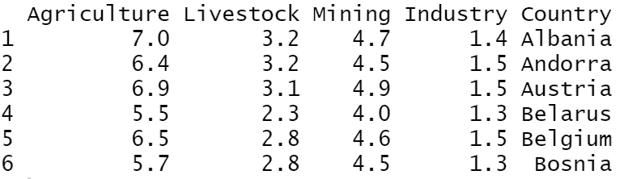

# 如何可视化多元数据分析

> 原文：<https://levelup.gitconnected.com/how-to-visualize-multivariate-data-analysis-ba7f13e230f9>

## 基于 PCA 和因子分析的图表


在本教程中，我们将使用 [**factoextra**](https://cran.r-project.org/web/packages/factoextra/index.html) R 包，并考虑[国家](https://drive.google.com/file/d/1H0Bc1dmA6RQ7iWF0w76jCjvmK-fxeR7i/view?usp=sharing)数据集。让我们开始:

```
library(factoextra)df<-read.csv("DataCountries.txt", sep="\t")head(df)
```



# 主成分分析

现在，我们将对数据集运行 PCA 分析。注意，我们只需要包含数字变量。我们还将把列`Country`设置为行名。

```
# set as rownames the column Country
rownames(df)<-df$Country# remove the Countrly columns
df$Country<-NULL# run a PCA Analysis
dfPCA <- prcomp(df, center = TRUE, scale. = TRUE)
```

让我们得到 Scree 图，它显示了由主成分解释的方差的百分比。

```
fviz_eig (dfPCA)
```


# 个人图表

让我们通过考虑因素图上个体的质量，将所有国家绘制成二维图。

```
# cos2 = the quality of the individuals on the factor map
# Select and visualize some individuals (ind) with select.ind argument.
 # - ind with cos2 >= 0.96: select.ind = list(cos2 = 0.96)
 # - Top 20 ind according to the cos2: select.ind = list(cos2 = 20)
 # - Top 20 contributing individuals: select.ind = list(contrib = 20)
 # - Select ind by names: select.ind = list(name = c("23", "42", "119") )fviz_pca_ind(dfPCA, col.ind = "cos2" , repel = TRUE)
```


# 变量图

让我们看看如何通过考虑变量的贡献，将变量表示成二维形式。

```
#  select.var = list(contrib = 2)fviz_pca_var(dfPCA, col.var = "contrib", repel = TRUE)
```


# 双标图

```
# Graph of the Biplot 
fviz_pca_biplot(dfPCA, repel = TRUE)
```


# 特征值、变量和个体

让我们看看如何获得变量和个体的特征值和统计数据，如**坐标**、对 PCs 的**贡献**和**表示质量**

**特征值**

```
# Eigenvalues
eigens_vals <- get_eigenvalue(dfPCA) eigens_vals
```


# 变量

```
# By Variable 
by_var <- get_pca_var(dfPCA) by_var$coord 
by_var$contrib 
by_var$cos2
```


**个人**

```
# By ndividual 
by_ind <- get_pca_ind(dfPCA) 
by_ind$coord 
by_ind$contrib 
by_ind$cos2
```

[](https://jorgepit-14189.medium.com/membership) [## 用我的推荐链接加入媒体-乔治皮皮斯

### 作为一个媒体会员，你的会员费的一部分会给你阅读的作家，你可以完全接触到每一个故事…

jorgepit-14189.medium.com](https://jorgepit-14189.medium.com/membership) 

*原载于*[*https://predictivehacks.com*](https://predictivehacks.com/how-to-visualize-multivariate-data-analysis/)*。*