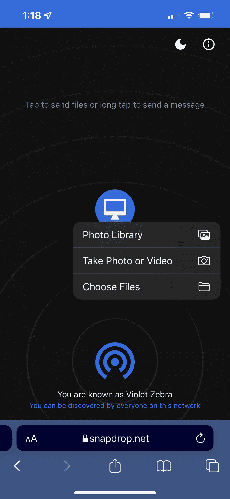
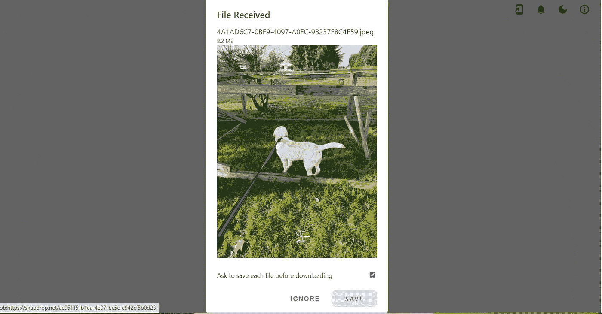

# 如何将文件/图片从 iPhone 传输到 PC

> 原文：<https://levelup.gitconnected.com/how-to-wirelessly-transfer-pictures-and-files-from-your-iphone-to-your-pc-a8da84d60af3>

如果你像我一样，你的首选手机是 iPhone，你的首选电脑运行 windows。有很多次我都想把照片或文件从我的 iPhone 传到我的电脑上，以便更好地观看，直到最近我才发现怎么做

介绍…[**Snapdrop**](https://snapdrop.net/)**一个网站，它可以让你即时将你的文件从你的 iPhone 分享到你的 PC，反之亦然。**

**Snapdrop 网站看起来和 iPhone 上的隔空投送非常相似，功能也非常相似。**

**要将照片从 iPhone 发送到 PC，首先在 Iphone 上的 Safari 中打开 [Snapdrop](https://snapdrop.net/) ，然后在 PC 上打开一个 web 浏览器(在本例中我使用的是 Chrome ),并转到那里的 [Snapdrop](https://snapdrop.net/) 。你会在你的 Snapdrop 页面底部看到你的 iPhone 的匿名名字，在下面的例子中是“紫罗兰斑马”另一方面，下面显示的我的电脑的匿名名称是“灰鬣狗”，它标有一个计算机图标。关键是让你的 iPhone 和 PC 都在 Snapdrop 上打开，并且离得很近，这样它就可以拾取每一个设备。**

**我在 iPhone 和 PC 上都打开了 Snapdrop，这使得网站可以找到每台设备。**

********

**左边是我的 iPhone(紫色斑马)显示我的电脑(灰色鬣狗)。在右边，我们打开我的电脑，显示我的 iPhone。**

**现在我们让每台设备都能找到对方，那么我们如何将照片从我的 iPhone 发送到我的 Windows 笔记本电脑呢？在你的 iPhone 上，你要点击电脑图标，一旦你点击它，一个弹出窗口会问你想分享什么。**

****

**您可以选取要从 iPhone 发送到 PC 的媒体类型**

**从这里，你可以选择“照片库”，然后将你带到你的 iPhone 的照片应用程序。然后，找到您想要发送到 PC 的照片，并在右上角单击“添加”**

**然后，您将看到您选择的图像在您电脑的 Snapdrop 网页上弹出，如下图所示。**

****

**现在你可以在你的电脑上保存到你选择的文件夹，你就完成了！多简单啊！？！**

****

**我的拉布拉多小狗的照片是在我的 iPhone 上拍摄的，并被发送到我的电脑上，以便在本文中使用**

**总之，这个网站省去了我很多麻烦，因为以前我必须把我的 iPhone 插到我的电脑上，然后手动拖放我想在电脑上查看的图片。如果你喜欢这篇文章，并且打算从现在开始像我一样使用 Snapdrop，请点击下面的按钮，关注更多提示，让你的科技生活更轻松！**