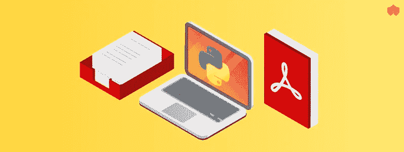

# 使用 Python 阅读和编辑 PDF 文档

> 原文：<https://levelup.gitconnected.com/how-to-work-with-a-pdf-in-python-a1e0c1d127a4>



在本文中，我们将了解如何使用 python pdf 模块来读取和修改 pdf 文件。PyPDF2 是 PyPDF 模块的更新版本，支持 python 版本 3 及更高版本。我们将通过 PyPDF2 的每个函数来处理 PDF 文件。

# 安装程序安装:

你可以在保存 python 模块文件的网站`PyPI`上找到`PyPdf2`模块。当您安装 python 时，会预先安装一个 pip 模块。使用下面的命令将在你的系统中安装`Pypdf2`。该命令对于所有操作系统都是相同的。

`pip install PyPDF2`

# 正在读取 PDF 文件:

在本节中，我们将学习如何读写 pdf 文件。首先，我们需要在程序中加载 Pypdf2 模块。

第 2 行显示我们已经在程序中加载了它们`PyPDF2`，然后我们使用 python `open()`读取方法读取 pdf 文件。但是我们做的一个改变是，我们不是在正常模式下读取，而是使用`rb`在字节模式下读取，接下来我们将具有字节形式文件的变量传递给`PdfFileReader()`函数，该函数将读取 pdf 内容。在下一行，为了验证我们是否成功地读取了 pdf 文件，我们使用了`numpages`和 `Pypdf2`的方法来计算 pdf 的页数并返回一个整数。最后，我们关闭 pdf 文件。

您可以使用`PyPDF2`从 PDF 中提取元数据和一些文本。当您对预先存在的 PDF 文件执行某些类型的自动化时，这很有用。

以下是当前可以提取的数据类型:

*   作者
*   创造者
*   生产者
*   科目
*   标题
*   页数

## 输出:

```
 Information about sample.pdf:
    Author: None
    Creator: Rave ([http://www.nevrona.com/rave](http://www.nevrona.com/rave))
    Producer: Nevrona Designs
    Subject: None
    Title: None
    Number of pages: 2
```

# 从 Pdf 中提取内容

通过使用 PyPDF 2，我们可以使用它的提取功能提取任何 PDF 的内容。检查下面的代码

正如你所看到的，我们已经实现了 reading 方法，我们将调整我们的程序，使用`extractText()`函数提取 reading pdf 文件的内容，但在此之前，我们通过使用`getPage()` a 函数获取特定页面，并将其存储在变量名`pageObj`中，然后调用`extractText()` a 方法。检查下面的输入和输出 pdf 文件。


## 输出:

```
A Simple PDF File This is a small demonstration .pdf file — just for use in the Virtual Mechanics tutorials. More text. And more text. And more text. And more text. And more text. And more text. And more text. And more text. And more text. And more text. And more text. Boring, zzzzz. And more text. And more text. And more text. And more text. And more text. And more text. And more text. And more text. And more text. And more text. And more text. And more text. And more text. And more text. And more text. And more text. Even more. Continued on page 2
```

我们可以通过迭代每个 pdf 页面并执行相同的第 10 行和第 13 行来提取 pdf 的所有页面。我们需要页面计数，以便我们的循环知道在哪里停止。记住我们在阅读部分看到的方法。我们将使用它来计算 pdf 页面，然后我们将通过设置 `i<pagecount`来使用 while 循环，在循环体中我们将第 10 行和第 13 行。我们要做的一个简单的改变是将 getPage(0)改为 getPage(i)。每次迭代值 `i` 都会增加 1，所以我们可以迭代整个 pdf。

# 逐页拆分文档:

通过使用`PyPdf2`，我们可以一页一页地分割 pdf 文件。简单来说，我们可以拆分 pdf，将每一页存储为一个 pdf。检查下面的代码。

我们导入了 pydf2 的读写方法，在下一行中，我们实现了一个函数。其中传递了 pdf 文件名，在第 6 行，我们使用 getNumPages()根据页数迭代 Pdf 文件。如果你看到 getNumPages()做了与 NumPages 相同的工作，但是在循环区域中，getNumPages()方法为 python 范围函数提供了更多的好处。在循环体中，我们设置 PdfWriter 并在 Writer 中添加当前迭代页面，然后像在编写部分中一样编写 pdf 文件。现在，循环将迭代到最后一页，并再次执行所有行。通过这种方式，我们将 pdf 文档页面分割成多个 pdf 页面。

# 逐页合并文档:

到目前为止，我们学习了如何分割 pdf 文档。在本节中，我们将学习如何使用 python 中的 Pypdf2 将两个 pdf 合并成一个 pdf。检查下面的代码。

如果你看过这段代码，你会发现这段代码有点类似于分割 pdf 的代码。有一点小小的变化，我们使用了两个循环，第一个循环将通过逐个读取 pdf 文档来迭代它们，因为我们传递了一个包含所有 pdf 文件名称的列表表单变量。在当前的例子中，我传递了 2 个 pdf 文件。接下来，在阅读 pdf 后，我们用 pdf writer 编写 pdf 的每一页，在`line # 13`上迭代所有 Pdf 文档后，我们编写 Pdf 文件。我们可以把这个过程分成三个步骤

1.  逐一阅读 pdf
2.  撰写 pdf 的每一页
3.  输出 pdf 文件

# 旋转 PDF:

`PyPdf 2`提供任意角度旋转 pdf 文档的功能。通过使用`rotateClockwise`方法，我们需要传递一个整数值。如果我们在方法中传递 90 个数字，就会将 pdf 文档中的每一页旋转 90 度。检查下面的代码

## 输出:


# 加密 PDF 文件:

有时您需要为您的文档增加一些安全性，因为没有人希望与任何人共享重要信息。您可以使用 Pypdf2 的加密方法为您的 pdf 文件添加加密。

我们做了一个函数名加密，作为参数，我们传递输入文件名、输出文件名和密码，我们希望在我们的文件上设置一个`line # 10`，我们使用了`encrypt()`。如果您查看代码行，我们给出了 3 个参数 user_pass、owner_pass 和 use_128bit。默认情况下，打开 128 位加密。如果将其设置为 False，则将应用 40 位加密。

# 结论:

这个`PyPDF2`包非常有用，而且通常很快。您可以使用`PyPDF2` it 来自动化大型工作，其功能可以帮助您更好地完成工作！你可以在 [PyPDF2 官网](https://pythonhosted.org/PyPDF2/)了解更多关于它的功能。

在本教程中，您学习了如何执行以下操作:

*   阅读 PDF 文件
*   从 PDF 中提取元数据
*   旋转页面
*   合并和分割 pdf
*   添加加密

python 中还有很多其他的 PDF 模块。您可以了解它们的功能，并在您的项目或程序中使用它们。希望你觉得这篇文章有用，并随时分享你的回应。