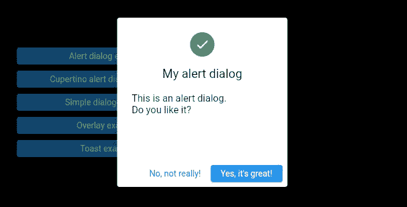
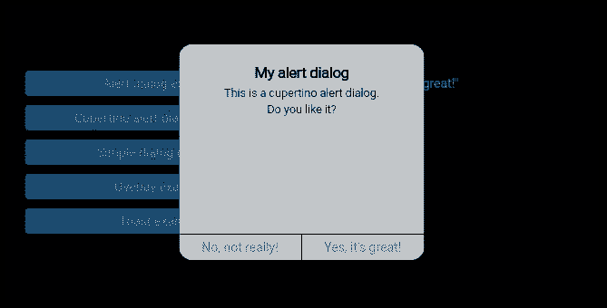
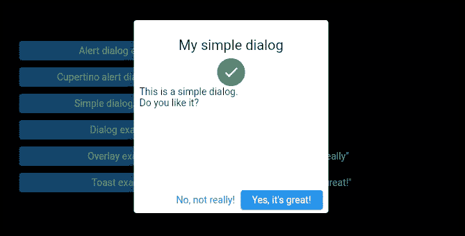
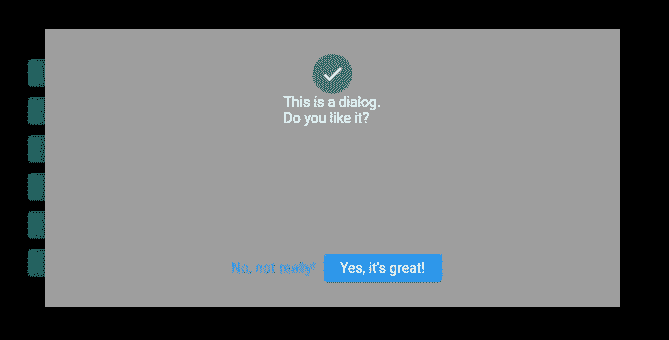
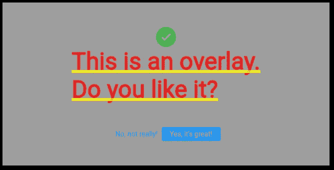
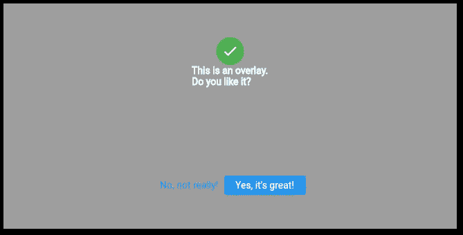
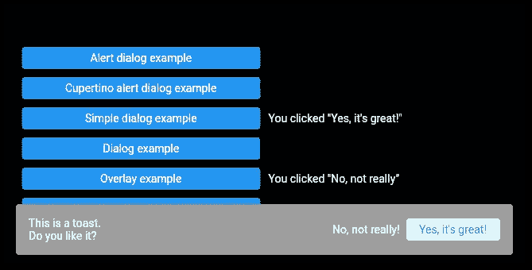

# 如何在 Flutter 应用程序中使用对话框、祝酒词和覆盖图

> 原文：<https://levelup.gitconnected.com/how-to-work-with-dialogs-toasts-and-overlays-in-flutter-apps-b53c5ce37aa6>

## 输入输出！

## Flutter 为对话框、祝酒词和覆盖图提供了预定义的小部件。下面是如何通过代码示例正确使用它们！


图片来自 Freepik 上的[故事集](https://www.freepik.com/free-vector/programming-concept-illustration_7118756.htm#query=coding&position=4&from_view=search&track=sph)

对话框是许多应用程序中的常见模式。在本文中，我将向您介绍 Flutter 创建对话框的内置可能性。我们将介绍以下小部件类型:

[AlertDialog](https://api.flutter.dev/flutter/material/AlertDialog-class.html) (和[CupertinoAlertDialog](https://api.flutter.dev/flutter/cupertino/CupertinoAlertDialog-class.html))
[简单对话框](https://api.flutter.dev/flutter/material/SimpleDialog-class.html)
[对话框](https://api.flutter.dev/flutter/material/Dialog-class.html)
[叠加](https://api.flutter.dev/flutter/widgets/Overlay-class.html)
[吐司](https://api.flutter.dev/flutter/material/SnackBar-class.html)

```
🔔 Get a short summary of my Medium content on the 1st of every month to your inbox. Save time and pick what you like to read!

Click [HERE](http://medium-newsletter.quickcoder.org/) to subscribe for free! 
```

## AlertDialog(和 CupertinoAlertDialog)

`AlertDialog`是向用户显示他需要做出反应的信息的最简单的方式。这是一个简单的小部件，有一个`title`(标题)、一个`content`(消息)和一个`actions`(一个或多个按钮)列表。

与 [CupertinoAlertDialog](https://api.flutter.dev/flutter/cupertino/CupertinoAlertDialog-class.html) 相比， [AlertDialog](https://api.flutter.dev/flutter/material/AlertDialog-class.html) 具有一些额外的特性。例如，`icon`属性可以让你在标题上添加一个图标。

要调用小部件，使用 [showDialog](https://api.flutter.dev/flutter/material/showDialog.html) 函数。如果您不希望用户通过点击对话框之外的任何地方来关闭对话框，请将`barrierDismissible`值设置为 false。例如，在这种情况下，您必须注意使用`Navigator.of(context).pop()`关闭对话框。

这里有两个对话框演示应用程序的截图:



颤振警报作者的对话示例



颤振 CupertinoAlertDialog 作者举例

## 简单对话

简单对话框给你更多的自由来设计你的对话框。基本属性只有一个`title`和一个`children`列表。它的主要目的是从一系列选项中进行选择。您可以使用 [SimpleDialogOption](https://api.flutter.dev/flutter/material/SimpleDialogOption-class.html) 小部件添加多个选择选项，而不是底部的按钮栏。和`AlertDialog`一样，`SimpleDialog`也是由`showDialog()`方法触发的。



作者的 Flutter SimpleDialog 示例

## 对话

对话框是你能拥有的最纯净的对话框。它只需要一个`child`，所以你可以用你的全部创造力来设计你想要的风格。除此之外，它的工作方式类似于`AlertDialog`和`SimpleDialog`。



作者的颤振对话框示例

## 覆盖物

一个[覆盖图](https://api.flutter.dev/flutter/widgets/Overlay-class.html)是一个将被放置在所有其他部件之上的部件。你可以把它想象成一个[堆栈](https://api.flutter.dev/flutter/widgets/Stack-class.html)小部件，但是它可以放在你应用程序的任何页面之上。您需要首先创建一个包含要显示的小部件的 [OverlayEntry](https://api.flutter.dev/flutter/widgets/OverlayEntry-class.html) 。要显示它，调用`Overlay.of(context)!.insert(overlayEntry);`。要删除它，调用`overlayEntry?.remove();`。

`Overlays`不要使用`Text`小工具的`ThemeData`。所以你需要设计所有的`Text`部件，否则你的`Overlay`看起来会像这样:



作者的颤振叠加示例



作者的颤振叠加示例

## 烤

要显示 toast 通知，可以使用 [SnackBar](https://api.flutter.dev/flutter/material/SnackBar-class.html) 。一个`SnackBar`将显示在屏幕底部，默认情况下 4 秒后自动隐藏。您可以添加任何想要的小部件，并自定义各种属性，如`dismissDirection`(向设定的方向滑动将隐藏小部件)或`duration`(小部件隐藏后的时间跨度)。

一个`SnackBar`只能在一个`Scaffold`里面使用。为了显示一个`SnackBar`，调用 [ScaffoldMessengerState](https://api.flutter.dev/flutter/material/ScaffoldMessengerState-class.html) 的`showSnackBar(…)`方法。隐藏与`hideSnackBar()`方法类似。



作者提供的 Flutter SnackBar 示例

## 结论

在本文中，您看到了不同对话框小部件之间的差异以及如何使用它们。您可以在 [GitHub](https://github.com/xeladu/flutter_dialog_examples) 上找到带有工作示例的演示应用程序。

[***通过我的推荐链接加入成千上万的媒体会员，每月只需 5 美元就可以阅读你想阅读的文章！***](https://medium.com/@xeladu/membership)

[](https://medium.com/@xeladu/membership) [## 通过我的推荐链接加入 Medium-xela du

### 只需点击一下，就可以通过会员资格访问数千篇文章！您的会员资格只需 5 美元一张…

medium.com](https://medium.com/@xeladu/membership) 

点击 [**此处**](http://medium-newsletter.quickcoder.org/) 每月一次获取我的所有中型文章汇总🔔浏览[我的 Gumroad 商店](https://xeladu.gumroad.com/)寻找有趣的编程素材🏬


xeladu

## 适合初学者的颤振文章

[View list](https://xeladu.medium.com/list/flutter-articles-for-beginners-a040ea777956?source=post_page-----b53c5ce37aa6--------------------------------)24 stories

[赛拉杜](https://xeladu.medium.com/?source=post_page-----b53c5ce37aa6--------------------------------)

## 软件工程师的高级颤振文章

[View list](https://xeladu.medium.com/list/advanced-flutter-articles-for-software-engineers-f074879fdef3?source=post_page-----b53c5ce37aa6--------------------------------)9 stories

# 分级编码

感谢您成为我们社区的一员！在你离开之前:

*   👏为故事鼓掌，跟着作者走👉
*   📰查看[级编码出版物](https://levelup.gitconnected.com/?utm_source=pub&utm_medium=post)中的更多内容
*   🔔关注我们:[推特](https://twitter.com/gitconnected) | [LinkedIn](https://www.linkedin.com/company/gitconnected) | [时事通讯](https://newsletter.levelup.dev)

🚀👉 [**加入升级人才集体，找到一份惊艳的工作**](https://jobs.levelup.dev/talent/welcome?referral=true)