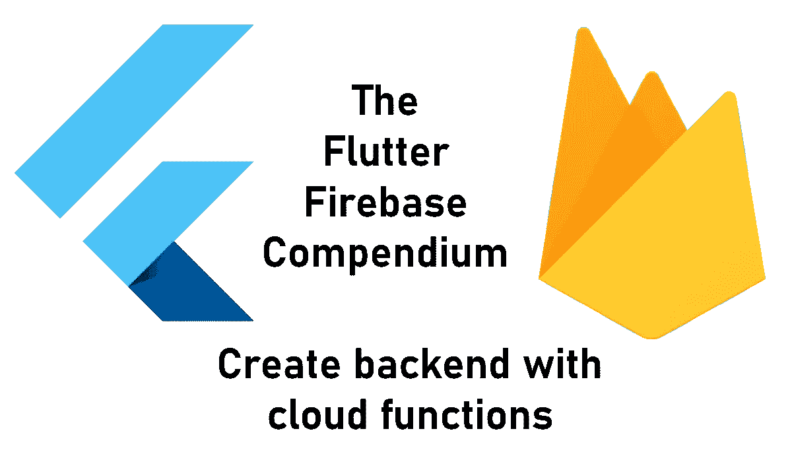
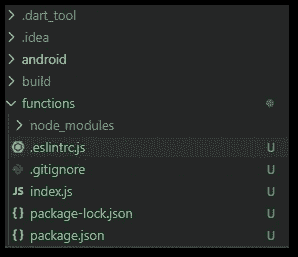
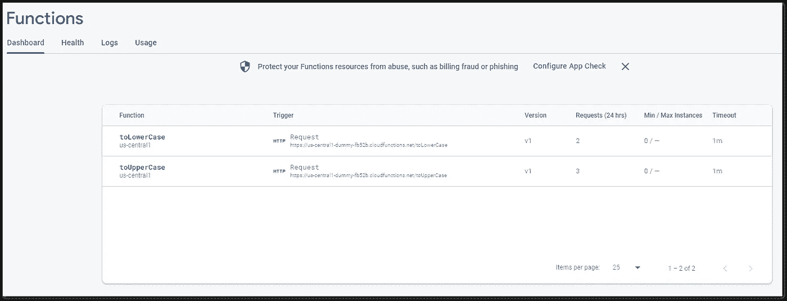
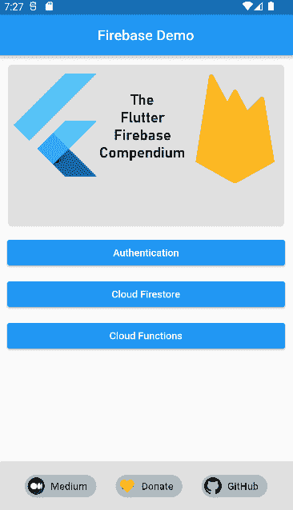
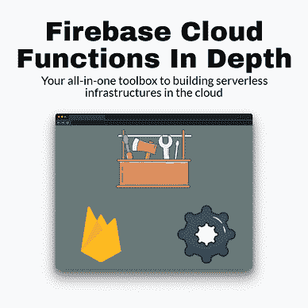
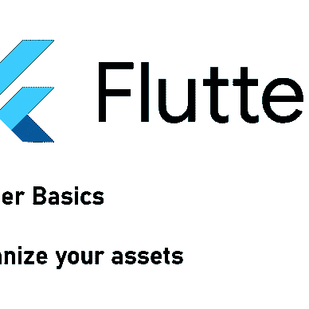
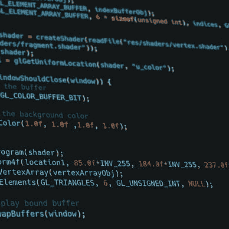

# 如何在 Flutter 应用程序中使用 Firebase 云功能

> 原文：<https://levelup.gitconnected.com/how-to-work-with-firebase-cloud-functions-from-a-flutter-app-fb818c01b0db>

## 利用外部计算能力！

## 在本文中，我将演示如何使用 Firebase 编写和部署云函数，并从 Flutter 应用程序中调用它。



Firebase Cloud Functions 是 Google 提供的一项服务，可以让你在云端执行代码。一个主要的好处是可伸缩性。如果你的应用有很多用户，你在使用 Firebase 时就不会有瓶颈。本文将涵盖以下子主题:

🔹设置 Firebase 和你的应用
🔹初始化云功能
🔹写一个云函数
🔹部署云功能
🔹调用云函数
🔹充当 HTTP 请求端点
🔹预定功能
🔹区域
🔹记录

```
👉 Do you want all the details? Check out [**my ebook**](https://xeladu.gumroad.com/l/ffc) with in-depth guides about building Flutter apps with Firebase! Buy it on [**Gumroad**](https://xeladu.gumroad.com) now!
```

## 设置 Firebase 和您的应用程序

首先，你需要设置 Firebase，并将其与你的应用程序连接。看看下面的文章，了解更多细节。

[](/how-to-create-a-firebase-project-and-link-it-with-your-flutter-app-acd826be8356) [## 如何创建一个 Firebase 项目并将其与您的 Flutter 应用程序链接

### 在本文中，我将向您展示如何创建一个 Firebase 项目，以及如何将它与您的 Flutter 应用程序链接起来。

levelup.gitconnected.com](/how-to-create-a-firebase-project-and-link-it-with-your-flutter-app-acd826be8356) 

下一步是安装 Firebase 云功能包。将其添加到您的`pubspec.yaml`中或使用命令行。如果需要进一步说明，请阅读[安装手册](https://pub.dev/packages/cloud_functions/install)或以下文章。

[](https://xeladu.medium.com/how-to-install-packages-in-your-flutter-app-e7f7e62711ee) [## 如何在你的 Flutter 应用中安装包

### 这篇短文展示了如何将包添加到一个 Flutter 应用程序中，这样你就可以使用现有的代码并加速…

xeladu.medium.com](https://xeladu.medium.com/how-to-install-packages-in-your-flutter-app-e7f7e62711ee) 

设置完成。现在可以开始编写函数了。🎉

## 初始化云函数

通过运行命令`firebase login`登录 Firebase。然后，从你的项目根目录运行命令`firebase init functions`。该工具将询问一些您需要回答的问题。我给你一个回答工作流程的例子。

🔹你准备好继续了吗？→是
🔹请选择一个选项:→使用现有项目
🔹你想用什么语言写云函数？→ JavaScript
🔹你想使用 ESLint 来捕捉可能的错误并加强风格吗？→否
🔹您想现在安装与 npm 的依赖关系吗？→是

成功完成后，您将在项目结构中找到一个新的 functions 文件夹。



作者初始化后函数文件夹的屏幕截图

下一步是编写将在云中执行的实际代码💨

## 编写一个云函数

我们的演示代码将是一个函数，它将一个字符串作为参数，并将输入转换为大写。这很简单，但它应该给你一个你能做什么和如何实现它的想法。

我们打开 functions 文件夹中的`index.js`并编写以下代码:

我们用两个参数定义了一个名为 toUpperCase 的可调用方法。`data`包含我们想要转换的字符串，第二个参数是一个 [CallableContext](https://firebase.google.com/docs/reference/functions/firebase-functions.https.callablecontext) ，我们在这个例子中不需要它。然后我们使用 JavaScript 的内置 [toUpperCase](https://www.w3schools.com/jsref/jsref_toUpperCase.asp) 方法并返回结果。就这么简单🎆

💡**你的代码应该是幂等的！**这意味着即使多次调用，它也会产生相同的结果。确保坚持这种模式，因为它将允许您非常容易地重试失败的执行。

💡您也可以将 TypeScript 用作编程语言。只是一定要在初始化的时候用“TypeScript”而不是“JavaScript”来回答问题。不幸的是，目前没有任何其他支持的语言。

## 部署云功能

部署非常简单，只需运行命令`firebase deploy --only functions`并等待该过程完成。可能需要 5 分钟才能更新您的仪表板。仪表板还提供关于日志和函数使用情况的信息。



按作者划分的 Firebase 函数仪表板的屏幕截图

## 调用云函数

一个可调用的函数可以通过`functions.http.onCall((data, context) => {...});`方法来识别。Firebase 仪表板不区分可调用函数和 HTTP 端点，两个触发器都将“请求”显示为一种类型。要调用名为 toUpperCase()的函数，请看下面的代码示例:

## HTTP 请求端点

使用代码`functions.https.onRequest((request, result) ⇒ {...});`您可以定义一个 HTTP 端点，其他 web 服务可以按需调用它。通过这种方式，您可以为第三方软件定义接口来操作您的数据或逻辑。您甚至不需要 Firebase 包来调用端点，而是需要一些东西来创建请求，如 [http](https://pub.dev/packages/http) 或 [Dio](https://pub.dev/packages/dio) 。看一下示例代码:

💡您需要将该函数的链接替换为您部署的版本！`<server>`和`<projectId>`也只是占位符。

我还用演示代码写了一篇文章，介绍如何在 Flutter 中创建和发送 HTTP 请求，如果您不熟悉这个主题，这可能会有所帮助。

[](/how-to-make-http-requests-with-flutter-and-parse-json-result-data-ae1f5794f53) [## 如何用 Flutter 发出 HTTP 请求并解析 JSON 结果数据

### 这篇短文展示了如何从 Flutter 应用程序中执行 HTTP 请求。我们来看看最常见的…

levelup.gitconnected.com](/how-to-make-http-requests-with-flutter-and-parse-json-result-data-ae1f5794f53) 

❗默认情况下，任何人都可以访问 HTTP 端点。确保实现像授权令牌这样的安全措施。[点击此处](https://github.com/firebase/functions-samples/blob/main/authorized-https-endpoint/functions/index.js)查看如何保护您终端的官方示例。

## 安排一个功能

也可以安排一个函数的执行。时间间隔或时间范围既可以用[应用引擎 cron.yaml](https://cloud.google.com/appengine/docs/standard/python/config/cronref) 语法来描述，也可以用传统的 Unix crontab 语法来描述。下面的代码示例定义了每 10 分钟执行一次的函数。

下一个示例使用 Unix crontab 语法并定义一个时区。点击[此处](https://en.wikipedia.org/wiki/List_of_tz_database_time_zones)查看所有支持时区的列表。

## 地区

Firebase 使用影响定价和延迟的不同区域。您可以用`region()`方法和一个有效的区域名作为参数来指定您想要的区域。例子:`functions.region(”europe-west3”)`。点击[此处](https://firebase.google.com/docs/functions/locations)查看所有可用区域列表。我建议使用离你最近的地区。您也可以将多个用逗号分隔的区域传递给函数。

## 记录

要监控函数的执行，可以使用[日志](https://firebase.google.com/docs/functions/writing-and-viewing-logs)。输出将在 Firebase 函数仪表板中可见。

```
const functions = require("firebase-functions");
functions.logger.log("This is log:", someObj);
functions.logger.info("This is info:", someObj);
functions.logger.warn("This is warn:", someObj);
functions.logger.error("This is error:", someObj);
```

关于日志的更多细节可以在[官方文档](https://firebase.google.com/docs/functions/writing-and-viewing-logs?hl=en&authuser=0)中找到。

## onCall()还是 onRequest()？

可调用函数和 HTTP 函数非常相似。**可调用函数是带有特殊请求参数**的 HTTP 函数。[主要区别](https://firebase.google.com/docs/functions/callable?hl=en&authuser=0)在于 Firebase 和 Firebase 云消息的认证令牌以及应用检查令牌会自动包含在可调用函数的请求中(如果可用)。此外，默认情况下，一个可调用的函数会验证这些令牌。这意味着**如果你使用[云函数包](https://pub.dev/packages/cloud_functions)的`onCall()`方法，你可以免费获得**认证特性。

如前所述， **HTTP 函数默认没有集成任何访问控制特性**。你必须自己去做。但是，如果您提供了正确的数据，也可以用 HTTP 请求执行可调用的函数。欲了解更多详细信息，请阅读此处的文档[。](https://firebase.google.com/docs/functions/callable-reference?hl=en&authuser=0)

如果你的应用程序是唯一的消费者，✔ Go 带有可调用函数

如果你有第三方消费者(例如一个公共 rest API ),✔使用 HTTP 函数，但是要确保实现访问控制和其他安全机制。

## 结论

Firebase 云函数提供了一种在你的 Flutter 应用中使用外部计算能力的简单方法。这里有一个简短的源代码演示视频。



作者演示的 Firebase 云函数

您可以在我的 GitHub 页面上找到完整的示例源代码。

[](https://github.com/xeladu/flutter_firebase) [## GitHub - xeladu/flutter_firebase

### 这是附带代码示例的 Flutter Firebase 概要的配套应用程序。颤振燃烧基地纲要是一个…

github.com](https://github.com/xeladu/flutter_firebase) 

这篇文章是 Flutter Firebase 纲要的一部分，其中有许多教程和操作指南，介绍了 Firebase 与 Flutter 应用程序相结合的可能性。


[赛拉杜](https://xeladu.medium.com/?source=post_page-----fb818c01b0db--------------------------------)

## 了解 Flutter 和 Firebase 的威力

[View list](https://xeladu.medium.com/list/learn-about-the-power-of-flutter-and-firebase-2ec07e25baba?source=post_page-----fb818c01b0db--------------------------------)13 stories

用我的电子书为 Flutter 开发者充分利用 Firebase。

[](https://xeladu.gumroad.com/l/ffc) [## 颤振燃烧基础概要

### 这本电子书着重于让你能够在你的应用中集成 Firebase 云服务。当你想要的时候，它是一个跳跃的开始…

xeladu.gumroad.com](https://xeladu.gumroad.com/l/ffc) 

[***通过我的推荐链接加入成千上万的媒体会员，每月只需 5 美元就可以阅读你想阅读的文章！***](https://medium.com/@xeladu/membership)

[](https://medium.com/@xeladu/membership) [## 通过我的推荐链接加入 Medium-xela du

### 只需点击一下，就可以通过会员资格访问数千篇文章！您的会员资格只需 5 美元一张…

medium.com](https://medium.com/@xeladu/membership) 

点击 [**此处**](https://xeladu.medium.com/subscribe) 将我所有的新文章发送到你的邮箱🔔
浏览[我的口香糖商店](https://xeladu.gumroad.com/)寻找有趣的编程素材🏬


[赛拉杜](https://xeladu.medium.com/?source=post_page-----fb818c01b0db--------------------------------)

## 适合初学者的颤振文章

[View list](https://xeladu.medium.com/list/flutter-articles-for-beginners-a040ea777956?source=post_page-----fb818c01b0db--------------------------------)24 stories

[赛拉杜](https://xeladu.medium.com/?source=post_page-----fb818c01b0db--------------------------------)

## 软件工程师的高级颤振文章

[View list](https://xeladu.medium.com/list/advanced-flutter-articles-for-software-engineers-f074879fdef3?source=post_page-----fb818c01b0db--------------------------------)9 stories