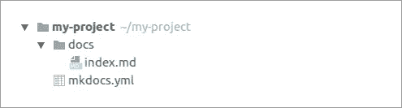
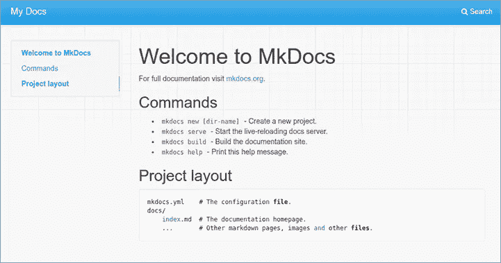
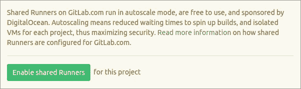
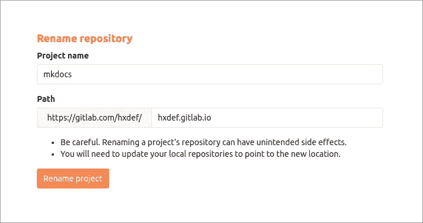
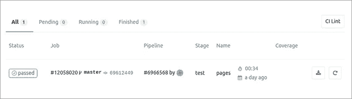

# 如何使用项目文档

> 原文：<https://levelup.gitconnected.com/how-to-work-with-project-documentation-3875135f0881>


[由 ADCI 解决](https://www.adcisolutions.com/?utm_source=medium&utm_medium=referral&utm_campaign=medium-publication-project-documentation-mainwebsite&utm_content=medium-publication-project-documentation)

详细的**文档的存在对于任何项目来说都是重要的事情之一。不管你是使用一些复杂的系统还是这类系统的开发者。所以，我相信大家都很清楚我们需要项目文档的目的是什么。在这篇文章中，我们将进一步了解另一件事。我想提出一种方法，它将帮助您处理您的文档并与其他用户共享它们。它由三个主要步骤组成:选择源文件的格式，生成静态站点，并在基于 git 的托管服务上部署这个站点。**

首先，我想简单介绍一下我将在提议的方法中使用的一些技术。我将重点介绍作为编写源文件的基础语言的 [Markdown](https://daringfireball.net/projects/markdown/) 。静态站点的一个例子将由 [MkDocs](http://www.mkdocs.org/) 工具生成。此外，我们将详细了解部署过程。

# 降价

当您开始处理项目文档时，首先需要决定源文件使用的格式。无论是 html、Markdown、纯文本还是其他。在这种情况下，有必要了解你希望看到什么样的最终结果。一个好的解决方案是使用 Markdown 语言。在这种情况下，您不需要努力创建一个完整的 html 标记。同时，如果有必要的话，可以将你的文档转换成 html 格式。


Markdown 是一种轻量级的标记语言，专门为这种目的而设计。Markdown 通常用于**创建自述文件和项目文档**。下面是一些语法示例。当然，这不是一个完整的指南:可以在官方网站上找到 Markdown 语法的完整描述。

最常见的语法元素有:

## 标题

```
#Heading                      <h1>Heading</h1>##Sub-heading                 <h2>Sub-heading</h2>
```

## 文本属性

```
_italic_, *italic*            <em>italic</em>, <em>italic</em>__bold__, **bold**            <strong>bold</strong>, <strong>bold</strong>`monospace`                   <code>monospace</code>
```

## 水平标尺

```
---                           <hr />
```

## 项目符号列表

```
Bullet list:                  <p>Bullet list:</p><ul>* one                         <li>one</li>* two                         <li>two</li>* three                       <li>three</li></ul>
```

## 编号列表

```
Bullet list:                  <p>Numbered list:</p><ol>1\. one                        <li>one</li>2\. two                        <li>two</li>3\. three                      <li>three</li></ol>
```

## 环

```
[Link](http://example.com)    <a href=”http://example.com”>Link</a>
```

## 引文

```
> Quoted text                 <blockquote>Quoted text</blockquote>
```

## 形象

```

```

在这个列表中，您可以找到 Markdown 语法元素和生成的 html 之间的匹配。在 Markdown 中通常被视为特殊字符的字符可以用反斜杠进行转义。例如，序列“\*”将打印“*”符号，而不是斜体文本的开始符号。

# 静态站点生成器

假设我们已经有了一组使用 Markdown 语言编写的文档。如果您编写了一个简单的自述文件，请保持原样。但是，如果您的文档由几个文件组成并且结构复杂，这是将其编译为一个网站的好理由。在这种情况下，每个降价文件将有一个适当的 html 文件。还有，会有头版。通常，这个页面包含一个普通的描述和一些到其他页面的链接。

实际上，您不需要手动完成所有工作。有很多专门的**搭建静态网站的工具** (Jekyll，Hugo，GitBook，MkDocs 等等)。[在这里](https://www.staticgen.com/)你可以找到相当大的最受欢迎项目的评级。在我的例子中，我将使用 MkDocs。因此为了更好的理解，我想对它的功能做一个简短的回顾。

# MkDocs

MkDocs 是一个流行的静态站点生成器，旨在构建项目文档。它使用用 Markdown 编写的源文件。要指定项目结构，您需要编辑 yaml 配置文件( *mkdocs.yml* )。下面是这样一个文件的例子:

```
site_name: MkLorumpages:- Home: index.md- Articles:- Article 1: articles/article-1.md- Article 2: articles/article-2.md- About: about.mdtheme: readthedocs
```

它包括一个站点名称( *site_name* 参数)、一个带有导航链接的页面结构( *pages* 参数)和一个主题( *theme* 参数)，该主题将用于整个站点的风格化。页面的导航链接可以具有嵌套结构。它有助于按必要的类别对页面进行分组。此外，对于 MkDocs 来说，有一个很好的[内置](http://www.mkdocs.org/user-guide/styling-your-docs/)和[第三方](https://github.com/mkdocs/mkdocs/wiki/MkDocs-Themes)主题的集合，这有助于定制你的站点。

为了开始，有必要创建一个新项目。

```
mkdocs new my-projectcd my-project
```

默认情况下，新项目具有以下结构:



有一个名为 *mkdocs.yml* 的配置文件和一个带有 *index.md* 文件的 docs 文件夹。该文件包含一些代码示例。它会帮助你感受到 Markdown 语言的简单性和灵活性。尤其是当你第一次使用这种语言的时候。

MkDocs 带有一个内置的开发服务器。这允许您在本地查看工作结果。换句话说，您不需要在某个地方部署您的站点来检查一切是否正常工作。要启动 dev-server，需要转到根项目目录( *mkdocs.yml* 文件所在的位置)并运行 *mkdocs serve* 命令。

```
~/my-project$ mkdocs serveINFO    -  Building documentation...[I 170311 18:04:57 server:271] Serving on [http://127.0.0.1:8000](http://127.0.0.1:8000)[I 170311 18:04:57 handlers:58] Start watching changes
```

现在应该可以通过输入以下 URL 在 web 浏览器中打开您的站点了— [http://127.0.0.1:8000](http://127.0.0.1:8000/) 。如果你设置正确，你会看到类似这样的东西(外观取决于 mkdocs 的版本和选择的主题):



基于已有的文档集，你可以构建最终的静态站点( *mkdocs build* 命令)。所有必要的文件都将存储在*站点的*文件夹中。

```
~/my-project$ mkdocs buildINFO    -  Building documentation to directory: ~/my-project/site
```

所以，它只需要解决一个问题——如何与其他用户分享你的结果？

# 部署

实际上，你可以有很多选择来处理这个问题:无论是你的本地服务器，云主机还是其他什么。一切取决于你想达到什么目标。

让我们看看当你有一个开源项目并且项目文档必须对每个人都是可访问的时候的情况。在这种情况下，一个好的选择是使用一些免费的**服务来托管静态网站**。GitHub 和 GitLab 就是很好的例子。除了版本控制系统，你将获得一个工作流程来处理你的文档，使用持续集成的能力和其他有用的东西。为了避免毫无根据，接下来我将为您提供一个在 [GitLab](https://about.gitlab.com/) 上配置这样一个环境的例子。

# GitLab 页面

**GitLab** 支持很多生成静态站点的工具。[在这里](https://gitlab.com/groups/pages)你可以找到很多有用的例子。它还包括[一个支持](https://gitlab.com/pages/mkdocs) [GitLab 持续集成](https://www.adcisolutions.com/knowledge/continuous-integration-drupal-8-and-gitlab-cicd?utm_source=medium&utm_medium=referral&utm_campaign=medium-publication-project-documentation-GitlabCI&utm_content=medium-publication-project-documentation)的 MkDocs 站点的示例。我们来叉一下这个考点。如果您不打算参与上游项目，请转到您的项目设置并移除分叉关系。

接下来，您需要确保为您的项目启用了[共享通道](https://docs.gitlab.com/ce/ci/runners/README.html)(设置->“CI/CD 管道”，然后单击“启用共享通道”)。它会给你带来几个好处。您的构建将在一个单独的虚拟机上运行，该虚拟机使用 [Docker](https://www.docker.com/) 容器。这种方法最小化了安全问题的可能性，因为容器具有隔离的架构。为新项目激活共享跑步者。因此，您可能不需要做任何事情来激活它们。



默认情况下，您的项目页面将在【https://username.gitlab.io/projectname】的[T5可用。这个配置被称为](https://username.gitlab.io/projectname.)[一个项目页面](https://docs.gitlab.com/ce/user/project/pages/introduction.html#project-pages)。可以不在 URL 中使用项目名称部分。为此，请转到项目设置页面(点击“齿轮”图标，然后点击“编辑项目”链接)，并将项目重命名为 *username.gitlab.io* 。现在你的建造可以在 https://username.gitlab.io/[](https://username.gitlab.io/)*获得。这种配置被称为[用户页面](https://docs.gitlab.com/ce/user/project/pages/introduction.html#user-or-group-pages)。*

**

*除了这些默认配置，您还可以使用自定义域和 ssl/tls 证书来设置[。](https://docs.gitlab.com/ee/user/project/pages/getting_started_part_three.html)*

# *GitLab CI*

*如果任何打开项目/用户页面的尝试都返回 404 错误，请不要担心。发生这种情况是因为您当前没有项目的构建。为了触发一个构建过程，有必要向项目存储库提交和推送一些东西。顺便说一下，你可以从浏览器直接在 GitLab 中编辑文件。*

*一旦添加了更改，构建过程就会开始。在构建过程中将执行的一组操作取决于指定的设置。GitLab Runner 将从一个名为。gitlab-ci.yml .我们来看看这个文件的结构。*

```
*image: python:alpinebefore_script:- pip install mkdocs## Add your custom theme if not inside a theme_dir## (https://github.com/mkdocs/mkdocs/wiki/MkDocs-Themes)# - pip install mkdocs-materialpages:script:- mkdocs build- mv site publicartifacts:paths:- publiconly:- master*
```

*在这种情况下， **GitLab Runner** 用 Python 启动了一个基于 Docker 映像的容器(这是 MkDocs 所必需的)。在对项目文件进行任何操作之前，它会安装 *mkdocs* 包。接下来，像往常一样，它运行 *mkdocs build* 命令，并将一个“ *site* ”文件夹重命名为“ *public* ”。请记住，Runner 将只跟踪来自主分支的变更。可以自定义*。gitlab-ci.yml* 文件。此外，在将设置添加到项目之前，可以检查您的设置( [CI Lint tool](https://gitlab.com/users/sign_in) )。*

*每个构建过程的状态可以直接在 GitLab 站点上获得(Pipelines->Jobs，然后单击所选作业的状态)。有时，检查这一点可能有助于发现部署中的任何问题。“*通过*状态表示构建过程成功。现在你可以享受你的项目文档的新网站了！*

**

# *结论*

*在本文中，我回顾了处理项目文档的方法。它包括选择源文件的格式、生成静态站点以及在基于 git 的托管服务上部署该站点。这种方法将帮助您选择必要的工具来编写和部署您的文档，以防您希望与所有人共享它。让我们列出一些关键时刻:*

*源文件的格式*

*   *我重点介绍了作为编写源文件的基础语言的 Markdown。*
*   *Markdown 允许使用易于阅读的纯文本格式，但同时也有能力将您的文件转换为 html。*

*静态站点生成器*

*   *如果你的文档由几个文件组成，并且结构复杂，这是一个很好的理由，通过使用一些静态站点生成器将它编译成一个网站。*
*   *有很多专门搭建静态网站的工具(Jekyll，Hugo，GitBook，MkDocs 等等)。您选择的工具取决于您的需求。*

*部署*

*   *如果你有一个开源项目，并且项目文档必须对每个人都可用，那么使用一些基于 git 的托管服务是一个不错的选择，比如 GitHub 或 GitLab。*

*这就是我在这篇文章中想告诉你的一切。希望所描述的方法和提供的示例对您有用。*

**最初发布于*[*ADCI 解决方案网站。*](https://www.adcisolutions.com/knowledge/how-work-project-documentation?utm_source=medium&utm_medium=referral&utm_campaign=medium-publication-project-documentation-article&utm_content=medium-publication-project-documentation)*

*作者是 ADCI 解决方案公司的团队负责人叶夫根尼·列昂诺夫。*

*展示项目中不同角色的同等熟练程度:从开发人员到团队领导。尽管 Evgeny 是一个丰富技术堆栈的专家，但他设法在弹吉他、学日语和健身之间保持平衡。*

**

*在社交网络上关注我们: [推特](https://twitter.com/ADCISolutions) | [脸书](https://www.facebook.com/adcisolutions/) | [LinkedIn](https://www.linkedin.com/company/adci-solutions/)*

*[](https://medium.com/drupal-stories-an-insiders-view/top-9-responsive-drupal-e-commerce-themes-70d9acad81dd) [## 9 大响应 Drupal 电子商务主题

### 在过去的几年里，电子商务改变了人们在网上买卖的方式。互联网提供了一个快速和…

medium.com](https://medium.com/drupal-stories-an-insiders-view/top-9-responsive-drupal-e-commerce-themes-70d9acad81dd)*