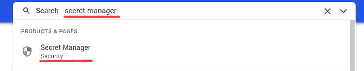
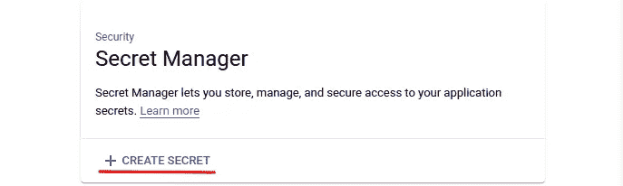
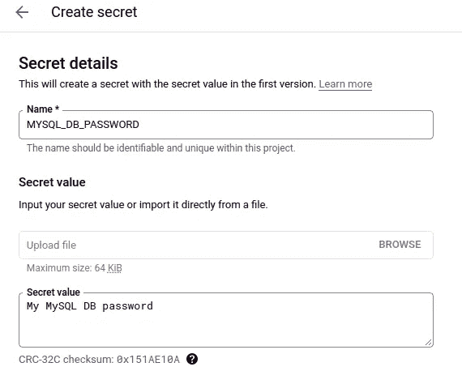
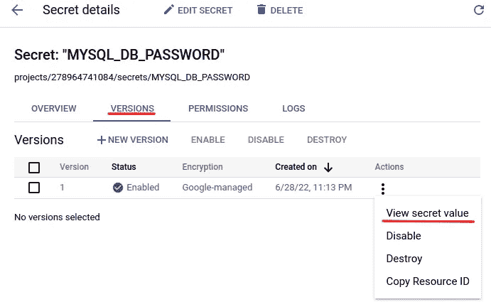
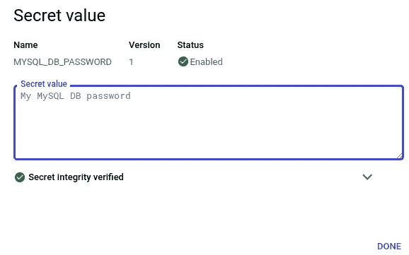
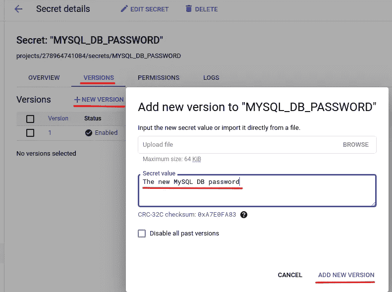
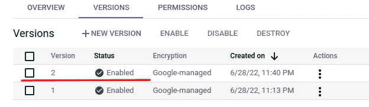
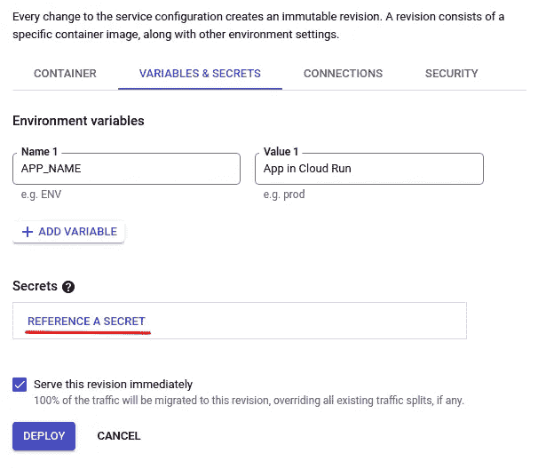
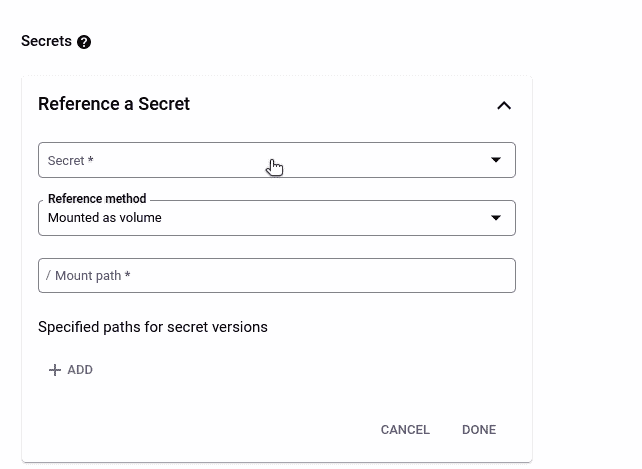
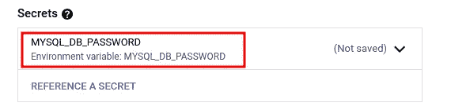

# 如何在谷歌云平台上使用秘密(GCP)

> 原文：<https://levelup.gitconnected.com/how-to-work-with-secrets-in-google-cloud-platform-gcp-ebfcad03b8cf>

## 了解管理敏感数据的更好方法


图片由 [geralt](https://pixabay.com/photos/fingerprint-unlock-network-man-2904774/) 在 Pixabay 拍摄

应用程序通常需要一些敏感数据，如 API 密钥、数据库密码、私钥等。通常将它们存储为环境变量。但是，这不是一个好的做法，因为环境变量的值是以纯文本的形式设置和存储的，因此很容易被发现。如果你的应用程序托管在谷歌云平台(GCP)上，你可以使用秘密管理器来管理这些敏感数据，这是一个非常安全和方便的解决方案。在这篇文章中，我们将介绍在我们的应用程序中使用 Secret Manager 的要点。

## 准备

如果你刚到 GCP，你可以根据[这个帖子](/how-to-set-up-your-local-environment-to-work-with-gcp-4ed0a11421ef)来设置你当地的开发环境。

如果你用你的私人 Google 账号创建了一个项目，那么你就是项目的所有者，不需要担心权限问题。然而，如果你在一个团队中工作，你需要被授予[秘密管理者](https://cloud.google.com/secret-manager/docs/access-control)的角色，如果你想遵循这篇文章中的所有指示。通常，作为开发人员，您可能没有这个管理员角色，而只有一些有限的角色来创建秘密版本或只是查看秘密。请查看[此链接](https://cloud.google.com/secret-manager/docs/access-control)了解秘密管理者的精细角色。

## 创造一个秘密

通常我们不需要在代码中以编程的方式创建秘密。我们只需要在需要创建或更新敏感数据时不时地手动执行。因此，在 GCP 控制台中创建秘密更方便，在那里你可以得到很多有用的提示，比如什么、为什么和如何。

在 GCP 控制台中，搜索“秘密管理器”并选择下面显示的一个:



然后单击“创建密码”创建一个新密码:



在打开的页面上，输入机密的名称，该名称在项目中必须是唯一的。因此，请给它一个易于识别的描述性且唯一的名称。



您可以直接输入您的密码值，也可以从文件中导入。在这里直接输入敏感数据是安全的，因为除非你在一个不安全的环境中工作，并且有人在看着你的屏幕，否则它不会在任何地方泄露👀。对于通常已经存储在文本文件中的私钥，直接上传文件更方便。

您可以保持所有其他选项不变，因为默认选项在大多数情况下已经足够了。当然，通过微调这些选项，您可以对如何管理秘密进行更细粒度的控制。现在点击“创建密码”来创建密码。

创建密码的 gcloud 命令是

```
$ gcloud secrets create my-secret --data-file=/tmp/secret
```

在终端本地，最好通过数据文件而不是纯文本来指定秘密值，因为后者可能会在 Linux 命令历史中暴露出来，这本身就是一个安全问题。

## 检查秘密值

对于秘密管理者创造的秘密，一个很重要的概念就是“版本”。秘密版本包含秘密的实际值。一个秘密可以包含多个版本，从 1 开始依次命名。默认情况下，如果没有指定版本 id，则使用版本号最大的最新版本。我们还可以通过指定版本 id 来访问特定版本的值。

使用版本控制特性的一个好处是，具有不同值的相同秘密可以用于不同的环境，从而最小化要维护的秘密的数量。例如，我们通常为开发、试运行和生产环境提供不同的 API 键。对于这些环境，我们可以使用同一个秘密的不同版本。

让我们检查一下我们的秘密的第一个版本的价值:



检查密码值的 gcloud 命令是:

我们可以通过版本 id 或“最新”标签来访问秘密版本。

## 添加秘密版本

如果我们需要为不同的环境拥有不同的值，或者仅仅是因为我们需要更新秘密的值，我们可能需要添加秘密版本。

在 GCP 控制台中创建新版本很简单:



为密码创建新版本的 gcloud 命令是:

```
$ gcloud secrets versions add secret-id --data-file=/tmp/secret
```

## 在应用程序代码中直接使用 secret

作为开发人员，我们主要关注的是如何在应用程序代码中使用秘密管理器创建的秘密。为此，我们需要为特定的编程语言安装一个 Secret Manager 客户端库。如果使用 Python，可以使用`pip`安装客户端库:

建议创建一个[虚拟环境](https://lynn-kwong.medium.com/how-to-create-virtual-environments-with-venv-and-conda-in-python-31814c0a8ec2)，并在那里安装客户端库，这样它就不会与您的系统库混淆。

然后，我们可以使用以下代码来读取机密的值，并在我们的应用程序中使用它进行身份验证:

注意事项:

*   如果你遇到认证问题，请看看[这篇文章](https://medium.com/p/4ed0a11421ef)，它很可能会解决你的问题。
*   我们需要用项目 ID、秘密 ID 和版本 ID 构造一个完整的资源名称，然后用它来访问秘密。项目 ID、秘密 ID 和版本 ID 可以存储为环境变量。
*   默认情况下，该值作为二进制字符串返回，在大多数情况下，我们需要[将](https://lynn-kwong.medium.com/understand-the-encoding-decoding-of-python-strings-unicode-utf-8-f6f97a909ee0)解码为普通字符串。

## 将机密作为环境变量挂载

正如您在上面发现的，如果我们需要直接访问秘密值，我们需要使用客户端库。然而，有时你的代码会严重依赖环境变量或秘密文件，例如当你使用 [Pydantic](https://lynn-kwong.medium.com/how-to-use-pydantic-to-read-environment-variables-and-secret-files-in-python-8a6b8c56381c) 库来管理这些数据时。在这种情况下，如果您想摆脱 Pydantic 并直接使用 Secret Manager 客户端库，就需要进行重大的重构。

幸运的是，我们不需要这样做！对于像 Cloud Run 这样的 GCP 服务，我们可以将秘密作为环境变量挂载，并在 Pydantic 中直接使用它们。根本不需要重构工作。

从头开始创建云运行微服务需要做大量工作，因为您需要为微服务准备代码(通常是一些 API 代码)以及如何构建和部署服务。请查看[这篇文章](https://betterprogramming.pub/how-to-deploy-a-web-application-to-cloud-run-automatically-6967d7c7d42a)，了解如何从头开始部署云运行服务。这里我们将只关注如何将一个秘密暴露为一个环境变量或一个挂载的卷。

您可以编辑您的云运行服务并切换到“变量和秘密”选项卡，在这里您可以引用一个秘密并将其用作环境变量:



当您单击“引用机密”时，您可以指定机密 id、版本 id 以及如何在您的云运行服务中引用它:



现在你可以在你的代码中使用 secret 作为一个环境变量，而根本不需要修改你的代码，这非常方便。

在这篇文章中，我们介绍了如何使用秘密管理器创建、更新和访问秘密。一个非常重要的概念是版本化，每个版本存储一个独立的秘密值，便于维护。我们还介绍了如何使用 Python 访问应用程序代码中的秘密。最后但同样重要的是，我们可以在云运行服务中将秘密作为环境变量公开，这让我们可以方便地利用秘密的安全特性，而无需对代码进行重大重构。

相关文章:

*   [如何设置您的本地环境以便与 GCP 一起工作](https://medium.com/p/4ed0a11421ef)
*   [如何使用 pydantic 读取 Python 中的环境变量和秘密文件](https://lynn-kwong.medium.com/how-to-use-pydantic-to-read-environment-variables-and-secret-files-in-python-8a6b8c56381c)