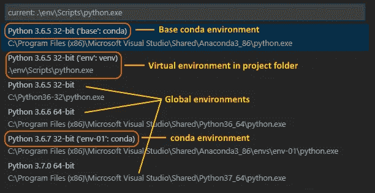
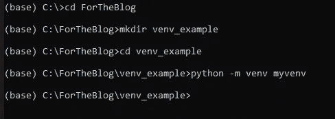
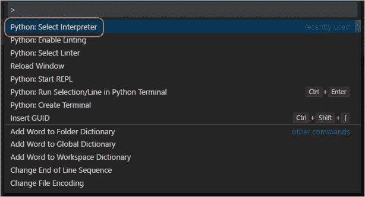
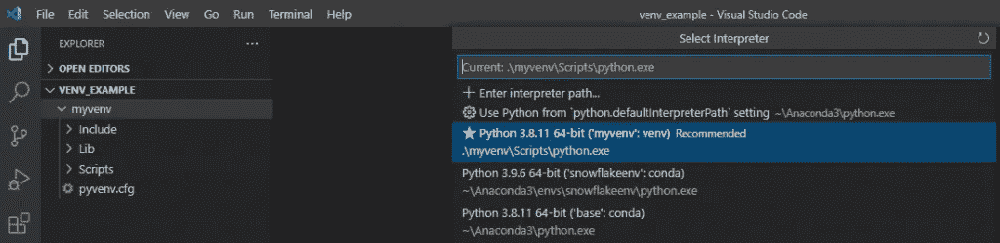
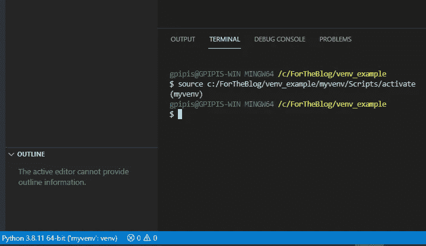
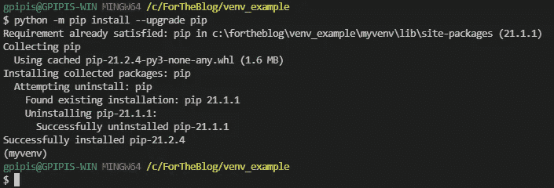
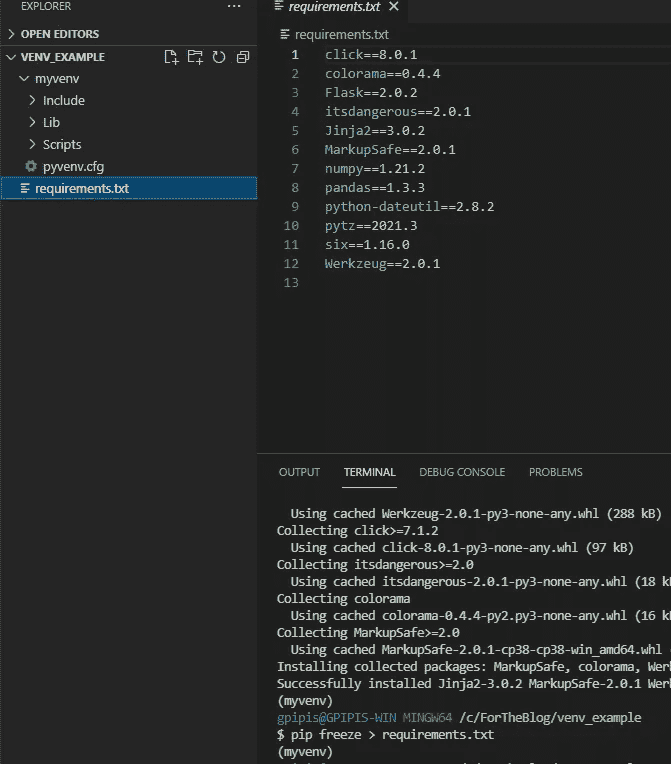

# 如何在 Python 中使用 VS 代码和虚拟环境

> 原文：<https://levelup.gitconnected.com/how-to-work-with-vs-code-and-virtual-environments-in-python-5aa4f65afb3d>

## 如何在 VS 代码中使用 Python 虚拟环境的演练示例



[上的图像 VS 代码](https://code.visualstudio.com/assets/docs/python/environments/interpreters-list.png)

[](https://jorgepit-14189.medium.com/membership) [## 用我的推荐链接加入媒体-乔治皮皮斯

### 阅读乔治·皮皮斯(以及媒体上成千上万的其他作家)的每一个故事。您的会员费直接支持…

jorgepit-14189.medium.com](https://jorgepit-14189.medium.com/membership) 

我们已经提供了[如何与康达环境](https://predictivehacks.com/working-with-anaconda-environments/)合作的例子。在本帖中，我们将为您提供一个如何使用 VS 代码和虚拟环境的示例。

## 为什么使用虚拟环境

当我们从事一个数据科学项目时，它可能包括一个 Flask API，最好对项目中使用的库有完全的控制权。此外，只使用必要的库会更有效。这是因为在虚拟环境中，项目是可复制的，我们只需要安装`requirements.txt`中提到的所需的库。最后，在虚拟环境中工作时，干扰其他项目的风险会更小。

## 创建项目环境

对于这个例子，我们将我们的项目命名为“ **venv_example** ”，并且我们已经创建了一个同名的文件夹。在该文件夹中，我们可以通过运行以下命令创建一个名为" **myvenv** "的虚拟环境:



```
# Linux
sudo apt**-**get install python3**-**venv    # If needed
python3 **-**m venv myvenv# macOS
python3 **-**m venv myvenv# Windows
python **-**m venv myvenv
```

然后，我们可以使用**文件** > **打开文件夹**命令从 VS 代码中打开文件夹 **venv_example** 。然后在 VS 代码中，打开命令调板(**视图** > **命令调板**或(Ctrl+Shift+P))。然后选择**Python:Select Interpreter**命令，然后选择我们创建的环境“ **myenv** ”:



然后从命令面板中运行[**Terminal:Create New Terminal**](https://code.visualstudio.com/docs/editor/integrated-terminal)(Ctrl+Shift+`)，这将打开一个新的 python 终端，并并行激活虚拟环境。



确认选择了新环境(提示:查看 VS 代码底部蓝色状态栏),然后更新虚拟环境中的`pip`:

```
python **-**m pip install **--**upgrade pip
```



最后，让我们安装**熊猫**和**烧瓶**库。

```
python -m pip install flask
python -m pip install pandas
```

## 创建一个 requirement.txt 文件

使用`pip freeze`命令，我们可以根据我们在虚拟环境中安装的库生成`requirement.txt`文件。

在激活的虚拟环境的终端中，我们可以运行:

`pip freeze > requirements.txt`



正如我们所看到的，在我们的文件夹中，有`requirements.txt`文件和`myenv`文件夹。现在，任何人都可以通过运行`pip install -r requirements.txt`命令重新安装包来创建相同的环境。

另一种激活环境的方法是运行`source myvenv/bin/activate` (Linux/macOS)或 myv `env\Scripts\Activate.ps1` (Windows)。

## 如何删除环境

如果您想删除环境，只需运行:

`rm`

最初发布在[预测黑客](https://predictivehacks.com/how-to-work-with-vs-code-and-virtual-environments-in-python/)