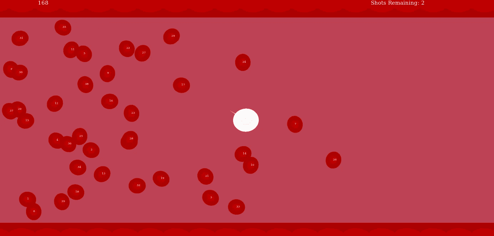
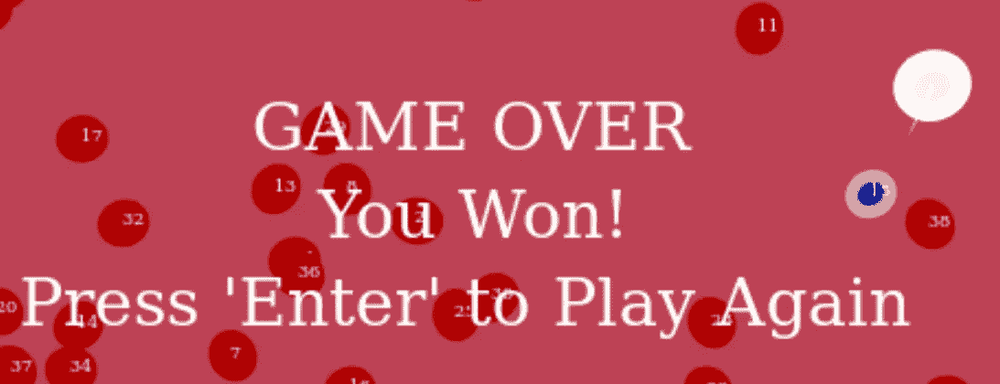

# 如何在 Firefox 扩展中包装浏览器游戏

> 原文：<https://levelup.gitconnected.com/how-to-wrap-a-browser-game-in-a-firefox-extension-360e3692c5c9>

## 在一个插件中构建一个 HTML5 游戏，将数据保存到玩家的浏览器中



血细胞游戏截图，图片作者

当构建简单的游戏时，使用 JavaScript 和 HTML5 允许我们利用 web 浏览器的能力和多功能性来做许多繁重的工作，包括制作游戏动画和在不同的操作系统之间分发游戏。然而，如果我们想在会话之间保存玩家的游戏数据(例如，高分或游戏进度)，浏览器游戏会出现一个两难的问题:如果我们不想要维护后端 web 服务器的麻烦和费用，我们应该在哪里存储数据？

令人高兴的是，浏览器扩展提供了一个解决方案，因为在扩展中包装游戏允许我们方便地访问用户的本地浏览器存储，以保存他们的个人游戏数据。这样，我们不需要承担收集和安全存储用户数据的工作和责任，也不需要担心数据在会话之间从他们的浏览器缓存中删除。

本教程将特别关注构建一个 Firefox 浏览器扩展，其中包含一个将游戏结果数据保存到本地存储的简单游戏，以我的血细胞游戏为例。作为参考，这款游戏的完整源代码可以在 GitLab [这里](https://gitlab.com/karldeve/bloodcellgame)找到。

请注意，本教程不会涵盖 HTML5 浏览器游戏开发的基础知识，但是 Mozilla 开发者网络提供了该主题的介绍[这里](https://developer.mozilla.org/en-US/docs/Games/Tutorials/2D_Breakout_game_pure_JavaScript)。

**概述**

我们的示例扩展将在浏览器的工具栏上添加一个按钮，单击该按钮将在新标签页中启动一个游戏。该扩展名由几个不同的文件组成:

1.  `manifest.json`:这个文件提供了扩展使用的元数据，包括需要的权限，后台运行的脚本，启动游戏的按钮定义。
2.  `launch_blood_cell.js`:这个脚本监听游戏工具栏上的按钮被按下的情况，并在按钮被按下时启动游戏。
3.  `bloodcell.html`:这个文件定义了包含游戏的网页。
4.  `bloodcell.js`:这个脚本包含游戏逻辑，包括从本地存储器读取和写入的代码。

**货单**

在`manifest.json`文件中，我们需要填写几个关键字段:

1.  这个字段将定义启动游戏的按钮，通过指定添加它的位置(tabstrip)，使用什么图标，以及当我们悬停在它上面时应该出现什么标题
2.  `permissions`:该字段指定扩展需要什么特殊权限。在这种情况下，我们需要`storage`权限才能写入本地存储。
3.  `background`:该字段指定该浏览器将在后台运行哪些脚本。在我们的例子中，我们需要在后台运行我们的`launch_blood_cell.js`脚本来观察按钮点击。

以下是完整清单文件的示例，包括上述字段:

```
{
  "manifest_version": 2,
  "name": "Blood Cell Game",
  "version": "1.0","description": "A browser game in which you are a white blood cell hunting for the one infected red blood cell. The infected cell uses an evolutionary algorithm to gradually adopt strategies that work best against you, so the game gets harder as you get better.",
 "icons": {
  "48": "icons/BloodCellLogo-48.png"
 },"browser_action": {
  "default_area": "tabstrip",
  "default_icon": "icons/BloodCellLogo-32.png",
  "default_title": "Blood Cell"
 },"background": {
  "scripts": ["launch_blood_cell.js"]
 },"permissions": [
  "storage"
 ]}
```

**启动游戏**

在我们的`launch_blood_cell.js`文件中，我们需要观察扩展的按钮何时被点击，这可以使用`[browser.browserAction.onClicked.addListener](https://developer.mozilla.org/en-US/docs/Mozilla/Add-ons/WebExtensions/API/browserAction/onClicked)` [方法](https://developer.mozilla.org/en-US/docs/Mozilla/Add-ons/WebExtensions/API/browserAction/onClicked)来完成。我们可以为这个方法提供一个函数，当按钮被点击时，这个函数将被调用。在我们的例子中，我们将提供`launchGame`函数，它将创建一个新的选项卡，指向扩展中的`bloodcell.html`文件。

最后，在启动新标签页后，我们的`launchGame`函数可以调用我们的`onCreated`函数，这将在新标签页中执行我们的`bloodcell.js`游戏逻辑脚本。注意，出于安全考虑，Firefox 不允许在我们的`bloodcell.html`文件中直接嵌入 JavaScript，但是使用`[browser.tabs.executeScript](https://developer.mozilla.org/en-US/docs/Mozilla/Add-ons/WebExtensions/API/tabs/executeScript)` [方法](https://developer.mozilla.org/en-US/docs/Mozilla/Add-ons/WebExtensions/API/tabs/executeScript)允许我们触发指定选项卡的脚本。

```
/**
 * Run game code in new tab
 */
function onCreated(tab) {
  console.log(`Launching Blood Cell browser game in tab ${tab.id}...`);
  browser.tabs.executeScript(tab.id, {file: "bloodcell.js"})
}/**
 * Log error to the console.
 */
function onError(error) {
  console.log(`Error: ${error}`);
}/**
 * Opens a new tab to play Blood Cell game.
 */
function launchGame() {
  var creating = browser.tabs.create({url:"/bloodcell.html"});
  creating.then(onCreated, onError);
}/**
 * Listen for extension button clicks
 */
browser.browserAction.onClicked.addListener(launchGame);
```

此时，假设我们的`bloodcell.html`文件包含一个 [HTML 画布](https://developer.mozilla.org/en-US/docs/Web/HTML/Element/canvas)并且我们的`bloodcell.js`脚本包含相关的游戏逻辑，我们可以在浏览器扩展中启动并玩游戏。

**如何从浏览器扩展访问本地存储器**

对于我的血细胞游戏，我使用一个简单的进化算法，让游戏随着时间的推移变得更难。不过，要做到这一点，我需要将游戏结果和策略保存到本地存储，并在新游戏启动时检索这些值。我们可以使用[本地存储 API](https://developer.mozilla.org/en-US/docs/Mozilla/Add-ons/WebExtensions/API/storage/local) 来实现这一点。

首先，在包含游戏逻辑的`bloodcell.js`脚本中，我们将使用`[local.get](https://developer.mozilla.org/en-US/docs/Mozilla/Add-ons/WebExtensions/API/storage/StorageArea/get)` [方法](https://developer.mozilla.org/en-US/docs/Mozilla/Add-ons/WebExtensions/API/storage/StorageArea/get)检索已经存在于我们的扩展存储中的内容(第一次运行游戏时，这将是空的，但之后我们应该保存策略值和结果)。如果我们只想从存储中获取某些项目，这个方法接受键作为输入，但是在我们的例子中，我们想要所有的东西，所以我们可以在没有输入的情况下调用这个方法。

```
const gettingStoredGeneration = browser.storage.local.get();
gettingStoredGeneration.then(opponentInit, onError);
```

一旦我们从存储器中读取数据，我们就调用我们的`opponentInit`函数，它将处理我们获取的内容(如果有的话)。

首先，我们将检查是否从存储中取出了我们想要的对象。如果不是(即如果`!storedGeneration.strat`，那么我们将假设这是第一次启动游戏，并使用预设值和 [local.set 方法](https://developer.mozilla.org/en-US/docs/Mozilla/Add-ons/WebExtensions/API/storage/StorageArea/set)初始化存储。如果已经有数据存在，那么我们可以用它来设置我们当前游戏的最新策略。

```
// set initial strategies for first time game is launched
var strat = {
 changeProb: [0.02, 0.005, 0.005, 0.005, 0.005, 0.005, 0.005, 0.005, 0.005, 0.005],
 frontProb: [0.9, 0.9, 0.9, 0.75, 0.5, 0.5, 0.5, 0.25, 0.5, 0.5], 
 closenessfactor: [0.1, 0.1, 0.1, 0.15, 0.15, 0.25, 0.5, 0.1, 0.75, 0.9],
 distAttack: [2, 2, 1.5, 1.5, 1.5, 1.5, 1.5, 1.5, 1.5, 1.5],
 distAttackExtended: [5, 5, 2, 2, 2, 2, 2, 2, 2, 3],
 outcome: [-1, -1, -1, -1, -1, -1, -1, -1, -1, -1]
};/*
 Load 'strategy' variables for infected RBC from storage, or load initial values if first time game being played
*/
function opponentInit(storedGeneration) {
  if (!storedGeneration.strat) {
   // init strategy in storage if doesn't exist
    browser.storage.local.set({strat});
    stratNum = 0;
  }
  else {
   // otherwise grab first strategy that hasn't been played, if exists
   strat = storedGeneration.strat;
   for(var i = 0; i < numPerGen; i++) {
    if(strat.outcome[i] == -1) {
     stratNum = i;
     break;
    }
   }
   if(stratNum == -1) {
    // if all existing strategies have been played, generate next set of strategies
    nextGen();
   }
  }
  setStratVars();
}
```

当我们的游戏结束并且我们准备好存储结果时，或者如果我们用我们的进化算法生成一组新的策略，我们可以使用用于存储上述初始策略集的相同的 [local.set 方法](https://developer.mozilla.org/en-US/docs/Mozilla/Add-ons/WebExtensions/API/storage/StorageArea/set)将这些值保存回本地存储。

**结论**

通过本地存储 API，Firefox 浏览器扩展提供了一种构建和分发免费浏览器游戏的便捷方式，这种游戏可以在会话之间保存数据，而不会让游戏开发爱好者觉得这是第二份工作。游戏开始。



作者图片

**资源**

血细胞浏览器扩展源代码:【https://gitlab.com/karldeve/bloodcellgame 

MDN HTML5/JavaScript 游戏教程:[https://developer . Mozilla . org/en-US/docs/Games/Tutorials/2D _ Breakout _ game _ pure _ JavaScript](https://developer.mozilla.org/en-US/docs/Games/Tutorials/2D_Breakout_game_pure_JavaScript)

MDN 浏览器扩展教程:[https://developer . Mozilla . org/en-US/docs/Mozilla/Add-ons/web extensions/Your _ first _ web extension](https://developer.mozilla.org/en-US/docs/Mozilla/Add-ons/WebExtensions/Your_first_WebExtension)

本地存储 API 文档:[https://developer . Mozilla . org/en-US/docs/Mozilla/Add-ons/web extensions/API/storage/local](https://developer.mozilla.org/en-US/docs/Mozilla/Add-ons/WebExtensions/API/storage/local)

# 分级编码

感谢您成为我们社区的一员！在你离开之前:

*   👏为故事鼓掌，跟着作者走👉
*   📰查看[升级编码出版物](https://levelup.gitconnected.com/?utm_source=pub&utm_medium=post)中的更多内容
*   🔔关注我们:[Twitter](https://twitter.com/gitconnected)|[LinkedIn](https://www.linkedin.com/company/gitconnected)|[时事通讯](https://newsletter.levelup.dev)

🚀👉 [**加入人才集体，找到一份令人惊喜的工作**](https://jobs.levelup.dev/talent/welcome?referral=true)