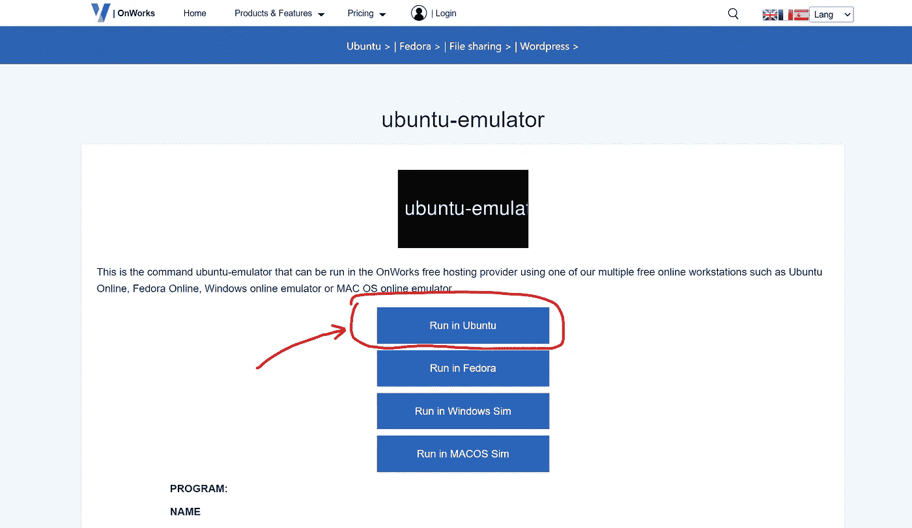
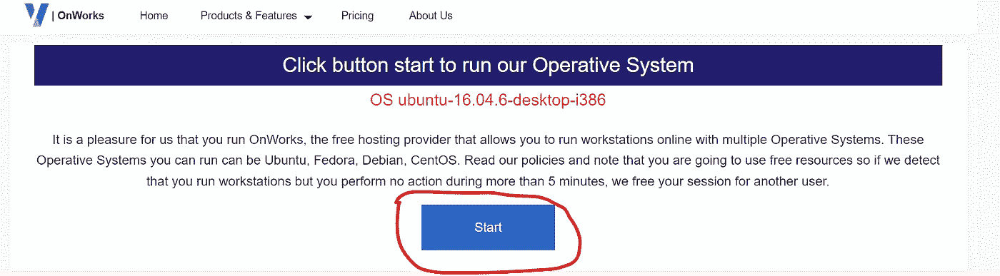
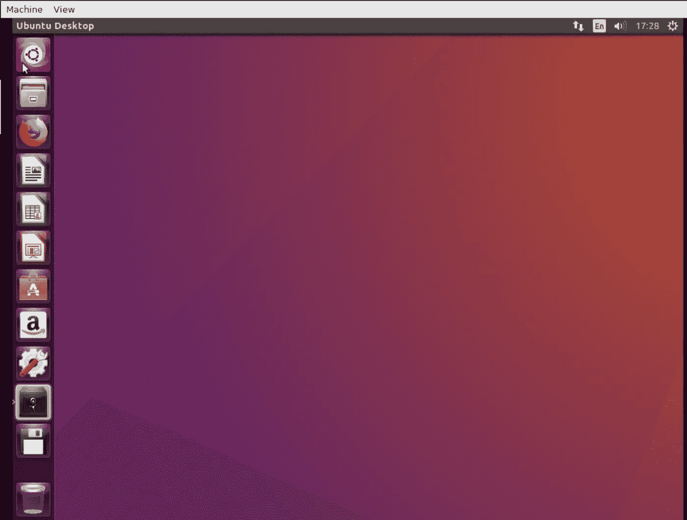
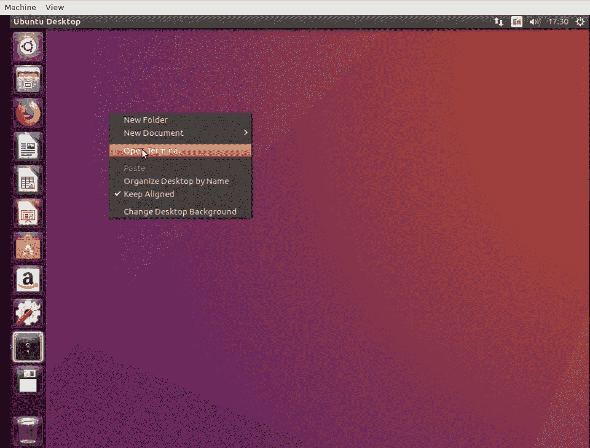
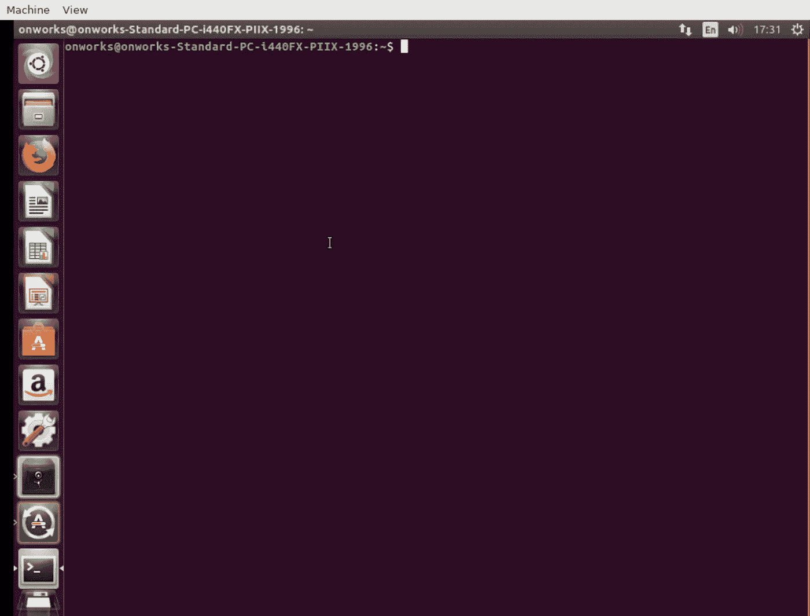
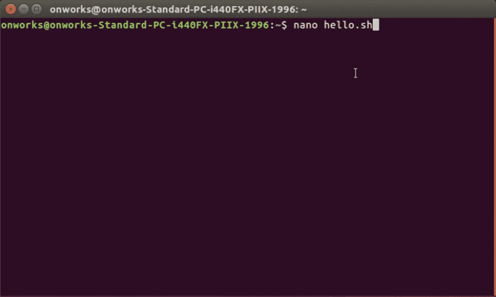
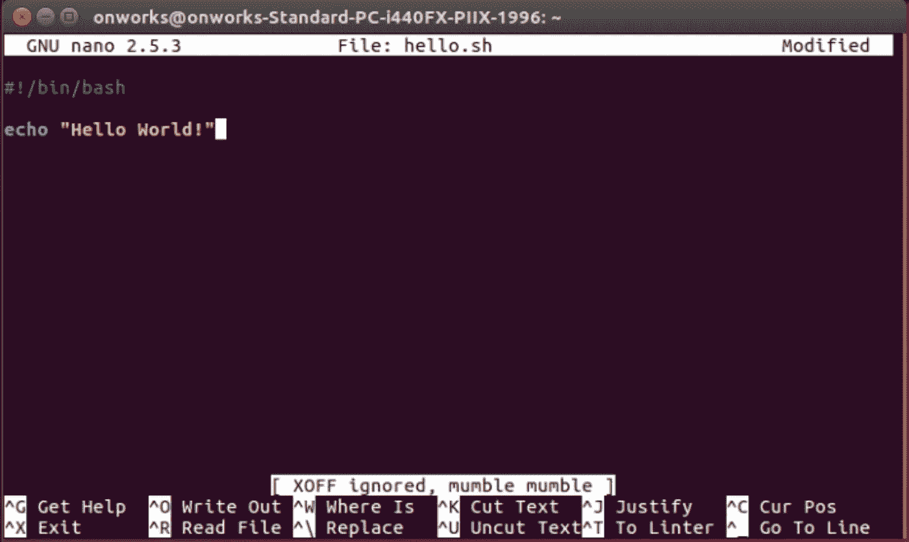
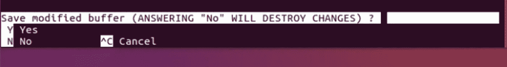
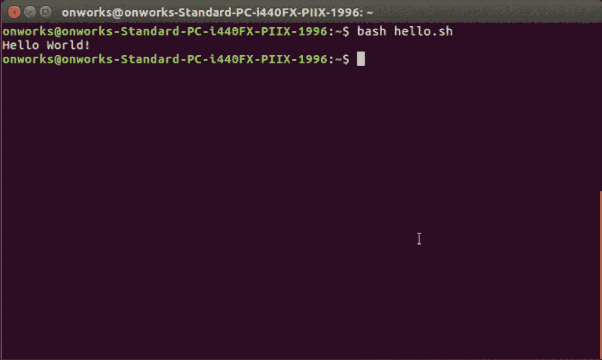

# 如何在没有安装 Linux 的情况下从 Windows 编写 Bash 脚本

> 原文：<https://levelup.gitconnected.com/how-to-write-a-bash-script-from-windows-without-having-linux-installed-141d5b17c93b>

## 使用您的浏览器编写 Bash 脚本，无需安装任何带有 OnWorks 的 Linux 发行版

由[凯文·霍尔瓦特](https://unsplash.com/@hidd3n?utm_source=medium&utm_medium=referral)在 [Unsplash](https://unsplash.com?utm_source=medium&utm_medium=referral) 上拍摄的照片

是的，我知道……有时你只是在闲逛，看一些关于 Linux 或脚本的教程，你想跟着学，但是……但是……你在 Windows 上，你不想设置一个虚拟机或创建一个新的分区来安装 Linux。如果是这种情况，这个教程是给你的。

在你最喜欢的浏览器中搜索 OnWorks 或打开以下链接[https://www.onworks.net/programs/ubuntu-emulator-online](https://www.onworks.net/programs/ubuntu-emulator-online)。点击“在 Ubuntu 中运行”。

OnWorks 网站

您将看到以下页面:

OnWorks 网站

点击“开始”按钮并等待，这将需要 20 秒来启动您的机器。

当您的机器准备就绪时，单击“输入”按钮。

OnWorks 网站

您可以开始使用您的 Linux 发行版(在本例中，是一台 Ubuntu 机器)。

在 OnWorks 网站上运行的 Ubuntu 操作系统

此时，你可以在桌面上点击右键，选择“打开终端”。

在 Ubuntu 上打开终端

Ubuntu 终端

您可以测试各种命令，并尝试在这个模拟器上做不同的事情。我们可以试着写一个简单的脚本，比如经典的“Hello World！”。

用 nano 创建一个`hello.sh`文件。

nano hello.sh

你好世界！

用 Ctrl+X 关闭 nano，终端会显示问题“保存修改过的缓冲区？”。按 Y，然后回车确认。

来自终端的问题

你应该选择文件名，只需按回车键保持相同的名称。

来自终端的问题

使用命令`bash hello.sh`，终端将打印您的 echo 命令。

bash 脚本执行

恭喜你，你已经学会了如何不用安装任何东西就能使用 Ubuntu！

🎉🎉🎉

# 分级编码

感谢您成为我们社区的一员！在你离开之前:

*   👏为故事鼓掌，跟着作者走👉
*   📰查看[升级编码出版物](https://levelup.gitconnected.com/?utm_source=pub&utm_medium=post)中的更多内容
*   🔔关注我们:[Twitter](https://twitter.com/gitconnected)|[LinkedIn](https://www.linkedin.com/company/gitconnected)|[时事通讯](https://newsletter.levelup.dev)

🚀👉 [**加入升级人才集体，找到一份神奇的工作**](https://jobs.levelup.dev/talent/welcome?referral=true)